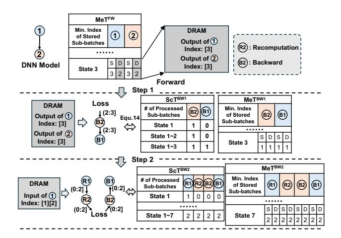

# 5.2 Representation of Fusion Strategy

While determining the state workloads  $\{s_i\}$  and constructing the scheduling table ScT fully specifies the execution scheme of a block, it does not capture memory-related behavior – particularly those associated with *fusion strategies*. These strategies directly affect

Figure 4: State-based representation of execution scheme for mapping multiple layers onto a tiled architecture. The number of hardware tiles allocated to different layers within the same state is proportionally determined based on their computational costs.

Figure 5: Example that how MeT and ScT jointly and implicitly capture the impact of fusion strategy on memory status. The 2-layer model is a top-level block with each layer as a sub-block. In State-1, all 3 sub-batches of Layer-1's input data are transferred from DRAM to PEs for computation. The resulting outputs are then stored in on-chip SRAM, avoiding costly DRAM writes. Consequently, SRAM holds 3 sub-batches of outputs (indexed as 1, 2, 3) for Layer-1, while DRAM stores none. This is reflected in  $ScT_{1,1} = 3$ , indicating that 3 sub-batches are processed in State-1. Meanwhile,  $McT_{1,1}^S = 0$  defines the stored sub-batch range in SRAM as (0:3], and  $McT_{1,1}^D = 3$  defines the DRAM range as (3:3], confirming no data is stored in DRAM. In State-3, the 3 sub-batches stored in SRAM are directly sent to PEs for Layer-2 processing, eliminating DRAM access. After computation, the 3 sub-batches of Layer-2's output data are stored in DRAM, and Layer-1's intermediate results are evicted from SRAM. This is represented by  $McT_{3,2}^S = 0$  and  $ScT_{3,2} = 3$ , defining the sub-batch range of Layer-2's output in DRAM as (0:3]. Additionally,  $McT_{3,2}^S = 3$  indicates no Layer-2's output remains in SRAM (3,3]. Similarly,  $McT_{3,1}^S = McT_{3,1}^D = 3$  confirms that Layer-1's outputs are stored neither in SRAM nor DRAM, precisely describing the final memory state.

memory reuse, data lifetimes, and intermediate storage requirements, which are not encoded in ScT alone.

To model this dimension, we introduce the *Memory Table* MeT, which tracks the *lifetime of intermediate data* in memory. Specifically, MeT captures the allocation and deallocation dynamics of sub-batch-level intermediate results for each execution unit (e.g., layer or sub-block), offering a structured and interpretable view of how fusion affects memory usage. Each fusion decision (the "action") introduces implicit changes to memory behavior (the "impact"), influencing how long intermediate results must be stored and when memory can be released.

**Definition 5** (**Memory Table (MeT)**). For a block with sub-block sequence  $C_B = \{B_1, B_2, \dots, B_N\}$  and state set  $S_B = \{1, \dots, 2N-1\}$ , the *memory table*  $\mathbf{MeT} \in \mathbb{R}^{(2N-1) \times N \times 2}$  tracks the memory status of intermediate data for each block or sub-block across states.

- (i) MeT has 2N-1 rows and N columns, where row i corresponds to State-i, and column j corresponds to block  $B_j \in C_B$ .
- (ii) Each entry  $MeT_{i,j}$  is a tuple  $(MeT_{i,j}^D, MeT_{i,j}^S)$ , where:
  - $MeT_{i,j}^D$  denotes the lower (open) bound of the sub-batch range stored in **DRAM** for sub-block  $B_j$  at State-i;
  - $MeT_{i,j}^{S}$  denotes the lower (open) bound of the sub-batch range stored in **SRAM** for sub-block  $B_i$  at State-*i*.

As defined above, MeT tracks the lower bound of sub-batches stored in memory. Meanwhile,  $ScT_{i,j}$  monitors the number of sub-batches processed for block  $B_j$  from State-1 to State-i, effectively representing the upper (closed) bound of that range. Therefore, ScT and MeT together define the range of sub-batches stored in SRAM and DRAM, denoted as  $(MeT_{i,j}^S, ScT_{i,j}]$  and  $(MeT_{i,j}^D, ScT_{i,j}]$ , respectively. Since the essence of layer fusion is to allocate intermediate data in SRAM to reduce costly DRAM accesses, MeT and ScT jointly capture the impact of fusion on memory behavior.

Construction of MeT. In general, MeT is derived by following the construction rules. Eq. 7 ensures that the lower bounds of the sub-batches stored in memory are non-negative integers. Eq. 9 enforces that these lower bounds cannot exceed the upper bound represented by  $ScT_{i,j}$ , which tracks the number of sub-batches processed. Furthermore, Eq. 8 enforces a non-decreasing order for the lower bounds as the state progresses, reflecting the policy that earlier sub-batches are discarded first when memory (SRAM or DRAM) capacity is insufficient to store all sub-batches. This is based on the observation that newly generated data is more likely to be required by future computations, whereas previously generated sub-batches can be discarded temporarily. When sub-block  $B_i$ depends on the data from sub-block  $B_m$ , Eq. 10 introduces a constraint to ensure that, if the output of sub-block  $B_m$  is required in memory, the necessary data is available in the previous state. Specifically, since  $ScT_{i-1,j}$  represents the upper bound of the sub-batch index processed by sub-block  $B_j$  in State-(i-1), the corresponding lower bound in State-i must be less than or equal to  $MeT_{i-1,m}^S$  and

Figure 6: Recomputation Example. Consider a 2-layer model treated as a top-level block, with each layer as a sub-block. Suppose ScT3,1 =  $ScT_{3,2} = 3$ . After the forward pass, we have  $MeT_{3,1}^D = MeT_{3,2}^D = 2$ , indicating that the sub-batch range stored in DRAM for both Layer-1 and Laver-2 is (2, 3]. In Step 1, these stored activations are used for backward propagation over sub-batch (2, 3], where the loss flows through Layer-2 and then Layer-1. This step involves only the backward pass and aligns with the optimization of ScT and MeT as defined in Eq. 14.In Step 2, recomputation is required for the evicted sub-batch (0,2]. The input data for Layer-1 over this range is fetched from DRAM, and forward recomputation is performed for both layers, followed by the backward pass. This combined forward-backward workload also fits within the scheduling and memory optimization framework of ScT and MeT.

 $\mathbf{MeT}^D_{i-1,m}$ . This ensures that sub-block  $B_m$ 's output is available for sub-block  $B_j$  when needed. Eq. 11 and 12 define the maximum storage capacity for SRAM and DRAM, respectively. In these equations,  $V_i$  represents the size of one sub-batch of sub-block  $B_i$ 's output, and  $ScT_{i,j} - MeT_{i,j}^{S}$  and  $ScT_{i,j} - MeT_{i,j}^{D}$  represent the number of sub-batches stored in SRAM and DRAM, respectively. These constraints ensure that the total data stored in memory does not exceed the available capacity of SRAM  $(Cap^S)$  and DRAM  $(Cap^D)$ .

$$\mathbf{MeT}_{i,j}^{S} \in \mathbb{N} \cup \{0\} \quad \mathbf{MeT}_{i,j}^{D} \in \mathbb{N} \cup \{0\}$$
 (7)

$$MeT_{i,j}^{S} \le MeT_{i+1,j}^{S} \quad MeT_{i,j}^{D} \le MeT_{i+1,j}^{D}$$
(8)

$$MeT_{i,j}^{S} \leq ScT_{i,j} \quad MeT_{i,j}^{D} \leq ScT_{i,j}$$
 (9)

$$\min(\text{MeT}_{i-1,m}^S, \text{MeT}_{i-1,m}^D) \le \text{ScT}_{i-1,j} \quad \text{if} \quad d_{m,j} = 1$$
 (10)

$$\sum_{i} (\operatorname{ScT}_{i,j} - \operatorname{MeT}_{i,j}^{S}) \times V_{i} \le Cap^{S}$$
(11)

$$\sum_{j} (\operatorname{ScT}_{i,j} - \operatorname{MeT}_{i,j}^{S}) \times V_{j} \leq Cap^{S}$$

$$\sum_{i} (\operatorname{ScT}_{i,j} - \operatorname{MeT}_{i,j}^{D}) \times V_{j} \leq Cap^{D}$$
(11)

$$\sum_{j} (\operatorname{ScT}_{i,j} - \operatorname{MeT}_{i,j}^{D}) \times V_{j} \le Cap^{D}$$
(12)

#### Representation of Recomputation Scheme

As analyzed in Section 2.1, recomputation is a critical decision variable in inter-layer scheduling, particularly for DNN training. Next we introduce how to use ScT and MeT to describe the recomputation process during training. In general, determining a recomputation strategy requires answering two key questions.

Question #1 (Where/Which): Which sub-blocks' activations should be discarded and recomputed?

Question #2 (How): How can forward recomputation be coordinated with backward pass in the context of sub-batch-based processing?

Notably, the scheduling space for answering Question #1 is vast. As discussed in Section 2.2, there are approximately 2200 possible checkpoint choices for recomputation in a 4-sub-batch-based ResNet-50. Fortunately, this extensive search space can be effectively integrated into the construction and optimization of ScT and MeT after the forward pass, as these two tables precisely track the sub-batches stored in SRAM and DRAM. In other words, once ScT and MeT are determined, the location and amount of activations to be recomputed are automatically identified.

Answering Question #2 is more challenging due to the interaction between forward recomputation and backward propagation, creating a bi-directional processing flow. To address this, we propose splitting the process into two distinct phases, each of which can be effectively described using ScT and MeT.

Step-1: Backward Pass-only Pre-processing. As illustrated in Fig. 6, after forward propagation, a new pair of ScT and MeT tables are constructed to describe the action of backward propagating the sub-batches currently stored in DRAM. The goal in this phase is to consume as many of the DRAM-stored activations of sub-block  $B_m$  required by sub-block  $B_i$  for the backward pass as possible. No further backward computation can occur in  $B_i$  until forward recomputation in  $B_m$  generates the required data. The benefit of this "pre-processing" arrangement is that it simplifies the data dependency of backward processing in each sub-block from two sources (stored activations and recomputed activations) to a single source (recomputed activations only). This ensures that the recomputation in Step-2 can always be performed prior to the backward computation, allowing ScT and MeT to represent the coupled recomputation and backward pass.

To ensure the success of this arrangement, at the end of forward pass (State-(2N-1)), the amount of stored activation results for sub-block  $B_m$  should be no less than that of sub-block  $B_j$ . This brings a new constraint when constructing MeT for forward pass:

$$MeT_{2N-1,m}^{D,FW} \ge MeT_{2N-1,j}^{D,FW}$$
 if  $d_{m,j} = 1$ . (13)

After optimizing forward-specific  $\mathbf{MeT}$  (denoted as  $\mathbf{MeT}^{FW}$ ) with constraints described in Eq. 7-12 and Eq. 13, ScT for Step-1, denoted as  $ScT^{BW1}$ , can be constructed using the same method as described in Section 5.1, as the processing in Step-1 is also one-directional. Specifically, Eq. 1-6 still serve as the constraints for table construction. The only difference is that Eq. 2 and 3 are replaced by the following constraint, considering the consumption of stored activation incurred by pre-processing (note that the indices of sub-batches in Eq. 14 are offset for consistency with physical meaning of  $ScT_{i,j}$ :

$$\mathbf{ScT}_{i,j}^{BW1} = \begin{cases} \frac{BS}{BS_{\text{Sub}}} - \mathbf{MeT}_{2N-1,j}^{D,FW}, \text{for } i \in [N+j-1,\dots,2N-1] \\ \mathbf{MeT}_{2N-1,j+1-L}^{D,FW} - \mathbf{MeT}_{2N-1,j}^{D,FW}, \text{for } i \in [1,\dots,j-1] \end{cases}$$
(14)

Then, the corresponding MeT (MeT  $^{BW1}$ ) can be derived from  $\mathbf{ScT}^{BW1}$ , constrained by Eq. 7-12.

Step-2: Forward Recomputation-then-Backward Pass. After Step-1, another pair of tables, denoted as  $ScT^{BW2}$  and  $MeT^{BW2}$ . will be constructed. As illustrated in Fig. 6, the two tables in Step-2 consist of 2L layers — the first and last L layers correspond to the recomputation phase and the backward pass phase, respectively. Notably, because in Step-2, recomputation is only performed to recover the previously discarded sub-batches of activation data, Eq. 3 is replaced with the following constraint:

$$ScT_{i,j}^{BW2} = MeT_{2N-1,j}^{D,FW} \quad i \in [N+j-1,\cdots,2N-1],$$
 (15)

where  $\operatorname{MeT}_{2N-1,j}^{D,FW}$  is the index of the first sub-batch of activation stored for sub-block  $B_j$  in State-(2N-1) during forward propagation, minus 1 (to account for the open bound), and equivalently represents the index of the last sub-batch discarded.

