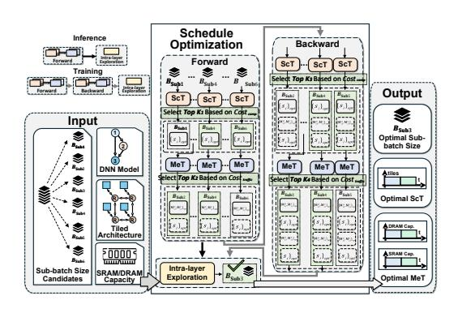

# 5.4 Latency & Energy Evaluation

Upon representing the execution scheme, fusion strategy, and recomputation scheme using ScT and MeT, we can construct performance model to evaluate latency and energy for a given scheduling configuration, preparing for scheduling space exploration.

**Latency Evaluation.** The latency performance is modeled based on delays incurred from PE computation and data traffic.

Computation-incurred Latency. At the hardware tile granularity, the computation-incurred latency of each state is determined by the workload and tile utilization. The workload of sub-block  $B_j$  (which could be a single layer or multiple layers within a block) for processing one sub-batch, denoted as Workloadj, is the number of FLOPs required by that sub-block. To evaluate hardware utilization, we follow the method adopted in SET: For  $T_{i,j}$  tiles allocated for sub-block  $B_j$  in State-i, the corresponding utilization ratio  $u_{i,j}$  is calculated by mapping the four dimensions (dimq) of one sub-batch onto the four factors of  $T_{i,j}$  ( $k_{i,j}^1 \times k_{i,j}^2 \times k_{i,j}^3 \times k_{i,j}^4 = T_{i,j}$ ) and calculating the product of utilization across these dimensions:

$$u_{i,j} = \prod_{q=1}^{4} \frac{\dim_q}{\lceil \frac{\dim_q}{k_{i,j}^q} \rceil k_{i,j}^q}.$$
 (16)

Then the computation latency of sub-block  $B_j$  in State-i is as:

$$L_{\text{comp},i,j} = \frac{\text{Workload}_j}{u_{i,j} \times T_{i,j} \times P},$$
(17)

where P denotes the computing power per unit time for each tile. Since computation-incurred latency for a DNN in one state is determined by the bottleneck sub-block in that state (as sub-blocks are processed concurrently within one state), and sub-block execution in different states happens sequentially, the overall computation-incurred latency  $L_{\rm comp}$  for the entire model can be calculated as:

$$L_{\text{comp}} = \sum_{i} s_{i} \times \max_{j} \left( L_{\text{comp},i,j} \right). \tag{18}$$

Note that Eq. 18 describes the latency evaluation for forward propagation. It can be easily extended for backward propagation by including the computation of gradients.

Data Traffic-incurred Latency. From the perspective of a hardware tile, the latency incurred by transferring its required input data consists of three parts: the cost incurred by reading data from DRAM, SRAM, and other hardware tiles. Since the tiled architecture uses NoC as a unified fabric to transfer data, the data traffic-incurred latency can be evaluated as:

$$L_{\text{traffic}} = \sum_{i,j,m} (\text{Dep}_{m,i,j}^C H_C + \text{Dep}_{m,i,j}^S H_S + \text{Dep}_{m,i,j}^D H_D) V_m / BW_N$$

$$+ \text{Dep}_{m,i,j}^D V_m / BW_D,$$
(19)

Figure 7: Overall intra-block exploration and optimization process.

where  $V_m$  is the storage size for one sub-batch of data and the corresponding weight, and  $BW_N$  is the bandwidth of NoC. Here, for data movement from sub-block  $B_m$  to sub-block  $B_j$  in State-i,  $\text{Dep}_{m,i,j}^C$ ,  $\text{Dep}_{m,i,j}^S$ , and  $\text{Dep}_{m,i,j}^D$  represent the amount of data transferred from other hardware tiles, SRAM, and DRAM, respectively. Since ScT and MeT record all the computing and memory statuses for all sub-blocks, the amount of these three types of data transfer can be easily calculated from the two tables. Additionally,  $H_C$ ,  $H_S$ , and  $H_D$  represent the hop counts for transferring these data through NoC, while  $BW_D$  represents the bandwidth of DRAM. The latency for data sourced from DRAM is included in Eq. 19 since it is transferred via NoC but must first be read from the DRAM.

**Energy Evaluation.** Energy costs are evaluated similarly by considering the consumption due to computation and data traffic.

Computation-incurred Energy Consumption. Eq. 20 describes the evaluation model for computation-incurred energy cost  $(E_{\text{comp}})$ . Here,  $E_{\text{comp}}$ , unit is the unit energy consumption for each operation, and  $\frac{s_i \text{Workload}_j}{u_{i,j}}$  represents the equivalent number of FLOPs required for computation, adjusted for the tile utilization.

$$E_{\text{comp}} = E_{\text{comp, unit}} \times \sum_{i,j} \frac{s_i \text{Workload}_j}{u_{i,j}}.$$
 (20)

Data Traffic-incurred Energy Consumption. For the tiled architecture, the energy consumption due to data traffic has two sources: data movement through NoC and from/to DRAM. Eq. 21 describes the evaluation of the total energy cost incurred by transferring data at the tile level. Here,  $E_{\rm NoC,\;unit}$  and  $E_{\rm DRAM,\;unit}$  are the unit energy consumption per hop and access, respectively.

$$E_{\text{traffic}} = \sum_{i,j,m} V_m E_{\text{NoC, unit}} \left( \text{Dep}_{m,i,j}^C H_C + \text{Dep}_{m,i,j}^S H_S + \right.$$

$$\left. \text{Dep}_{m,i,j}^D H_D \right) + V_m E_{\text{DRAM, unit}} \text{Dep}_{m,i,j}^D.$$
(21)

