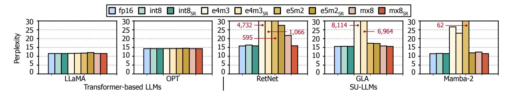
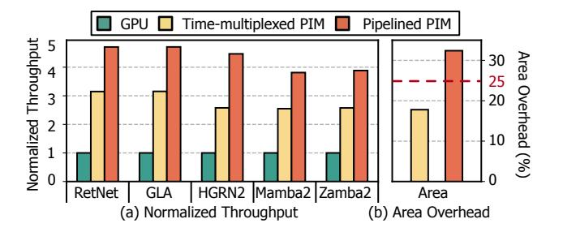

## Pimba: A Processing-in-Memory Acceleration for Post-Transformer Large Language Model Serving

[Wonung Kim](https://orcid.org/0009-0000-1180-0503) KAIST

Daejeon, Republic of Korea wukim@casys.kaist.ac.kr

> [Jinwoo Hwang](https://orcid.org/0009-0008-8498-2502) KAIST

Daejeon, Republic of Korea jwhwang@casys.kaist.ac.kr

[Aziz Huseynov](https://orcid.org/0009-0009-0516-0605) KAIST Daejeon, Republic of Korea aziz@casys.kaist.ac.kr

[Yubin Lee](https://orcid.org/0009-0002-6541-6739) KAIST

Daejeon, Republic of Korea yblee@casys.kaist.ac.kr

[Seongryong Oh](https://orcid.org/0009-0004-6707-0641) KAIST Daejeon, Republic of Korea sroh@casys.kaist.ac.kr

[Woong Gyu Park](https://orcid.org/0009-0002-4106-8039) KAIST

Daejeon, Republic of Korea wgpark@casys.kaist.ac.kr

[Yoonsung Kim](https://orcid.org/0009-0000-2333-292X) KAIST Daejeon, Republic of Korea yskim@casys.kaist.ac.kr

[Jiyong Jung](https://orcid.org/0009-0007-0420-179X) KAIST Daejeon, Republic of Korea jyjung@casys.kaist.ac.kr

[Chang Hyun Park](https://orcid.org/0000-0002-8250-8574) Uppsala University Atlanta, GA, USA chang.hyun.park@it.uu.se

[Divya Mahajan](https://orcid.org/0009-0007-8184-0528) Georgia Institute of Technology Uppsala, Sweden divya.mahajan@gatech.edu

## Abstract

Transformers are the driving force behind today's Large Language Models (LLMs), serving as the foundation for their performance and versatility. Yet, their compute and memory costs grow with sequence length, posing scalability challenges for long-context inferencing. In response, the algorithm community is exploring alternative architectures—such as state space models (SSMs) (e.g., Mamba-2), linear attention, and recurrent neural networks (RNNs)—which we refer to as post-transformers. This shift presents a key challenge: building a serving system that efficiently supports not only emerging post-transformer LLMs but also existing transformer models within a unified framework.

To address this challenge, we analyze the performance characteristics of transformer and post-transformer LLMs. Despite their algorithmic differences, both are largely bounded by memory bandwidth under batched inference—due to attention in transformers and state updates in post-transformers. Inspired by this finding, we propose Pimba, an accelerator solution that aims to address the memory bottleneck by jointly leveraging (1) Processing-in-Memory (PIM) paradigm and (2) LLM quantization. Further analyses suggest two additional insights: (1) state update operations, unlike attention, incur high hardware cost, making per-bank PIM acceleration inefficient, and (2) different low-precision arithmetic methods offer varying accuracy-area tradeoffs, while we identify Microsoft's MX as a Pareto-optimal choice. Building on these insights, we design the

[This work is licensed under a Creative Commons Attribution 4.0 International License.](https://creativecommons.org/licenses/by/4.0) MICRO '25, Seoul, Republic of Korea © 2025 Copyright held by the owner/author(s). ACM ISBN 979-8-4007-1573-0/25/10 <https://doi.org/10.1145/3725843.3756121>

[Jongse Park](https://orcid.org/0000-0002-6629-449X) KAIST Daejeon, Republic of Korea jspark@casys.kaist.ac.kr

architecture of Pimba as an array of State-update Processing Units (SPUs), each shared between two banks to enable interleaved access. Each SPU includes a State-update Processing Engine (SPE) that comprises element-wise multipliers and adders using MX-based quantized arithmetic, enabling efficient execution of state update and attention operations. Our evaluation shows that, compared to LLM-optimized GPU and GPU+PIM systems, Pimba achieves up to 4.1× and 2.1× higher generation throughput, respectively.

## CCS Concepts

• Computer systems organization → Neural networks; Heterogeneous (hybrid) systems.

## Keywords

Processing-in-Memory (PIM); Heterogeneous system; Large Language Model (LLM); Post-Transformer LLM; State Space Model (SSM); Linear Attention; Recurrent Neural Network (RNN)

#### ACM Reference Format:

Wonung Kim, Yubin Lee, Yoonsung Kim, Jinwoo Hwang, Seongryong Oh, Jiyong Jung, Aziz Huseynov, Woong Gyu Park, Chang Hyun Park, Divya Mahajan, and Jongse Park. 2025. Pimba: A Processing-in-Memory Acceleration for Post-Transformer Large Language Model Serving. In 58th IEEE/ACM International Symposium on Microarchitecture (MICRO '25), October 18–22, 2025, Seoul, Republic of Korea. ACM, New York, NY, USA, [16](#page-15-0) pages. <https://doi.org/10.1145/3725843.3756121>

## 1 Introduction

Every industrial and enterprise sector in our society is either actively using Large Language Models (LLMs) or eager to adopt them [\[63,](#page-13-0) [72\]](#page-14-0). LLM's widespread success can be attributed to the effectiveness of their core algorithmic component, transformers [\[74\]](#page-14-1).

Figure 1: Comparison between 2.7B parameter transformer and Mamba-2. Accuracy results are referenced from [15].

While transformers offer remarkably versatile capabilities and continue to dominate LLMs, their enormous resource demands are a significant concern for LLM providers. Transformer-based LLMs scale quadratically in compute and linearly in memory footprint with sequence length, while emerging applications—such as test time scaling [2, 17, 49, 68], retrieval-augmented generation [11, 39, 42, 66], and multimodal input fusion [1, 3]—are driving demand for longer sequence lengths, recently reaching up to 2 billion tokens in industry-leading models [81]. Moreover, batched inferencing exacerbates these resource demands, forcing hyperscalers to invest billions of dollars in equipping their data centers with hundreds of thousands of costly GPUs, each priced at \$30,000 or more [56].

Recently, the algorithm community has actively explored alternative approaches, including state space models (SSMs), linear attention mechanisms, and recurrent neural networks (RNNs). In this paper, we henceforth refer to LLMs employing these alternative algorithmic techniques as "post-transformer" LLMs. We argue that post-transformer LLMs have the potential to serve as a promising complement to transformer-based LLMs, providing comparable algorithmic capabilities with significantly lower and constant resource demands [9, 15, 21-26, 35, 57-59, 61, 70, 80, 87]. Figure 1(a) presents an empirical evidence that supports our argument. The figure compares the memory usage, throughput, and accuracy of a transformer-based LLM with a post-transformer LLM, Mamba-2, both having a model size of 2.7 billion parameters1. The results show that Mamba-2 requires 2.3× less memory capacity, delivering 2.6× higher throughput than the transformer counterpart, while achieving 4.5% higher accuracy. Despite this considerable potential, the architecture and system community have a limited understanding of the implications of these algorithms, causing LLM providers to hesitate in adopting them for their serving systems.

To this end, this paper sets out to bridge this gap through a comprehensive workload analysis and performance characterization, and to devise a solution that leverages the resulting insights. The first of these insights is that many post-transformer LLMs share a common algorithmic operation, *state update*, which propagates and evolves contextual information across tokens. This commonality offers a promising opportunity for architectural generalization and acceleration. We also discovered that similar to the attention operation in transformer-based LLMs, this state update operation

becomes the performance bottleneck due to its low arithmetic intensity. Figure 1(b) reports the roofline analysis results that the arithmetic intensity of state update operation is  $4 \times$  larger than that of attention, while it is still significantly bandwidth-bound.

Inspired by these insights, we propose PIMBA, an acceleration solution that addresses the memory bandwidth bottleneck by jointly exploiting (1) Processing-in-Memory (PIM) paradigm, and (2) LLM quantization. While prior works have extensively investigated these techniques for transformer-based LLM serving [28, 30, 54, 67, 77, 84, 88], we observe that post-transformer LLMs demonstrate significantly different behaviors, requiring distinct design choices to enable a unified serving system that accommodates the two classes of LLM architectures. Below, we share the empirical insights and their corresponding principles that govern our accelerator design:

- (Principle 1): Maximizing hardware resource sharing for area efficiency: Existing LLM-targeted PIM acceleration methods [27, 28, 40, 54, 67] focus on supporting matrix-vector multiplication (i.e., GEMV) since attention operation consists of a full of GEMVs. However, this approach is unsuitable for post-transformer algorithms since implementing the state update operation in hardware incurs significantly larger area costs due to the variety of primitives in state update operation, such as element-wise multiplication, element-wise addition, and vector dot products. Thus, in designing PIMBA, we aim to exploit the hardware resource sharing for maximizing area efficiency.
- (Principle 2): Achieving both accuracy and area-efficiency from low-precision arithmetic: While quantizing the state in post-transformers can reduce computation cost and memory footprint, it also affects area efficiency. We also discover that, due to the state "update" mechanism, conventional numerical formats cause severe accuracy degradation, rendering them impractical for post-transformers. We carefully explore the accuracy-area tradeoffs and observe that different low-precision arithmetic approaches exhibit different characteristics. We thoroughly perform an empirical study to understand the differences and aim to employ a Pareto-optimal quantization technique for our solution.

Building upon these two principles, we design the Pimba accelerator architecture, which incorporates the following key elements:

State-update Processing Unit (SPU). At the core of PIMBA is the State-update Processing Unit (SPU), which includes a State-update Processing Element (SPE). Deploying an SPE for each bank would incur excessive area costs and reduce memory capacity, rendering this approach impractical under the stringent area constraints of PIM compute units. To address this, PIMBA assigns one SPU to every two banks. The SPU alternates between reading from and writing to the row buffers of different banks, performing computations in an interleaved manner. This design sustains throughput while optimizing area efficiency.

SPE with MX-based quantized arithmetic. Empirical analysis suggests that among various quantization formats, MX8 [16] (requiring an average of 8 bits per value) emerges as a Pareto-optimal choice in the accuracy-efficiency tradeoff, while aligning seamlessly with memory address alignment requirements. This enables area-and power-efficient implementation of SPEs within the constraints of PIM. Consequently, we design custom MX8 vector multipliers and adders, significantly improving resource efficiency.

&lt;sup>1Detailed experimental methodology is presented in Section 6.1

Figure 2: Model architectures of (a) Transformer, (b) Mamba-2 of SSM, and (c) Linear Attention. For simplicity, we focus on the key operations.

End-to-end PIMBA system design. We construct the PIMBA system by jointly leveraging PIMBA accelerators with GPUs, offloading state update and attention operations to PIM, while delegating other tasks to GPUs. PIMBA includes custom DRAM commands and command scheduling techniques to manage state pre-charging and subsequent generative computations. Our PIM accelerator and its interface use a system architecture similar to the existing PIM-based LLM serving systems [28, 54, 55, 67], allowing PIMBA to serve as a "drop-in replacement" in transformer-serving systems adapted to support post-transformer LLMs as well.

To evaluate Pimba's effectiveness, we use four post-transformer LLM models-Mamba-2, GLA, RetNet, and HGRN2 [15, 61, 70, 80]—along with Zamba2, a hybrid transformer-Mamba-2 model [89], and OPT [86], a traditional attention-based model. Our experimental results show that compared to LLM-optimized GPU and GPU+PIM systems, Pimba achieves 14.6× and 6.9× lower latency in state update operations, resulting in up to 4.1× and 2.1× higher throughput, respectively, with minimal area overhead on the memory device. These advantages in both performance and area-efficiency demonstrate that Pimba is an effective PIM-based solution for LLM serving, capable of supporting both transformer and post-transformer models, paving the way toward scalable and cost-efficient deployment of emerging LLM architectures. A full-system simulator for Pimba and the accuracy evaluation code are open-sourced at https://github.com/casys-kaist/pimba.

#### 2 Background

## 2.1 Transformer-based LLMs and their Limitations

**Transformer-based LLMs.** Transformers offer remarkable performance due to their attention mechanism, which enables efficient modeling of inter-token dependencies [18, 48, 50, 73]. Figure 2(a) shows the model architecture for transformer-based LLMs. In the attention mechanism, each token in the input sequence is projected

into three distinct vectors: query (Q), key (K), and value (V). The query and key vectors are used to compute the attention scores by taking the scaled dot product, and the value vectors are used to perform a weighted sum over these scores.

**Limitations.** The auto-regressive nature of LLM requires revisiting all previous tokens, resulting in redundant computation. Key-Value (KV) cache is employed to prevent recomputing previous tokens, but the transformers face the following limitations:

- (1) Memory usage. The KV cache grows linearly with the sequence length. Despite prior work on enhancing memory efficiency [19, 30, 33, 38, 79], the fundamental property of the algorithm is unchanged. This ends up consuming significant amounts of GPU memory and imposing limits on the sequence length or the batch size.
- (2) Latency. The computation of attention layers increases linearly, even with the KV cache, leading to increased latency with longer sequences. In multi-user serving scenarios, typically processed in batches, the difference in compute latency can hinder efficient scheduling [38, 83].

#### 2.2 Post-Transformer LLMs

Recently, alternative architectures including state space models (SSMs) [15, 21–26, 59], linear attention mechanisms [35, 70, 80, 87], and recurrent neural networks (RNNs) [9, 57, 58, 61] have emerged as promising substitutes for transformers. These *post-transformer* models offer comparable capabilities to transformers, while requiring constant resources regardless of sequence length, addressing the fundamental limitations of transformers.

**SSM.** Among the alternatives, state space models (SSMs) have demonstrated their effectiveness, leveraging structured state transitions to efficiently capture long-range dependencies. The state-of-the-art, Mamba-2 [15], achieves leading performance among SSMs through its selection mechanism that efficiently propagates prior token information. Given the prominence of Mamba-2 in language modeling and its adoption in numerous new models [31, 47, 75, 89], this paper focuses on Mamba-2 as a representative of SSMs.

Figure 2(b) illustrates the key operations of Mamba-2. Among these, the selective state update operation is the core in Mamba-2, which operates with H parallel heads, akin to the multi-head attention mechanism in transformers. The inputs to the selective state update include vectors  $\overline{A}$ ,  $\overline{B}$ , C, and X. These are partitioned across the H heads, yielding scalar  $a^h$  and vectors  $\overline{B^h}$ ,  $C^h$ , and  $X^h$  for each head. Each head maintains its own state matrix, which is updated through the following steps at each time step:

- (1) **State decay.** The previous state matrix is decayed by multiplying it with scalar  $a^h$ , decaying the influence of older information.
- (2) Outer product. The outer product of vectors  $\overline{B^h}$  and  $X^h$  is computed, capturing the interactions between these vectors.
- (3) Update. The resulting outer product matrix is added to the decayed state to form the updated state.
- (4) Output. A GEMV operation between the updated then transposed state matrix and vector  $C^h$  produces the output vector.

In this sequence, each head effectively updates its internal state based on inputs, producing outputs that contribute to the model's overall computation.

Figure 3: Latency breakdown of operations during generation phase on various SU-LLMs. For RetNet, GLA, HGRN2, and Mamba-2, we use a single generation phase due to their constant-time behavior. For Zamba2, we use (2,048, 2,048) input/output lengths.

**Linear Attention.** One approach is to propose entirely new architectures, such as SSM. Alternatively, modifying the existing attention mechanism offers another way to address the limitations of transformers. Among such approaches, linear attention [35, 70, 80, 87] has garnered significant interest, as it replaces the softmax function in attention with a linear function. Since most linear attention mechanisms use the identity function as the linear function, it can be expressed as Equation 1 and is illustrated in Figure 2(c).

$$LinearAttention(Q, K, V) = Q \cdot (K^{T} \cdot V)$$
 (1)

During the generation phase, the  $K^T \cdot V$  product is used as the state, which is continuously updated. This is a constant-size state that does not grow with sequence length and corresponds to steps (2)-(3) of the selective state update operations in SSMs. Multiplication of the state with Q corresponds to the final step (4). When a scalar decay factor is applied (e.g., RetNet [70]), the linear attention mechanism aligns with the selective state update operation in Mamba-2. Conversely, applying an input-dependent gating mechanism (e.g., GLA [80]) replaces the scalar decay factor with a gating vector, which is broadcast and multiplied element-wise with the state. In short, both RetNet and GLA share the same or very similar state update operation as Mamba-2.

RNN. RNNs are being actively revisited as an alternative to transformers for their linear computational complexity [9, 57, 58, 61]. Among these, HGRN2 [61] introduces a novel architecture by extending the conventional RNN state representation from a one-dimensional to a two-dimensional state using an outer product-based approach. Interestingly, this operation closely resembles step (2) of the selective state updates. The forget gate in HGRN2 functions similarly to the decay mechanism, while it employs a forget gate vector instead of a decaying scalar, akin to GLA.

Combining with attention. Although aforementioned architectures demonstrate strong performance, they often fall short in incontext learning, particularly in recalling previous tokens [75]. This limitation has motivated a body of work [20, 51, 62, 75, 89] exploring hybrid models that combine the efficiency of alternative architectures and the expressiveness of attention. Notably, Nemotron-H [51] and Zamba2 [89] integrate attention layers with Mamba-2

architectures to leverage the complementary strengths of both approaches. By sparsely inserting attention layers, for example, one attention layer per six Mamba-2 layers in Zamba2 [89], these models effectively restore the in-context learning capability of standard Transformers, while maintaining the computational efficiency.

#### 2.3 DRAM and Processing-in-Memory (PIM)

**DRAM architecture.** DRAM is organized hierarchically, starting with channels, each divided into ranks, which are further subdivided into bank groups. Each bank group consists of multiple banks, with each bank storing data in a matrix format. Accessing data from DRAM involves three critical steps: (1) *Row Access*: the sense amplifier of the bank activates the target row. (2) *Column Access*: the specific column within the activated row is selected, and the requested data is read out. (3) *Data Transfer*: the data is transmitted to the host via the data bus of the DRAM channel, where only one bank of the channel can transfer data at a time.

PIM. Processing-in-Memory (PIM) is a realization of the Near-Data Processing (NDP) paradigm, which has branched into various research directions. Among these, industry-leading memory manufacturers focus on in-bank PIM technologies, where each DRAM bank is equipped with small compute logic to overcome the bandwidth constraints of the DRAM channel. These accelerators perform PIM operations during the first two steps of DRAM access, with computation handled by the in-bank logic instead of transferring data over the bus. As DRAM comprises multiple banks, its internal bandwidth is significantly higher than the channel bandwidth, creating opportunities for PIM to leverage. Thus, PIM delivers substantial speedups for memory-bound tasks with low arithmetic intensity.

#### 3 Workload Characterization

#### 3.1 Analysis of Post-Transformer LLMs

Common operational structure. As discussed in Section 2.2, many post-transformer models exhibit a shared structured pattern that is increasingly evident in recent algorithms. We find that we can unify this shared algorithmic commonality across post-transformer models into a single, generalized operation, termed state update. For clarity, we refer to post-transformer models employing this state update as State Update-based LLMs, or SU-LLMs for short. Equation 2 represents the state update operation for a single head.

$$S_t = d_t \odot S_{t-1} + k_t v_t^T$$
  

$$y_t = S_t^T q_t$$
(2)

Here,  $d_t$ ,  $q_t$ , and  $k_t$  are vectors with  $dim_{head}$  dimension, while  $v_t$  is a vector with  $dim_{state}$  dimension. The state is represented as a matrix of  $(dim_{head} \times dim_{state})$  dimensions. First, the  $d_t$  vector is broadcast to match the dimensions of the state matrix, after which an element-wise multiplication is performed to decay the state. This decayed state is then updated by adding the outer product of  $k_t$  and  $v_t$ . The updated state is then multiplied by  $q_t$  using GEMV to produce the output  $y_t$ .

**Performance Analysis.** Figure 3 illustrates the latency breakdown of operations during generation phase across 2.7B parameter SU-LLMs-such as RetNet, GLA, HGRN2, Mamba-2 [15, 61, 70, 80]—along with Zamba2 [89], a 7B parameter hybrid transformer-Mamba-2 model using A100 GPU. Unless otherwise specified, we

Figure 4: Perplexity of SU-LLMs and transformer-based LLMs using the WikTtext-2 [45] dataset when quantized their respective representations to 8-bit formats.

use models with the same parameter count throughout this paper. The results show that state updates dominate latency, despite having fixed memory and compute footprints. In RetNet, as the batch size increases from 32 to 128, the time spent on state updates rises from 41.9% to 73.8%, resulting in a significant bottleneck. This is because state updates are memory-bound and lack parameter reuse across user requests. They read and write the state matrix, while each operation–such as decay, outer product, update, and GEMV–requires FLOPs proportional to the size of the state matrix, resulting in a low operational intensity. Furthermore, each request must independently read, update, and write its own state. Consequently, their latency grows linearly with batch size, rendering state updates a performance bottleneck at large batch sizes.

Another noteworthy observation is that in a hybrid model such as Zamba2, although the number of Mamba-2 layers greatly exceeds that of attention layers (e.g. 6×), attention still represents a substantial fraction of the overall latency–reaching 65.5% at a batch size of 128. This is because, unlike state update operations that exhibit constant latency regardless of sequence length, attention operations scale in latency proportionally to sequence length, making them a dominant bottleneck in long-sequence scenarios. Hence, to effectively accelerate hybrid models, it is critical to optimize not only state update operations but also attention operations.

## 3.2 Quantization Analysis for SU-LLMs

As discussed in Section 3.1, state update operations are memory-bound, leading to significant memory bandwidth pressure. Quantizing the state may offer a promising solution to mitigate this issue by reducing data precision and thus memory bandwidth needs. Although significant research has been dedicated to quantizing the KV cache in transformer-based LLMs [30, 77, 88], the quantization of the state in SU-LLMs has received little attention.

Low precision formats. To address this gap, we explore various low-precision formats for quantizing the state: (1) integer, (2) floating point, and (3) block floating point formats. For the integer format, we use an 8-bit integer with a scaling factor across every 32 elements. For the floating point format, we consider 8-bit variants: e4m3 (4 exponent bits and 3 mantissa bits) and e5m2 (5 exponent bits and 2 mantissa bits). For the block floating point format, we employ MX [16]. Specifically, we employ a variant of MX, called MX8, where groups of 16 values share a common 8-bit exponent, and pairs of values within each group share a 1-bit microexponent to match the bit-width. We also investigate the impact of rounding

Figure 5: (a) Normalized throughput for state updates of various SU-LLMs. (b) Area overhead for two PIM designs.

methods, particularly stochastic rounding, which rounds numbers probabilistically based on their distance from representable values. **Implication of quantization for SU-LLMs.** Figure 4 shows the perplexity of various 2.7B parameter models when their respective representations–state for SU-LLMs and KV cache for transformers–are quantized using the Wikitext-2 [45] dataset. Our results reveal distinct quantization behaviors between these two model types.

Transformer-based LLMs exhibit negligible perplexity increases across all formats, while SU-LLMs exhibit a severe increase in perplexity with floating point formats (e.g. 8,114 for GLA with e4m3). This discrepancy arises from the SU-LLMs' continuous state "update" mechanism. This makes them vulnerable to loss of small values during accumulation due to limited mantissa precision, which is called swamping effect [29, 76]. The 7-bit (int8) and 6-bit (MX8) mantissas provide enough precision to mitigate swamping, whereas the 3-bit and 2-bit mantissas in e4m3 and e5m2 render these formats highly susceptible. This finding aligns with conventional practices in training deep learning models, wherein weights are stored at higher precisions to reduce numerical errors [46]. Another notable observation is that stochastic rounding has a substantial positive impact on SU-LLMs, in contrast to transformer-based LLMs. For example, the perplexity of Mamba-2 in the e5m2 format drops dramatically from 62 to 11.9 when stochastic rounding is applied. In SU-LLMs, stochastic rounding probabilistically preserves smaller magnitude values that would otherwise be lost due to swamping, thereby maintaining more information during state update scenario.

According to the results, employing stochastic rounding on int8 appears optimal for SU-LLMs. However, this strategy might require re-evaluation in area-constrained environments, such as PIM architectures. We will discuss this in further detail in Section 4.2.

Figure 6: Accuracy-area tradeoff between different low-precision formats on Mamba-2 model with WikiText-2. All compute units take 256-bit-group operands as input.

#### 4 PIM Design Principles

Since state update operations are memory-bound, PIM appears to be a promising solution for acceleration. While prior works have already explored PIM acceleration for transformer-based LLM serving [27, 28, 32, 40], we observe that SU-LLMs have significantly different performance characteristics, necessitating distinct design decisions. In this section, we share our empirical insights and the corresponding principles that govern our accelerator design.

