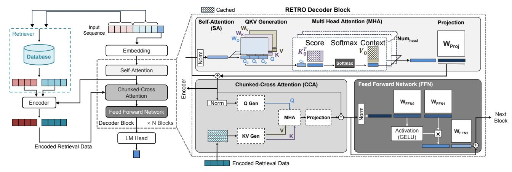
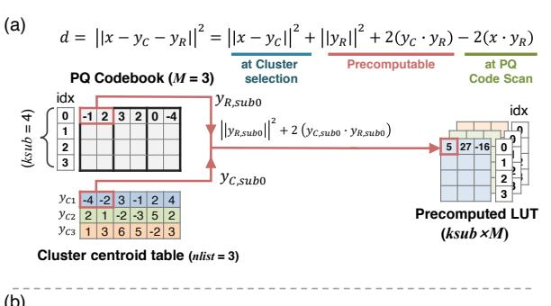
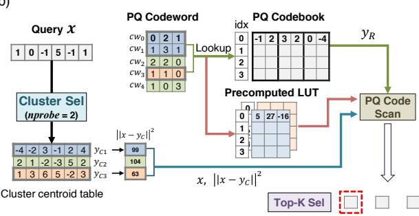
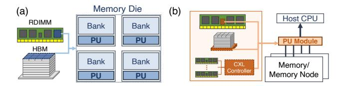

## Accelerating Retrieval Augmented Language Model via PIM and PNM Integration

[Je-Woo Jang](https://orcid.org/0009-0002-3585-6020) Yonsei University Seoul, Republic of Korea jeus63@yonsei.ac.kr

[Sung-Hyuk Cho](https://orcid.org/0009-0007-2647-9661) Yonsei University Seoul, Republic of Korea sunghyuk.cho@yonsei.ac.kr

[Junyong Oh](https://orcid.org/0009-0009-9317-3886) Yonsei University Seoul, Republic of Korea ohjy1121@yonsei.ac.kr

[Jeongyeol Lee](https://orcid.org/0009-0006-5634-8710) Yonsei University Seoul, Republic of Korea jyeol.lee@yonsei.ac.kr

[Youngbae Kong](https://orcid.org/0009-0006-2293-7656) Yonsei University Seoul, Republic of Korea ybkong98@yonsei.ac.kr

[Hoeseok Yang](https://orcid.org/0000-0002-7929-7470) Santa Clara University Santa Clara, California USA hoeseok.yang@scu.edu

[Jae-Youn Hong](https://orcid.org/0009-0006-9487-5562) Yonsei University Seoul, Republic of Korea jaeyounhong@yonsei.ac.kr

[Joon-Sung Yang](https://orcid.org/0000-0002-1502-5353) Yonsei University Seoul, Republic of Korea js.yang@yonsei.ac.kr

## Abstract

Retrieval-Augmented Language Models (RALMs) integrate a language model with an external database to generate high-quality outputs utilizing up-to-date information. However, both components of a RALM system, the language model and the retriever, suffer from distinct memory-bound bottlenecks. In particular, the attention mechanism of the language model heavily relies on General Matrix-Vector Multiplication (GEMV) operations using unique K/V matrices per request, complicating batch parallelization and exacerbating memory bandwidth constraints. Conversely, the retriever encounters performance bottlenecks due to frequent LUT lookups and intensive sorting operations, characterized by low arithmetic intensity and limited data reuse, making GPU acceleration challenging. To address these distinctive characteristics, this paper proposes MNM, a hardware architecture integrating Processing In Memory (PIM) within the HBM core die and Processing Near Memory (PNM) on the HBM logic die. The PIM module leverages the high internal bandwidth of HBM to accelerate GEMV operations in the language model, while the PNM module optimizes retrieval-specific tasks. Furthermore, this work introduces a novel RALM scheduling strategy combining selective batching and early generation to exploit the performance improvements achieved by the MNM architecture. By strategically overlapping retrieval and generation phases, the proposed scheduling scheme reduces idle cycles in a batched RALM system. Experimental results demonstrate that the proposed techniques achieve up to 29.2× performance speedup compared to a conventional GPU-based RALM system. In addition, the proposed PIM/PNM-integrated approach saves up to 71.5% of energy consumption, highlighting its applicability for memory-bound RALM workloads.

## Keywords

Retrieval augmented language model, Processing in Memory, Processing near memory, Vector Search, High Bandwidth Memory

[This work is licensed under a Creative Commons Attribution 4.0 International License.](https://creativecommons.org/licenses/by/4.0) MICRO '25, Seoul, Republic of Korea © 2025 Copyright held by the owner/author(s). ACM ISBN 979-8-4007-1573-0/25/10 <https://doi.org/10.1145/3725843.3756020>

#### ACM Reference Format:

Je-Woo Jang, Junyong Oh, Youngbae Kong, Jae-Youn Hong, Sung-Hyuk Cho, Jeongyeol Lee, Hoeseok Yang, and Joon-Sung Yang. 2025. Accelerating Retrieval Augmented Language Model via PIM and PNM Integration. In 58th IEEE/ACM International Symposium on Microarchitecture (MICRO '25), October 18–22, 2025, Seoul, Republic of Korea. ACM, New York, NY, USA, [17](#page-16-0) pages.<https://doi.org/10.1145/3725843.3756020>

## 1 Introduction

Retrieval-Augmented Language Models (RALMs) are increasingly adopted for knowledge-intensive Natural Language Processing (NLP). RALMs couple a token generator with a retriever that injects on-demand information from external corpora [\[20,](#page-14-0) [56\]](#page-15-0), grounding responses in verifiable and up-to-date information via web-enabled or database-based retrieval [\[66\]](#page-15-1) and keeping the non-parameterized knowledge database independent of model parameters [\[7,](#page-14-1) [27,](#page-14-2) [39,](#page-14-3) [41,](#page-14-4) [56,](#page-15-0) [58\]](#page-15-2). This design mitigates hallucination [\[5,](#page-14-5) [31\]](#page-14-6), addresses data staleness through continual corpus refresh and on-demand retrieval [\[66\]](#page-15-1), simplifies knowledge updates through decoupled storage [\[20,](#page-14-0) [56\]](#page-15-0), and can match the quality of larger parametric models using smaller backbone model structures [\[7,](#page-14-1) [69,](#page-15-3) [95\]](#page-16-1). In practical deployment, RALMs support a broad range of applications—spanning open-domain question answering [\[28,](#page-14-7) [56\]](#page-15-0), multi-hop question answering [\[42\]](#page-14-8), dialogue [\[59\]](#page-15-4), machine translation [\[105\]](#page-16-2), summarization [\[59\]](#page-15-4), code understanding and generation [\[84\]](#page-16-3), and fact checking [\[92\]](#page-16-4)—where external grounding is essential.

A representative approach is the RETRO model of Google Deep-Mind [\[7,](#page-14-1) [69,](#page-15-3) [95\]](#page-16-1), which integrates an autoregressive language model with a vector search-based retriever. In RETRO, a retriever periodically queries an external knowledge database every time a predefined number of tokens are generated. The retrieved information is then integrated into subsequent token generation steps, enhancing the text generation quality of the language model. Despite their promise, the two main components of RALM, a language model and a retriever, are fundamentally memory-bound, causing performance bottlenecks that limit the overall system throughput [\[32,](#page-14-9) [35,](#page-14-10) [80,](#page-15-5) [101\]](#page-16-5). To explore these constraints in detail, this study conducts an indepth workload profiling of a RETRO model [\[7,](#page-14-1) [69\]](#page-15-3) across various retriever configurations. The analysis reveals distinct bottleneck characteristics of each component, highlighting the need for tailored optimization approaches.

Figure 1: Generation flow of RETRO model.

Specifically, from the language model perspective, key operations such as self-attention and chunked cross-attention involve generating unique K/V matrices for each request. These operations predominantly translate into memory-intensive General Matrix-Vector multiplications (GEMV), resulting in high memory bandwidth demands [24, 38, 43, 80, 83, 89, 101]. On the retriever side, vector search based on IVF-PQ requires frequent LUT lookups and intensive sorting operations to efficiently search the data within large-scale, high-dimensional datasets [10, 16, 29, 32, 34, 35, 37, 94]. Such operations not only impose high memory bandwidth demands but are also challenging to parallelize on conventional GPUs.

Motivated by these insights, this paper proposes MNM, a heterogeneous computing architecture specifically designed to alleviate the memory-bound constraints of RALM. The MNM integrates Processing In Memory (PIM) on the HBM core die and Processing Near Memory (PNM) on the logic (buffer) die, effectively distributing computations to their most suitable processing locations. PIM units accelerate GEMV-based attention operations by leveraging the abundant internal memory bandwidth within DRAM. In parallel, PNM units handle retrieval-related computations, including frequent lookups and top-k sorting, with the aid of the high aggregate bandwidth of HBM and dedicated accelerator logic. By optimizing these two memory-intensive tasks together, MNM achieves synergistic improvements in both throughput and energy efficiency, significantly enhancing overall RALM performance.

Furthermore, to fully exploit the advantages of the MNM architecture, this work introduces a novel scheduling strategy that carefully coordinates token generation with retrieval processes. Conventional batch processing in RALM has limited effectiveness due to sequential retrieval processes and repetitive GEMV computations during token generation, which hinder reuse across requests. To address these issues, the proposed scheduling strategy overlaps generation and retrieval operations, effectively reducing idle cycles, thus significantly enhancing batch-level parallelism and overall system throughput.

Experimental results confirm that the proposed MNM-based RALM computing system outperforms GPU-based approaches and state-of-the-art PIM/PNM architectures by more effectively addressing the memory-intensive demands of RALM. This work provides the following key contributions:

- A detailed performance characterization of RALM is provided, analyzing distinct computational features of bottleneck operations of both language model and IVF-PQ-based retriever comprising the RALM system.
- This work proposes an MNM architecture that integrates HBM PIM for GEMV-based attention kernels and PNM for distance computation and top-k selection, delivering higher effective bandwidth utilization.
- This paper introduces scheduling optimizations, including techniques to overlap token generation and retrieval more effectively, thus mitigating sequential bottlenecks in batched RALM inference
- Extensive evaluation results show that the proposed MNM-based RALM system consistently improves overall performance and energy efficiency compared to baseline H100 NVL GPU and existing RALM scheduling and PIM/PNM schemes.

#### 2 Background

In this section, the two main components of RALM system (i.e., the language model and the retriever) are described in detail. First, Sec. 2.1 explains a token generation flow of RETRO language model. Next, the retrieval process of IVF-PQ-based vector search is analyzed in the following Sec. 2.2. Finally, in Sec. 2.3, the distinct characteristics of existing PIM and PNM approaches are discussed to identify the optimal acceleration strategy for RALM system.

#### 2.1 RETRO Generation Flow

Figure 1 provides a simplified illustration of the token generation process in the RETRO model [7], which is one of the representative RALMs. During generation, the retriever queries a large external database for relevant information every <code>retrieval\_interval</code> tokens, using the most recent <code>chunk\_size</code> tokens as the query. The retrieved results are then fed back into the language model, thereby enhancing the quality of text generation. For example, in Figure 1, an input sequence of nine tokens is split into two chunks of four tokens, with one leftover token. In this example, where the <code>chunk\_size</code> and <code>retrieval\_interval</code> are equal, the retriever searches the database every four tokens for chunk-relevant data, which is then encoded by the Encoder and used in the token generation process of the language model.

The language model of RETRO is divided into three main layers: the Embedding Layer, the Decoder Block, and the LM Head. First, the Embedding Layer transforms an input token into an embedding vector, which then passes through N Decoder Blocks, each consisting of three sub-layers: Self-Attention (SA), Chunked Cross Attention (CCA), and Feed Forward Network (FFN). Within the Decoder Block, the self-attention and chunked cross attention layers perform attention-based computations using an embedding vector and encoded retrieval data, respectively. Finally, in the LM Head, the processed vectors are transformed into the final output token. The detailed internal operations of each component are explained as follows.

When an input token enters the model, it is first transformed into an embedding vector by the Embedding Layer. This vector then goes to the SA layer of the Decoder Block, where weight matrices  $W_O$ ,  $W_K$ , and  $W_V$  are applied to produce the Q, K, and V vectors (QKV Generation). Next, the Q, K, V vectors are split into Numhead segments (Numbead= 3 in this example) and processed via Multi-Head Attention (MHA). During MHA, **Q** vector is used directly, while K and V matrices are formed by appending newly computed vectors to the previously cached K and V matrices from earlier tokens. The MHA of each head proceeds as follows: compute the attention scores by  $Q \times K^T$  (Score operation), apply Softmax elementwise to derive attention weights, and multiply these weights with V to generate a context vector (Context operation). The context vectors from each head are concatenated and projected by the WProj matrix (Projection operation), yielding the output vector of the SA layer.

The output from the SA layer is fed into the CCA layer, where the  $\mathbf{Q}$  vector is derived from the SA output vector. Meanwhile, the data retrieved from the external database, based on the tokens used in the most recent retrieval chunk, are used to construct the  $\mathbf{K}$  and  $\mathbf{V}$  matrices.

The retrieved data are maintained until the next retrieval, which occurs after retrieval\_interval tokens are generated. Thus, **K** and **V** matrices of the CCA layer, computed using the retrieved data chunk, are cached during that interval. The MHA operation and subsequent Projection are performed on these **Q** vector and **K** and **V** matrices. Afterward, the resulting vector of the CCA layer is passed through the FFN, which applies linear computations with its own set of weight matrices. The FFN output is then sent to the next Decoder Block, and after passing through all *N* blocks, the final LM Head layer produces the output token. This SA-CCA-FFN sequence ensures that the retrieved data are incorporated in the token generation process.

It is worth noting that QKV generation, Projection, and FFN can be parallelized by batching vectors and multiplying them against pre-loaded weight matrices, thus improving computational efficiency. However, MHA in both SA and CCA generates unique **K**, **V** matrices per request and relies on GEMV operations with limited batching capability and low data reuse, making performance heavily dependent on memory bandwidth (i.e., memory-bound). Consequently, core MHA computations such as the Score and Context operations become memory-bound operations whose processing performance heavily depends on memory bandwidth. This paper

Figure 2: Explanation of FAISS IVF-PQ vector search. (a) Building precomputed LUT, (b) Retrieval (vector search) process.

further analyzes the MHA overhead in Sec. 3 based on a RALM workload profile.

#### 2.2 IVF-PQ Vector Retrieval Process

To leverage the external database in RALM, efficient retrieval mechanisms are essential for accessing relevant information from large-scale datasets. Meta's Facebook AI Similarity Search (FAISS) library uses IVF-PQ (Inverted File index with Product Quantization) for vector similarity search [16, 34, 35, 37, 103].

The retrieval process in IVF-PQ relies on distance calculation between a query vector and database vectors to identify the most relevant data (i.e., closest data). IVF-PQ utilizes the PQ to quantize vectors into compressed representations and applies IVF to partition a large dataset into clusters, enabling fast searching in large-scale datasets.

To search top-k nearest vectors for the given query, the IVF starts with whole dataset splitting into nlist clusters built with k-means clustering [10, 16, 32, 34, 94]. Each cluster is represented by a centroid vector  $\mathbf{y}_c$ . To reduce the search space during retrieval process, instead of probing all nlist clusters, the IVF-based retrieval conducts the coarse-grained search which selects nprobe clusters among nlist clusters by comparing distances between query  $\mathbf{x}$  and  $\mathbf{y}_c$ , followed by fine-grained search. Besides, based on  $\mathbf{y}_c$ , a data vector  $\mathbf{y}$  in each cluster is stored as the residual vector  $\mathbf{y}_R = \mathbf{y} - \mathbf{y}_c$ , representing the difference between the original vector and its cluster centroid.

In addition to the IVF, Product Quantization (PQ) is applied to alleviate the memory requirement by compressing data. PQ splits a residual vector  $\mathbf{y}_R$  into M sub-vectors, where M is smaller than the original vector dimension. Each sub-vector is then clustered with ksub sub-vector clusters. Typically, ksub is set to 256 in practice,

allowing the sub-vectors to be compactly represented by 8 bits (1 B) [7, 20, 34, 35]. As the final step of PQ process, these sub-vector clusters collectively form the PQ codebook, reducing memory usage and enabling hardware-accelerated distance computations.

Figure 2 illustrates the retrieval process in FAISS IVF-PQ [16, 37]. The L2 distance  ${\bf d}$  between a query  ${\bf x}$  and a data vector  ${\bf y}$  in the database is computed as

$$d = \|\mathbf{x} - \mathbf{y}_c - \mathbf{y}_R\|^2 = \|\mathbf{x} - \mathbf{y}_c\|^2 + \|\mathbf{y}_R\|^2 + 2(\mathbf{y}_c \cdot \mathbf{y}_R) - 2(\mathbf{x} \cdot \mathbf{y}_R).$$

Among these terms,  $\|\mathbf{y}_R\|^2 + 2(\mathbf{y}_c \cdot \mathbf{y}_R)$  does not depend on a query  $\mathbf{x}$ , so it can be precomputed and stored as a LUT before the query arrives. Figure 2 (a) shows how the *precomputed LUT* is built prior to the retrieval process. In the example, the entire dataset is grouped into 3 clusters (nlist = 3), each having a centroid  $\mathbf{y}_c$  in a *cluster centroid table*.

To build the PQ codebook, each 6-dimensional original dataset vector is first split into M=3 sub-vectors. A separate k-means clustering with ksub=4 is then performed on each sub-vector partition, producing the ksub=4 entries of the PQ Codebook. As depicted in Figure 2 (a), the sub-vector centroids (e.g.,  $\mathbf{y}_{R,\mathrm{sub0}}$ ) are dot-producted with the sub-vectors of the cluster centroid (e.g.,  $\mathbf{y}_{C,\mathrm{sub0}}$ ) to fill out the precomputed LUT, one per cluster. Each LUT has a size of  $ksub \times M$ .

Figure 2 (b) illustrates the search procedure, which leverages the precomputed LUT in Figure 2 (a) to identify data vectors closest to the query  $\mathbf{x}$  by calculating L2 distance. The process is divided into three main stages:

- 1) Coarse-grained search (Cluster selection): Compute the distance between the query vector  $\mathbf{x}$  and each cluster centroid  $\mathbf{y}_c$  (i.e.,  $\|\mathbf{x} \mathbf{y}_c\|^2$ ) to identify the top *nprobe* closest clusters. For instance, if nprobe = 2, clusters  $\mathbf{y}_{C1}$  and  $\mathbf{y}_{C3}$  are selected from a total of three clusters (nlist=3).
- **2) Fine-grained search (PQ Code Scan):** Load the *PQ codewords* belonging to the selected *nprobe* clusters (e.g.,  $cw_0$ ,  $cw_1$ ,  $cw_3$ ). Each *PQ codeword* consists of indices pointing to entries in the PQ codebook. By looking up the codebook, the residual vector  $\mathbf{y}_R$  is reconstructed through concatenation. In Figure 2 (b), for example, codeword  $cw_0$  references PQ codebook entries [0, 2, 1], forming the residual vector for distance calculation. The system also looks up the precomputed table to obtain  $\|\mathbf{y}_R\|^2 + 2(\mathbf{y}_c \cdot \mathbf{y}_R)$ , and combines it with the earlier  $\|\mathbf{x} \mathbf{y}_c\|^2$  from cluster selection stage to compute the total distance  $\mathbf{d}$  to  $\mathbf{x}$ .
- 3) Final stage (Top-k selection): Among the computed distances, the k smallest are chosen in a top-k selection stage. In the example, k = 1, so the data with the closest distance is selected.

The IVF-PQ method improves memory efficiency by encoding high-dimensional vectors into compact PQ codes and employing precomputed LUTs, enabling fast data search within large-scale datasets. However, IVF-PQ-based retrieval inherently necessitates frequent LUT access for each PQ codeword index and intensive sorting computations. These operations exhibit low GPU compute and memory bandwidth utilization, limiting parallel execution, thus adversely affecting overall system performance. This work provides the detailed analysis of these overheads in Sec. 3.

Figure 3: Existing memory-processing schemes. (a) PIM, (b) PNM.

