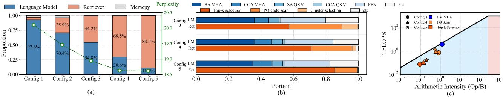
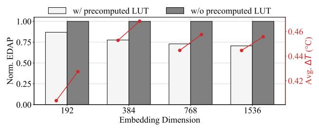
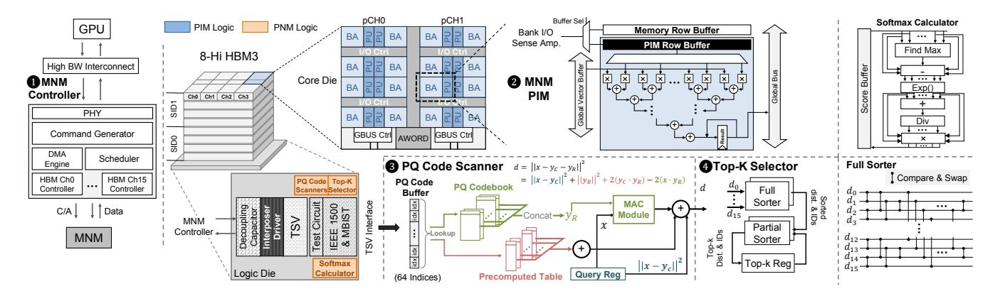
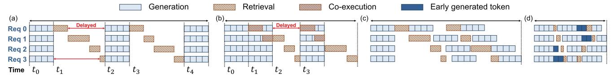
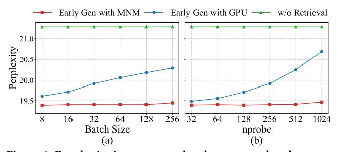
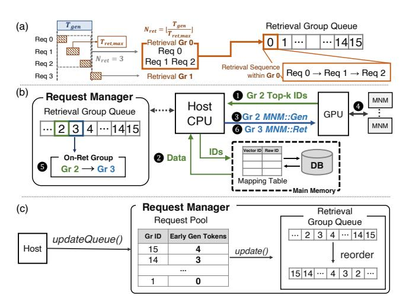
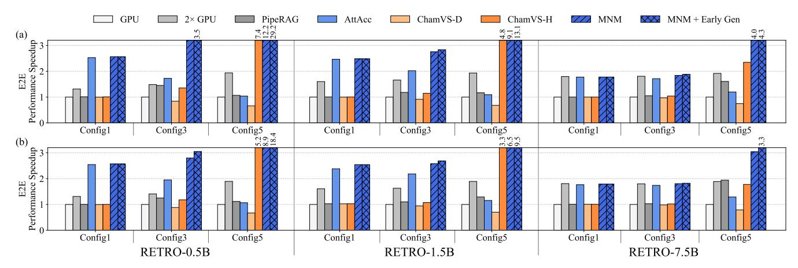
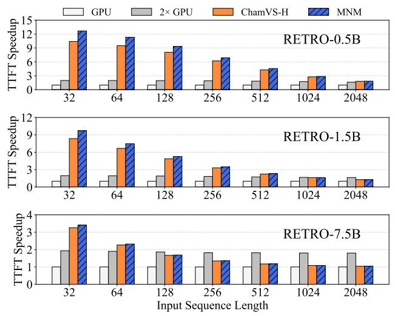
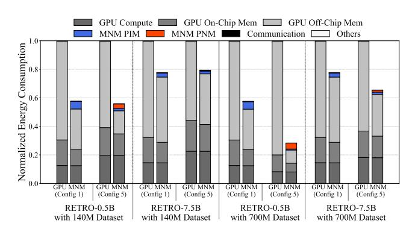
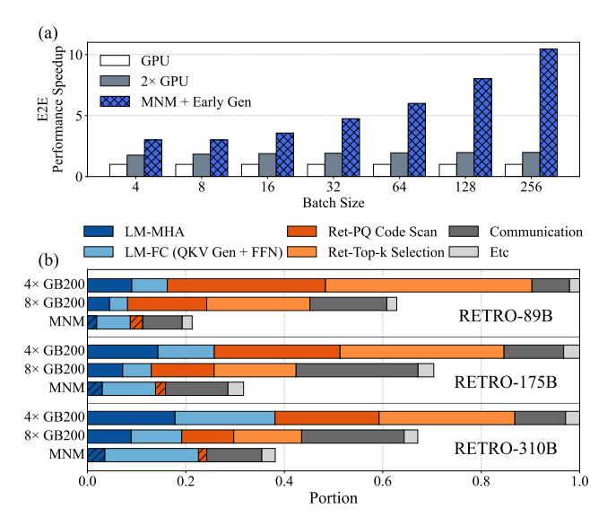

# 2.3 Processing-In-Memory (PIM) and Processing-Near-Memory (PNM)

The emergence of memory-bound workloads has motivated extensive research into in- or near-memory processing architectures, aiming to overcome conventional system bottlenecks caused by limited off-chip memory bandwidth. In particular, prior work has proposed various Processing In Memory (PIM) and Processing Near Memory (PNM) designs. In this section, comparison of existing PIM and PNM architectures is described, highlighting their key features and design considerations.

As shown in Figure 3 (a), PIM places a processing unit (PU) alongside each memory bank so that parallel computations can be implemented across all memory banks, exploiting the high internal memory bandwidth. A PU can be a MAC (Multiply and Accumulate) unit [22, 38, 48, 53–55, 80, 89, 101], a compute core [10, 14, 18, 25, 57, 104], or a database query processor [44], specialized in workloads with low arithmetic intensity. However, due to the constraints stemming from the memory process technology applied for the memory core die, PIM logic faces inherent limitations in supporting more complex computations, thereby restricting it to wimpy processing units [14]. On the other hand, as depicted in Figure 3 (b), PNM places processing modules not in the memory core but rather on the data read path between the host processor and the memory node or local main memory. Similar to PIM, PNM is also suitable for workloads with low arithmetic intensity. However, since PNM logic is fabricated using standard logic process nodes, it allows for a broader range of supported operations. Thus, one can fuse multiple kernels into a single module [21, 29, 52, 68, 83, 90, 91, 93, 102, 107], and exploit high aggregate bandwidth for task-specific computations [40, 47, 50, 61, 81].

Prior studies have predominantly explored either PIM or PNM schemes independently, focusing on specific application domains, without thoroughly investigating their integrated usage. However, in RALM system, the two major components, the language model and the retriever, both exhibit memory-bound behavior yet possess distinct computational needs, making it advantageous to introduce specialized PIM/PNM logic for each key operation. Therefore, this work leverages both PIM (on the core die) and PNM (on the logic die) in HBM, since the modern HBM provides high bandwidth (up to 4 TB/s in a H100 NVL GPU [30, 70]). Such bandwidth surpasses the maximum achievable aggregate bandwidth of DIMM-based memory nodes (e.g., 1.15 TB/s with 12-channel DDR5-6400 memory [3, 4, 67]). Moreover, the available logic die area in HBM allows the implementation of hardware optimized for high-bandwidth computations [45, 87], thereby effectively supporting memory-intensive RALM workloads. Integrating PIM and PNM thus enables each RALM component to be offloaded to its

Figure 4: (a) Proportion of language model (LM) and retriever (Ret) in various configurations. (b) Latency breakdown of each component. (c) A roofline model of H100 NVL GPU and Arithmetic intensity of each operation in Configuration 3, 4, and 5.

most suitable processing location, maximizing performance while minimizing data transfer overhead.

Table 1: IVF-PQ-based Retriever Configurations.

| Parameter | Config 1 | Config 2 | Config 3 | Config 4 | Config 5 |
|-----------|----------|----------|----------|----------|----------|
| nlist     | 32,768   | 16,384   | 8,192    | 4,096    | 2,048    |
| nprobe    | 16       | 32       | 64       | 128      | 256      |
| interval  | 64       | 32       | 16       | 8        | 8        |
| Top-k     | 1        | 2        | 4        | 8        | 16       |
| M         | 64       | 64       | 64       | 64       | 64       |

## 3 Analyzing Key Bottleneck Operations in RALM System

In this section, this work profiles the open-source RETRO model [7, 69], one of the representative RALMs, to identify the operational bottlenecks. The language model of RETRO consists of 12 decoder blocks, with an input sequence length of 64 and an output sequence length of 2048, using 16 batched inputs extracted from the *Realnewslike* subset of the C4 dataset [15]. Each vector of the dataset consists of 384-dimensional FP16 elements. The retriever for RETRO employs the IVF-PQ from FAISS-GPU implementation [37] to leverage enhanced parallelism of GPU in dot product for L2 distance calculation. The profiling is conducted on an Intel Xeon Gold 6526Y CPU as a host processor and an NVIDIA H100 NVL 94GB GPU using Nvidia Nsight Systems [74] and Compute profiler [73].

To investigate the bottlenecks across various retrieval demands, five retriever configurations, shown in Table 1, are employed. These configurations range from Config 1 [7, 20] with a small search space (i.e., small <code>nprobe/nlist</code>), large retrieval interval and low retrieval accuracy to Config 5 with a large search space, small interval and high retrieval accuracy for generating high-quality answers [35]. The accuracy of RALM is evaluated using perplexity, a metric widely used for assessing iterative RALM system [7, 35, 95] where it evaluates how accurately the model predicts a given correct sequence (the lower, the better).

The profiling results, illustrated in Figure 4 (a), reveal that the latency portions of the language model and the retriever vary across configurations. Notably, increasing the frequency and search space of retrieval (from the retrieval portion of 4.4% in Config 1 to 88.5% in Config 5) improves model accuracy (from 20.1 to 18.62). Thus, for high accuracy RALMs, the performance depends on both the language model and the retriever; accelerating only one would yield suboptimal results. Therefore, this work aims to accelerate both by analyzing their respective latency breakdowns to identify bottleneck operations.

Figure 4 (b) presents the operation-wise latency breakdown for configurations where the portion of the retriever latency is higher than 40% (Config 3, 4, and 5). For the language model, MHA in self-attention and chunked cross-attention layers dominates the latency. These attention mechanisms generate unique K and V matrices per request, limiting batch-level parallelism. Moreover, these layers heavily utilize GEMV and element-wise operations, both of which significantly underutilize GPU compute resources due to their memory-bound characteristics. For the retriever, as discussed in Sec. 2.2, the PQ code scan and top-k selection stages are the primary bottlenecks of the performance. Although the massive computing parallelism of GPU is beneficial for dot-product of PQ code scan, it is not appropriate for other computations such as frequent LUT lookups and selecting top-k elements, requiring dedicated logic for acceleration. Additionally, batching retrieval operations is inherently challenging, as each request necessitates accessing a unique set of *nprobe* clusters.

Based on the profiled data with memory utilization, the arithmetic intensity (Op/B) of each operation is calculated. Figure 4 (c) illustrates a roofline analysis for an H100 NVL GPU. As shown in the figure, the key bottleneck operations, MHA, PQ code scan, and top-k selection, are in the memory-bound region of the roofline analysis, making them suitable for acceleration via PIM- and PNM-based approaches. Although all three operations are memory-bound, a closer examination of them reveals fundamentally distinct characteristics, underscoring the necessity of employing both PIM and PNM

MHA operations of SA and CCA layers in the language model exhibit a low arithmetic intensity due to insufficient memory bandwidth rather than inadequate computational throughput. Thus, leveraging abundant internal bank-wise bandwidth offered by PIM can substantially enhance their performance. In contrast, PQ code scanning and top-k selection are characterized by both low arithmetic intensity and low compute utilization on GPU. Deploying tailored accelerators near memory (PNM) can mitigate these issues by enhancing computational efficiency and reducing memory access overhead, thereby addressing the distinct challenges posed by these operations.

## 4 Proposed MNM Architecture

In this section, this paper introduces MNM, a heterogeneous computing architecture to accelerate the RALM system. As discussed in Sec. 3, each major bottleneck, MHA, PQ code scanning, and top-k selection, shows distinct operational characteristics. To address

**Table 2: MNM Command Set** 

| Command             | Description                             |  |  |
|---------------------|-----------------------------------------|--|--|
| PIM_ACT_AB [53, 54] | Activate PIM row buffer for MAC         |  |  |
| PIM_WR_GB [80]      | Write data on global vector buffer      |  |  |
| PIM_MAC_AB [80]     | Compute MAC operation across all        |  |  |
|                     | banks                                   |  |  |
| PIM_MV_SB [80]      | Move to score buffer                    |  |  |
| PNM_RET_INIT        | Initiate PNM-based Retrieval operation, |  |  |
|                     | PQ code scan and top-k selection        |  |  |
| PNM_WR_MMIO         | Write MMIO query register or precom-    |  |  |
|                     | puted table                             |  |  |

Figure 5: EDAP and average thermal increase comparisons between employing precomputed distance LUT and not employing it.

these effectively, MNM identifies the most appropriate processing location and unit for each operation, ensuring the optimized acceleration across the entire RALM workflow.

#### 4.1 Design Decision for Logic Placement

**PIM/PNM Logic Placement:** To efficiently accelerate RALM systems, it is crucial to map each bottleneck operation to the most suitable hardware location, considering both the computational characteristics of the operation and the intrinsic capabilities of the hardware. For instance, PIM logic, fabricated using a DRAM process, inherently supports simple functional units. Thus, placing complex Softmax operations (e.g., exponent and divider logic) for MHA in PIM would increase the area overhead of the memory core die, potentially limiting the available memory capacity [80].

Therefore, to efficiently accelerate MHA, the MNM architecture processes the Score and Context operations using simple MAC units within the PIM logic. Then, to handle complex computations, the results from the PIM logic are transferred directly to a dedicated Softmax unit on the PNM die, enabling immediate processing for subsequent Context operations in PIM.

Similarly, implementing the PQ code scanner within PIM logic is suboptimal, as storing a full copy of the PQ codebook and precomputed tables with MAC unit in each bank would incur area overhead. The area overhead is estimated about 68.8 mm² per core die, even in the relaxed condition where two bank groups share the logic. In addition, it increases power caused by additional allbank write operations, estimated 4.1 W of consumption per core die which totals 32.8 W. Thus, MNM integrates specialized logic for PQ code scanning and top-k selection on the PNM logic die, where MNM can exploit the high aggregate bandwidth of HBM for both efficient lookup and sorting operations.

Meanwhile, since MAC operations in PIM occupy the row buffer, simultaneous memory requests from PNM may cause resource conflicts. To resolve the row buffer contention problem, MNM adopts a dual row buffer architecture [24], dedicating a separate access path for PNM. This additional buffer scheme allows PIM logic to perform MAC operations concurrently with PNM logic reading PQ codewords.

With vs. Without Precomputed LUT: GPU-based FAISS IVF-PQ implementations often avoid precomputed lookup tables. The LUT working set typically exceeds shared-memory capacity and limits reuse under warp scheduling, which reduces the benefit of precomputation [16, 37]. The same trade-off applies to dedicated PNM logic. To decide the architectural policy, EDAP (Energy-Delay-Area Product) and thermal impact are compared between PNM logic w/ precomputed LUT and w/o precomputed LUT. Figure 5 reports EDAP normalized to the w/o LUT case for each embedding vector dimension. Database embeddings from 192 to 1536 dimensions are examined [39, 63, 79, 88]. Logic synthesis method for area and power measurements is detailed in Sec. 6.

Across all embedding dimensions, the logic *w/ precomputed LUT* delivers lower EDAP than *w/o precomputed LUT*. The reduction is 13% at 192-D, 36% at 384-D, and 27–29% at 768/1536-D. The EDAP improvement stems from eliminating repeated distance arithmetic logic via table lookups, whose storage overhead is smaller than the saved operations in the PNM flow. Accordingly, the PNM logic of the proposed MNM datapath adopts precomputed LUTs.

3D-IC Architectural Implications of PNM Placement: Moreover, from a 3D-IC architectural perspective, the placement of PNM logic on the HBM logic die needs to account for thermal and signal integrity challenges. The PHY and TSV regions are primary thermal hotspots on the logic die due to their high-speed switching activity [82]. MNM logic reduces off-chip data transfers through direct in-memory processing, alleviating the PHY traffic. However, placing PNM logic near critical I/O regions may exacerbate thermal throttling and compromise the signal integrity of high-speed I/O channels. Figure 5 demonstrates the estimated temperature rise by a compact layered-conduction model [106],  $\Delta T \approx \frac{P}{A} \left( \frac{t_{\text{Si}}}{k_{\text{Si}}(T)} + \frac{\text{BLT}}{k_{\text{TIM}}} \right)$ , with P and A denoting block power and placement area.  $t_{Si}$  and  $k_{Si}(T)$  are the silicon die thickness and its thermal conductivity at the operating temperature. BLT and  $k_{\text{TIM}}$  represent the thickness and thermal conductivity of the thin bonding layer between the logic die and the heat spreader. The model form and variable definitions are employed from compact chip-level thermal researches on layered conduction and interface layers [19, 26, 64, 106].

As shown by the red markers in the figure, the average temperature rise by PNM logic during PNM operations becomes 0.38–0.47°C. Given the peak thermal increase and the HBM3 temperature criterion of 105°C [82], placing the PNM logic near TSV and PHY areas that operate at junction temperatures of 101–102°C might degrade thermal margin. Therefore, consistent with thermal-aware design principles [45], the PNM logic is located away from these critical I/O regions to ensure both thermal stability and reliable operation.

#### 4.2 MNM Hardware Architecture

Through the tailored integration of PIM and PNM, MNM effectively combines high-bandwidth GEMV acceleration with streamlined

Figure 6: Proposed PIM/PNM-Integrated MNM Architecture.

retrieval computations, substantially improving overall RALM inference performance. The following descriptions detail the MNM architecture and its command set, emphasizing the advantages of unifying PIM and PNM to improve performance.

● MNM Controller: As illustrated on the left side of Figure 6, the GPU connects to the MNM Controller via a high-bandwidth interconnect (such as PCIe or CXL), issuing MNM instructions for the MHA kernels of the language model, as well as PQ code scanning and top-k selection for retrieval. This configuration supports the acceleration of each operation in accordance with its distinct performance characteristics.

When the MNM Controller receives the instructions, its instruction decoder translates them into *MNM commands*, listed in Table 2, and schedules them across the HBM channels. Each command targets specific PIM or PNM operations, such as activating the row buffer or initiating a MAC operation for attention, or performing PQ code scans and top-*k* selection for the retriever.

Since the PIM logic occupies the part of the memory cell area [48, 53, 80], certain row addresses in HBM become unusable for standard DRAM storage. The MNM Controller repurposes these unused addresses to encode MNM commands. Additionally, registers and LUTs required for retrieval operations are exposed to the GPU as Memory-Mapped I/O (MMIO) within this reserved address space. The GPU directly accesses these MMIO regions through a DMA engine, facilitating efficient data transfers essential for retrieval processes, as elaborated in subsequent sections.

**② MNM PIM:** To accelerate score and context computations in the MHA layer, PIM logic is integrated into the HBM core die. Each HBM bank incorporates a 16-bit FP MAC unit [30, 53, 87], which reads 16 FP16 elements from both the PIM row buffer (column data for *K*T and *V*) and the global vector buffer (segments of *Q* vector or softmax outputs) to perform dot-product calculations of GEMV operation. Additionally, each bank equips dual row buffer [24], allowing memory accesses for PNM-based retrieval to proceed concurrently with PIM operations. If normal read/write or PNM commands arrive, the buffer select signal switches to the row buffer used for standard I/O, thus avoiding contention on the global data bus.

When the MNM Controller issues a PIM\_WR\_GB command, it writes an input vector to the global vector buffer. A PIM\_ACT\_AB

command activates the row in the bank, loading the necessary data for GEMV computation into the PIM row buffer. The following PIM\_MAC\_AB command initiates dot-product operations between data in the PIM row buffer and input data transmitted over the global vector buffer, facilitating the score operation of MHA. Dotproduct results are accumulated in a dedicated result register. These results are transferred to the softmax calculator located on the logic die via the PIM\_MV\_SB command [80]. After the softmax operation in the softmax calculator, additional PIM\_MAC\_AB commands execute the context computations on the PIM logic, finalizing the MHA process within the language model. The GPU reads the results from PIM logic and conducts subsequent operations of the language model. Notably, these MAC operations are conducted simultaneously across all banks within an HBM channel, harnessing parallelism to improve the performance of PIM-based GEMV operations, which are limited by memory bandwidth constraints.

� MNM PNM, PQ Code Scanner: To enhance retrieval performance, MNM employs PQ code scanner and Top-k selector on the HBM logic die to accelerate the bottleneck operations of the retriever. Before the PQ code scan stage, the cluster selection stage is first executed on the GPU. The IDs of PQ codewords within each cluster are reordered to optimize the retrieval process. Note that the IDs of PQ codeword are different from the indices residing in PQ codeword. In the IVF system, each 64 B PQ codeword in a cluster is stored and accessed together with its 8 B unique ID, forming a 72 B chunk. This 72 B data size does not align with the 32 B access granularity of HBM3 [30, 53, 87], necessitating either additional accesses or complex realignment logic.

To address this alignment issue, PQ codeword IDs within clusters are systematically reassigned according to their sequential order in memory. The host maintains a mapping table that associates the original PQ codeword IDs with their reassigned IDs. Consequently, the PQ codewords can be transferred directly to the PNM-based retrieval logic without accompanying IDs, enabling efficient data retrieval.

As discussed in Sec. 2.2, three terms,  $||\mathbf{x} - \mathbf{y}_c||^2$ ,  $||\mathbf{y}_R||^2 + 2(\mathbf{y}_c \cdot \mathbf{y}_R)$ , and  $2(\mathbf{x} \cdot \mathbf{y}_R)$  are required to calculate the distance **d** between the query and the data within a database. Among these,  $||\mathbf{x} - \mathbf{y}_c||^2$  is computed by the GPU during the cluster selection stage, before initiating the PNM-based retrieval for each cluster. Prior to this

Figure 7: (a) FAISS-GPU [37], (b) Generation and retrieval Co-execution [35], (c) Selective batching for batched RALM, (d) Early generation with selective batching and MNM.

retrieval, the corresponding precomputed LUT is populated, and both the query vector  $\mathbf{x}$  and the distance term  $||\mathbf{x} - \mathbf{y}_c||^2$  are written into the *Query Register* by the PNM\_WR\_MMIO command.

Next, to initiate retrieval in PNM, the PNM\_RET\_INIT command is issued to load the PQ codewords into the PQ code buffer in the PQ code scanner. This process transfers 1024 B of data every nCCDL (=4) cycles from all HBM3 channels, grouping 64 indices of 1 B PQ codes into a single 64 B index vector. A MAC module, comprising 24 MAC units for 384-dimensional FP16 dot-products, then computes  $\mathbf{x} \cdot \mathbf{y}_R$  and sums it with the LUT result  $||\mathbf{y}_R||^2 + 2(\mathbf{y}_c \cdot \mathbf{y}_R)$  and  $||\mathbf{x} - \mathbf{y}_c||^2$  from the *Query Register* to obtain the final distance **d**. This distance value is passed to the Top-k Selector to identify the closest data.

**QMNM PNM, Top-k Selector:** As discussed in Sec. 3, top-k sorting is one of the primary bottlenecks in retrieval. To accelerate top-k sorting, an initial sorting is performed in the MNM Top-k selector, which consists of a *Full sorter*, a *Partial sorter*, and a *Top-k register*. The sorters employ Odd-Even Merge Sort algorithm [6], which compares and swaps distances at even and odd indices in a parallel manner.

When the 16 new distances ( $d_0$  to  $d_{15}$ ) are received from the 16 PQ code scanners, they are first sorted by the *Full sorter* with their reordered IDs. The *Partial sorter* then merges these sorted distances with the existing top-16 results from the top-k register, producing 32 candidates. Finally, the 16 smallest distances are obtained, updating the top-k register with the distances and the IDs.

Once the PQ code scan and top-k selection for a given cluster are completed, the MNM controller steps in to prepare for the next cluster by establishing a new cluster ID. The controller subsequently issues PNM\_WR\_MMIO commands to populate the precomputed LUT and the query register with the data for the upcoming cluster, priming the PNM logic for the next round of retrieval operations.

After completing the PQ code scan and top-k sorting for all nprobe clusters, the GPU reads the top-k distances and IDs from the register and performs the final top-k selection. The final top-k IDs are then sent back to the host, which lookups an ID mapping table to retrieve the corresponding raw data.

In summary, the proposed MNM architecture enhances the performance of the RALM system by addressing its primary, yet distinct, bottleneck operations through the seamless integration of PIM and PNM. MNM simultaneously accelerates the attention layer of the language model, as well as the distance computations and selection operations of the retriever. Building on top of the MNM architecture, this paper explores further optimization strategies, identifying opportunities for further performance improvements in MNM-based RALM inference. The following section details a scheduling technique designed to utilize the benefits of the proposed MNM architecture.

## 5 Scheduling Scheme for Maximizing MNM-based RALM

In this section, this work proposes a scheduling optimization method that exploits the strengths of the proposed MNM to further accelerate the batched RALM system. Based on the scheduling scheme, this section provides detailed execution flow of the MNM-based batched RALM inference system.

#### 5.1 Selective Batching and Early Generation

Figure 7 (a) illustrates the execution flow of a batched RALM implemented with FAISS-GPU [37]. In this example, the language model performs a retrieval task every four generated tokens, batching four requests (Req 0-3) to concurrently execute token generation.

Although GPU architectures support parallel execution, the potential for concurrent processing is constrained by GPU memory capacity. When enhancing retrieval quality, the per-request memory footprint ( $\propto MaxClusterSize \times nprobe$ ) exceeds the available capacity, forcing sequential retrieval processing. As shown in the figure, such sequential retrieval significantly increases idle periods, thereby extending the end-to-end (E2E) latency since the batched requests should wait to synchronize token generation.

To mitigate this latency issue, *Co-execution* [35] (Figure 7 (b)) reduces E2E latency by parallelizing token generation and retrieval. By utilizing computing resources for parallel operation, Co-execution scheduling improves the performance of RALM with a single request [35]. Nevertheless, two significant concerns remain, especially when deployed in a batched RALM system.

First, as illustrated in Figure 7 (b), it may degrade answer quality when the relevant data obtained from the retrieval initiated at time  $t_1$  for Req 0 are reflected in the token generation at  $t_3$ . This parallel execution violates the retrieval—generation causal order and diminishes model accuracy. Second, Co-execution approach implicitly assumes that the generation and the retrieval have comparable latencies. If token generation has sufficiently long latency, retrieval latency can be hidden. However, if retrieval time increases to search more thoroughly for highly-related data, token generation is subsequently delayed.

To mitigate idle times during batched RALM computation, this work extends the selective (continuous) batching technique [99], initially proposed for dynamically batching the requests of an autoregressive language model arriving asynchronously at different time steps. Figure 7 (c) illustrates the adapted selective batching applied to the batched RALM scenario. In this scheme, each request immediately resumes token generation upon completing its retrieval stage, with retrieval completion serving as an asynchronous trigger for batching. This strategy effectively reduces synchronization overhead associated with sequential retrieval processes.

Figure 8: Perplexity increases under the proposed early generation scheme in GPU-based and MNM-based RALM systems: (a) Batch size scaling, (b) *nprobe* scaling

However, the retrieval itself remains sequential, meaning a request that has completed token generation (such as Req 0 in Figure 7 (c)) may still stall if another request (e.g., Req 3) is in retrieval.

To further mitigate stalls, this paper introduces *Early Generation* on top of selective batching, leveraging the advantage of the proposed MNM architecture. The MNM improves both token generation and retrieval latency through PNM and PIM integration, allowing these two phases to overlap more effectively and reduce overall latency. As discussed in Sec. 4, thanks to the dual row buffer feature of the MNM architecture, PNM-based retrieval behaves like a standard memory read operation, enabling concurrency between retrieval and generation so that both processes can be strategically scheduled together.

As shown in Figure 7 (d), Req 1 is proceeding on its first retrieval. In that case, Req 2 and Req 3 can generate additional tokens in advance. For instance, Req 2 produces 1 extra token and Req 3 produces 2 extra tokens.

If each request requires retrieval every 4 tokens, and Req 3 has already generated 2 early tokens, it only needs 2 more before immediately triggering retrieval, thus taking priority over Req 2. Once Req 3 completes its retrieval, Req 2 follows, and Req 0, Req 1 maintain their previous order. In the second retrieval phase, if Req 2 again incurs long latency, Req 0 and Req 1 can proceed to generate more tokens. It should be noted that the maintaining the model accuracy with proposed early generation scheduling is only viable with PNM-based retrieval. Under a conventional scheme, generating too many tokens early may result in a lack of access to the most recent retrieval data, thereby compromising the output quality of the model.

## 5.2 Impact of Early Generation on Model Accuracy

While combining selective batching and early generation effectively leverages the MNM architecture to accelerate the RALM system, generating tokens prior to retrieval can extend the actual retrieval interval beyond the configured value. As confirmed in Sec. 3, an extended retrieval interval degrades the capability of the model to incorporate external database, compromising accuracy.

The number of early-generated tokens per batch depends on the available generation time, which is primarily determined by two factors: batch size, influencing the total waiting time for batch completion, and retrieval latency, affecting individual request delays. Therefore, it is crucial to evaluate the impact of early generation on

RALM accuracy under varying batch sizes and retrieval latencies (i.e., nprobes).

Figure 8 depicts the accuracy of RALM on MNM and GPU where lower perplexity means better accuracy. Figure 8 (a) shows the perplexity increases with larger batch sizes under the nlist = 4096, nprobe = 256 retriever configuration. Figure 8 (b) uses a fixed batch size of 32, varying nprobe from 32 to 512. In the case of the conventional GPU-based RALM system integrated with early generation, perplexity increases as the batch size or the nprobe grow, since more tokens are generated prematurely before the retrieval. In contrast, MNM achieves lower perplexity, due to the reduced retrieval latency leading to fewer early tokens. Moreover, as the batch size increases, the latency between tokens becomes larger, limiting the scope for extensive early generation within the shortened retrieval cycle. These observations suggest that early generation scheduling, when integrated with the MNM architecture, provides an efficient approach for accelerating RALM system, while maintaining better accuracy.

## 5.3 System-level MNM-based RALM Execution Flow

This section provides an overall view of system-level MNM-based batched RALM execution flow with the integration of early generation. The MNM-based RALM system operates as an event-driven process, enabling asynchronous retrieval and generation tasks for requests within a batch. At admission time, serving requests are partitioned by retrieval configuration, and the requests with the same retrieval configuration are batched together to avoid imbalance caused by heterogeneous latency distributions. To further prevent scheduling contention caused by skewed PQ-scan latencies on hot clusters, database clusters are evenly distributed across MNM-equipped HBM stacks and per-stack results are merged, balancing the PQ-scan workload across stacks.

As described in Figure 9 (a), after completion of the first token, the runtime measures per-token generation time  $T_{\rm gen}$ . After completion of the first retrieval episode, the runtime measures the largest retrieval latency of the active configuration,  $T_{\rm ret,max}$ . Based on  $T_{\rm gen}$  and  $T_{\rm ret,max}$ , the Request Manager at runtime estimates  $N_{\rm ret} = \lfloor T_{\rm gen}/T_{\rm ret,max} \rfloor$ , which bounds the number of retrieval requests that can be executed within one token-generation time window thereby forming a Request Group (Gr). This timing window bounding gates early generation and prevents degradation of answer quality.

Figure 9 (b) illustrates a scenario where the host orchestrates the transition between generation and retrieval phases of each request group. The core of this process is the Request Manager at runtime, which maintains a *Retrieval Group Queue* containing the sequence of retrieval request groups. The request manager also tracks the currently retrieving request, denoted as the "on-retrieving group (On-Ret Gr)" (e.g., Gr 2 in this example), ensuring seamless management of the execution workflow.

● When a request group Gr 2 finishes its retrieval, the GPU reads the top-*k* IDs, comprising cluster IDs and vector IDs, from the MNMs and transmits them to the host processor. ② The host then utilizes a mapping table to look up the corresponding raw data IDs, subsequently fetching the relevant data from the database. ③

Figure 9: (a) Retrieval Group (Gr) formation within a token generation latency window (b) Retrieval and Generation phase conversion process, (c) Updating the Retrieval Queue.

This retrieved data serves as an argument for the MNM::Gen API, which batches the request group with ongoing generation requests to facilitate parallel token generation. The GPU then conducts batched token generation encompassing PIM-based MHA operation. Meanwhile, the request manager updates the retrieval sequence by examining the retrieval group queue and transitioning the onretrieving group from Gr 2 to the next in line, Gr 3. Based on the retrieval configurations of the requests in Gr 3, the host invokes the MNM::Ret API to execute the retrieval kernel of the group. During kernel execution, the GPU generates MNM instructions and sends them to MNMs in order to initiate the PNM-based retrieval.

Additionally, the request manager sends a trigger to the subsequent group, Gr 4, instructing it to stop token generation and prepare for retrieval. This sequential progress through the retrieval queue ensures that all requests within the batch are processed in an ordered manner.

When all groups in the queue have undergone a retrieval cycle, the host calls the updateQueue() function to reorder the retrieval group queue, as depicted in Figure 9 (c). To support selective batching, the host maintains a *Request Pool* [99] which tracks the number of tokens generated early by each retrieval group. Based on this information, the request manager reorders the retrieval group queue within the batch to determine the sequence of the next retrieval, prioritizing the groups with more early generated tokens.

By employing this selective batching and early generation scheduling strategy, the MNM-based RALM system effectively mitigates idle periods within batched inference. Moreover, this approach leads to improved resource utilization and significant reductions in E2E latency, thereby enhancing overall system throughput and performance.

## 6 Experiments

#### 6.1 Simulation Setup

Simulator: The simulator used in this experiment is based on the AttAcc simulator [80], a cycle-level simulator designed to evaluate

Table 3: Hardware configuration of experimental simulation.

#### (a) GPU and HBM configuration

| GPU  | H100 NVL; 94 GB HBM3; 132 SMs; 1 GHz core; L2 cache 60 MB;                                           |  |  |  |
|------|------------------------------------------------------------------------------------------------------|--|--|--|
|      | Max 32 thread blocks per SM; Max thread block size: 1024;                                            |  |  |  |
|      | Shared memory 132 KB per thread block;                                                               |  |  |  |
|      | Interconnect: NVLink 4.0 [75];                                                                       |  |  |  |
|      | HBM stacks per GPU: 6.                                                                               |  |  |  |
| НВМ3 | 8-Hi, 16 GB per stack [87]; 1024-bit interface @ 5.2 Gb/s per pin;                                   |  |  |  |
|      | Memory Organization: 16Ch / 2pCh / 2Ra / 4BG / 4BA;                                                  |  |  |  |
|      | Page size: 1 KB;                                                                                     |  |  |  |
|      | Timing Parameters (ns): Timing Parameters in ns: tCL=7.308, tRP=7.308, tRAS=17.308, tCCDS=0.769, tC- |  |  |  |

#### (b) MNM logic macros per HBM

CDL=1.538, tRC=24.231, tRCD=7.308, tRRDS=0.769.

|     | Block                   | Freq. [MHz] | Area [mm 2 ] | Power [W] |
|-----|-------------------------|----------------|-------------------------|--------------|
| PIM | FP16 MAC per bank       | 650            | 0.11                    | 0.00105      |
| PNM | Softmax calculator [80] | 650            | 1.38                    | 0.154        |
|     | 16× PQ code scanners    | 650            | 1.00                    | 0.99         |
|     | Top- <i>k</i> sorter    | 650            | 0.003                   | 0.00395      |

the performance and energy consumption of GPU-PIM heterogeneous computing system. It includes modules to measure language model performance and incorporates Ramulator2 [62], a DRAM cycle-level simulator. In the simulation, the performance modeling of language model emulates the optimized memory-aware tiling technique that underlies advanced GPU kernels [13, 77].

To model the RALM system, IVF-PQ performance and energy modeling are implemented based on the FAISS-GPU implementation [37] and integrated into the AttAcc simulator. The performance estimation of the simulator for the IVF-PQ kernels is validated using NVIDIA Nsight Systems [74] and NVIDIA Nsight Compute profilers [73]. Additionally, the MNM commands are added to the Ramulator to enable cycle-level MNM performance measurements. The HBM3 timing parameters are sourced from JEDEC standard [30] to reflect the characteristics of the HBM3 memory equipped in the H100 NVL GPU [76].

Hardware Configuration: The hardware configuration details such as synthesized area and estimated power are summarized in Table 3. The MNM-based RALM system consists of an H100 NVL GPU, with six HBM3 stacks, connected to the six MNM-enabled HBMs, accounting for twelve HBMs in total. The MNM PIM logic is synthesized using the Synopsys SAED 14nm standard cell library. The synthesized area is 10× scaled to reflect the difference between logic and 1z-DRAM memory technology nodes, considering FEOL effect (e.g., large transistor size) to BEOL effect (e.g., less metal layers and large routing pitch) [14]. The area and transfer energy

Figure 10: End-to-End performance speedup comparison result. (a) Realnewslike dataset [15], (b) Wikipedia dataset [17]

of the dual row buffers are considered by [24, 78]. The MNM PNM logic is synthesized using the ASAP 7nm predictive process design kit [11], and the area and power for LUTs and buffers are scaled based on 7nm SRAM [98]. The detailed analysis of area and power overheads is discussed in Sec. 6.6. MNM operates at 650 MHz which is 4× slower speed of the external I/O frequency of the memory (i.e., tCCDL-granularity of 2.6 GHz HBM3) [53, 54, 80, 101].

The energy consumption during a workload execution is measured based on the power consumption of each PIM and PNM logic component. For MNM PIM logic, the energy includes the MAC unit and the dual row buffer. The energy consumed on the DRAM read path such as row activation, global data bus, TSV and silicon interposer is modeled by referring to [78]. While for MNM PNM logic, it considers the PQ code scanner, the Top-k sorter, and the energy for loading PQ codewords through the HBM TSV and global data bus. Also, the simulation reflects the latency and power consumption of the high bandwidth interconnects [97].

**Workload:** To provide comprehensive experiments for various scenarios of RALM, diverse language models and retriever configurations are evaluated. The language models consist of RETRO models with parameter sizes of 0.5 B, 1.5 B, and 7.5 B [7]. For the retriever configurations, the IVF-PQ configurations in Table 1 are utilized. Meanwhile, the datasets employed in the experiments include the Wikipedia dataset [17], consisting of 80 million vectors, and the Realnewslike subset of the C4 dataset [15], which contains 140 million vectors.

#### 6.2 E2E Performance Speedup

To facilitate a comprehensive evaluation and a broad comparative analysis, the performance of the proposed MNM architecture and the Early Generation scheduling scheme is compared with the following schemes.

- GPU (Baseline) [76]: A single NVIDIA H100 NVL GPU equipped with 96GB of HBM3 memory, representing a conventional highperformance platform.
- 2× GPU [76]: A system with two H100 NVL GPUs with 192GB of HBM3 memory, with the same memory capacity as the MNM.
- PipeRAG [35]: A co-execution-based RALM scheduling technique where token generation and retrieval phases are overlapped in a pipelined manner.

- AttAcc [80] (PIM-only): A PIM-only approach where the baseline GPU is connected to six HBM3-based AttAcc devices via NVLink 5.0 [75] to accelerate MHA operations.
- ChamVS-D [34] (PNM-only, DIMM): A PNM-only approach where
  the baseline GPU is connected to the ChamVS FPGA logic via a
  TCP/IP [2, 12]. This system accelerates vector search retrieval
  and is equipped with 4-channel DDR4-2400 memory.
- ChamVS-H (PNM-only, HBM): A scaled PNM-only approach
  where the baseline GPU is connected to six HBM3 devices with
  the ChamVS logic implemented on the HBM logic die and interfaced through a PCIe 5.0.

The experiments are conducted under an input sequence length of 64, producing up to 2048 tokens per request, batched in groups of 32. To evaluate various retrieval scenarios, three retriever configurations (Config 1, 3, and 5 of Table 1) with Wikipedia and Realnewslike datasets are employed. Figure 10 shows the E2E latency improvement of the proposed techniques.

As shown, across all datasets and RETRO model sizes, MNM consistently outperforms 2× GPU, PIM-only (AttAcc) and PNM-only (ChamVS) approaches, demonstrating the synergy of concurrently offloading memory-bound GEMV operations in the language model to PIM while handling frequent LUT lookups and selections in the retriever with PNM. Furthermore, MNM with Early Generation scheduling achieves speedups of up to  $29.2\times$ ,  $13.1\times$  and  $4.3\times$  in Realnewslike dataset and  $18.4\times$ ,  $9.5\times$  and  $3.3\times$  in Wikipedia dataset over the GPU baseline across the RETRO models.

In Config 1, where the language model operations constitute a significant portion of the total latency, GEMV-based attention kernels dominate performance, resulting in substantial improvements primarily from PIM-based acceleration. Therefore, the PIM-only approach and MNM exhibit better speedups than the PNM-only schemes. Conversely, in Config 5, characterized by a larger portion of retriever latency, PNM-based retrieval acceleration provides the most substantial performance benefits. However, ChamVS-D-based PNM acceleration technique shows low performance speedup than HBM-based ChamVS-H (even worse than the GPU baseline) due to the low aggregate bandwidth of DIMMs, demonstrating the scalability of the PNM-performance with memory bandwidth. Notably, Realnewslike dataset exhibits large retrieval latency due to the large

Figure 11: TTFT performance speedup comparison with input sequence length.

search space, allowing PNM acceleration to yield particularly noticeable performance improvements compared to smaller datasets like Wikipedia. MNM benefits from both dimensions of acceleration, fully leveraging the available memory bandwidth on the HBM core and logic dies.

On smaller RETRO model sizes, the Early Generation scheduling yields greater speedups, as more tokens can be produced in advance while preserving the model accuracy. The proposed scheduling better overlaps the generation with the retrieval, improving compute utilization. Although Co-execution scheduling (PipeRAG) also enhances performance when the retrieval and the generation latencies are comparable (Config 3 with RETRO-1.5B and Config 5 with RETRO-7.5B), MNM surpasses these gains by mitigating the memory-bound characteristic of both the retriever and the language model components.

Overall, the results demonstrate that leveraging both PIM and PNM, combined with Early Generation scheduling, outperforms PIM-,PNM-only-based acceleration and co-execution scheduling schemes, maintaining effectiveness even as the system scales across different retrieval configurations and model sizes.

## 6.3 TTFT Performance Speedup

Time-To-First-Token (TTFT) is a latency metric that quantifies the responsiveness of a language model from the perspective of a user [1, 33]. In the context of the RETRO model, TTFT is measured by the sum of the latency from the prefill stage of language model and the retrieval latency [7]. The acceleration provided by the MNM architecture directly reduces the retrieval latency portion of the TTFT. Since the prefill stage of the language model exhibits a latency that is dependent on the length of the input, the evaluation spans input sequences length from 32 to 2048 tokens. Given that the prefill stage is GEMM-dominant [24, 80, 89, 101], in contrast to the GEMV-dominant decode stage, this section provides a quantitative analysis of the impact of accelerated retrieval on the total TTFT speedup. The performance of MNM is compared against a baseline

Figure 12: Normalized energy consumption of GPU baseline and MNM.

GPU, a  $2\times$  GPU configuration, and ChamVS-H [34]. The experiments adopt retrieval "Config 5" with the Realnewslike dataset.

As illustrated in Figure 11, MNM delivers higher TTFT speedup than the baseline GPU and ChamVS-H across the evaluated model sizes and input lengths. Compared with ChamVS-H, MNM adds a further gain by applying vector-ID remapping, which aligns memory accesses and increases HBM read-bandwidth utilization beyond the benefit of PNM offload alone. As the input length increases, the prefill stage becomes language-model bound. In this compute-bound regime, a 2×GPU configuration accelerates both the language model and the retriever, and can surpass PNM-only retrieval-acceleration approaches in TTFT speedup.

#### 6.4 Energy Efficiency

In this section, the energy efficiency of the proposed MNM architecture is evaluated through comparison with a conventional H100 GPU-based RALM system across the configurations employed in Figure 10. The retrieval databases utilized for the evaluation consist of 140M and 700M vector datasets. The energy consumption is normalized to the total energy usage of the GPU baseline for each case. The results provide a detailed breakdown of energy consumption by hardware component, including GPU Compute (energy for registers and ALUs), on-chip memory (L1 and L2 Cache) and off-chip memory access, MNM logic, and GPU-MNM communication.

As depicted in Figure 12, the MNM architecture achieves substantial energy savings. With the 140M vector database, energy reductions reach up to 42.3% in RETRO-0.5B and 22.4% in RETRO-7.5B. The efficiency is even greater with the 700M vector database, reaching 71.5% in RETRO-0.5B and 34.5% in RETRO-7.5B. Across all configurations, MNM consistently reduces the energy consumed by off-chip memory accesses.

Notably, the improvement in energy efficiency is particularly significant for configurations combining smaller RETRO models with larger retrieval datasets (e.g., RETRO-0.5B with the 700M dataset). Considering RALM aims to achieve high RALM accuracy with smaller language models and external databases, this result suggests that MNM provides an efficient solution for RALM systems. This advantage can be attributed to the capability of MNM to mitigate the energy-intensive data transfers inherent in memory-bound operations. For instance, in scenarios where the energy consumption of the language model is dominant, such as in Config 1, energy

Figure 13: MNM performance speedup with (a) Batch size scaling and (b) Model size scaling.

savings are primarily driven by the PIM-based attention operation. This is because, as discussed in Section 3, the retrieval process in this configuration exhibits low compute and memory bandwidth utilization. In these cases, the PIM-based attention provides substantial energy savings by minimizing off-chip data transfers between the GPU and its memory while leveraging parallel all-bank computations within the memory core die.

In contrast, in Config 5, the computations of the retriever are more pronounced due to higher computational and memory demands from a larger search space and more frequent querying. In these scenarios, the PNM logic of the MNM becomes particularly beneficial. By performing retrieval computations within the logic die, the proposed architecture minimizes data movement between the GPU and its memory. Notably, across all RETRO models, MNM achieves up to an additional 25.1% energy reduction in Config 5 compared to Config 1. Therefore, by addressing the distinct memory-bound bottlenecks of both the language model and the retriever, the proposed MNM architecture enhances energy efficiency across various model size and retrieval intensity.

#### 6.5 Scalability

Batch Scaling: The proposed Early Generation scheme is designed to maximize throughput as more requests are processed concurrently. The scheduling scheme is evaluated by scaling the batch size from 4 to 256 for the RETRO-7.5B model. As shown in Figure 13 (a), the performance benefit of MNM with early generation grows significantly with the batch size. Notably, at a batch size of 256, MNM achieves a 10.4× speedup over a single GPU, substantially outperforming a 2× H100 NVL GPU system which only provides nearly 2× speedup. This is because larger batches exacerbate the sequential retrieval bottlenecks and synchronization overheads in conventional systems, even with two GPUs. In contrast, MNM effectively parallelizes token generation and retrieval for each request, fully capitalizing on the increased concurrency.

Model and Database Scaling: To assess the applicability of MNM for future large-scale RALMs, a projection-based scalability analysis with larger models and datasets is conducted. Three existing large-scale transformer-based decoder-only language models are modeled, 89 B [65], 175 B [8], and 310 B, as the original RETRO model is limited to 7.5B parameters [7]. For the baseline, two latest compute nodes consisting of four and eight GB200 systems (4× GB200 and 8× GB200) [71, 72] are employed, interconnected via NVLink5.0 [75], totaling eight and sixteen B200 GPUs each equipped with 192GB of HBM3e memory. In this baseline, MHA operations are distributed across the GPUs, and results are aggregated via collective communication [101]. For the retrieval task, a large-scale database of 32 Billion vectors is utilized, with the moderate retrieval configuration of Config 3 (Table 1). The database clusters are evenly distributed across the MNM-enabled HBMs to maximize parallel computation in PNM operation. Figure 13 (b) presents a detailed latency breakdown, comparing MNM system against the 4× GB200 and 8× GB200 baseline. The results reveal that MNM achieves up to a 2.95× performance improvement compared to the 8× GB200 system. The most significant gains stem from the parallel PNM operations across distributed clusters, as well as the effective PIM-based MHA acceleration. Additionally, MNM simultaneously executes MHA and retrieval operations, enabling parallel processing and further improving efficiency. A key observation is that, for the large language models, inter-GPU communication for MHA constitutes a substantial portion of the latency. Moreover, the communication latency increases as the GPU scales, where it constitutes up to 31.0% of latency in 8× GB200 system. On the other hand, offloading memory-intensive tasks on MNM results in low communication overhead even considering transferring command and data for MNM operation. In conclusion, the MNM architecture not only scales effectively with increasing batch sizes but also demonstrates superior performance and scalability compared to next-generation multi-GPU platforms for large-scale RALM service deployment.

#### 6.6 Overhead Analysis

Area Overhead: The proposed MNM architecture consists of PIM and PNM logic, with component specifications listed in Table 3. Based on the JEDEC standard for an 8-Hi 16GB HBM3 configuration [30], the area for the MAC units and dual row buffers per core die is estimated to be  $14.4 \, mm^2$  and  $3.8 \, mm^2$  [24], respectively. This constitutes a 15.0% overhead relative to a standard 121 mm2 core die area [53, 54]. The overhead reported in AttAcc [80] is 10.8% and the difference in the MNM is due to the dual row buffer. This architectural decision is crucial as it enables concurrent PNM operations, leading to significant performance gains as verified in Sec. 6.2. The PNM logic area overhead is broken down by the components of the PQ code scanner, with the PQ codebook, precomputed table, and MAC units constituting 82.0%, 13.7%, and 4.3% of the area, respectively. The total area overhead of the PNM logic including softmax calculator is 2.0% of HBM3 logic die [82, 87], which falls within the available logic area (47.7%) of the HBM logic die as reported in prior work [45].

**Power Overhead:** In the PIM logic, the MAC units on a single core die consume 134.5 mW. The power consumption of a dual row

buffer is estimated as 98.2 mW, based on active standby and data transfer energy during concurrent PIM/PNM operation [\[49,](#page-15-36) [78\]](#page-15-32). In the PNM logic, the power consumption of a PQ code scanner is distributed among the PQ codebook, precomputed table, and MAC units, with proportions of 37.1%, 6.2%, and 56.7%, respectively and the softmax calculator consumes 154 mW. Under a maximum utilization scenario within the execution pipeline, the MNM logic consumes a total of up to 5.35 W, which corresponds to 4.6% of the 116 W maximum power budget calculated with all-bank interleave access pattern [\[23,](#page-14-40) [80\]](#page-15-5). While this adds a modest amount of power, MNM achieves significantly higher energy efficiency, as discussed in Sec. [6.4.](#page-11-2) In addition, the added power is effectively balanced out by the reduced off-chip data transfers through the PHY, which helps alleviate thermal concerns commonly caused by high-bandwidth PHY activity [\[82\]](#page-15-26).

## 7 Discussion

Applicability to Diverse RALM Paradigms: While this work focuses on iterative retrieval, the applicability of MNM can be extended to various RALM paradigms [\[33\]](#page-14-38) deployed by major industry service providers. MNM is inherently well-suited for hyperscale retrieval [\[9,](#page-14-41) [96\]](#page-16-21). As demonstrated in Sec. [6.5,](#page-12-2) the performance and energy efficiency scale effectively with database size, making it a viable solution for RALM systems that utilize massive external corpora. Furthermore, MNM can accelerate long-context RALM systems [\[51,](#page-15-37) [100\]](#page-16-22) that employ more computationally intensive retrieval schemes, such as exact k-Nearest Neighbor (kNN) search, with minimal PIM hardware logic modifications. While often prohibitive on conventional systems, the intensive distance calculations required by exact kNN can be efficiently parallelized across the MNM logic, directly addressing the compute-heavy nature of such high-fidelity retrieval tasks.

RALM Cache: Recent RALM-caching systems, such as RAG Cache [\[36\]](#page-14-42), and Cache-Craft [\[1\]](#page-14-37), cache the key–value states associated with retrieved documents or the prompt prefix [\[46\]](#page-15-38), thereby avoiding redundant prefill computation on frequently reused context. As cache hit rates increase by employing these schemes, the bottleneck of RALM system shifts toward the retriever, which strengthens the case for MNM acceleration on the retrieval path. MNM complements these caching methods without modifying model behavior by offloading PQ code scans and top- selection to near-memory logic and exploiting high-bandwidth access to index data. Overall, RAG caching and MNM address orthogonal approaches, prefill and retrieval, thus combining them improves TTFT and throughput across workloads and scales.

## 8 Related Works

In the domain of PIM architectures, significant strides have been made to address memory bandwidth bottlenecks, particularly for AI workloads and high-performance computing. For instance, works such as [\[48,](#page-15-7) [54,](#page-15-23) [55\]](#page-15-9) from memory vendors propose integrating computational units directly onto the memory die, leveraging the high internal bandwidth of DRAM to minimize data movement.

Building on these PIM schemes, studies such as AttAcc [\[80\]](#page-15-5), NeuPIM [\[24\]](#page-14-11), and IANUS [\[89\]](#page-16-6) introduce GPU/NPU-PIM heterogeneous computing systems to accelerate large language models

(LLMs). Specifically, these system offloads high arithmetic intensity operations such as FFNs to GPUs or NPUs, which exploits highly optimized computing resources for parallel operations, while delegating lower arithmetic intensity tasks, such as MHA mechanisms, to PIM units. This synergistic approach harnesses the complementary strengths of each processing element, yielding significant performance gains for LLMs. Also targeting RALM acceleration, Heter-RAG [\[60\]](#page-15-39) proposes a heterogeneous PIM architecture that combines HBM-based and DIMM-based PIM. This approach maps the generation and retrieval stages to different memory technologies to respectively address their distinct bandwidth and capacity demands.

Parallel to these efforts, another line of research focuses on accelerating vector search, a critical component in retrieval-augmented systems, via PNM-based techniques. Studies such as Chameleon [\[34\]](#page-14-17), FAANS [\[32\]](#page-14-9) and IKS [\[85\]](#page-16-23) explore the deployment of dedicated vector search processing units on DIMM-based or LPDDR-based memory nodes. By implementing LUT-based optimizations, they achieve efficient distance computations, enhancing the throughput of vector search operations. DReX [\[86\]](#page-16-24) presents an algorithmichardware co-design that focuses on accelerating accurate dense retrieval. The work utilizes a combination of in-DRAM and nearmemory processing to perform high-performance exact nearest neighbor search.

Meanwhile, PipeRAG [\[35\]](#page-14-10) proposes a pipelined co-execution strategy that overlaps the retrieval and generation phases of RALM system. Unlike sequential RALM execution, this approach mitigates latency bottlenecks by enabling simultaneous processing of retrieval and generation, thereby improving overall RALM system performance.

## 9 Conclusion

This paper proposes MNM, a heterogeneous PIM-PNM integrated architecture designed to tackle the fundamental memory bottlenecks in RALM systems. By strategically offloading the attentionbased GEMV operations of the language model to PIM and the search-and-sort tasks of the retriever to dedicated PNM logic, MNM efficiently accelerates both core components of RALM. Furthermore, this work introduces a novel scheduling strategy that pairs selective batching with early generation, maximizing throughput by overlapping the retrieval and generation phases. Comprehensive evaluation shows that the proposed MNM system outperforms conventional GPU-based system by up to 29.2× in performance and 71.5% in energy efficiency. Therefore, MNM presents a solid architectural foundation for building scalable and efficient memory-bound AI systems, demonstrating the applicability of hardware-software co-design.

## Acknowledgments

This work was supported by the National Research Foundation of Korea (NRF) grant (No.RS-2025-25424336, Plug&Play (P&P) Chiplet Integration research center) and Institute of Information & communications Technology Planning & Evaluation (IITP) (No. 2022-0- 00971) funded by the Korea government (MSIT). The EDA Tools used in this work were supported by IDEC, Daejeon, South Korea. Joon-Sung Yang is the corresponding author.

## References

- [1] Shubham Agarwal, Sai Sundaresan, Subrata Mitra, Debabrata Mahapatra, Archit Gupta, Rounak Sharma, Nirmal Joshua Kapu, Tong Yu, and Shiv Saini. 2025. Cache-craft: Managing chunk-caches for efficient retrieval-augmented generation. Proceedings of the ACM on Management of Data 3, 3 (2025), 1–28.
- [2] Albert Alexandrov, Mihai F Ionescu, Klaus E Schauser, and Chris Scheiman. 1995. LogGP: Incorporating long messages into the LogP model—one step closer towards a realistic model for parallel computation. In Proceedings of the seventh annual ACM symposium on Parallel algorithms and architectures. 95–105.
- [3] AMD. 2024. AMD EPYC™ 9755. [https://www.amd.com/en/products/processors/](https://www.amd.com/en/products/processors/server/epyc/9005-series/amd-epyc-9755.html) [server/epyc/9005-series/amd-epyc-9755.html](https://www.amd.com/en/products/processors/server/epyc/9005-series/amd-epyc-9755.html)
- [4] Advanced Micro Devices (AMD). 2022. AMD EPYC 9004 Series Processors. [https://www.amd.com/content/dam/amd/en/documents/epyc-technical](https://www.amd.com/content/dam/amd/en/documents/epyc-technical-docs/white-papers/58015-epyc-9004-tg-architecture-overview.pdf)[docs/white-papers/58015-epyc-9004-tg-architecture-overview.pdf.](https://www.amd.com/content/dam/amd/en/documents/epyc-technical-docs/white-papers/58015-epyc-9004-tg-architecture-overview.pdf) [Online; accessed 02-April-2025].
- [5] Akari Asai, Zeqiu Wu, Yizhong Wang, Avirup Sil, and Hannaneh Hajishirzi. 2023. Self-RAG: Learning to Retrieve, Generate, and Critique through Self-Reflection. arXiv[:2310.11511](https://arxiv.org/abs/2310.11511) [cs.CL]
- [6] Kenneth E Batcher. 1968. Sorting networks and their applications. In Proceedings of the April 30–May 2, 1968, spring joint computer conference. 307–314.
- [7] Sebastian Borgeaud, Arthur Mensch, Jordan Hoffmann, Trevor Cai, Eliza Rutherford, Katie Millican, George Bm Van Den Driessche, Jean-Baptiste Lespiau, Bogdan Damoc, Aidan Clark, et al. 2022. Improving language models by retrieving from trillions of tokens. In International conference on machine learning. PMLR, 2206–2240.
- [8] Tom Brown, Benjamin Mann, Nick Ryder, Melanie Subbiah, Jared D Kaplan, Prafulla Dhariwal, Arvind Neelakantan, Pranav Shyam, Girish Sastry, Amanda Askell, et al. 2020. Language models are few-shot learners. Advances in neural information processing systems 33 (2020), 1877–1901.
- [9] Chi-Min Chan, Chunpu Xu, Ruibin Yuan, Hongyin Luo, Wei Xue, Yike Guo, and Jie Fu. 2024. Rq-rag: Learning to refine queries for retrieval augmented generation. arXiv preprint arXiv:2404.00610 (2024).
- [10] Sitian Chen, Amelie Chi Zhou, Yucheng Shi, Yusen Li, and Xin Yao. 2024. MemANNS: Enhancing Billion-Scale ANNS Efficiency with Practical PIM Hardware. arXiv preprint arXiv:2410.23805 (2024).
- [11] Lawrence T Clark, Vinay Vashishtha, Lucian Shifren, Aditya Gujja, Saurabh Sinha, Brian Cline, Chandarasekaran Ramamurthy, and Greg Yeric. 2016. ASAP7: A 7-nm finFET predictive process design kit. Microelectronics Journal 53 (2016), 105–115.
- [12] David Culler, Richard Karp, David Patterson, Abhijit Sahay, Klaus Erik Schauser, Eunice Santos, Ramesh Subramonian, and Thorsten Von Eicken. 1993. LogP: Towards a realistic model of parallel computation. In Proceedings of the fourth ACM SIGPLAN symposium on Principles and practice of parallel programming. 1–12.
- [13] Tri Dao, Dan Fu, Stefano Ermon, Atri Rudra, and Christopher Ré. 2022. Flashattention: Fast and memory-efficient exact attention with io-awareness. Advances in neural information processing systems 35 (2022), 16344–16359.
- [14] Fabrice Devaux. 2019. The true Processing In Memory accelerator. In 2019 IEEE Hot Chips 31 Symposium (HCS). 1–24. [doi:10.1109/HOTCHIPS.2019.8875680](https://doi.org/10.1109/HOTCHIPS.2019.8875680)
- [15] Jesse Dodge, Maarten Sap, Ana Marasović, William Agnew, Gabriel Ilharco, Dirk Groeneveld, Margaret Mitchell, and Matt Gardner. 2021. Documenting large webtext corpora: A case study on the colossal clean crawled corpus. arXiv preprint arXiv:2104.08758 (2021).
- [16] Matthijs Douze, Alexandr Guzhva, Chengqi Deng, Jeff Johnson, Gergely Szilvasy, Pierre-Emmanuel Mazaré, Maria Lomeli, Lucas Hosseini, and Hervé Jégou. 2024. The Faiss library. (2024). arXiv[:2401.08281](https://arxiv.org/abs/2401.08281) [cs.LG]
- [17] Wikimedia Foundation. [n. d.]. Wikimedia Downloads. [https://dumps.wikimedia.](https://dumps.wikimedia.org) [org](https://dumps.wikimedia.org)
- [18] Christina Giannoula, Ivan Fernandez, Juan Gómez Luna, Nectarios Koziris, Georgios Goumas, and Onur Mutlu. 2022. Sparsep: Towards efficient sparse matrix vector multiplication on real processing-in-memory architectures. Proceedings of the ACM on Measurement and Analysis of Computing Systems 6, 1 (2022), 1–49.
- [19] Shoubhik Gupta, William Taube Navaraj, Leandro Lorenzelli, and Ravinder Dahiya. 2018. Ultra-thin chips for high-performance flexible electronics. npj Flexible Electronics 2 (2018), 8. [doi:10.1038/s41528-018-0021-5](https://doi.org/10.1038/s41528-018-0021-5)
- [20] Kelvin Guu, Kenton Lee, Zora Tung, Panupong Pasupat, and Mingwei Chang. 2020. Retrieval Augmented Language Model Pre-Training. In Proceedings of the 37th International Conference on Machine Learning (Proceedings of Machine Learning Research, Vol. 119), Hal Daumé III and Aarti Singh (Eds.). PMLR, 3929– 3938.<https://proceedings.mlr.press/v119/guu20a.html>
- [21] Hyungkyu Ham, Jeongmin Hong, Geonwoo Park, Yunseon Shin, Okkyun Woo, Wonhyuk Yang, Jinhoon Bae, Eunhyeok Park, Hyojin Sung, Euicheol Lim, et al. 2024. Low-overhead general-purpose near-data processing in cxl memory expanders. In 2024 57th IEEE/ACM International Symposium on Microarchitecture (MICRO). IEEE, 594–611.
- [22] Mingxuan He, Choungki Song, Ilkon Kim, Chunseok Jeong, Seho Kim, Il Park, Mithuna Thottethodi, and TN Vijaykumar. 2020. Newton: A DRAM-maker's

- accelerator-in-memory (AiM) architecture for machine learning. In 2020 53rd Annual IEEE/ACM International Symposium on Microarchitecture (MICRO). IEEE, 372–385.
- [23] Yintao He, Haiyu Mao, Christina Giannoula, Mohammad Sadrosadati, Juan Gómez-Luna, Huawei Li, Xiaowei Li, Ying Wang, and Onur Mutlu. 2025. Papi: Exploiting dynamic parallelism in large language model decoding with a processing-in-memory-enabled computing system. In Proceedings of the 30th ACM International Conference on Architectural Support for Programming Languages and Operating Systems, Volume 2. 766–782.
- [24] Guseul Heo, Sangyeop Lee, Jaehong Cho, Hyunmin Choi, Sanghyeon Lee, Hyungkyu Ham, Gwangsun Kim, Divya Mahajan, and Jongse Park. 2024. Neupims: Npu-pim heterogeneous acceleration for batched llm inferencing. In Proceedings of the 29th ACM International Conference on Architectural Support for Programming Languages and Operating Systems, Volume 3. 722–737.
- [25] Bongjoon Hyun, Taehun Kim, Dongjae Lee, and Minsoo Rhu. 2024. Pathfinding future pim architectures by demystifying a commercial pim technology. In 2024 IEEE International Symposium on High-Performance Computer Architecture (HPCA). IEEE, 263–279.
- [26] A. V. Inyushkin. 2023. Thermal conductivity of group IV elemental semiconductors. Journal of Applied Physics 134, 22 (2023), 221102. [doi:10.1063/5.0178256](https://doi.org/10.1063/5.0178256)
- [27] Gautier Izacard and Edouard Grave. 2020. Leveraging passage retrieval with generative models for open domain question answering. arXiv preprint arXiv:2007.01282 (2020).
- [28] Gautier Izacard, Patrick Lewis, Maria Lomeli, Lucas Hosseini, Fabio Petroni, Timo Schick, Jane Dwivedi-Yu, Armand Joulin, Sebastian Riedel, and Edouard Grave. 2022. ATLAS: Few-Shot Learning with Retrieval Augmented Language Models. arXiv[:2208.03299](https://arxiv.org/abs/2208.03299) [cs.CL]
- [29] Junhyeok Jang, Hanjin Choi, Hanyeoreum Bae, Seungjun Lee, Miryeong Kwon, and Myoungsoo Jung. 2024. Bridging software-hardware for cxl memory disaggregation in billion-scale nearest neighbor search. ACM Transactions on Storage 20, 2 (2024), 1–30.
- [30] JEDEC. 2022. High Bandwidth Memory DRAM (HBM3). JEDEC Publication.
- [31] Ziwei Ji, Nayeon Lee, Rita Frieske, et al. 2023. Survey of Hallucination in Natural Language Generation. Comput. Surveys 55, 12 (2023), 1–38.
- [32] Wenqi Jiang, Shigang Li, Yu Zhu, Johannes de Fine Licht, Zhenhao He, Runbin Shi, Cedric Renggli, Shuai Zhang, Theodoros Rekatsinas, Torsten Hoefler, et al. 2023. Co-design hardware and algorithm for vector search. In Proceedings of the International Conference for High Performance Computing, Networking, Storage and Analysis. 1–15.
- [33] Wenqi Jiang, Suvinay Subramanian, Cat Graves, Gustavo Alonso, Amir Yazdanbakhsh, and Vidushi Dadu. [n. d.]. RAGO: Systematic Performance Optimization for Retrieval-Augmented Generation Serving. In Proceedings of the 52th Annual International Symposium on Computer Architecture.
- [34] Wenqi Jiang, Marco Zeller, Roger Waleffe, Torsten Hoefler, and Gustavo Alonso. 2025. Chameleon: a heterogeneous and disaggregated accelerator system for retrieval-augmented language models. Proceedings of the VLDB Endowment (2025).
- [35] Wenqi Jiang, Shuai Zhang, Boran Han, Jie Wang, Yuyang Bernie Wang, and Tim Kraska. 2025. PipeRAG: Fast retrieval-augmented generation via adaptive pipeline parallelism. Proceedings of the 31th ACM SIGKDD International Conference on Knowledge Discovery and Data Mining (2025).
- [36] Chao Jin, Zili Zhang, Xuanlin Jiang, Fangyue Liu, Xin Liu, Xuanzhe Liu, and Xin Jin. 2024. Ragcache: Efficient knowledge caching for retrieval-augmented generation. arXiv preprint arXiv:2404.12457 (2024).
- [37] Jeff Johnson, Matthijs Douze, and Hervé Jégou. 2019. Billion-scale similarity search with GPUs. IEEE Transactions on Big Data 7, 3 (2019), 535–547.
- [38] Hongju Kal, Chanyoung Yoo, and Won Woo Ro. 2023. Aespa: Asynchronous execution scheme to exploit bank-level parallelism of processing-in-memory. In Proceedings of the 56th Annual IEEE/ACM International Symposium on Microarchitecture. 815–827.
- [39] Vladimir Karpukhin, Barlas Oguz, Sewon Min, Patrick SH Lewis, Ledell Wu, Sergey Edunov, Danqi Chen, and Wen-tau Yih. 2020. Dense Passage Retrieval for Open-Domain Question Answering.. In EMNLP (1). 6769–6781.
- [40] Liu Ke, Udit Gupta, Benjamin Youngjae Cho, David Brooks, Vikas Chandra, Utku Diril, Amin Firoozshahian, Kim Hazelwood, Bill Jia, Hsien-Hsin S Lee, et al. 2020. Recnmp: Accelerating personalized recommendation with nearmemory processing. In 2020 ACM/IEEE 47th Annual International Symposium on Computer Architecture (ISCA). IEEE, 790–803.
- [41] Urvashi Khandelwal, Omer Levy, Dan Jurafsky, Luke Zettlemoyer, and Mike Lewis. 2019. Generalization through memorization: Nearest neighbor language models. arXiv preprint arXiv:1911.00172 (2019).
- [42] Omar Khattab, Keshav Santhanam, Xiang Lisa Li, David Hall, Percy Liang, Christopher Potts, and Matei Zaharia. 2022. Demonstrate-Search-Predict: Composing Retrieval and Language Models for Knowledge-Intensive NLP. arXiv[:2212.14024](https://arxiv.org/abs/2212.14024) [cs.CL]
- [43] Byeongho Kim, Sanghoon Cha, Sangsoo Park, Jieun Lee, Sukhan Lee, Shinhaeng Kang, Jinin So, Kyungsoo Kim, Jin Jung, Jong-Geon Lee, et al. 2024. The breakthrough memory solutions for improved performance on llm inference.

- IEEE Micro 44, 3 (2024), 40–48.
- [44] Donghyuk Kim, Jae-Young Kim, Wontak Han, Jongsoon Won, Haerang Choi, Yongkee Kwon, and Joo-Young Kim. 2024. Darwin: A DRAM-Based Multi-Level Processing-in-Memory Architecture for Column-Oriented Database. IEEE Transactions on Emerging Topics in Computing (2024).
- [45] Seongguk Kim, Subin Kim, Kyungjun Cho, Taein Shin, Hyunwook Park, Daehwan Lho, Shinyoung Park, Kyungjune Son, Gapyeol Park, Seungtaek Jeong, et al. 2021. Signal integrity and computing performance analysis of a processingin-memory of high bandwidth memory (PIM-HBM) scheme. IEEE Transactions on Components, Packaging and Manufacturing Technology 11, 11 (2021), 1955– 1970.
- [46] Woosuk Kwon, Zhuohan Li, Siyuan Zhuang, Ying Sheng, Lianmin Zheng, Cody Hao Yu, Joseph Gonzalez, Hao Zhang, and Ion Stoica. 2023. Efficient memory management for large language model serving with pagedattention. In Proceedings of the 29th symposium on operating systems principles. 611–626.
- [47] Youngeun Kwon, Yunjae Lee, and Minsoo Rhu. 2019. Tensordimm: A practical near-memory processing architecture for embeddings and tensor operations in deep learning. In Proceedings of the 52nd Annual IEEE/ACM International Symposium on Microarchitecture. 740–753.
- [48] Young-Cheon Kwon, Suk Han Lee, Jaehoon Lee, Sang-Hyuk Kwon, Je Min Ryu, Jong-Pil Son, O Seongil, Hak-Soo Yu, Haesuk Lee, Soo Young Kim, et al. 2021. 25.4 a 20nm 6gb function-in-memory dram, based on hbm2 with a 1.2 tflops programmable computing unit using bank-level parallelism, for machine learning applications. In 2021 IEEE International Solid-State Circuits Conference (ISSCC), Vol. 64. IEEE, 350–352.
- [49] Seyed Saber Nabavi Larimi, Behzad Salami, Osman S Unsal, Adrián Cristal Kestelman, Hamid Sarbazi-Azad, and Onur Mutlu. 2021. Understanding power consumption and reliability of high-bandwidth memory with voltage underscaling. In 2021 Design, Automation & Test in Europe Conference & Exhibition (DATE). IEEE, 517–522.
- [50] Donghun Lee, Jinin So, Minseon Ahn, Jong-Geon Lee, Jungmin Kim, Jeonghyeon Cho, Rebholz Oliver, Vishnu Charan Thummala, Ravi shankar JV, Sachin Suresh Upadhya, et al. 2022. Improving in-memory database operations with acceleration dimm (axdimm). In Proceedings of the 18th International Workshop on Data Management on New Hardware. 1–9.
- [51] Jinhyuk Lee, Anthony Chen, Zhuyun Dai, Dheeru Dua, Devendra Singh Sachan, Michael Boratko, Yi Luan, Sébastien MR Arnold, Vincent Perot, Siddharth Dalmia, et al. 2024. Can Long-Context Language Models Subsume Retrieval, RAG, SQL, and More? arXiv preprint arXiv:2406.13121 (2024).
- [52] Minkyu Lee, Sang-Seol Lee, Kyungho Kim, Eunchong Lee, and Sung-Joon Jang. 2024. HAIL-DIMM: Host Access Interleaved with Near-Data Processing on DIMM-based Memory System. In Proceedings of the 61st ACM/IEEE Design Automation Conference. 1–6.
- [53] Sukhan Lee, Shin-haeng Kang, Jaehoon Lee, Hyeonsu Kim, Eojin Lee, Seungwoo Seo, Hosang Yoon, Seungwon Lee, Kyounghwan Lim, Hyunsung Shin, et al. 2021. Hardware architecture and software stack for PIM based on commercial DRAM technology: Industrial product. In 2021 ACM/IEEE 48th Annual International Symposium on Computer Architecture (ISCA). IEEE, 43–56.
- [54] Seongju Lee, Kyuyoung Kim, Sanghoon Oh, Joonhong Park, Gimoon Hong, Dongyoon Ka, Kyudong Hwang, Jeongje Park, Kyeongpil Kang, Jungyeon Kim, et al. 2022. A 1ynm 1.25 V 8Gb, 16Gb/s/pin GDDR6-based accelerator-in-memory supporting 1TFLOPS MAC operation and various activation functions for deeplearning applications. In 2022 IEEE International Solid-State Circuits Conference (ISSCC), Vol. 65. IEEE, 1–3.
- [55] Won Jun Lee, Chang Hyun Kim, Yoonah Paik, Jongsun Park, Il Park, and Seon Wook Kim. 2019. Design of processing-"inside"-memory optimized for dram behaviors. IEEE Access 7 (2019), 82633–82648.
- [56] Patrick Lewis, Ethan Perez, Aleksandra Piktus, Fabio Petroni, Vladimir Karpukhin, Naman Goyal, Heinrich Küttler, Mike Lewis, Wen-tau Yih, Tim Rocktäschel, et al. 2020. Retrieval-augmented generation for knowledge-intensive nlp tasks. Advances in neural information processing systems 33 (2020), 9459–9474.
- [57] Cong Li, Zhe Zhou, Yang Wang, Fan Yang, Ting Cao, Mao Yang, Yun Liang, and Guangyu Sun. 2024. PIM-DL: Expanding the Applicability of Commodity DRAM-PIMs for Deep Learning via Algorithm-System Co-Optimization. In Proceedings of the 29th ACM International Conference on Architectural Support for Programming Languages and Operating Systems, Volume 2. 879–896.
- [58] Chien-Yu Lin, Keisuke Kamahori, Yiyu Liu, Xiaoxiang Shi, Madhav Kashyap, Yile Gu, Rulin Shao, Zihao Ye, Kan Zhu, Stephanie Wang, et al. 2025. TeleRAG: Efficient Retrieval-Augmented Generation Inference with Lookahead Retrieval. arXiv preprint arXiv:2502.20969 (2025).
- [59] Xi Victoria Lin, Xilun Chen, Mingda Chen, Weijia Shi, Maria Lomeli, Rich James, Pedro Rodriguez, Jacob Kahn, Gergely Szilvásy, Mike Lewis, et al. 2023. RA-DIT: Retrieval-Augmented Dual Instruction Tuning. arXiv[:2310.01352](https://arxiv.org/abs/2310.01352) [cs.CL]
- [60] Chaoqiang Liu, Haifeng Liu, Dan Chen, Yu Huang, Yi Zhang, Wenjing Xiao, Xiaofei Liao, and Hai Jin. 2025. HeterRAG: Heterogeneous Processing-in-Memory Acceleration for Retrieval-augmented Generation. In Proceedings of the 52nd Annual International Symposium on Computer Architecture. 884–898.

- [61] Haifeng Liu, Long Zheng, Yu Huang, Chaoqiang Liu, Xiangyu Ye, Jingrui Yuan, Xiaofei Liao, Hai Jin, and Jingling Xue. 2023. Accelerating personalized recommendation with cross-level near-memory processing. In Proceedings of the 50th Annual International Symposium on Computer Architecture. 1–13.
- [62] Haocong Luo, Yahya Can Tuğrul, F Nisa Bostancı, Ataberk Olgun, A Giray Yağlıkçı, and Onur Mutlu. 2023. Ramulator 2.0: A modern, modular, and extensible dram simulator. IEEE Computer Architecture Letters 23, 1 (2023), 112–116.
- [63] Zhuoyuan Mao and Tetsuji Nakagawa. 2023. LEALLA: Learning Lightweight Language-agnostic Sentence Embeddings with Knowledge Distillation. In Proceedings of the 17th Conference of the European Chapter of the Association for Computational Linguistics (EACL). Association for Computational Linguistics, 1886–1894.<https://aclanthology.org/2023.eacl-main.138.pdf>
- [64] Henry A. Martin, Sébastien Libon, Edsger C. P. Smits, René H. Poelma, Willem D. van Driel, and GuoQi Zhang. 2024. Thermal characterization methodology for thin bond-line interfaces with high-conductive materials. Thermal Science and Engineering Progress 53 (2024), 102754. [doi:10.1016/j.tsep.2024.102754](https://doi.org/10.1016/j.tsep.2024.102754)
- [65] Meta AI. 2024. Llama-3.2-90B-Vision. Hugging Face model card. [https://](https://huggingface.co/meta-llama/Llama-3.2-90B-Vision) [huggingface.co/meta-llama/Llama-3.2-90B-Vision](https://huggingface.co/meta-llama/Llama-3.2-90B-Vision) Model card; accessed: 2025- 09-02.
- [66] Reiichiro Nakano, Jacob Hilton, Suchir Balaji, Jeff Wu, Long Ouyang, Christina Kim, et al. 2021. WebGPT: Browser-Assisted Question-Answering with Human Feedback. arXiv[:2112.09332](https://arxiv.org/abs/2112.09332) [cs.CL]
- [67] Nevine Nassif, Ashley O Munch, Carleton L Molnar, Gerald Pasdast, Sitaraman V Lyer, Zibing Yang, Oscar Mendoza, Mark Huddart, Srikrishnan Venkataraman, Sireesha Kandula, et al. 2022. Sapphire rapids: The next-generation intel xeon scalable processor. In 2022 IEEE International Solid-State Circuits Conference (ISSCC), Vol. 65. IEEE, 44–46.
- [68] Si Ung Noh, Junguk Hong, Chaemin Lim, Seongyeon Park, Jeehyun Kim, Hanjun Kim, Youngsok Kim, and Jinho Lee. 2024. PID-Comm: A Fast and Flexible Collective Communication Framework for Commodity Processing-in-DIMM Devices. In 2024 ACM/IEEE 51st Annual International Symposium on Computer Architecture (ISCA). IEEE, 245–260.
- [69] Tobias Norlund, Ehsan Doostmohammadi, Richard Johansson, and Marco Kuhlmann. 2023. On the Generalization Ability of Retrieval-Enhanced Transformers. In Findings of the Association for Computational Linguistics: EACL 2023. Association for Computational Linguistics, Dubrovnik, Croatia, 1485–1493. [doi:10.18653/v1/2023.findings-eacl.109](https://doi.org/10.18653/v1/2023.findings-eacl.109)
- [70] Nvidia. 2022. NVIDIA H100 Tensor Core GPU. [https://www.nvidia.com/](https://www.nvidia.com/content/dam/en-zz/Solutions/Data-Center/h100/PB-11773-001_v01.pdf) [content/dam/en-zz/Solutions/Data-Center/h100/PB-11773-001\\_v01.pdf](https://www.nvidia.com/content/dam/en-zz/Solutions/Data-Center/h100/PB-11773-001_v01.pdf)
- [71] NVIDIA. 2024. NVIDIA Blackwell Architecture Technical Brief. Technical Report V1.0. NVIDIA. Accessed: 2025-06-16.
- [72] NVIDIA. 2025. GB200 NVL2 | NVIDIA. [https://www.nvidia.com/en-us/data](https://www.nvidia.com/en-us/data-center/gb200-nvl2/)[center/gb200-nvl2/.](https://www.nvidia.com/en-us/data-center/gb200-nvl2/) Accessed: 2025-06-16.
- [73] NVIDIA. 2025. NVIDIA Nsight Compute. [https://developer.nvidia.com/nsight](https://developer.nvidia.com/nsight-compute)[compute.](https://developer.nvidia.com/nsight-compute)
- [74] NVIDIA. 2025. NVIDIA Nsight Systems. [https://developer.nvidia.com/nsight](https://developer.nvidia.com/nsight-systems)[systems.](https://developer.nvidia.com/nsight-systems)
- [75] NVIDIA. 2025. NVLink & NVSwitch: Fastest HPC Data Center Platform | NVIDIA. [https://www.nvidia.com/en-us/data-center/nvlink/.](https://www.nvidia.com/en-us/data-center/nvlink/) Accessed: 2025- 06-17.
- [76] NVIDIA Corporation. 2022. NVIDIA H100 Product Brief. Technical Report PB-11773-001. NVIDIA Corporation. Available at [https://www.nvidia.com/content/](https://www.nvidia.com/content/dam/en-zz/Solutions/Data-Center/h100/PB-11773-001_v01.pdf) [dam/en-zz/Solutions/Data-Center/h100/PB-11773-001\\_v01.pdf.](https://www.nvidia.com/content/dam/en-zz/Solutions/Data-Center/h100/PB-11773-001_v01.pdf)
- [77] NVIDIA Corporation. 2024. CUTLASS Documentation: Overview. [https://](https://docs.nvidia.com/cutlass/overview.html) [docs.nvidia.com/cutlass/overview.html.](https://docs.nvidia.com/cutlass/overview.html) Last updated: April 26, 2024, Accessed: 2024-05-21.
- [78] Mike O'Connor, Niladrish Chatterjee, Donghyuk Lee, John Wilson, Aditya Agrawal, Stephen W Keckler, and William J Dally. 2017. Fine-grained DRAM: Energy-efficient DRAM for extreme bandwidth systems. In Proceedings of the 50th Annual IEEE/ACM International Symposium on Microarchitecture. 41–54.
- [79] OpenAI. 2022. New and Improved Embedding Model. [https://openai.com/index/](https://openai.com/index/new-and-improved-embedding-model/) [new-and-improved-embedding-model/.](https://openai.com/index/new-and-improved-embedding-model/)
- [80] Jaehyun Park, Jaewan Choi, Kwanhee Kyung, Michael Jaemin Kim, Yongsuk Kwon, Nam Sung Kim, and Jung Ho Ahn. 2024. AttAcc! Unleashing the power of PIM for batched transformer-based generative model inference. In Proceedings of the 29th ACM International Conference on Architectural Support for Programming Languages and Operating Systems, Volume 2. 103–119.
- [81] Jaehyun Park, Byeongho Kim, Sungmin Yun, Eojin Lee, Minsoo Rhu, and Jung Ho Ahn. 2021. TRiM: Enhancing processor-memory interfaces with scalable tensor reduction in memory. In MICRO-54: 54th Annual IEEE/ACM International Symposium on Microarchitecture. 268–281.
- [82] Myeong-Jae Park, Jinhyung Lee, Kyungjun Cho, Jihwan Park, Junil Moon, Sung-Hak Lee, Tae-Kyun Kim, Sanghoon Oh, Seokwoo Choi, Yongsuk Choi, et al. 2022. A 192-Gb 12-high 896-GB/s HBM3 DRAM with a TSV auto-calibration scheme and machine-learning-based layout optimization. IEEE Journal of Solid-State Circuits 58, 1 (2022), 256–269.
- [83] Sang-Soo Park, KyungSoo Kim, Jinin So, Jin Jung, Jonggeon Lee, Kyoungwan Woo, Nayeon Kim, Younghyun Lee, Hyungyo Kim, Yongsuk Kwon, et al. 2024.

- An lpddr-based cxl-pnm platform for tco-efficient inference of transformerbased large language models. In 2024 IEEE International Symposium on High-Performance Computer Architecture (HPCA). IEEE, 970–982.
- [84] Md Rizwan Parvez, Wasi Uddin Ahmad, Saikat Chakraborty, Baishakhi Ray, and Kai-Wei Chang. 2021. Retrieval Augmented Code Generation and Summarization. arXiv[:2108.11601](https://arxiv.org/abs/2108.11601) [cs.SE]
- [85] Derrick Quinn, Mohammad Nouri, Neel Patel, John Salihu, Alireza Salemi, Sukhan Lee, Hamed Zamani, and Mohammad Alian. 2024. Accelerating Retrieval-Augmented Generation. arXiv preprint arXiv:2412.15246 (2024).
- [86] Derrick Quinn, E Ezgi Yücel, Martin Prammer, Zhenxing Fan, Kevin Skadron, Jignesh M Patel, José F Martínez, and Mohammad Alian. 2025. DReX: Accurate and Scalable Dense Retrieval Acceleration via Algorithmic-Hardware Codesign. In Proceedings of the 52nd Annual International Symposium on Computer Architecture. 1108–1124.
- [87] Yesin Ryu, Sung-Gi Ahn, Jae Hoon Lee, Jaewon Park, Yong Ki Kim, Hyochang Kim, Yeong Geol Song, Han-Won Cho, Sunghye Cho, Seung Ho Song, et al. 2023. A 16 GB 1024 GB/s HBM3 DRAM with source-synchronized bus design and on-die error control scheme for enhanced RAS features. IEEE Journal of Solid-State Circuits 58, 4 (2023), 1051–1061.
- [88] Sentence-Transformers. 2021. all-MiniLM-L6-v2 (Sentence-Transformers). [https:](https://huggingface.co/sentence-transformers/all-MiniLM-L6-v2) [//huggingface.co/sentence-transformers/all-MiniLM-L6-v2.](https://huggingface.co/sentence-transformers/all-MiniLM-L6-v2)
- [89] Minseok Seo, Xuan Truong Nguyen, Seok Joong Hwang, Yongkee Kwon, Guhyun Kim, Chanwook Park, Ilkon Kim, Jaehan Park, Jeongbin Kim, Woojae Shin, et al. 2024. Ianus: Integrated accelerator based on npu-pim unified memory system. In Proceedings of the 29th ACM International Conference on Architectural Support for Programming Languages and Operating Systems, Volume 3. 545–560.
- [90] Joonseop Sim, Soohong Ahn, Taeyoung Ahn, Seungyong Lee, Myunghyun Rhee, Jooyoung Kim, Kwangsik Shin, Donguk Moon, Euiseok Kim, and Kyoung Park. 2022. Computational cxl-memory solution for accelerating memory-intensive applications. IEEE Computer Architecture Letters 22, 1 (2022), 5–8.
- [91] Weiyi Sun, Zhaoshi Li, Shouyi Yin, Shaojun Wei, and Leibo Liu. 2021. ABC-DIMM: Alleviating the bottleneck of communication in DIMM-based nearmemory processing with inter-DIMM broadcast. In 2021 ACM/IEEE 48th Annual International Symposium on Computer Architecture (ISCA). IEEE, 237–250.
- [92] James Thorne, Andreas Vlachos, Christos Christodoulopoulos, and Arpit Mittal. 2018. FEVER: A Large-Scale Dataset for Fact Extraction and Verification. arXiv[:1803.05355](https://arxiv.org/abs/1803.05355) [cs.CL]
- [93] Boyu Tian, Yiwei Li, Li Jiang, Shuangyu Cai, and Mingyu Gao. 2024. NDPBridge: Enabling Cross-Bank Coordination in Near-DRAM-Bank Processing Architectures. In 2024 ACM/IEEE 51st Annual International Symposium on Computer Architecture (ISCA). IEEE, 628–643.
- [94] Bing Tian, Haikun Liu, Zhuohui Duan, Xiaofei Liao, Hai Jin, and Yu Zhang. 2024. Scalable Billion-point Approximate Nearest Neighbor Search Using {SmartSSDs}. In 2024 USENIX Annual Technical Conference (USENIX ATC 24). 1135–1150.
- [95] Boxin Wang, Wei Ping, Peng Xu, Lawrence McAfee, Zihan Liu, Mohammad Shoeybi, Yi Dong, Oleksii Kuchaiev, Bo Li, Chaowei Xiao, et al. 2023. Shall we pretrain autoregressive language models with retrieval? a comprehensive study. arXiv preprint arXiv:2304.06762 (2023).
- [96] Shuting Wang, Xin Yu, Mang Wang, Weipeng Chen, Yutao Zhu, and Zhicheng Dou. 2024. Richrag: Crafting rich responses for multi-faceted queries in retrievalaugmented generation. arXiv preprint arXiv:2406.12566 (2024).
- [97] Ying Wei, Yi Chieh Huang, Haiming Tang, Nithya Sankaran, Ish Chadha, Dai Dai, Olakanmi Oluwole, Vishnu Balan, and Edward Lee. 2023. 9.3 NVLink-C2C: A coherent off package chip-to-chip interconnect with 40Gbps/pin single-ended signaling. In 2023 IEEE International Solid-State Circuits Conference (ISSCC). IEEE, 160–162.
- [98] Yoshisato Yokoyama, Miki Tanaka, Koji Tanaka, Masao Morimoto, Makoto Yabuuchi, Yuichiro Ishii, and Shinji Tanaka. 2020. A 29.2 Mb/mm 2 Ultra High Density SRAM Macro using 7nm FinFET Technology with Dual-Edge Driven Wordline/Bitline and Write/Read-Assist Circuit. In 2020 IEEE Symposium on VLSI Circuits. IEEE, 1–2.
- [99] Gyeong-In Yu, Joo Seong Jeong, Geon-Woo Kim, Soojeong Kim, and Byung-Gon Chun. 2022. Orca: A distributed serving system for {Transformer-Based} generative models. In 16th USENIX Symposium on Operating Systems Design and Implementation (OSDI 22). 521–538.
- [100] Zhenrui Yue, Honglei Zhuang, Aijun Bai, Kai Hui, Rolf Jagerman, Hansi Zeng, Zhen Qin, Dong Wang, Xuanhui Wang, and Michael Bendersky. 2024. Inference scaling for long-context retrieval augmented generation. arXiv preprint arXiv:2410.04343 (2024).
- [101] Sungmin Yun, Kwanhee Kyung, Juhwan Cho, Jaewan Choi, Jongmin Kim, Byeongho Kim, Sukhan Lee, Kyomin Sohn, and Jung Ho Ahn. 2024. Duplex: A Device for Large Language Models with Mixture of Experts, Grouped Query Attention, and Continuous Batching. In 2024 57th IEEE/ACM International Symposium on Microarchitecture (MICRO). IEEE, 1429–1443.
- [102] Sungmin Yun, Hwayong Nam, Kwanhee Kyung, Jaehyun Park, Byeongho Kim, Yongsuk Kwon, Eojin Lee, and Jung Ho Ahn. 2024. CLAY: CXL-based Scalable NDP Architecture Accelerating Embedding Layers. In Proceedings of the 38th

- ACM International Conference on Supercomputing. 338–351.
- [103] Jingrong Zhang, Akira Naruse, Xipeng Li, and Yong Wang. 2023. Parallel Top-K Algorithms on GPU: A Comprehensive Study and New Methods. In Proceedings of the International Conference for High Performance Computing, Networking, Storage and Analysis (Denver, CO, USA) (SC '23). Association for Computing Machinery, New York, NY, USA, Article 76, 13 pages. [doi:10.1145/3581784.](https://doi.org/10.1145/3581784.3607062) [3607062](https://doi.org/10.1145/3581784.3607062)
- [104] Yilong Zhao, Mingyu Gao, Fangxin Liu, Yiwei Hu, Zongwu Wang, Han Lin, Ji Li, He Xian, Hanlin Dong, Tao Yang, et al. 2024. UM-PIM: DRAM-based PIM with Uniform & Shared Memory Space. In 2024 ACM/IEEE 51st Annual International Symposium on Computer Architecture (ISCA). IEEE, 644–659.
- [105] Zexuan Zhong, Tao Lei, and Danqi Chen. 2022. Training Language Models with Memory Augmentation. arXiv[:2205.12674](https://arxiv.org/abs/2205.12674) [cs.CL]
- [106] Yongcun Zhou, Siqi Wu, Yuheng Long, Pengli Zhu, Feixiang Wu, Feng Liu, Vignesh Murugadoss, Williams Winchester, Amit Nautiyal, Zhe Wang, and Zhanhu Guo. 2020. Recent Advances in Thermal Interface Materials. ES Materials & Manufacturing 7 (2020), 4–24. [doi:10.30919/esmm5f717](https://doi.org/10.30919/esmm5f717)
- [107] Zhe Zhou, Cong Li, Fan Yang, and Guangyu Sun. 2023. Dimm-link: Enabling efficient inter-dimm communication for near-memory processing. In 2023 IEEE International Symposium on High-Performance Computer Architecture (HPCA). IEEE, 302–316.