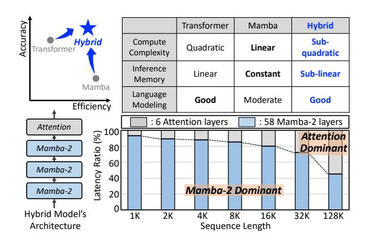
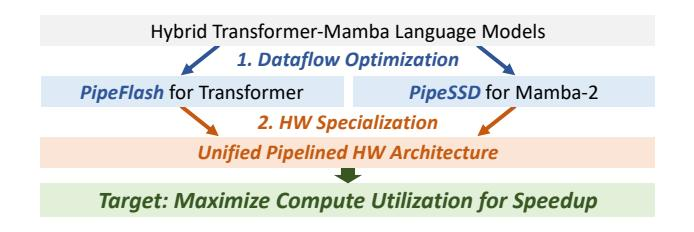
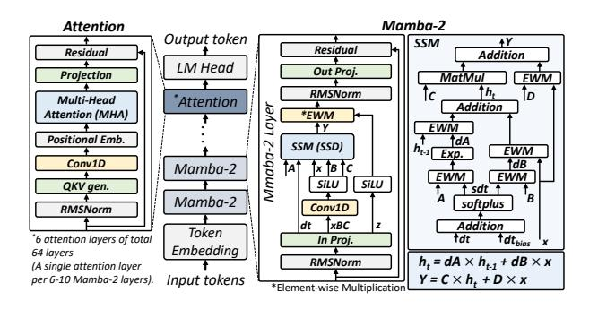

# 1 Introduction

The Hybrid Transformer-Mamba language models [\[11,](#page-12-0) [15,](#page-13-0) [16,](#page-13-1) [27,](#page-14-1) [45,](#page-14-2) [49,](#page-14-3) [51\]](#page-14-4) are emerging as a promising solution to overcome critical limitations of conventional attention-based large language models (LLMs). By combining Transformers and state-space models (SSMs), such as Mamba [\[11,](#page-12-0) [19\]](#page-13-2), these Hybrid models mutually compensate for the drawbacks of each architecture, thereby achieving both accuracy and efficiency. Specifically, Mamba, with its linear computational complexity and constant memory usage, stems from the SSM, mitigates Transformer's quadratic computational complexity and increased memory usage due to its key-value (KV) cache, thereby enabling the processing of longer sequences. Meanwhile, the strong language modeling capabilities of the attention compensate for the degraded recall and in-context learning capabilities of Mamba. As a concrete example, the recent Hybrid model [\[49\]](#page-14-3) achieves 2.5 times faster inference compared to Mistral [\[20\]](#page-13-3), Llama-3.1 8B [\[18\]](#page-13-4), and Mixtral 8×7B [\[21\]](#page-13-5) with 8 times less KV cache memory at a sequence length of 256K, along with improved accuracy.

The complementary advantages of Hybrid models directly stem from their two core computational kernels: attention and SSM. Consequently, maintaining consistent and efficient performance across varying sequence lengths critically depends on effectively managing these two computational kernels. As illustrated in Fig. 1, for sequence lengths below 128K, the overall latency is dominated by the numerous Mamba-2 layers despite their linear complexity. In contrast, as the sequence length increases beyond 128K, the

Figure 1: The comparison between Transformer, Mamba, and Hybrid models. The latency breakdown of the Hybrid-2.7B model on an A100 GPU according to the sequence length.

quadratic complexity of attention layers starts to dominate the latency, highlighting a shift in the performance bottleneck.

Although various software (SW) approaches have been proposed to optimize two key computations on conventional hardware (HW), such as GPUs, both Transformer's attention and Mamba-2 still suffer from suboptimal performance. For attention layers, FlashAttention-2 (FA-2) [10] significantly reduced memory access by merging softmax and matrix multiplication (MatMul) into a single fused kernel while applying tiling and recomputation techniques to compute results directly without storing intermediate data. In addition, FA-2 parallelizes along the sequence length dimension to maximize compute utilization. However, FA-2 still suffers from a dependency between MatMul and non-MatMul operations related to softmax within the attention mechanism. This limitation arises from FA-2's synchronous execution, which restricts the ability to overlap non-MatMul computations with MatMul, thereby inhibiting effective latency hiding [47]. Consequently, as the sequence length increases, compute utilization is saturated at about 61% and 49% on A100 [34] and H100 [36], respectively. To address this low compute utilization, FlashAttention-3 (FA-3) [47] was recently introduced, building upon the Hopper GPU architecture, such as H100. The H100 supports asynchronous execution by incorporating a specialized Tensor Memory Accelerator (TMA) and SW pipelining with warp-specialization [5], allowing FA-3 to overlap non-MatMul and MatMul operations. Nevertheless, despite this asynchronous execution, the compute utilization of FA-3 on the H100 also saturates at around 61%.

For Mamba-2 layers, a state-space duality (SSD) algorithm is introduced to overcome the limited parallelism of SSM, the core computation of Mamba-1, and enhance inference speed [11]. SSD leverages the fact that SSMs are semiseparable matrices. It decomposes these matrices into tiles to increase the number of MatMul operations and improve parallelism rather than computing the entire semiseparable matrices recurrently. MatMul can be viewed as SSM in a tiled form, where input and output sequences are partitioned. However, SSD remains memory-bound, with compute utilization saturating at only about 26.9%. This is because SSD has a higher number of memory-intensive element-wise operations compared

Figure 2: Overview of HLX.

to the attention mechanism, and the high volume of intermediate data generated during the computations, combined with a lack of data reuse, results in relatively high DRAM traffic. Additionally, SSD's recurrent nature prevents it from achieving parallelism along the sequence length dimension like FA-2, resulting in low compute utilization. This memory-bound operation can be sped up through kernel fusion, but to the best of our knowledge, no research has yet fused SSD.

Motivated by these challenges, in this paper, we propose HLX, the first unified Hybrid Transformer-Mamba Language model Xcelerator providing optimized performance on varying sequence lengths and batch sizes. HLX supports the newly proposed fine-grained pipelined dataflows specifically tailored to enhance FA-2 and SSD computations. For attention layers (FA-2), HLX introduces PipeFlash, a refined, fine-grained pipelined dataflow that addresses the issue of dependencies preventing latency reduction, thereby substantially enhancing compute utilization. For the Mamba-2 layers (SSD), we propose PipeSSD, a novel fused SSD algorithm that employs a finegrained pipelined execution to fuse block-based SSD computations. HLX natively supports both fine-grained pipelined dataflows in the unified HW. This approach significantly reduces the DRAM traffic and volume of intermediate data while effectively lowering on-chip memory requirements and enhancing compute utilization. Existing GPU architectures inherently struggle to support HLX's proposed PipeFlash and PipeSSD efficiently. First, although the proposed fused SSD algorithm (i.e., without a fine-grained pipelining) effectively increases the data reuse, it still generates more than twice the amount of intermediate data compared to FA-2, exceeding the per streaming multiprocessor (SM) memory capacity on modern GPUs like A100 and H100 and causing register spilling and reduced occupancy. FA-3 also suffers from register pressure, resulting in a limited block size [47]. Second, although a fine-grained pipelined dataflow could be an attractive solution to mitigate these issues by reducing non-MatMul computation overhead and register spilling, current GPUs exhibit structural limitations in supporting it efficiently. Warp-specialized pipelines are heterogeneous, requiring different resources at each stage, yet the SM-based on a SIMT execution model that assumes uniform warp execution-cannot efficiently handle such pipeline parallelism [9, 33, 43]. Furthermore, while the TMA efficiently supports coarse-grained memory tile transfers, overhead persists for fine-grained memory access [9].

Consequently, we need a specialized HW architecture to achieve the maximum performance from PipeFlash and PipeSSD, as illustrated in Fig. 2. Our proposed HLX achieves high compute utilization by seamlessly handling FA-2 and fused SSD computations,

Figure 3: Architecture of attention, Mamba-2, and Hybrid models. The Hybrid model is based on the work presented in [11], and existing Hybrid models share a similar architecture.

which have inherent inter-operation dependencies, through a unified reconfigurable streamlined architecture. This architecture enables tightly coupled operation execution and streamlined data forwarding across processing units, effectively realizing PipeFlash and PipeSSD. As a result, HLX improves compute utilization by up to 2.03× and 2.84× for FA-2 and SSD, respectively, across varying sequence lengths, compared to well-optimized kernels on the GPU baselines, achieving up to 2.78×, 1.84×, and 4.95× speedups for FA-2, FA-3, and SSD. HLX also boosts end-to-end and batching performance by up to 2.08× and 1.76×, respectively, while reducing area and power consumption by up to 89.8% and 63.8%. Our PipeFlash achieves 4.8× smaller amount of the intermediate data generated during the FA-2 processing, while PipeSSD reduces the amount of the intermediate data generated during the SSD processing by  $11 \times$ with 6.8× DRAM traffic reduction. Thus, HLX also has up to 5.5× less on-chip SRAM capacity than the GPU baselines.

In summary, the contributions of this paper are as follows:

- We analyze the performance bottlenecks of FA-2, FA-3, and SSD on GPUs, identifying the root causes of low compute utilization in Hybrid Transformer-Mamba models.
- We propose PipeFlash and PipeSSD, a novel fine-grained pipelined execution that improves compute utilization, mitigating operational dependencies with increased data reuse.
- We develop HLX, the first unified HW accelerator for Hybrid models, supporting both PipeFlash and PipeSSD with a unified pipelined architecture. HLX achieves consistently high utilization across varying sequence lengths and batch sizes, outperforming GPU-optimized baselines.

