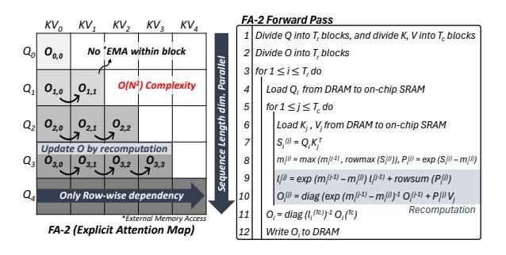
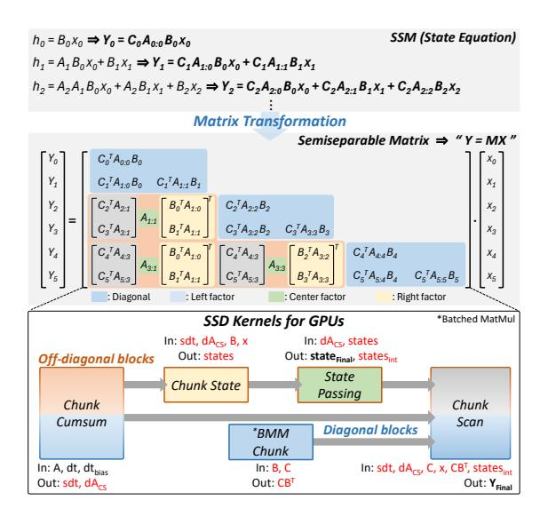

# 2 Background

### 2.1 Limitation of Attention-based Transformer

As the sequence length increases, the attention mechanism [50] becomes the primary bottleneck for Transformer-based model inference. This is because attending to every pair of tokens to compute their relationships leads to a quadratic computational complexity, and storing the KV cache for all processed tokens requires a memory footprint that grows linearly. Moreover, there has been a recent surge in the demand for long sequences [1]. Consequently, the latest LLMs, such as GPT-40 [41], Llama 3.1 [18], Claude 3.5 [3], and

Figure 4: Concept and process of FA-2. By fusing blocklevel operations and compensating through recomputation, DRAM accesses for intermediate data are reduced.

Gemini 2.0 [17], have extended their maximum supported context windows to range from 128K to 1M tokens. As a result, Transformer-based LLMs face significant challenges in achieving efficient long-context inference.

## 2.2 Emergence of State-Space Models (SSMs)

To overcome the quadratic computational increase of Transformers, SSMs such as Mamba have recently emerged as promising alternatives due to their recurrent structure with subquadratic computational complexity and constant inference memory. Among these, Mamba-1 [19] was the first to dynamically update its internal state by selectively emphasizing or suppressing input tokens based on their importance. Building upon this concept, Mamba-2 [11] significantly improves efficiency by redesigning the model architecture to support better parallelism. Most notably, it simplifies Mamba-1's sequential linear projections by moving them to the input projection, allowing the SSM parameters to be generated in parallel through a single projection. Additionally, Mamba-2 adopts a multi-head structure by expanding the head dimension (e.g., from 1 to 64) and the state dimension (e.g., from 16 to 128), improving both performance and scalability. These architectural refinements enable Mamba-2 to achieve better accuracy and faster inference compared to Mamba-1.

Fig. 3 shows the model architecture of Mamba-2. Mamba-2 combines the previously separated attention and FFN layers into a single unified layer, replacing the attention entirely with an SSM operation. During the processing of the Mamba-2 layer, the input first undergoes root mean square normalization (RMSNorm), followed by an input linear projection that generates dt, xBC, and z. Here, z functions as a gating mechanism within a gated multi-layer perceptron (MLP) structure [28], selectively modulating the output from the SSM operation. Meanwhile, xBC undergoes 1D convolution (conv1D) and SiLU [13] operations and is subsequently decomposed into x, B, and C. Finally, the SSM operation takes as inputs the predefined matrix A, along with the previously obtained dt, x, B, and C. The parameter dt controls the decay rate, determining how quickly the influence of past hidden states  $(h_{t-1})$  diminishes in the SSM computation. Parameter *x* represents the input for the current timestep, and B maps the input signal to the internal hidden state  $(h_t)$ , while C converts the updated  $h_t$  into the final output. Finally, the matrix A defines how the  $h_t$  evolves over time, controlling the

Figure 5: The block decomposition method of the SSD algorithm is illustrated. It consists of five kernels for GPUs. There is a possibility of reusing the intermediate data.

temporal dynamics of the model. These parameters (A, dt, x, B, C) interact within the SSM to compute the state equations (see Fig. 3). After the SSM computation, the output Y undergoes z-gating, followed by RMSNorm, an output linear projection, and a residual connection. Through these computations, Mamba-2 demonstrates superior computing and memory efficiency over Transformers, achieving enhanced performance for modeling long sequences.

### 2.3 Hybrid Transformer-Mamba Models

While Mamba-2 successfully overcomes the efficiency limitations of Transformers when modeling long sequences and outperforms them across various natural language processing (NLP) tasks, it still lags behind Transformers in tasks such as in-context learning and recall [4, 51]. This is primarily due to Mamba-2 selectively compressing and storing input tokens within a fixed-size state, leading to gradual information decay over time.

To address these limitations, Hybrid Transformer-Mamba models [11, 15, 16, 27, 45, 49, 51] have recently been proposed. By synergistically leveraging the complementary strengths of both architectures, the Hybrid model not only demonstrates superior performance compared to traditional Transformer-based models but also supports significantly longer sequence lengths. Fig. 3 also shows the architecture of the Hybrid model. Specifically, this model sequentially interleaves the Transformer's attention layers and Mamba-2 layers according to a specific ratio.

