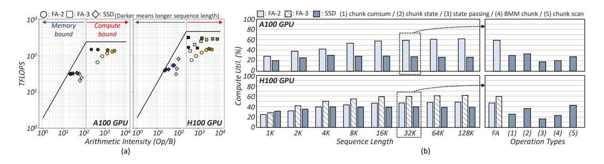
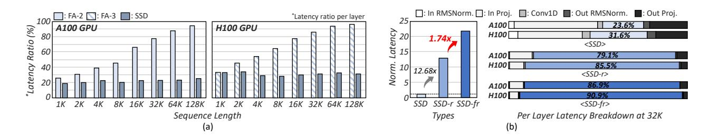
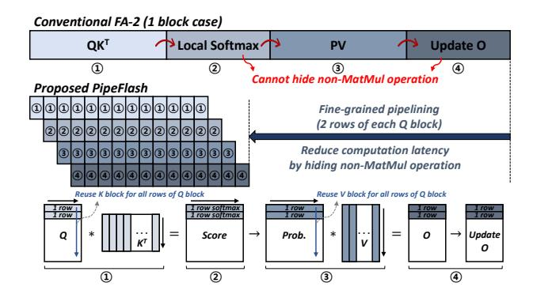

# 2.4 FlashAttention-2 and -3 (FA-2 and FA-3)

FA-2 [10] is an optimized solution designed to alleviate the memory bandwidth bottleneck found in conventional attention mechanisms, resulting in an inference speedup. It divides the attention computation into small blocks and fuses key operations (e.g., MatMul,

```
dt: [b, n, l], A: [n], B: [b, s, l], C: [b, s, l], x: [b, h, l], state Final: [b, n, h, s], Y Final: [b, n, h, l]
      #0. block decomposition: [l] → [c, cl]
      #1. chunk cumsum
             sdt = softplus(dt + dt_{bias}), dA_{CS} = cumsum(sdt \times A) (sdt: [b, n, c, cl], dA_{CS}: [b, n, c, cl])
      # 2. chunk state
            decay\_states = exp (dA_{CS}[:,:,:,-1:] - dA_{CS}]
             states = einsum(B, decay_states, sdt, x)
      #3. state passing
                    _{\text{nics}} = \text{cumsum} (zero padding (dA<sub>cs</sub>[:,:,:,-1], (1, 0)), dim = -1)
             decay\_chunk = causal mask (exp(dA_{chunkCS}[:,:,:,None] - dA_{chunkCS}[:,:,None,:])
                       , states<sub>int</sub> = einsum (decay_chunk, states)
                                                                                 (state<sub>Final</sub>: [b, n, h, s, 1], states<sub>int</sub>: [b, n, h, s, c],
12
     #4. BMM chunk
           CB^T = einsum(C, B^T) (CB^T: [b, c, cl, cl])
      #5. chunk scan
15
            L = causal\ mask\ (exp(\ dA_{CS}[\ :,\ :,\ :,\ :,\ None] - dA_{CS}[\ :,\ :,\ :,\ None,\ :])
            Y_{stor} = einsum (CB^T, L, sdt, x)
                                                                                  (Y<sub>diag</sub>: [b, n, h, c, cl])
            state\_decay\_out = exp(dA_{CS})
             Y_{off} = einsum (C, (states<sub>int</sub> × state_decay_out))
                                                                                  (Y<sub>off</sub>: [b, n, h, c, cl])
```

Figure 6: Process of SSD algorithm.

softmax, masking, etc.) within a single kernel. This approach recomputes intermediate results, such as score and probability matrices, on the fly without storing them in external DRAM, significantly reducing DRAM traffic. Moreover, there is no dependency between query (Q) blocks, enabling parallel processing along the sequence length dimension while maintaining head and batch dimension parallelism, as shown in Fig. 4. Each block performs its operations in the order of  $QK^T$ , local softmax, PV, and update output (O). FA-3 [47] extends FA-2 by redesigning the kernel to leverage new Hopper-specific capabilities such as asynchrony and low-precision. It employs a warp specialization that creates separate "producer" warps for data movement and "consumer" warps for computation, allowing these tasks to be overlapped. It further improves efficiency by interleaving the slower softmax with the faster MatMul operations. Additionally, FA-3 adds support for FP8 precision to nearly double computational throughput, while mitigating accuracy loss.

#### 2.5 State-Space Duality (SSD)

SSD is a hardware-efficient algorithm for the parallel processing of input sequences (SSM computations in Fig. 3 are executed in parallel along the sequence length dimension), introduced in Mamba-2. It overcomes the limitation of Mamba-1, where the recurrent nature of SSM computations lacked the necessary MatMuls, preventing full utilization of modern hardware such as GPUs and TPUs [24]. As illustrated in Fig. 5, SSD leverages the insight that SSM operations can be represented as semiseparable matrices, enabling efficient linear (recurrent) computations as well as hardware-friendly quadratic (attention-like) operations. Rather than performing recurrently over the entire semiseparable matrix at once, SSD employs a block decomposition strategy. Specifically, the diagonal blocks compute independent local SSM outputs within each block of the input sequence. These computations are efficiently implemented using MatMuls and can be performed entirely in parallel. Off-diagonal computations are factorized into three components-right, center, and left factors-to efficiently propagate state information between blocks. The right factors summarize how input data within a block propagates forward by computing each block's states. The center factors then efficiently combine these states across blocks through



Figure 7: (a) The roofline graph and (b) compute utilization for FA-2 and SSD on GPU with varying sequence lengths.



Figure 8: (a) Latency breakdown of (a) FA-2 and (b) SSD on GPU.

cumulative multiplications (1-semiseparable multiplications), effectively propagating global state information forward in time. Finally, the left factors project these accumulated global states into outputs for each block, correctly integrating prior context.

To efficiently process these operations on GPUs, SSD is composed of five kernels: chunk cumsum, chunk state, state passing, batched MatMul (BMM) chunk, and chunk scan. Each kernel is implemented to handle both diagonal and off-diagonal blocks in a highly parallel manner. Fig. 6 shows the process of SSD kernels. The chunk cumsum kernel computes sdt and  $dA_{CS}$  parameters that reflect the decay of state and input data over time, while the chunk state kernel uses these parameters along with *B* and *x* to compute the right factor representing the states. The states computed within each block are then updated by the influence of previous input tokens through the state passing process, producing the final state ( $state_{Final}$ ) as the center factor. For diagonal block operations, the BMM chunk kernel performs a MatMul between B and C. Finally, the chunk scan kernel calculates both the left factor (yielding the off-diagonal output,  $Y_{Off}$ ) and the diagonal output  $(Y_{Diag})$ , which are combined to produce the final output ( $Y_{Final}$ ).

### 3 Computation Analysis

### 3.1 Arithmetic Intensity & Compute Utilization

FA-2 and FA-3 employ a fusion technique to reduce DRAM accesses and increase data reuse, thereby achieving a relatively high arithmetic intensity (Op/B) (see Fig. 7(a)). Consequently, as the sequence length increases, the Op/B continues to rise. However, when the sequence length exceeds 16K (32K for FA-3), the increase in the KV cache leads to a reduction in the Op/B, although it still

remains compute-bound. In terms of compute utilization, there is a gradual increase with longer sequence lengths, but it saturates at approximately 61% at 128K, as shown in Fig. 7(b). This is because FA-2 adheres to a synchronous nature, limiting the overlap of non-MatMul with MatMul computations. For FA-3, although it supports asynchronous 2-stage pipelining for hiding non-MatMul computations, it still suffers from pipeline-agnotic HW and register pressure.

In contrast, SSD remains memory-bound with a very low Op/B, as shown in Fig. 7(a). Even when the sequence length is increased up to 128K, the Op/B hardly increases, and the compute utilization remains at about 27% on A100 and 38% on H100, which is roughly 2.3× and 1.6× lower than that of FA-2 and FA-3, respectively (see Fig. 7(b)). Although SSD operations minimize recurrent operations and maximize MatMul operations to enhance parallelism, they still remain sub-optimal on the GPUs. This is because SSD itself has a higher proportion of memory-intensive operations, such as element-wise operations, compared to FA-2, and it involves many Einsum operations between multi-dimensional tensors. Additionally, a significant amount of intermediate data is generated during each operation, and this data is not immediately reused. To maximize these data reuse opportunities and shift the workload into the compute-bound, a block-level fusion technique similar to that of FA-2 is essential for SSD operations.

### 3.2 Latency Breakdown

Owing to their quadratic computational complexity, FA-2 and FA-3 dominate the attention layer latency once the sequence length exceeds 16K, as shown in Fig. 8(a). Therefore, accelerating FAs is

crucial for speeding up the attention layer of the Hybrid model. In contrast, because SSD has a linear characteristic, even as the sequence length increases, it maintains a nearly constant proportion within the Mamba-2 layer, accounting for an average of about 24% on the A100 and 32% on the H100 for sequence lengths ranging from 1K to 128K at the given Hybrid model size. This makes it the second-largest component in the Mamba-2 layer. Since the number of Mamba-2 layers is dominant in the Hybrid model, accelerating this part is also an essential factor.

However, SSD remains memory-bound, so acceleration through fusion techniques is essential. When implementing operations with a large amount of intermediate data, such as SSD, as a fused single kernel, the required shared memory for each operation becomes a limiting factor [25]. Moreover, if the shared memory requirement exceeds the GPU's available capacity, the kernel will not be able to execute [10, 47]. Consequently, a latency breakdown is performed on both the PyTorch [44]-based reference SSD (SSD-r) that performs the same operations as the SSD presented in [11], and the fused reference SSD (SSD-fr) implemented based on SSD-r using the proposed fused SSD algorithm (described in Section 4). The results showed that the latency of SSD-fr increased by 1.74× compared to SSD-r, as shown in Fig. 8(b).

This outcome is mainly due to the fact that, despite the proposed fused SSD algorithm maximizing data reuse and efficiently reducing DRAM traffic, it still involves over twice as much intermediate data as FA-2. For instance, fused SSD requires 642KB of on-chip memory per block, whereas FA-2 requires only 321KB. This exceeds the per-SM memory capacity of both A100 (256KB of register files and up to 164KB of shared memory) and H100 (256KB of register files and 224KB of shared memory) [34-37], causing register pressure. Since each thread is allocated a finite number of registers, exceeding this limit causes register spilling, where excess data is stored in local memory or, even worse, global memory. This not only increases memory access latency but also reduces the number of threads that can be concurrently scheduled (i.e., lower occupancy), ultimately degrading parallel performance. In addition, fused SSD suffers from sequential dependencies introduced by fusion. In particular, unlike FA-2, SSD exhibits not only row-wise dependency but also column-wise dependency due to its recursive characteristics, which results in a loss of parallelism along the sequence length dimension. Therefore, the fused SSD must also reduce the amount of intermediate data generated through fine-grained pipelining to decrease the required on-chip memory capacity and mitigate sequential dependencies.

### 3.3 Motivation for Specialized Architecture

A new HW architecture is necessary to support both FA-2 and SSD efficiently and maximize their performance. Even advanced methods like FA-3, which utilize block-level asynchrony, still suffer from register pressure (2-stage pipeline doubles the amount of intermediate data for FA-2) and saturated compute utilization, failing to completely hide non-MatMul latencies. Furthermore, so far, FA-3's complex optimization results in a highly specialized implementation whose performance is primarily optimized for specific head dimensions (e.g., 64, 128, 256), potentially leading to performance degradation for other sizes. For SSD, the unfused version



Figure 9: Proposed PipeFlash dataflow.

has critically low compute utilization due to its low Op/B, while the fused SSD, on the other hand, suffers from limited register file and shared memory capacity on GPUs, making it challenging to implement as a single fused kernel. Even when implemented, it often results in performance degradation. Moreover, fused SSD introduces sequential dependencies due to its recurrent nature, which further limits parallelism. To overcome these challenges, a finegrained pipelined dataflow is an attractive solution, as it can mitigate both non-MatMul overheads and register spilling. However, current GPUs cannot efficiently support such fine-grained pipelining due to fundamental architectural constraints. This is because each pipeline stage is a warp with a unique program and different resource requirements (e.g., registers, functional units). This heterogeneity conflicts with the GPU's SIMT execution model, which assumes uniform execution and thus incurs significant scheduling overhead and resource contention for these workloads [9, 29, 33, 43]. In addition, advanced features like H100's TMA are designed for coarse-grained tile movements. This leaves a significant performance opportunity untapped, as many applications that could benefit from pipelining are characterized by fine-grained streaming and gather memory access patterns that are not well supported by existing hardware [9].

