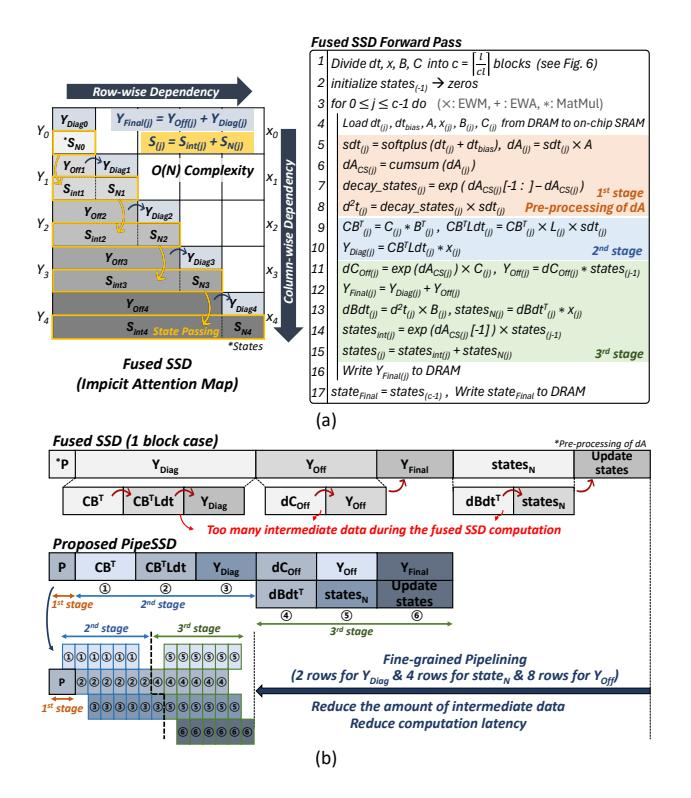
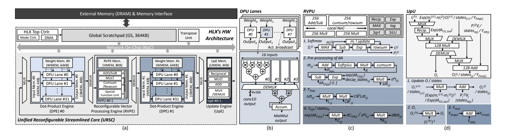
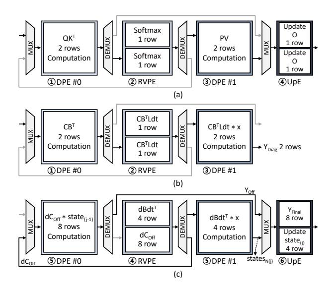
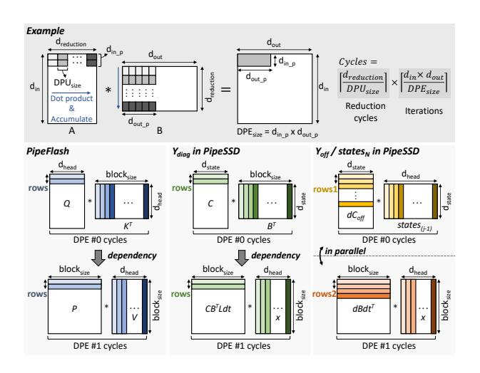

# 4.1 Dataflow Strategy

**PipeFlash.** To speed up the conventional FA-2 by hiding the latency of non-MatMul operations, we propose PipeFlash. Unlike FA-2, which performs operations at the block-level, PipeFlash executes the attention mechanism's  $QK^T$ , local softmax, PV, and update O step-by-step through a pipeline at a finer granularity, processing two rows of Q at a time within each block. As shown in Fig. 9, this approach concurrently executes the softmax and update O operations with MatMul operations such as  $QK^T$  and PV, effectively hiding non-MatMul latency by mitigating the dependencies. Also, PipeFlash reduces the amount of intermediate data generated during the computation by  $4.8\times$  compared to conventional FA-2. This reduction is attributed to the fine-grained pipelining, which reduces the size of the score and probability matrices generated during computation from 128KB to 1KB, respectively. Lastly, similar to FA-2, PipeFlash reuses K and V blocks by processing all rows in a

Figure 10: (a) Proposed fused SSD. By fusing block-level operations similar to FA-2, external DRAM accesses for intermediate data are reduced. (b) Proposed PipeSSD dataflow.

given Q block against them. However, PipeFlash uniquely performs this at a finer granularity to enable its pipeline.

**PipeSSD.** The proposed fused SSD performs block-level fusion and is composed of six operations:  $pre-processing\ related\ to\ dA$  (line 5-8),  $Y_{Diag}$  (line 9-10),  $Y_{Off}$  (line 11),  $Y_{Final}$  (line 12),  $states_N$  (line 13), and  $update\ states$  (line 14-15), as shown in Fig. 10(a). While FA-2 employs separate for loops for KV and Q, fused SSD uses a single for loop, achieving linear computational complexity with respect to sequence length. However, within each block, there is a columnwise dependency for transferring and updating the states (line 14) from the previous block to generate decayed states ( $states_{int}$ ). In addition, a row-wise dependency arises from the addition between the transferred  $states_{int}$  and newly generated  $states_N$  to produce states (line 15), as well as from combining the computed states ( $states_{int}$ ) and states (line 15), as well as from combining the computed states ( $states_{int}$ ) without external DRAM access, all the massive amounts of intermediate data generated during these processes must be stored on-chip.

Consequently, to efficiently process the fused SSD in a streaming manner and effectively reduce the on-chip memory requirement, PipeSSD, a fused SSD with fine-grained pipelining, is proposed. The PipeSSD divides the fused SSD into three stages, considering the dependencies between computations (see Fig. 10(b)). The computations related to  $Y_{Off}$  and those related to  $states_N$  can be operated simultaneously because they are independent computations. Thus, the PipeSSD combines those computations ( $3^{\rm rd}$  stage).

After completing the 1st stage for *pre-processing*, the operations for computing the 2nd stage  $(CB^T, CB^TLdt,$ and  $Y_{Diag})$  are seamlessly executed through pipelining. Then, the concurrent pipelined execution of  $(dC_{Off})$  and dBdt,  $(Y_{Off})$  and  $states_N$ , and  $(Y_{Final})$  and update states) are performed (3rd stage). The number of rows assigned to each operation is determined by considering the pipeline cycle. Through this process, PipeSSD reduces DRAM accesses by 6.8× compared to conventional SSD and decreases the amount of intermediate data generated during computation by 11×, from 642KB to 58.5KB, while improving the compute utilization.

### 4.2 Hardware Architecture

Overall Architecture. As shown in Fig. 11(a), HLX consists of a top controller that manages the computation mode and loads (stores) data from (to) DRAM, a transpose unit, a unified reconfigurable streamlined core (URSC), and a global scratchpad (GS) connected to the URSC through a network-on-chip (NoC). The URSC comprises two dot-product engines (DPEs), a reconfigurable vector processing engine (RVPE), and an update engine (UpE). This HW architecture focuses on accelerating the sequential computations along with the sequence length dimension in both FA-2 and SSD while maintaining parallel processing along with the batch and head dimensions. To achieve this, the URSC serves as the core of HLX, and seamless pipelining between the DPE, RVPE, and UpE significantly enhances compute utilization and reduces computation latency.

**Dot-Product Engine (DPE).** Each DPE comprises 32 DPU lanes, with each DPU lane consisting of 8 DPUs. Each DPU is primarily designed for MatMul operations and is composed of 16 floating-point 16-bit (FP16) multipliers, an adder tree, and an accumulator (see Fig. 11(b)). Additionally, a demux is incorporated to output results without accumulation, enabling support for the conv1D operation within the Hybrid model. Within each DPU lane, while the DPUs share 16 broadcasted activations, each DPU receives distinct weights to perform row-wise MatMul operations for a fine-grained pipeline dataflow. After the computation, the 8 outputs produced by each DPU are forwarded—along with outputs from other DPU lanes—to either the RVPE or UpE for subsequent processing.

Reconfigurable Vector Processing Engine (RVPE). The RVPE consists of two reconfigurable vector processing units (RVPUs) and a memory (VMEM) for storing intermediate data generated after pre-processing. Each RVPU, as shown in Fig. 11(c), comprises an addition/subtraction (add/sub) unit capable of processing 256 data elements, a unit that performs rowsum for FA-2 operations and cumulative-sum (cumsum) for SSD operations, two multiplication units, and a special function unit (SFU) for reciprocal, exponential (exp), max, log, square-root-mean (sqrt), and SiLU. It also includes a dedicated reconfigurable network that supports four operation modes among these units. Through this reconfigurable network (local NoC), the RVPU efficiently performs PipeFlash's local softmax (line 8 in Fig. 4), PipeSSD's pre-processing (line 5-8 in Fig. 10(a)), element-wise multiplication for computing  $Y_{Diag}$  (line 9 in Fig. 10(a)), and element-wise multiplication for calculating  $Y_{Off}/states_N$  (line 11 amd 13 in Fig. 10(a)).

**Update Engine (UpE).** The UpE consists of two Update Units (UpUs). Both PipeFlash and PipeSSD perform similar operations,

Figure 11: (a) Overall architecture of HLX. Microarchitecture of (b) dot-product unit (DPU) lanes, (c) reconfigurable vector processing unit (RVPU), and (d) update unit (UpU).

Figure 12: (a) PipeFlash mapping. (b) Mapping of  $Y_{Diag}$  computation and (c) that of  $Y_{Off}$  and statesN in PipeSSD.

namely *update O* and *update states*. In both operations, each element of the previous O and *states* is multiplied by a pre-computed exponentiated value, and the resulting product is then combined with the newly computed PV or  $states_N$  via element-wise addition to update the current block's O and states (line 10 in Fig. 4 and line 14-15 in Fig. 10(a)). As illustrated in Fig. 11(d), the UpU not only supports these update operations, but is also designed to compute the final  $O(O_i)$  after all iterations are complete (line 11 in Fig. 4), as well as to perform the element-wise addition between  $Y_{Diag}$  and  $Y_{Off}$  for  $Y_{Final}$  (line 12 in Fig. 10(a)). The final outputs produced by each UpU are stored in OMEM, and once the processing for each block is complete, the results are transferred to external DRAM.

**Dataflow Mapping.** The URSC is a key component of HLX's architecture, enabling the computations of PipeFlash and PipeSSD to be efficiently mapped onto the URSC for a streamlined and effective operation. Fig. 12(a) illustrates how PipeFlash processes its computations within the URSC (see Fig. 9), while Figs. 12(b) and

(c) show how the  $2^{\mbox{\scriptsize nd}}$  and  $3^{\mbox{\scriptsize rd}}$  stages of PipeSSD (see Fig. 10(b)) are handled. In the case of PipeFlash, the operations for  $QK^{T}$ , local softmax, PV, and update O are sequentially executed in DPE#0, RVPE, DPE#1, and UpE, thereby hiding the local softmax and update O operations and achieving high compute utilization. PipeSSD's YDiag operation proceeds in a manner very similar to that of PipeFlash. Specifically, the  $CB^T$  computed in DPE#0 is forwarded to the RVPE, where an element-wise multiplication produces  $CB^TLdt$ . This result is then sent to DPE#1, where a MatMul operation computes the  $Y_{Diag}$ . The computed  $Y_{Diag}$  is temporarily stored in GS for subsequent  $Y_{Final}$  computation. After all row operations for  $Y_{Diag}$  are completed, the operations for  $Y_{Off}$  and  $states_N$  follow. Unlike the  $Y_{Diag}$  operation that starts in DPE#0, each RVPU within the RVPE first processes the computations for  $dBdt^T$  and  $dC_{Off}$ , and then, via mux/demux, changes the data transmission direction by forwarding the results to DPE#0 and DPE#1, respectively. In DPE#0, a MatMul operation between the received  $dC_{Off}$  and the  $states_{(i-1)}$ (previous states) computes YOff, while in DPE#1, a MatMul operation between the received  $dBdt^{T}$  and x produces  $states_{N}$ . The computed  $Y_{Off}$  and  $states_N$  are then forwarded to UpE, where  $Y_{Off}$  is added element-wise with the previously computed  $Y_{Diag}$ to produce the final result,  $Y_{Final}$ . Simultaneously, for updating states, an element-wise multiplication is performed between the  $states_{(i-1)}$  and  $exp(dA_{CS}[-1])$ , which represents time-based decay. This result is then added element-wise with  $states_N$  to obtain  $state_{Final}$ . In this way, compute utilization is enhanced to achieve a speedup while also reducing the amount of intermediate data generated during computation.

**Pipeline Stage Balancing.** To achieve pipeline stage balancing within the URSC, the design is based on its bottleneck—the Mat-Mul operation in the DPE. Consequently, the RVPE and UpE engines, which have lighter workloads, are scaled to match the DPE's throughput. The computation cycle of DPE is calculated as shown in Fig. 13:  $\lceil d_{reduction}/\text{DPU}_{\text{size}} \rceil \times \lceil (d_{in} \times d_{out})/\text{DPE}_{\text{size}} \rceil$ . Our architecture employs a simple yet powerful principle to achieve a balanced pipeline: controlling the number of rows processed by each engine. This principle is applied with flexibility depending on the operation. For instance, in PipeFlash, where  $QK^T$  and PV have the same computational workloads (FLOPs) with  $block_{size}$ 

Figure 13: Pipeline Stage balancing of PipeFlash and PipeSSD.

and  $d_{head}$ , the number of rows processed is adjusted by a factor of  $\lceil block_{size}/d_{head} \rceil$ . Similarly,  $Y_{Diag}$  stage of PipeSSD is balanced in the same manner as PipeFlash, although it introduces an additional dimension ( $d_{state}$ ). Here, any mismatch with  $d_{head}$ , or  $block_{size}$  not perfectly divisible by the  $d_{head}$ , can become minor sources of under-utilization. Conversely,  $Y_{Off}/states_N$  offer more flexible balancing by equalizing the total computation cycles rather than strictly matching the number of processed rows. This allows resource allocation tailored to the total FLOPs of each operation, ensuring that even with different numbers of processed rows, the final completion cycles align, thus preventing pipeline stalls. This architectural flexibility yields exceptional performance. When blocksize,  $d_{head}$ , and  $d_{state}$  are all equal, the pipeline achieves nearly 100% compute utilization with single-row processing. Even when these dimensions are not identical, HLX maintains robust utilization by adjusting the number of processed rows to minimize inefficiency. As a result, HLX efficiently supports the decode phase without sacrificing compute efficiency, making it well-suited for auto-regressive inference, although in this paper, we focus only on accelerating the prefill phase of the Hybrid model. Notably, HLX also demonstrates great scalability. Across five configurations of the Mamba-2 model [11] (130M to 2.7B), compute utilization remains consistently high with less than 2% variation. This proves that HLX is a highly efficient and scalable architecture.

