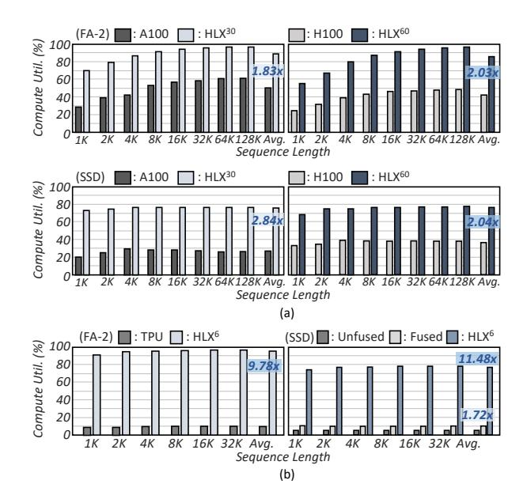
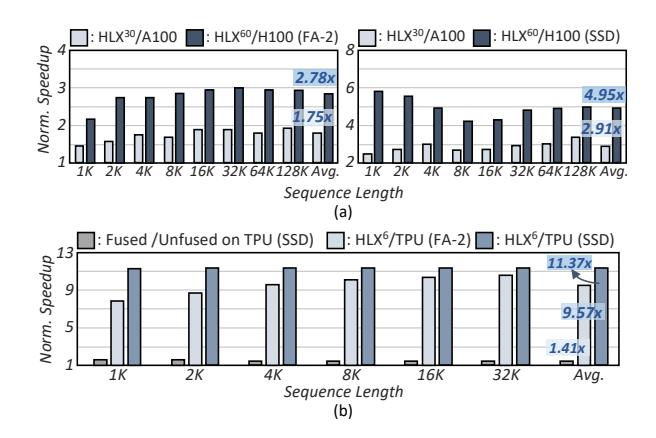
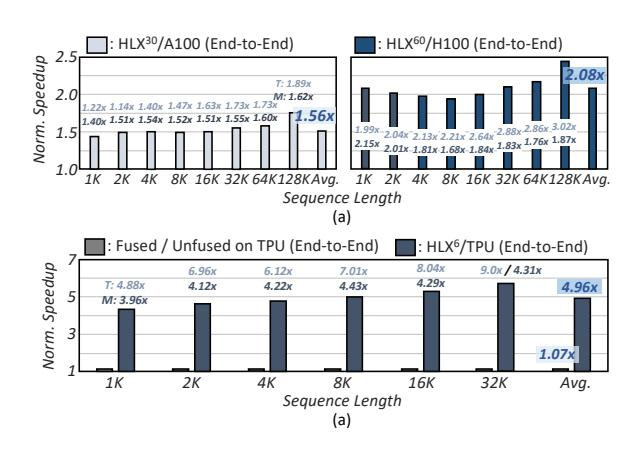
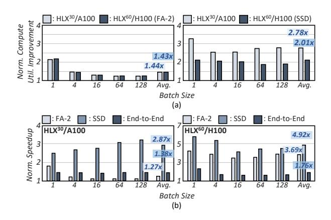
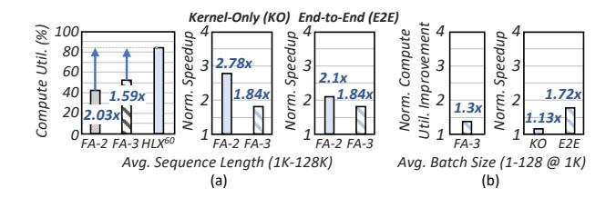

# 5 Evaluation

### 5.1 Methodology

Model and Accuracy. To evaluate HLX, we utilize the 2.7B Hybrid model (Mamba2attn-2.7B) from the GitHub repository [11], which provides the GPU-optimized FA-2 and SSD. This Hybrid model features a fundamental backbone structure that supports various models enhanced with modifications such as bigger model size [51], mixture-of-expert (MoE) [27, 49], and shared attention block [15, 16]. The attention layer of this model employs a multihead attention operation consisting of 30 heads, and each head has a dimension of 128. In contrast, the SSD operation uses 80 heads, with

**Table 1: HW Specifications for Comparison** 

|                          | HW Specificatio                         | ns of GPU and TPU                  |                       |  |
|--------------------------|-----------------------------------------|------------------------------------|-----------------------|--|
|                          | H100 GPU                                | A100 GPU                           | a)TPU                 |  |
| Technology               | 4 nm                                    | 7 nm                               | 16 nm                 |  |
| b) Throughput | 756 TFLOPS                              | 312 TFLOPS                         | 61.5 TFLOPS           |  |
| Memory Bandwidth         | 2000 GB/s                               | 1935 GB/s                          | 450 GB/s              |  |
| On-Chip SRAM Capacity    | RAM Capacity c)103.9 MB c)84.3 MB       |                                    | 16 MB                 |  |
| DRAM Capacity            | 80 GB                                   | 80 GB                              | 16 GB                 |  |
| Area                     | 814 mm 2 826 mm 2 |                                    | 324 mm²               |  |
| Power Consumption        | 350 W                                   | 300 W                              | 225 W                 |  |
|                          | HLX Configurati                         | ion for Comparison                 |                       |  |
|                          | HLX 60 (Scaled to 7 nm)      | HLX 30 (Scaled to 7 nm) | HLX 6      |  |
| Technology               | 14 nm                                   | 14 nm                              | 14 nm                 |  |
| b) Throughput | 614.4 TFLOPS                            | 307.2 TFLOPS                       | 61.44 TFLOPS          |  |
| On-Chip SRAM Capacity    | 30.4 MB                                 | 15.2 MB                            | 3.04 MB               |  |
| Area                     | 475 mm² (169 mm²)                       | 235.8 mm² (83.9 mm²)               | 47.16 mm 2 |  |
| Power Consumption        | 358 W (201.8 W)                         | 174.64 W (108.47 W)                | 35.06 W               |  |

c): Sum of the register file, shared memory and L1 cache per SM and the L2 cache size

each head having a dimension of 64, and each state has a dimension of 128. The model's block size is set to the default value of 256. In terms of accuracy, based on FP16 precision, both PipeFlash and PipeSSD have confirmed that there is no accuracy loss compared to conventional FAs and SSD across eight benchmarks (wikitext-2 [30], Winogrande [46], ARC-challenge and ARC-easy [8], LAMBADAopenai [42], PIOA [6], OpenBookOA [31], and HellaSwag [54]). **Performance.** To evaluate the performance of HLX, we developed a custom cycle-level simulator and established three baselines to analyze how performance varies across different hardware platforms as the sequence length changes: the GPUs (NVIDIA A100 80GB [34], H100 80GB [36]), and the TPU (TPUv3 [24]). For the GPU comparison, the baseline was set using results from executing FA-2, FA-3, and SSD operations with GPU-optimized CUDA kernels provided in the GitHub repository [11, 47] for a fair comparison. The performance was analyzed by sweeping the sequence length and the batch size, considering the maximum sequence length and batch size executable on a single GPU. The execution time for each operation and the GPU compute utilization were measured using NVIDIA Nsight Systems [39] and Nsight Compute [38]. For the TPU baseline, a custom cycle-level simulator was developed that emulates a single core (half of a TPUv3 chip), the fundamental unit of a TPUv3, implementing not only the FA-2 and SSD operations (both unfused and fused) but also all operations within the Hybrid model for an end-to-end evaluation. In particular, the MatMul operations were executed with the two 128×128 systolic array-based matrix multiplication units (MXUs), while non-MatMul operations were executed on the vector unit. Due to the DRAM capacity of TPU, an out-of-memory (OOM) error occurs when the sequence length in a single batch exceeds 32K, so the performance analysis was conducted only up to 32K. To ensure a fair comparison with the GPU and TPU baselines, the HLX simulator was implemented in three configurations, as shown in Table 1: HLX30, HLX60, and HLX6. For comparison with the A100 GPU, the HLX30 configuration uses 30 URSCs, delivering 307.2 TFLOPS with 1935 GB/s of memory bandwidth. Similarly, the HLX60 configuration, with 60 URSCs and 2 TB/s of memory bandwidth, is used for comparison with the H100 GPU. The HLX6 utilizes 6 URSCs configured to achieve 61.44 TFLOPS and match the TPU's DRAM bandwidth of 450 GB/s. The

Figure 14: Improvement of compute utilization for FA-2 and SSD over (a) GPU and (b) TPU.

Figure 15: Latency reduction for FA-2 and SSD over (a) GPU and (b) TPU.

DRAM access latency of these configurations was calculated based on their respective DRAM bandwidths.

Area/Power. To estimate the area and power consumption of HLX, a single core of HLX was designed at the RTL level using System Verilog, and the SRAM was compiled. The design was synthesized using Synopsys Design Compiler [48] based on 14nm technology at a frequency of 625MHz. It was also confirmed that the implemented design operates without timing errors at 0.8V and 625MHz, and the synthesized area and power consumption values were compared against the GPU and TPU baselines. In addition, we scaled HLX down to 7nm according to [25] to match the technology process of GPUs. For DRAM power modeling, the HLX simulator incorporated data provided by the DRAM and TPU vendors for the A100 and H100 GPUs using HBM2E and the TPUv3 using HBM2 [23, 32], thereby

enabling accurate power consumption estimation. Meanwhile, the GPU baseline power consumption was measured using NVIDIA-SMI [40].

### 5.2 Compute Utilization

Comparison to GPU Baseline. Due to the dependency of FA-2 operations on GPUs, compute utilization saturates as the sequence length increases, as shown in Fig. 14(a). HLX alleviates this limitation, achieving approximately 97.5% utilization at 128K, with average improvements of  $1.83\times$  and  $2.03\times$ , respectively. While FA-2 exhibits increased compute utilization as the sequence length increases, SSD maintains an almost constant compute utilization regardless of sequence length due to its linear characteristics. The H100 achieves a slight increase of compute utilization compared to the A100, but it is still under 40%. In contrast, HLX achieves over  $2\times$  higher compute utilization, averaging around 76%, although it does not reach the same high utilization as PipeFlash since  $d_{head}$  is half of  $d_{state}$  for SSD operations in the given Hybrid model.

Comparison to TPU Baseline. On TPU, compute utilization improves significantly, as shown in Fig. 14(b). This is because, unlike GPU, which are relatively general-purpose, TPU prioritizes compute-intensive dense MatMul operations. In particular, a TPU consists of two MXUs, making it relatively inefficient at handling FA-2 and SSD operations that involve many non-MatMul computations. When running the fused SSD, which improves data reuse compared to the unfused SSD, on TPU, compute utilization increases by 1.72×. However, overall utilization still remains at only about 11%. This indicates that SSD operations are inherently unsuited for MatMul-dominant HW like TPU. In contrast, HLX6 achieves an average improvement of 9.78× for FA-2 and 11.48× for SSD in compute utilization compared to the TPU baseline.

### 5.3 Speedup

FA-2 and SSD. Fig. 15(a) shows the speedups of FA-2 and SSD on HLX compared to the GPU baseline. As the compute utilization of FA-2 improves, HLX achieves an average speedup of 1.75× and 2.78×, respectively. In contrast, even though SSD's compute utilization remains nearly constant as sequence length increases, the speedup profiles of HLX relative to the A100 and H100 diverge. Against the A100, the speedup of HLX climbs steadily from 1K to 4K because both A100 and HLX gain utilization in this range, yet the incremental benefit is proportionally larger for HLX. Around 8K, the speedup briefly declines. This corresponds to the point where the A100 achieves peak throughput (see Fig. 7(a)), temporarily narrowing the gap. Beyond 8K, the Op/B of A100 falls again, and HLX's speedup rises once more. The comparison with the H100 shows a different pattern. From a sequence length of 1K to 4K, the speedup of HLX relative to H100 decreases as H100's throughput increases sharply (see Fig. 7(a)). At 8K, the relative speedup reaches its lowest point. Although both throughput and Op/B on the H100 are lower at 8K than at 4K, this is because the kernels that were unable to fully utilize GPU resources at the short 4K sequence length experience a tiny increase in latency. Beyond 8K, as the Op/B ratio decreases further, the speedup of HLX begins to increase again.

**End-to-End Model.** Since HLX already has computation units for supporting other computations, such as feed-forward network

Figure 16: End-to-end speedups over (a) GPU and (b) TPU.

Figure 17: (a) Normalized compute utilization improvement and (b) speedup over GPU with the varying batch size.

(FFN), conv1D, and RMSNorm, we evaluate its end-to-end model latency against the baselines. To ensure a fair comparison focused on pure computational performance, our latency measurements specifically isolate kernel execution times, excluding overheads such as CPU-GPU communication and kernel launching. Figs. 16(a) and (b) illustrate the end-to-end model speedup compared to GPU and TPU baselines. The graphs also show the speedup ratios for a single attention layer and a single Mamba-2 layer (denoted as T and M, respectively) of the Hybrid model. For GPU comparison, since the Hybrid-2.7B model comprises 58 Mamba-2 layers and 6 attention layers, the contribution of the Mamba-2 layers is dominant in the overall speedup. However, as the sequence length increases, the speedup ratio of the attention layers grows more significantly than that of the Mamba-2 layers, leading to a more pronounced overall speedup with longer sequence lengths. Specifically, at a sequence length of 128K, a 1.76× (2.45×) speedup is achieved, with an average speedup of 1.56× (2.08×) compared to the A100 (H100). A similar trend is observed when comparing with TPU, where the speedup of the attention layer increases markedly with sequence length, resulting in an average 4.96× speedup.

Table 2: Area and Power Breakdown

|              | Area (mm²) | Power (W) |
|--------------|------------|-----------|
| DPE #0       | 2.48       | 2.03      |
| SVPE         | 1.76       | 0.85      |
| DPE #1       | 2.44       | 2.01      |
| UpE          | 0.38       | 0.25      |
| On-chip SRAM | 0.68       | 0.21      |
| Others       | 0.15       | 0.05      |
| Total        | 7.89       | 5.39      |

Measured at 625MHz, 0.8V

#### 5.4 Batch Size

To conduct a more comprehensive analysis of HLX, we not only swept through various sequence lengths but also analyzed compute utilization and speedup by increasing the batch size while fixing the sequence length at 1K, as shown in Figs. 17(a) and (b). The results were verified up to a batch size of 128, which is the maximum batch size that can be executed on the GPU baseline.

For compute utilization improvement, FA-2 exhibits a slight decrease as the batch size increases. This is because HLX maintains parallelism along the batch and head dimensions while focusing on resolving dependencies and accelerating computation along the sequence length dimension. Thus, HLX maintains constant compute utilization when the sequence length is fixed. In contrast, the GPU leverages increased parallelism with a larger batch size, leading to higher compute utilization. Nevertheless, HLX achieves an average improvement of 1.44×. Similarly, for SSD, the compute utilization of HLX remains constant regardless of the batch size, whereas that of A100 increases with the batch size until batch size of 4. However, since the SSD is memory-bound, the compute utilization starts to decline beyond a batch size of 16. Consequently, an average compute utilization improvement of 2.78× is achieved. On the other hand, the H100 leverages its higher Op/B and compute utilization compared to the A100, showing a trend where its compute utilization gradually improves up to a batch size of 64 before slightly decreasing at 128. This improvement in compute utilization results in reduced latency for both FA-2 and SSD, yielding an average endto-end model speedup of from 1.38× to 1.76× depending on the batch size (see Fig. 17(b)).

### 5.5 On-Chip SRAM Capacity

As mentioned earlier, PipeFlash and PipeSSD reduce the amount of intermediate data generated during computation by 4.8× and 11×, respectively. This enables HLX to significantly reduce the required on-chip SRAM capacity. Consequently, as shown in Table 1, HLX $^{60}$  and HLX $^{30}$  require 3.4× and 5.55× less on-chip SRAM capacity compared to the GPU baseline, and HLX $^{6}$  requires 5.26× less compared to the TPU baseline. Additionally, by efficiently achieving speedup with a fixed SRAM capacity irrespective of the sequence length, a smaller area footprint can be maintained.

#### 5.6 Area and Power Breakdown

Table 2 presents the area and power breakdown of HLX. Based on this result, we compare the HLX to GPU and TPU architectures (see Table 1). In terms of area, the  $HLX^{60}$  occupies  $169 \text{mm}^2$  (20.8% of the

Figure 18: Comparison between PipeFlash on HLX60 and FA-3 on H100 GPU according to varying (a) sequence lengths and (b) batch sizes.

H100), the HLX $^{30}$  is 83.9mm $^2$  (10.2% of the A100), and the HLX $^6$  is 47.16mm $^2$  (14.5% of the TPUv3). Regarding power consumption, the HLX $^{60}$ , HLX $^{30}$ , and HLX $^6$  consume 42.5%, 63.8%, and 84.4% less power than the H100, A100, and TPUv3, respectively. Within the HLX architecture, the two DPEs are the most dominant components in terms of both area and power consumption, accounting for approximately 62.4% of the total area and 74.9% of the total power usage.

### 6 Discussion and Related Works

Comparison with FA-3 on H100. Figs. 18(a) and (b) show the comparison between PipeFlash on HLX60 and FA-3 on the H100 according to varying sequence lengths and batch sizes. The results indicate that FA-3, being optimized for the Hopper GPU architecture like the H100, achieves improved compute utilization and lower latency compared to FA-2 across all sequence lengths. However, its utilization still saturates at approximately 61%. Consequently, FA-3 on the H100 underperforms relative to the HLX60, even though the latter has a lower peak throughput (see Table 1). When sweeping the batch size, the performance gap in compute utilization and kernel latency between the H100 and HLX60 narrows, yet the H100 continues to show lower performance. This suggests that while performance has indeed improved over FA-2 due to the H100's support for asynchronous execution, the GPU cannot fully maximize pipeline parallelism. In contrast, HLX proposes a unified, streamlined architecture based on a fine-grained pipelined dataflow to enable more granular pipeline parallelism. As a result, it remains free from register pressure while achieving high performance in both attention and Mamba-2 operations.

Overhead Analysis of Supporting Both Models. The HLX supports both Transformer and Mamba-2 with minimal HW overhead because our proposed PipeSSD employs a block-level fusion method, similar to that of FA-2, which maximizes HW reuse. This efficiency is further enhanced by the complete sharing of the two DPEs—the primary consumers of chip area and power—by both models. As a result, the HW overhead is modest when compared to accelerators dedicated to a single model. As shown in Table 3, the unified design incurs an area overhead of 3.0% and a power overhead of 2.9% compared to a Transformer-only implementation. This stems from integrating logic for Mamba-2-specific operations, such as conv1D, softplus, and cumsum. Conversely, when compared to a Mamba-2-only design, the overheads are 4.4% in area and 3.5% in power. This increase results from including HW for FA-2's softmax operation in the RVPE, and adding the reciprocal function and mux/demux

Table 3: HW overhead for supporting both models.

| Area Overhead |                |                             |              |  |  |  |  |  |
|---------------|----------------|-----------------------------|--------------|--|--|--|--|--|
| Area (mm²)    | HLX            | Transformer Only Mamba-2 On |              |  |  |  |  |  |
| DPE #0-1      | 4.92           | 4.86                        | 4.92         |  |  |  |  |  |
| SVPE          | 1.76           | 1.59                        | 1.61         |  |  |  |  |  |
| UpE           | 0.38           | 0.38                        | 0.20         |  |  |  |  |  |
| SRAM & Others | 0.83           | 0.83                        | 0.83         |  |  |  |  |  |
| Total         | 7.89           | 7.66                        | 7.56         |  |  |  |  |  |
|               | Power Overhead |                             |              |  |  |  |  |  |
| Power (W)     | HLX            | Transformer Only            | Mamba-2 Only |  |  |  |  |  |
| DPE #0-1      | 4.04           | 4.01                        | 4.04         |  |  |  |  |  |
| SVPE          | 0.85           | 0.72                        | 0.73         |  |  |  |  |  |
| UpE           | 0.25           | 0.25 0.18                   |              |  |  |  |  |  |

UpE SRAM & Others

Total

Table 4: Comparison with SOTA accelerators.

0.26

0.26

0.26

5.39

| Comparison with SOTA Accelerators         |                                |                         |                                          |                               |  |  |
|-------------------------------------------|--------------------------------|-------------------------|------------------------------------------|-------------------------------|--|--|
|                                           | VGA [25]                       | MARCA [26]              | SOFA [52]                                | HLX 30             |  |  |
| Technology                                | 7 nm                           | 28 nm                   | 28 nm                                    | 7 nm                          |  |  |
| Frequency                                 | 1 GHz                          | 1 GHz                   | 1 GHz                                    | 625 MHz                       |  |  |
| Area                                      | 52.82 mm 2          | 221.88 mm²              | 5.69 mm 2                     | 83.9 mm 2          |  |  |
| Power                                     | 41.10 W                        | 10.44 W                 | 3.40 W                                   | 108.47 W                      |  |  |
| On-Chip Mem. Size                         | -                              | 24 MB                   | 316 KB                                   | 15.2 MB                       |  |  |
| Peak Throughput                           | 49.152 TFLOPS                  | -                       | 24.423 TOPS                              | 307.2 TFLOPS                  |  |  |
| Target Computation                     | FFTConv-based SSM (H3) Only | Mamba-1 Only            | Attention Only (w/ Sparsity Handling) | Both Attention and Mamba-2 |  |  |
| Fine-grained Pipeline for FA-2 and SSD | X                              | х                       | x                                        | 0                             |  |  |
| Speedup over A100 GPU                  | 1.7x (H3-GPT-125M)          | 1.38x (Mamba-1 2.8B) | -                                        | 1.56x (Hybrid-2.7B)        |  |  |

logic to the UpE, both of which are required to support state and O updates.

Comparison with SOTA Accelerators. Table 4 shows a comparison between HLX and state-of-the-art (SOTA) accelerators. First, VGA [25] is a dedicated accelerator for FFT-based convolution, designed to accelerate SSM such as H3 [14]. It operates as a co-processor alongside a GPU or TPU. VGA focuses on offloading memory-intensive FFT-based convolution and state passing to a specialized datapath optimized for generating Vandermonde matrices and utilizing high-bandwidth SRAM. However, the VGA is specifically tailored for earlier SSMs and cannot accommodate FA-2 and newer selective SSMs such as Mamba. MARCA [26] is the first Mamba-1 accelerator specifically tailored for Mamba-1. It introduces a reconfigurable PE array that dynamically performs either linear reductions or element-wise operations, a reusable nonlinear function unit that implements exponential and SiLU via approximations, and an operation-wise buffer management strategy to minimize memory traffic. Its reliance on large on-chip memory-occupying 80% of die area-renders it ill-suited for computeintensive attention workloads. SOFA [52] targets large-scale tokenparallel processing in dynamic sparse attention scenarios, addressing the scalability bottlenecks of FA-2. SOFA achieves higher energy and area efficiency by focusing solely on FA-2-based sparse attention, but entirely overlooks the recurrent, memory-intensive Mamba-2 workloads. In contrast, HLX is the first unified accelerator architecture to support both attention and Mamba-2 operations natively. By leveraging a fine-grained pipelined dataflow, it sustains high compute utilization and achieves 1.56× of end-to-end speedup

over an A100 GPU, while MARCA achieves only 1.38× of speedup. VGA achieves 1.7× of end-to-end speedup, targeting a much smaller model.

Applicability of HLX to Diverse Attention Variants. Recent advances have introduced several attention variants, including group query attention (GQA) [\[2\]](#page-12-9) and multi-head latent attention (MLA) [\[12\]](#page-12-10). GQA reduces the size of KV cache by grouping multiple query heads with the same key and value heads. DeepSeek's MLA also reduces the KV cache during inference by jointly compressing the key and value into a latent vector with a low-rank projection. More recently, DeepSeek introduced native sparse attention (NSA) [\[53\]](#page-14-30), which employs a dynamic hierarchical sparse strategy that combines coarse-grained token compression with finegrained token selection. However, these attention variants do not change the core computations ( , softmax, ) [\[47\]](#page-14-5) and support FlashAttention-like block-level fusion [\[22,](#page-13-10) [53\]](#page-14-30). Consequently, PipeFlash can support these diverse attention variants. In other words, despite its simplicity, PipeFlash delivers good applicability across diverse modern attention mechanisms.

Reconfigurable Dataflow Architecture. SambaNova's recent work [\[43\]](#page-14-9), SN40L, employs a reconfigurable dataflow architecture with coarse-grained fusion targeting full Transformer decoder layers. high compute throughput via 1,040 Pattern Compute Units (PCUs), achieving up to 638 BF16 TFLOPS. A key aspect of its architecture is its large 520MB on-chip SRAM capacity, which enables aggressive kernel fusion. However, the large on-chip SRAM incurs substantial area and power overhead [\[7\]](#page-12-11). In addition, SN40L does not support Mamba-2 or Hybrid models and lacks evaluation for such workloads. In contrast, the proposed HLX architecture adopts fine-grained pipelining and introduces the URSC to support both Transformer and Mamba-2. HLX performs tightly scheduled, pipelined execution with minimal on-chip memory usage (30.4MB for HLX60), thereby reducing area and power while maintaining high utilization.

