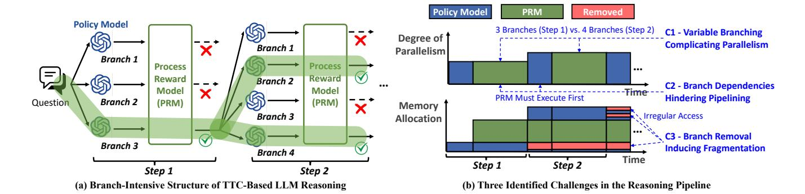
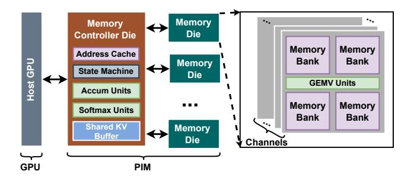

## ORCHES: Orchestrated Test-Time-Compute-based LLM Reasoning on Collaborative GPU-PIM HEterogeneous System

[Sixu Li](https://orcid.org/0000-0002-9105-9299)∗ Georgia Institute of Technology Atlanta, USA sli941@gatech.edu

[Yonggan Fu](https://orcid.org/0000-0002-7483-2921) Georgia Institute of Technology Atlanta, USA yfu314@gatech.edu

[Haoran You](https://orcid.org/0000-0002-2873-2153) Georgia Institute of Technology Atlanta, USA hyou37@gatech.edu

[Yuzhou Chen](https://orcid.org/0009-0004-9236-0480)∗ Georgia Institute of Technology Atlanta, USA eiclab.gatech@gmail.com

[Zheng Wang](https://orcid.org/0009-0002-9467-7460) Georgia Institute of Technology Atlanta, USA zwang3478@gatech.edu

[Zhifan Ye](https://orcid.org/0000-0003-0755-8843) Georgia Institute of Technology Atlanta, USA zye327@gatech.edu

[Chaojian Li](https://orcid.org/0000-0003-4030-9777) Georgia Institute of Technology Atlanta, USA cli851@gatech.edu

[Zhongzhi Yu](https://orcid.org/0000-0002-9981-4981) Georgia Institute of Technology Atlanta, USA zyu401@gatech.edu

[Wei Zhou](https://orcid.org/0000-0002-9770-3583) Georgia Institute of Technology Atlanta, USA wzhou322@gatech.edu

[Yongan Zhang](https://orcid.org/0000-0001-7919-049X) Georgia Institute of Technology Atlanta, USA yzhang919@gatech.edu

## Abstract

Recent breakthroughs in AI reasoning, enabled by test-time compute (TTC) on compact large language models (LLMs), offer great potential for edge devices to effectively execute complex reasoning tasks. However, the intricate inference pipelines associated with TTC pose new efficiency bottlenecks, limiting achievable latency and hindering widespread adoption. Through an in-depth analysis, we identify three key barriers: (1) variable parallelism, characterized by inference-dependent dynamic control flows and varying batch sizes, complicating workload scheduling; (2) branch dependencies, hindering efficient pipelining across sequential reasoning steps; and (3) branch pruning, causing memory fragmentation and irregular data access patterns. Motivated by the memory-bound nature of LLMs and Processing-in-Memory (PIM)'s capability to reduce data movement, we propose ORCHES, a novel GPU–PIM collaborative system specifically designed to address these barriers. ORCHES integrates three key innovations: (1) adaptive workload assignment, dynamically balancing workloads between GPU and PIM units to maximize parallelism despite unpredictable branching; (2) branch-aware pipelining, leveraging speculative execution to substantially reduce inter-step pipeline stalls; and (3) fragmentationaware memory structuring, enhancing data locality and access efficiency through coordinated caching and optimized memory layout reorganization. Experimental results demonstrate that ORCHES

∗ Sixu Li and Yuzhou Chen contributed equally to this work.

[This work is licensed under a Creative Commons Attribution 4.0 International License.](https://creativecommons.org/licenses/by/4.0) MICRO '25, Seoul, Republic of Korea © 2025 Copyright held by the owner/author(s). ACM ISBN 979-8-4007-1573-0/25/10 <https://doi.org/10.1145/3725843.3756039>

[Yingyan \(Celine\) Lin](https://orcid.org/0000-0001-5946-203X) Georgia Institute of Technology Atlanta, USA celine.lin@gatech.edu

achieves average speedups of 4.16× and 3.10× over state-of-the-art (SOTA) GPU implementations for text-based and vision-based reasoning tasks, respectively, without any loss in the accuracy of the original reasoning pipeline.

## CCS Concepts

• Computer systems organization → Heterogeneous (hybrid) systems; • Hardware → Application specific processors; • Computing methodologies → Artificial intelligence.

## Keywords

Processing-in-Memory, Heterogeneous Computing, Hardware Acceleration, Large Language Models

#### ACM Reference Format:

Sixu Li, Yuzhou Chen, Chaojian Li, Yonggan Fu, Zheng Wang, Zhongzhi Yu, Haoran You, Zhifan Ye, Wei Zhou, Yongan Zhang, and Yingyan (Celine) Lin. 2025. ORCHES: Orchestrated Test-Time-Compute-based LLM Reasoning on Collaborative GPU-PIM HEterogeneous System. In 58th IEEE/ACM International Symposium on Microarchitecture (MICRO '25), October 18– 22, 2025, Seoul, Republic of Korea. ACM, New York, NY, USA, [14](#page-13-0) pages. <https://doi.org/10.1145/3725843.3756039>

## 1 Introduction

Recent breakthroughs in AI reasoning, enabled by large language models (LLMs), promise transformative real-world applications—from assisting coding tasks [\[29\]](#page-13-1) to multi-hop question answering [\[6\]](#page-12-0) and advanced 3D understanding [\[7,](#page-12-1) [36\]](#page-13-2). However, deploying these reasoning capabilities on everyday edge devices remains challenging due to resource constraints and immense computational demands.

Figure 1: (a) Illustrative comparison between standard singlestep LLM inference, which limits reasoning despite large models, and TTC-based multi-step reasoning, which enhances reasoning by increasing inference "width" (multiple branches per step) and "depth" (multiple sequential reasoning steps), enabling smaller models to outperform larger ones. (b) Summary of the trade-offs: unlike standard inference, TTC-based reasoning achieves stronger reasoning capability with smaller models but currently suffers from suboptimal hardware utilization.

For instance, solving a single problem from the widely-used reasoning benchmark MATH500 [\[8\]](#page-12-2) requires around 10 minutes even on edge GPUs [\[23\]](#page-12-3), severely limiting practicality.

To bridge the gap between the capabilities of large-scale reasoning models and the limited resources available on practical platforms, Test-Time Compute (TTC) has emerged as a highly promising paradigm [\[28\]](#page-12-4). Rather than directly performing a single-step inference, TTC decomposes each reasoning task into multiple sequential sub-tasks. At every step, the model generates multiple candidate solutions ("branches"), evaluates these branches using a learned verification function, such as a Process Reward Model (PRM), and selects the most promising ones to proceed to the next step. This approach effectively enhances model performance, allowing relatively compact LLMs, e.g., models with only around 1B

parameters, to surpass much larger models (405B+ parameters) on challenging reasoning benchmarks [\[18\]](#page-12-5).

Despite the aforementioned promise, the benefits of TTC introduce unique computational challenges that current hardware acceleration methods cannot effectively address. As analyzed in Sec. [2.2,](#page-2-0) general LLM decoding workloads tend to be memory-bound [\[9,](#page-12-6) [25\]](#page-12-7), especially in edge scenarios, where Processing-in-Memory (PIM) architectures have emerged as promising accelerators, mitigating memory bottlenecks by reducing data movement [\[5,](#page-12-8) [17,](#page-12-9) [27\]](#page-12-10). However, existing PIM-based solutions have primarily focused on singlestep LLM inference [\[9,](#page-12-6) [25\]](#page-12-7). We note that both current GPU and PIM acceleration strategies fall short in addressing the distinctive computational challenges posed by TTC-powered reasoning workloads due to the challenges summarized below and illustrated in Fig. [2:](#page-2-1) Challenge 1 (C1) — Variable Parallelism Complicating Workload Scheduling: Unlike conventional LLM decoding at edge, which is uniformly memory-bound, TTC reasoning introduces a mixture of compute- and memory-bound behavior. This stems from the distinct roles of policy models (decoding) and PRMs (prefilling), as well as the presence of both shared and unique KV caches across candidates. Shared KV usage can make operations compute-bound due to higher parallelism, while unique KV access remains memory-bound. In addition, as the reasoning progresses, the ratio of shared-to-unique KV cache dynamically shifts, causing compute patterns to evolve. This heterogeneity complicates scheduling and mapping. Challenge 2 (C2) — Branch Dependencies Hindering Pipeline Execution: In standard LLM decoding, each token generation depends sequentially on previous tokens due to the auto-regressive nature. TTC-powered LLM reasoning introduces an additional layer of sequential dependency across reasoning steps: candidate generation at each step must wait for verification results from the previous step, and vice versa. This strictly enforced inter-step execution order significantly limits the effectiveness of traditional pipelining techniques. Challenge 3 (C3) — Branch Pruning Inducing Memory Fragmentation: During TTC reasoning, unselected branches are removed from memory as the process progresses, resulting in irregular memory access patterns and runtime fragmentation. This irregular behavior reduces the utilization efficiency of vanilla PIM accelerators and limits the overall achievable system energy efficiency.

In response to these unique efficiency challenges posed by TTCpowered LLM reasoning, we propose a novel GPU-PIM collaborative system, ORCHES, specifically designed to address these challenges. ORCHES integrates three new techniques, each explicitly targeting one of the identified barriers: Technique 1 (T1) — Adaptive Assignment Enhancing Parallelism: To leverage parallelism opportunities in LLM reasoning fully, we propose a workload assignment strategy for collaborative GPU–PIM execution. This includes (1) offline computation partitioning between GPU and PIM modules based on anticipated batch sizes and reasoning branches, and (2) online runtime scheduling to dynamically compensate for workload imbalance between GPU and PIM modules as reasoning steps progress. Technique 2 (T2) — Branch Prediction Facilitating Pipelining: To improve pipelining across adjacent reasoning steps, we introduce a branch prediction mechanism tailored for LLM reasoning, inspired by CPU branch prediction designs. Specifically, we develop a lightweight predictor that forecasts

Figure 2: An overview of how (a) the unique branch-intensive structure of TTC-based LLM reasoning leads to (b) the three identified challenges in the reasoning pipeline. We use 3 and 4 branches in this figure as illustrative examples to help visualize the dynamic branching behavior; the actual number of branches may vary depending on the task or configuration.

which branches are likely to be selected in the next step, enabling the system to generate their outputs in parallel with the verification process of the current step. This prediction-guided execution allows overlapping output generation and branch selection, improving pipeline utilization and reducing inter-step latency. **Technique 3 (T3) — Memory Structuring Alleviating Fragmentation:** To address irregular memory access patterns due to fragmentation, we propose a memory structuring strategy combining a dedicated cache for frequently accessed branches, lightweight memory reorganization for improved contiguity, and a controller-side buffer optimizing GPU access. This strategy enhances data locality and mitigates fragmentation in TTC-powered workloads.

Evaluating ORCHES on both text-based and vision-based reasoning tasks demonstrates substantial speedups of  $4.16\times$  and  $3.10\times$  over state-of-the-art (SOTA) GPU implementations, respectively, all while fully preserving original inference accuracy.

#### 2 Background

#### 2.1 Large Language Models (LLMs)

Recent advances in LLMs have been driven by the decoder-only Transformer architecture, which underpins many SOTA models, such as OpenAI's GPT-4 [24] and Meta's LLaMA series [31–33]. These models are typically built by stacking multiple identical decoder blocks, each sharing the same architecture but with distinct learned parameters.

Decoder blocks comprise three sequential components: **1) Linear operators project** input tokens into query (*Q*), key (*K*), and value (*V*) vectors for attention, with *K* and *V* stored in the *KV* cache for efficient autoregressive generation; **2) Attention operators** compute scores by comparing each token's *Q* with cached *K*, normalize them via softmax, and produce a weighted sum of cached *V*; **3) Linear operators in feed-forward networks (FFNs)** process each token with two linear transformations and a non-linear activation, combining the output with the input via a residual connection.

During generation, decoding-only Transformers operate in two stages: **prefilling** and **decoding**. The **prefilling** stage occurs once at the beginning, when the full input prompt (e.g., user instruction or context) is available. In this stage, all prompt tokens are processed in parallel to compute their key (K) and value (V) vectors, which are

Figure 3: Block diagram of the TTC-based LLM reasoning pipeline: the generation phase and the verification phase.

stored in the KV cache for reuse. The **decoding** stage follows and proceeds autoregressively. At each step, a new token is generated based on all previously generated tokens, using the cached K/V values to avoid redundant computation. As token generation is inherently sequential, this stage becomes the primary efficiency bottleneck, particularly for long outputs or interactive use cases.

## 2.2 Test-Time Compute (TTC) based Reasoning

TTC has emerged as a promising direction to enhance LLMs' performance on complex tasks requiring multi-step reasoning. Unlike conventional single-step generation, TTC introduces a structured, iterative reasoning process that allows the model to decompose tasks into intermediate steps and progressively refine its output.

As shown in Fig. 3, to solve an input question—referred to as a request in this paper—a typical TTC pipeline [18, 36] adopts an iterative generation pattern to break down complex problems into sequential steps. Each step consists of a generation phase, which produces a set of candidate outputs conditioned on the current prompt, followed by a verification phase that selects the most promising candidates. The selected candidates are appended to the prompt and used to proceed to the next step, while unselected candidates are discarded. This iterative procedure continues until the input question is solved. The overall procedure can be viewed as a form of tree search, where nodes represent candidate outputs and edges correspond to reasoning transitions. The width (number of candidates per step) and depth (number of reasoning steps) are task-specific and typically determined empirically. To support this iterative reasoning, TTC systems typically consist of two main components: a policy model, which drives the generation phase by producing candidate outputs (corresponds to decoding in standard LLM inference), and a process reward model (PRM), which performs the verification phase by selecting the most promising candidate (essentially a prefilling task), as shown in Fig. [3.](#page-2-2)

Together, this combination of multi-branch generation and selective verification forms a structured but asymmetric computation pattern, introducing a unique test-time workload that diverges from standard LLM inference.

## 2.3 Processing-in-Memory (PIM)

TTC introduces highly irregular workloads with small batch sizes, dynamic branching, and sequential inter-step dependencies. These result in a mix of compute- and memory-bound behavior across different reasoning stages, diverging significantly from the regular, high-throughput workloads GPUs are optimized for. Although GPUs provide strong computing capabilities, their effective memory bandwidth is constrained by architectural limitations: Modern memory modules multiplex access across banks and channels, exposing only a fraction of internal bandwidth at any given time [\[12\]](#page-12-12), which can lead to under-utilization, especially for memory-bound operations like attention with batch size 1.

PIM architectures address this issue by integrating lightweight compute units directly into memory banks, reducing data movement and increasing effective bandwidth [\[5,](#page-12-8) [17,](#page-12-9) [27,](#page-12-10) [34,](#page-13-5) [41\]](#page-13-6). While prior works [\[9,](#page-12-6) [25\]](#page-12-7) focus on server-level LLM inference, they highlight a key principle: Operators with low compute-to-memory ratios are more sensitive to bandwidth constraints and can benefit from memory-centric architectures. In TTC settings, these memory bottlenecks are even more pronounced, and are further exacerbated by inter-stage dependencies and memory sparsity caused by branch pruning. These insights motivate a heterogeneous GPU–PIM system tailored to the unique workload characteristics of TTC-based LLM reasoning.

## 3 Identified New Patterns and Challenges

## 3.1 Challenge 1: Variable Parallelism Complicates Workload Scheduling

In regular LLM decoding, both linear and attention operators are memory-bound, with low data reuse and parallelism. In contrast, TTC presents a more complex workload pattern: (1) Since policy models involve a decoding process and PRMs involve a prefilling process, under an edge setting (i.e., solving one request at a time), the linear operators in each can be memory-bound or computebound, respectively; (2) There exist both shared KV caches among all candidates, due to shared reasoning trajectories in beam search, and unique KV caches specific to each candidate. The former may result in a compute-bound scenario due to increased opportunities for parallel computation, while the latter corresponds to a memorybound scenario. Consequently, this variation in parallelism complicates workload scheduling and mapping across platforms.

In addition, the ratio of shared-to-unique KV caches may dynamically evolve as the search process deepens, leading to dynamic compute behavior and further complicating workload scheduling and mapping throughout the search process. These new workload patterns are elaborated below.

3.1.1 New Workload Patterns of Different Operators. To analyze the compute- or memory-bound scenarios of operators in TTCbased LLM reasoning workloads, we follow the definition from prior work [\[39\]](#page-13-7) to derive the arithmetic intensity, i.e., the ratio of FLOPs to bytes accessed, as a function of batch size , defined as the number of input tokens to the LLM that can be processed in parallel. If an operator's arithmetic intensity exceeds a device-specific threshold, the workload becomes compute-bound and demonstrates good data reuse, favoring compute-centric platforms with high parallelism such as GPUs. Conversely, a low arithmetic intensity indicates a memory-bound workload, which is better suited to memory-centric architectures such as PIM. We analyze the workload patterns for linear and attention operators as follows.

Arithmetic intensity of linear operators. As shown in Fig. [4,](#page-4-0) the arithmetic intensity of the linear operator generally increases with batch size . In PRMs, which correspond to the verification phase, the workload primarily involves a prefilling process with a large , often equal to the input sequence length (typically >100) in common use cases [\[8,](#page-12-2) [36\]](#page-13-2). This results in high arithmetic intensity and compute-bound workloads, even for a single request, making GPUs the ideal choice. In contrast, policy models follow a token-by-token decoding process, characterized by a small on edge devices. For example, in text-based TTC pipelines, the number of candidates can be as low as 4 [\[18\]](#page-12-5), and even down to 2 in visionbased TTC pipelines [\[2,](#page-12-13) [36\]](#page-13-2), leading to memory-bound workloads that are better suited for PIM architectures.

Arithmetic intensity of attention operators. A similar trend holds for the attention operator. In traditional setups, where each request maintains a unique KV cache, the workload is consistently memory-bound, making it well-suited for PIM architectures. However, with the introduction of shared KV caches across candidates in reasoning workloads (as discussed in Sec. [2.2\)](#page-2-0), the workload can become compute-bound if the number of candidates is sufficiently large. Since both shared and unique KV caches coexist in TTC, a new parallelization strategy is required to efficiently support both associated with the same operator.

#### Identified Challenge 1A

Unlike regular LLM decoding, where all operators are consistently memory-bound, edge reasoning workloads may exhibit a mix of compute-bound and memory-bound behaviors across different operators.

3.1.2 Dynamically Evolving Workload Patterns During Search. We further analyze the impact of dynamically evolving workload patterns caused by the increasing ratio of shared to unique KV caches as the search process progresses, leading to dynamically evolving compute behavior. Specifically, as mentioned in Sec. [2.2,](#page-2-0) as the search process progresses, the selected candidates are appended to the original prompt to form a new prompt and serve as the inputs for the next step. As a result, the shared KV cache increases as the search deepens, as shown in Fig. [5.](#page-4-1) In contrast, the unique KV cache for each candidate is always cleared when moving to the next step. In other words, since the unique context depends only on the current candidate, it is reset to zero at the start of each new candidate. As a result, the workload associated with shared

KV caches increases as the search deepens, while the workload for the unique context remains relatively unchanged, causing an imbalance in compute utilization over time. Since the workloads from both shared and unique KV caches across all candidates must be aggregated to proceed with the search process, this imbalance introduces additional delays due to the need for synchronization.

#### **Identified Challenge 1B**

The *shared* KV cache associated with the reasoning workload grows larger as the search progresses, whereas the *unique* KV cache workload remains relatively constant. This discrepancy leads to an imbalance and introduces synchronization overhead.

## 3.2 Challenge 2: Branch Dependencies Hinder Pipeline Execution

As discussed in Sec. 2.2, the verification phase primarily consists of prefilling, which is parallelizable and generally achieves good runtime on existing GPUs. In contrast, the generation phase is inherently sequential, making it slower on GPUs and better suited for PIM acceleration. However, for certain workloads, the verification phase can take as long as—or even longer than—the generation phase on GPUs, as shown in Fig. 6(a). This can be attributed to two key factors: (1) verification may require a larger model to ensure sufficient accuracy, which significantly increases computational cost; and (2) a large number of candidates may need to be verified, further compounding the runtime.

To provide a deeper analysis, Fig. 6(b) presents profiling results comparing decoding speed (the main workload of generation) and prefilling speed (the main workload of verification). We observe that, when using models of the same size, prefilling can be significantly faster than decoding—up to 50× in some cases. However, when the verification model is much larger, this speed advantage diminishes. For example, the prefilling speed of an 8B model is only about 10× faster than the decoding speed of a 1B model. In such scenarios, verification may become the bottleneck. Moreover, since verification (prefilling) benefits from GPU acceleration while generation (decoding) favors PIM, any stall in the verification phase can lead to under-utilization of the PIM module, negatively impacting

Figure 4: Illustration of the arithmetic intensity of linear and attention operators in TTC-based LLM reasoning workloads.

Figure 5: An example of the number of tokens in the *shared* KV cache and the *unique* KV cache during the reasoning process. The example is from the MATHVista [19] dataset using the SOTA TTC-based vision LLM reasoning model [36].

Figure 6: (a) An example of the verification and generation time breakdown in a SOTA TTC pipeline [18], where the policy model for generation is a 1B model and the PRM model for verification is an 8B model, and (b) the prefilling and decoding speed on an edge device [23] with different model sizes and sequence lengths.

overall system performance. Conversely, the verification phase also depends on the generation phase, as candidate content must be generated before it can be verified. Therefore, in scenarios where generation is offloaded to PIM, the GPU may become under-utilized due to this dependency, as it must wait for generation to complete before initiating verification.

#### **Identified Challenge 2**

Verification and generation phases in the reasoning workload exhibit data dependencies on each other and require different compute resources, which can lead to mutual bottlenecks, resulting in under-utilization of the GPU-PIM system.

## 3.3 Challenge 3: Branch Pruning Induces Memory Fragmentation

Unlike regular LLM edge inference, where the request consists of a single continuous sequence, TTC-based reasoning processes, selects, and discards a set of candidates. Discarded candidates are never reused, corresponding to a branch pruning process. This can lead to nontrivial memory fragmentation, which is unfavorable for PIM devices due to the increased memory access overhead associated with indexing the selected candidate. The problem is further exacerbated by the variability in candidate lengths: our experiments on the MATH [8] dataset using a SOTA text-based TTC pipeline [18] show that the number of tokens per candidate can range from 10 to 1000. To achieve high memory utilization and avoid fragmentation, this sparsity must be carefully managed.

### **Identified Challenge 3**

Branch pruning in TTC causes memory fragmentation, which is unfavorable for PIM devices due to additional memory access overhead and thus requires proper handling.

#### 4 The Proposed ORCHES Framework

#### 4.1 Hardware Architecture Overview

To address the unique challenges of accelerating TTC-based LLM reasoning, as discussed in Sec. 3, we develop the proposed OR-CHES system, of which the hardware architecture is shown in Fig. 7. In particular, the architecture consists of the following three main components, each implemented as a separate silicon die: Host GPU refers to the conventional GPU typically used in edge devices [23]. While it offers ample computing resources, it is constrained by limited memory bandwidth. This module primarily handles compute-intensive tasks, such as prefilling and executing operators with large batch sizes during decoding. Memory Controller Die serves as the interface between the host GPU and the memory dies. Beyond standard memory read/write operations, it performs data aggregation across memory channels, as also explored in prior work [9, 25]. The aggregation in the controller die is supported by the Accum Units (implemented as parallel adders) and the Softmax Units (implemented using fixed-function pipelined datapath). Specifically, it is responsible for (1) accumulation operations and (2) statistical transformations such as Softmax and normalization. These operations are delegated to the controller due to their aggregation-intensive nature and the precision requirements that are challenging to meet on the memory dies, which are often fabricated using older technology nodes [14]. To further optimize performance, a buffer is integrated into the controller to

Figure 7: The overall hardware architecture of our proposed ORCHES GPU-PIM collaborative system.

cache frequently accessed data for the host GPU, reducing memory die activations and mitigating interference with near-bank compute units. In addition to the compute units, our design includes an address cache to optimize memory access for the PIM device, because the address mapping is the same for different banks, the address cache is placed in the controller die. More details will be introduced in Sec. 4.4. **Memory Dies** are responsible for both data storage and in-memory computation. Each die contains multiple channels, with each channel comprising several bank groups. Within each bank group are multiple banks, each equipped with dedicated compute units, such as General Matrix–Vector Multiplication (GEMV) units, optimized for parallel execution directly within memory. The GEMV units here are implemented using multiplier-adder trees.

## 4.2 Technique 1: Adaptive Assignment Enhancing Parallelism

4.2.1 Technique 1A: Offline Parallelization Strategy. As mentioned in Sec. 3.1.1, since multiple branches exist in each reasoning step and the KV query is shared across those branches, both the linear and attention operators can be either compute-bound or memory-bound depending on the specific number of branches configured by users. This behavior differs from standard LLM inference, in which the linear operators are often compute-bound and the attention operators are memory-bound [39]. Hence, existing PIM solutions built on assumptions from standard LLM inference [9, 25] cannot be directly applied to our target LLM reasoning workloads. To bridge this gap, we propose the following parallelization strategies for the operators in TTC-based LLM reasoning, as detailed below:

Linear Operator and Shared Attention Operator: For each linear operator and the attention operator shared across different branches, their arithmetic intensity is proportional to the corresponding batch size (e.g., sequence length or number of branches). Specifically, when the batch size W for a given operator is sufficiently large, the workload becomes compute-bound, indicating that assigning it to the GPU is more efficient than executing it on PIM. Otherwise, when the batch size is small, the workload is memory-bound, and executing it on PIM modules yields higher efficiency. Unique Attention Operator: For the attention operator that is unique to each reasoning branch, the batch size is always 1. Therefore, the arithmetic intensity remains fixed at 2, significantly lower than the maximum achievable arithmetic intensity on GPUs (> 500). Therefore, offloading this operator to PIM modules is a more efficient option. It is worth noting that the aforementioned fixed arithmetic intensity value of 2 is based on the unique KV query setting in the standard attention mechanism, used here for simplified explanation. For models employing Grouped Query Attention, the arithmetic intensity depends on group size. Our actual experimental implementation uses the appropriate attention mechanism accordingly.

As a result of the aforementioned analysis on different operators in TTC-based LLM reasoning, the key to determining whether to offload the workload to PIM is the batch size W. Thus, the offline computation partitioning between the GPU and PIM modules is guided by an analytical model that characterizes how latency is affected by key parameters: batch size (W), embedding dimension

Figure 8: Parallelization strategies for the linear and attention operators in the TTC pipeline. (a) The baseline assignment, where linear operator is always assigned to GPU and the attention operator is always assigned to PIM. (b) The proposed assignment when the total batch size is small. (c) The proposed assignment when the total batch size is in a medium state and the GPU is utilized to help the PIM computation. (d) The proposed assignment when the total batch size is large. (e) The proposed collaborative parallelization strategy. (f) The online scheduling compensation scheme.

(D), compute capability (CC), and memory bandwidth (BW). Specifically, the PIM module has two distinct bandwidths: BWPIM IO, representing the IO bandwidth of the controller die, and BWPIM, denoting the internal bank-level bandwidth within the memory die. Specifically, taking the linear operator as an example, the latency on GPU and PIM can be represented as:

$$T_{GPU} = \frac{WD^2}{CC_{GPU}} + \frac{2WD + D^2}{BW_{GPU}}$$
(1)  
$$T_{PIM} = \frac{WD^2}{CC_{PIM}} + \frac{2WD}{BW_{PIM\_IO}} + \frac{D^2}{BW_{PIM}}$$
(2)

$$T_{PIM} = \frac{WD^2}{CC_{PIM}} + \frac{2WD}{BW_{PIM IO}} + \frac{D^2}{BW_{PIM}}$$
 (2)

By comparing the latency on GPU and PIM, denoted as  $T_{GPU}$ and  $T_{PIM}$ , our parallelization strategy is summarized as follows: 1) When the total batch size is small, we assign the linear operator and the entire attention operator (including both the shared and unique KV components) to the PIM modules, as illustrated in Fig. 8(b). 2) When the batch size is moderate and GPU is partially utilized to assist PIM computation, the shared KV query is executed on the GPU, while the linear operator and unique KV query are handled by PIM, as shown in Fig. 8(c). 3) When the batch size is large, both the linear and shared attention operators are executed on the GPU, while the unique KV query is handled by PIM, as shown in Fig. 8(d).

Additionally, to avoid scenarios where only GPU or PIM is used across the entire system, we incorporate a mechanism to evaluate whether utilizing both devices simultaneously is beneficial, as shown in Fig. 8(e). For example, if PIM is initially selected as the primary device, we compare the latency of (i) transferring part of the data to the GPU, executing the operator on the GPU, and transferring the result back to PIM, vs. (ii) running the entire operator segment directly on PIM. If the former is faster, we switch to using the GPU as the primary device for that portion of computation. In particular, we introduce a ratio  $\alpha$  to represent the portion of the operator to be executed on the GPU:

$$T_{PIM}(\alpha) = \frac{WD^2(1-\alpha)}{CC_{PIM}} + \frac{WD(2-\alpha)}{BW_{PIM\_IO}} + \frac{D^2}{BW_{PIM}}$$
(3)

$$T_{GPU}(\alpha) = \frac{WD^2\alpha}{CC_{GPU}} + \frac{WD(1+\alpha) + D^2\alpha}{BW_{GPU}}$$
(4)

If the following inequality holds:  $T_{PIM} \ge \max(T_{PIM}(\alpha), T_{GPU}(\alpha))$ , transferring  $\alpha \times 100\%$  of the data to the GPU to execute the operator results in lower latency compared to executing the entire operator on PIM without data transfer. The value of  $\alpha$  is determined by solving  $T_{GPIJ}(\alpha) = T_{PIM}(\alpha)$ , which minimize  $\max(T_{PIM}(\alpha), T_{GPIJ}(\alpha))$ .

The co-processing of GPU and PIM introduces data movement overhead. Since  $\alpha$  divides the linear in the output dimension, the communication overhead typically lies in sending the entire FP16 input vector to PIM and collecting the partial FP16 output vector from PIM. The volume of data movement is  $WD(2 - \alpha)$ , which has been considered in the second term of Equation 3. Considering  $W \ll$  $D, D^2$  rather then  $WD(2-\alpha)$  dominates the latency. Experimental results averaged across all settings in Sec. 5.2 show that data transfer accounts for approximately 8.3% of the total runtime.

#### Technique 1A: Offline Parallelization Strategy

We propose an offline parallelization strategy for the linear and attention operators in the TTC pipeline. The proposed strategy supports both GPU and PIM devices and integrates seamlessly into TTC workflows deployed on existing hardware systems.

4.2.2 Technique 1B: Online Scheduling Compensation. The aforementioned offline parallelization strategy is designed for operators whose computational workloads remain constant during runtime. However, for the attention operator shared across different reasoning branches, the workload varies at runtime due to the accumulation of shared inputs across branches. To address this challenge, we propose an online scheduling compensation scheme, as illustrated in Fig. 8(f). Considering  $Q \cdot K$  as an example, for the increasing compute workload  $\sum_i W_i L_i D$ , where  $L_i$  is the length of a KV cache fragment KVi (i.e., shared KVs or unique KVs in each reasoning stage), D is the hidden dimension, and  $W_i$  is the corresponding batch size (i.e., number of branches), we dynamically compute the value of  $\alpha$  before each reasoning step, as  $L_i$  increases during the reasoning process. The runtime of PIM and GPU is approximated by the roofline model:

$$T_{PIM}(\{\alpha_0, ..., \alpha_i, ...\}) = \sum_i \frac{W_i L_i D(1 - \alpha_i)}{CC_{PIM}} + \sum_i \frac{L_i D}{BW_{PIM}}$$
 (5)

$$+\sum_{i}\frac{W_{i}D+WL_{i}(1-\alpha_{i})}{BW_{PIM\_IO}}\tag{6}$$

$$T_{GPU}(\{\alpha_0,...,\alpha_i,...\}) = \sum_i \frac{W_i L_i D\alpha_i}{CC_{GPU}} + \sum_i \frac{W_i D + W_i L_i \alpha_i}{BW_{GPU}}$$
(7)

This model is employed to quickly initialize an ideal  $\alpha$ , which achieves  $T_{PIM}(\{\alpha_0,...,\alpha_i,...\}) = T_{GPU}(\{\alpha_0,...,\alpha_i,...\})$ . Initially, all layers are assigned to the GPU, setting  $\alpha_i = 1$ . Subsequently, layers are reassigned to the PIM, setting  $\alpha_i = 0$ , starting from the layer with the lowest  $W_i$  to the highest, until  $T_{PIM}$  exceeds  $T_{GPU}$ . The critical layer t, where the relationship between  $T_{PIM}$  and  $T_{GPU}$  shifts, is then analyzed. The  $\alpha$  values for other layers remain fixed at 0 or 1, while  $\alpha_t$  for layer t is treated as a variable. The equation  $T_{PIM} = T_{GPU}$  is solved to determine the optimal  $\alpha_t$ .

#### **Technique 1A: Offline Parallelization Strategy**

We propose an offline parallelization strategy for the linear and attention operators in the TTC pipeline. The proposed strategy supports both GPU and PIM devices and integrates seamlessly into TTC workflows deployed on existing hardware systems.

