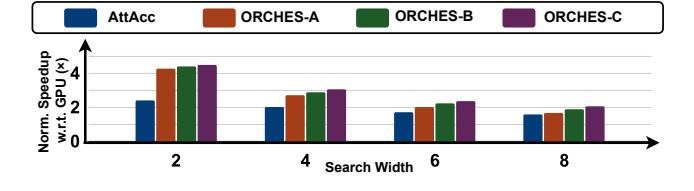
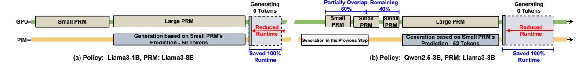

# 4.4 Technique 3: Memory Structuring Alleviating Fragmentation

To address the memory fragmentation challenge caused by the removal of unselected branches, as illustrated in Fig. 10(a), we propose

a comprehensive memory structuring strategy that integrates three key techniques: address caching, dynamic memory reorganization, and hierarchical buffering.

First, as shown in Fig. 10(b)-(1), we introduce a dedicated memory address cache in the controller die to accelerate access to sparse memory. It maps logical candidate IDs to physical locations, avoiding costly memory traversals when accessing pruned branches. The address cache is introduced to avoid storing pointers directly in DRAM cell lines, which incur high read latency. By using the address cache, two sequential DRAM accesses with data dependency are transformed into a combination of SRAM and DRAM accesses, where the SRAM access is one to two orders of magnitude faster. In terms of overhead, the cache is shared between all banks and only needs to store the location to the beginning of sequences and sequence length (usually less than 1000 datapoints in common benchmarks [8]), so the area overhead remains minimal. The address cache is managed by a state machine in the controller die, which reads pointers from the address cache and then sends instructions to the PIM banks with the processed address. **Second**, as shown in Fig. 10(b)-(2), we implement dynamic memory reorganization. As removing unselected branches introduces memory holes (i.e., unused gaps due to fragmentation), we track fragmentation using a metric  $\beta$ , which is the ratio of *Total Memory Holes* to the *Memory for Reasoning.* When  $\beta$  approaches 1 (i.e., memory is highly fragmented), the system compacts valid blocks into contiguous space to eliminate fragmentation. **Third**, as shown in Fig. 10(b)-(3), the controller's buffer streamlines reorganization by optimizing memory access. After the QKV is accumulated at the controller die, KV segments are stored in a shared KV buffer, reducing read operations for reorganization. During reorganization, KV segments are written back to the banks to eliminate fragmentation. It avoids PIM-host data transfers, allowing background reorganization. The GPU can also quickly synchronize the KV cache. When decoding is fully offloaded to the PIM, the GPU must fetch the latest KV cache from the PIM.

## **Technique 3: Memory Structuring Strategy**

We propose a three-pronged approach to alleviate memory fragmentation in the TTC acceleration pipeline for (1) fast location lookup, (2) eliminating fragmentation, and (3) optimizing GPU access patterns.

#### 5 Experiments

#### 5.1 Experiment Setting

Hardware Platform Configuration and Baselines: Our baseline GPU platform is the NVIDIA AGX Orin [23]. As for the PIM, we adopt the standardized setup as described in prior work [25], in which each memory bank integrates 16 multipliers and adders. We scale down the total memory capacity of the PIM device to 32GB to better match the constraints of edge environments while still meeting the memory demands of all benchmarks. This configuration results in a total of 2048 memory banks. The off-chip bandwidth in the simulator is configured as 204.8 GB/s to match that of the AGX Orin. In addition to the standalone GPU baseline, we also compare against SOTA GPU-PIM-based LLM inference systems, as described

Figure 11: Normalized speedup achieved by the proposed ORCHES system and two baseline devices [25, 40] compared to the baseline GPU platform [23] across different model sizes, search tree widths, and SoC bandwidth on the MATH500 [8] dataset.

in [25, 40]. To further evaluate the performance of our proposed system under varying System-on-Chip (SoC) memory bandwidth constraints, we model the available SoC bandwidth as a variable. Specifically, we test the system under 100%, 75%, and 50% of the total available bandwidth.

Simulator Setup: We build our simulator by extending the open-source AttAcc framework [25, 26]. The simulator leverages a modified version of Ramulator2 [20] to model the memory system. We enhance both the frontend (task scheduling) and the backend (PIM memory system simulation) components to support our proposed TTC-based reasoning pipeline and to reflect the resource constraints of the targeted edge platform. The simulator's accuracy of GPU modeling and PIM estimating has been validated against real hardware in prior work [25], so we keep the same unit latency and energy consumption as the prior work. To enable system-level energy evaluation, performance counters are implemented in the simulator to count the data volume transferred and the number of different types of computations performed, which are multiplied by the corresponding unit energy values.

Algorithm Pipeline and Dataset: To evaluate our hardware platform, we employ two SOTA algorithm pipelines in TTC-based LLM reasoning: a text-based reasoning pipeline from [18] and a vision-based pipeline from [36]. In the text-based pipeline, the policy model candidates for generation include Llama3.2-1B [33], Qwen2.5-1.5B [37], and Qwen2.5-3B [37], while the PRM models for verification include Qwen2.5-1.5B-PRM-Tuned, Qwen2.5-7B-PRM-Tuned, and Llama3.1-8B-PRM-Tuned. We evaluate all  $3\times 3=9$  combinations of these models across 2  $\sim$  8 branch counts. As reported in [18], these configurations achieve generation quality comparable to or exceeding that of significantly larger models, such as

Llama3.1-405B [33] (45× larger). We first use the same evaluation dataset as the original work: MATH500 [8], which primarily focuses on math problems. To assess the generality of our design across more diverse use cases, we additionally evaluate it on a coding task dataset, LiveCodeBench [11]. For the vision-based pipeline, we adopt the SOTA approach in [36], which utilizes a fine-tuned Llama-3.2-11B-Vision-Instruct model for both the policy and PRM components. The search tree width is set to 2 and 4. As for the dataset, we use MATHVista [19]. The performance of this setup surpasses closed-source models (e.g., GPT-40-mini), as well as larger open-source models (e.g., Llama-3.2-90B-Vision-Instruct).

## 5.2 System Evaluation

For Text-based Tasks: Fig. 11 presents the normalized speedup of the ORCHES system compared to the baseline GPU [23] for text-based tasks. The evaluation covers various model sizes, search tree widths, and available SoC memory bandwidth using the MATH500 dataset [8] and employs the SOTA TTC-based text LLM reasoning pipeline [18]. On average, the proposed ORCHES system achieves a

| PRM \ Policy | Llama3.2-1B | Qwen2.5-1.5B | Qwen2.5-3B |
|--------------|-------------|--------------|------------|
| Qwen2.5-1.5B | 1.96×       | 2.07×        | 1.87×      |
| Qwen2.5-7B   | 3.23×       | 2.57×        | 2.14×      |
| Llama3.1-8B  | 3.4×        | 2.71×        | 2.13×      |

Table 1: Normalized energy efficiency achieved by the proposed ORCHES system compared to the baseline GPU platform [23], averaged across different search tree widths, and question lengths.

| Bandwidth \ PRM | Qwen2.5-1.5B | Qwen2.5-7B | Llama3.1-8B |
|-----------------|--------------|------------|-------------|
| 100% Bandwidth  | 3.85×        | 3.19×      | 2.73×       |
| 75% Bandwidth   | 4.98×        | 3.77×      | 3.27×       |
| 50% Bandwidth   | 6.93×        | 5.10×      | 4.31×       |

Table 2: Normalized speedup achieved by the proposed OR-CHES system compared to the baseline GPU platform [\[23\]](#page-12-3) on the LiveCodeBench [\[11\]](#page-12-18) dataset.

|           | Short QA | Medium QA | Long QA |
|-----------|----------|-----------|---------|
| Width = 2 | 3.26 ×   | 3.35 ×    | 4.85 ×  |
| Width = 4 | 2.47 ×   | 2.35 ×    | 2.32 ×  |

Table 3: Normalized speedup achieved by the proposed OR-CHES system compared to the baseline GPU platform [\[23\]](#page-12-3) across different search tree widths, and question lengths on the MATHVista [\[19\]](#page-12-14) dataset.

speedup of 4.16× over the GPU baseline. Tab. [1](#page-9-2) summarizes energy efficiency results, indicating an average improvement of 2.45× over the baseline GPU platform. Tab. [2](#page-10-0) summarizes the speedup on the coding task, indicating an average speedup of 4.24× over the baseline GPU platform. In addition, we have the following observations: (1) The speedup depends on the search tree width; wider trees generally result in a lower speedup, transitioning workload characteristics from memory-bound to compute-bound. (2) The speedup of the ORCHES system becomes even better as the available bandwidth to the GPU decreases. This is because reduced bandwidth further slows down the decoding process in LLM inference, precisely the stage where PIM devices provide the most benefit. (3) The proposed ORCHES system demonstrates performance improvements across different task types.

For Vision-based Tasks: We evaluate the proposed ORCHES system across varying search tree widths and question lengths on the MATHVista dataset [\[19\]](#page-12-14), using the SOTA TTC-based vision reasoning pipeline [\[36\]](#page-13-2). As shown in Tab. [3,](#page-10-1) the proposed system achieves an average speedup of 3.10× over the baseline GPU platform. The results also show consistent speedups (i.e., 2.32×-4.85×) across different question lengths.

Figure 12: Impact of different scheduling strategies on speedup performance. The evaluated strategies include the baseline GPU platform, a prior work [\[25\]](#page-12-7), and the proposed ORCHES system (for settings of ORCHES-A, ORCHES-B, and ORCHES-C, please refer to the configurations in Section [5.3\)](#page-10-2). The evaluation is conducted on the MATH500 [\[8\]](#page-12-2) dataset.

|         | Llama3.2-1B   | Qwen2.5-1.5B  | Qwen2.5-3B    |
|---------|---------------|---------------|---------------|
| Level 1 | 51.4% → 73.3% | 56.1% → 82.4% | 61.1% → 79.5% |
| Level 2 | 50.7% → 80.1% | 56.8% → 82.6% | 61.5% → 79.2% |
| Level 3 | 53.2% → 82.2% | 57.5% → 82.8% | 59.9% → 79.5% |
| Level 4 | 52.7% → 82.3% | 57.7% → 83.1% | 59.7% → 79.6% |
| Level 5 | 52.6% → 83.0% | 57.9% → 83.1% | 59.8% → 80.3% |

Table 4: Prediction accuracy of selected branches by the PRM with and without (denoted by →) the proposed history alignment mechanism, evaluated across different policy model sizes and question difficulty levels (simplest: Level 1; hardest: Level 5) on the MATH500 [\[8\]](#page-12-2) dataset.

| PRM \ Policy | Llama3.2-1B | Qwen2.5-1.5B | Qwen2.5-3B |
|--------------|-------------|--------------|------------|
| Qwen2.5-1.5B | 63%         | 68%          | 67%        |
| Qwen2.5-7B   | 64%         | 71%          | 65%        |
| Llama3.1-8B  | 66%         | 78%          | 65%        |

Table 5: Context memory footprint saving of the proposed T3 across different policy and PRM model sizes. All the results are evaluated on the MATH500 [\[8\]](#page-12-2) dataset.

## 5.3 Analysis of Technique 1

Adaptive Assignment Enhancing Parallelism. To further evaluate the effectiveness of Technique 1, we conducted an ablation study comparing the speedup of the ORCHES system under different scheduling strategies. Specifically, we compare our system against the baseline GPU and the Attacc scheduling strategy from a prior work [\[25\]](#page-12-7), across varying search tree widths using a 3B policy model and a 7B PRM model. Technique 2 is turned off for the sake of the ablation study. We consider three configurations of the OR-CHES system: 1) ORCHES-A, where all computations are offloaded to PIM to favor edge deployment; 2) ORCHES-B, where linear layers are adaptively assigned to either GPU or PIM; 3) ORCHES-C, which builds upon ORCHES-B by incorporating dynamic compensation mechanisms, enabling the PIM to assist GPU computation when the shared workload becomes substantial. As shown in Fig. [12,](#page-10-3) the proposed ORCHES system achieves an average 3× speedup over the baseline GPU platform and a 1.5× speedup over prior work [\[25\]](#page-12-7), which itself achieves a 2× speedup over the baseline. Furthermore, the results indicate that progressively integrating the proposed features yields additional performance improvements.

## 5.4 Analysis of Technique 2

Candidate Verification Predictor. To evaluate the effectiveness of our proposed candidate verification predictor and its history alignment mechanism, we analyze the predictor's accuracy across different configurations. Tab. [4](#page-10-4) presents the accuracy improvements achieved by our proposed history alignment mechanism in the candidate verification predictor. The results show that without history alignment, the average candidate verification accuracy is approximately 52% across different policy model sizes and question difficulty levels. After applying our history alignment mechanism, the accuracy improves to about 78%, demonstrating a significant enhancement in the system's ability to select correct reasoning paths. This improvement is consistent across different model sizes and

Figure 13: Case studies of the proposed Technique 2, conducted on the MATH500 [8] dataset. The configurations include a 1B and 3B policy model, as well as an 8B large PRM model. The length of all blocks is scaled based on real runtime.

question difficulty levels, indicating the robustness of our approach. We conjecture that the lower prediction accuracy at simpler difficulty levels (e.g., level 1) arises because candidate selection plays a less critical role in the final reasoning outcome for simpler cases. As a result, the predicted candidates may differ more from those ultimately selected by the PRM.

Analysis on Pipelined Candidate Generation and Verification. Our candidate verification predictor enables efficient pipelining between candidate generation and verification phases. To demonstrate the effectiveness of this pipeline strategy in enhancing hardware efficiency, we present two case studies in Fig. 13. In Fig. 13, the "small PRM" denotes the execution of the first 10 layers of the original 8B PRM model, while the "large PRM" comprises the execution of the remaining layers. This partitioning ensures no additional computational overhead. Fig. 13(a) demonstrates the elimination of the latency originally associated with sequential candidate generation. This improvement results from: (1) accurate prediction of candidate verification, and (2) overlapping verification with candidate generation. Fig.13(b) further enhances pipeline efficiency by pre-executing 60% of the small PRM verification concurrently with generation. This significantly reduces verification latency while fully overlapping with the generation workload.

#### 5.5 Analysis of Technique 3

Memory Structuring Alleviating Fragmentation. With the proposed Technique 3, we are able to save memory footprint by merging the isolated data in the fragment memory. The saved memory corresponds to the context KV cache. During the reasoning process, only the selected branches are executed; unselected branches and their associated context data are reorganized for cleanup. Currently, this reorganization is triggered after 3-5 reasoning steps (i.e., after every 3-5 PRM verification runs). Tab. 5 shows the context memory footprint saving ratio of the proposed Technique 3. Specifically, the proposed Technique 3 can save 65% of context memory footprint on average. However, we did observe that memory reorganization introduces some overhead, primarily due to the additional KV buffer and the runtime costs associated with memory read and write operations. In terms of area, the overhead of the added buffer is 12% under the same hardware implementation settings. For runtime, we evaluate the overhead using the same setup as in the text-based evaluation (Sec. 5.2). Results show that the average runtime overhead is only 0.12%, which is negligible in practice.

#### 5.6 Individual Technique's Contribution

**Individual Technique's Contribution to the Overall Speedup:** To further evaluate the effectiveness of the individual techniques, we conducted an ablation study comparing the speedup of the

| Setting \ PRM | Qwen2.5-1.5B | Qwen2.5-7B | Llama3.1-8B |
|---------------|--------------|------------|-------------|
| T1 Only       | 4.1×         | 2.9×       | 3.1×        |
| T2 Only       | 3.1×         | 2.8×       | 2.9×        |
| T1 + T2       | 4.4×         | 3.2×       | 3.4×        |

Table 6: Impact of different technique settings on speedup performance over the baseline GPU platform. The evaluation is conducted on the MATH500 [8] dataset.

ORCHES system under different configurations. Specifically, we compare our system, configured with only T1, only T2, and both T1 + T2, against a baseline GPU platform, across varying RPM model sizes using a 3B policy model. Tab. 6 reports the average speedups across different question difficulty levels. The results indicate that while each technique individually contributes to performance gains, the combination of both techniques yields the highest speedup.

Individual Technique's Contribution to the Resource Utilization: To provide additional insights into system utilization, we analyzed the utilization rates of both the GPU and PIM components in our system. Using the same experimental setup as in our previous evaluations on the MATH500 [8] dataset, we observed average GPU utilization (including both compute and memory) of 97.9%, 62.2%, and 93.21% for T1 Only, T2 Only, and T1 + T2 settings, respectively. Corresponding PIM utilization was 43.6%, 66.7%, and 61.0%. These results demonstrate that only the combined use of T1 and T2 enables high utilization of both the GPU and the PIM. In contrast, applying either technique in isolation results in high utilization for only one of the two devices.

#### 6 Related Work

LLM Acceleration for Edge Devices. To deploy LLM on edge devices, various software-hardware co-designs have been proposed, including pruning[21, 35, 38] and quantization[4, 10, 15]. They compress the computational load and storage overhead, reducing the latency of LLM inference on edge devices. However, a fundamental challenge remains unresolved: the low compute-to-memory ratio of edge LLM inference, typically described by operation per byte (OP/B). Neither of them alters the OP/B characteristics, which results in limited utilization of GPU or NPU.

**Speculative Execution in LLM.** Speculative execution in LLM, commonly known as speculative decoding, adapts the draft-thenverify paradigm to accelerate token generation[3, 16, 22, 30, 42]. They employ a lightweight model to speculatively generate multiple tokens and verify the results in parallel with the target LLM. Branch prediction in ORCHES is different from speculative decoding. While speculative decoding speeds up generation by offloading work to a

lightweight model, branch prediction seeks to start decoding earlier by predicting which path the beam search is likely to follow.

Memory Management for KV-Cache. The KV-cache grows and shrinks dynamically during generation. Naively allocating memory based on the maximum possible length can lead to significant memory waste[\[42\]](#page-13-13). PageAttention[\[13\]](#page-12-26) addresses this issue by using a management scheme inspired by the page table in operating systems, which enables dynamic and non-contiguous memory allocation for the KV-cache. However, the non-contiguous memory allocation impacts the latency of memory access, since the only contiguous memory access could utilize the burst mechanism[\[1\]](#page-12-27). In contrast, T3 of ORCHES achieves both the elimination of memory waste and the contiguous storage of kv-cache data.

## 7 Conclusion

We propose, design, and evaluate a system, which aims to enable the deployment of TTC-based LLM reasoning on edge devices. Experimental results demonstrate that ORCHES achieves a 4.16× and 3.10× average speedup over SOTA GPU implementations on representative text- and vision-based reasoning tasks, respectively.

## Acknowledgments

This article is based upon work supported by the National Science Foundation (NSF) (Award IDs: 1937592, 2048183, 2016727, and 2434166), the Department of Health and Human Services Advanced Research Projects Agency for Health (ARPA-H) under Award Number AY1AX 000003 and Agreement Number 140D042490003, and CoCoSys, one of the seven centers in JUMP 2.0, a Semiconductor Research Corporation (SRC) program sponsored by DARPA. The views and conclusions contained herein are those of the authors and should not be interpreted as necessarily representing the official policies or endorsements, either expressed or implied of the Advanced Research Projects Agency Health or the U.S. Government.

## References

- [1] Mikhail Asiatici and Paolo Ienne. 2019. Dynaburst: Dynamically assemblying dram bursts over a multitude of random accesses. In 2019 29th International Conference on Field Programmable Logic and Applications (FPL). IEEE, 254–262.
- [2] Jing Bi, Junjia Guo, Susan Liang, Guangyu Sun, Luchuan Song, Yunlong Tang, Jinxi He, Jiarui Wu, Ali Vosoughi, Chen Chen, and Chenliang Xu. 2025. VERIFY: A Benchmark of Visual Explanation and Reasoning for Investigating Multimodal Reasoning Fidelity. arXiv preprint arXiv:2503.11557 (2025).
- [3] Charlie Chen, Sebastian Borgeaud, Geoffrey Irving, Jean-Baptiste Lespiau, Laurent Sifre, and John Jumper. 2023. Accelerating large language model decoding with speculative sampling. arXiv preprint arXiv:2302.01318 (2023).
- [4] Yuzong Chen, Ahmed F AbouElhamayed, Xilai Dai, Yang Wang, Marta Andronic, George A Constantinides, and Mohamed S Abdelfattah. 2025. Bitmod: Bit-serial mixture-of-datatype llm acceleration. In 2025 IEEE International Symposium on High Performance Computer Architecture (HPCA). IEEE, 1082–1097.
- [5] Ping Chi, Shuangchen Li, Cong Xu, Tao Zhang, Jishen Zhao, Yongpan Liu, Yu Wang, and Yuan Xie. 2016. Prime: A novel processing-in-memory architecture for neural network computation in reram-based main memory. ACM SIGARCH Computer Architecture News 44, 3 (2016), 27–39.
- [6] DeepSeek-AI. 2025. DeepSeek-R1: Incentivizing Reasoning Capability in LLMs via Reinforcement Learning. arXiv[:2501.12948](https://arxiv.org/abs/2501.12948) [cs.CL] [https://arxiv.org/abs/2501.](https://arxiv.org/abs/2501.12948) [12948](https://arxiv.org/abs/2501.12948)
- [7] Hao Fei, Shengqiong Wu, Wei Ji, Hanwang Zhang, Meishan Zhang, Mong Li Lee, and Wynne Hsu. 2024. Video-of-thought: step-by-step video reasoning from perception to cognition. In Proceedings of the 41st International Conference on Machine Learning. 13109–13125.
- [8] Dan Hendrycks, Collin Burns, Saurav Kadavath, Akul Arora, Steven Basart, Eric Tang, Dawn Song, and Jacob Steinhardt. 2021. Measuring Mathematical Problem Solving With the MATH Dataset. In Thirty-fifth Conference on Neural Information Processing Systems Datasets and Benchmarks Track (Round 2).

- [9] Guseul Heo, Sangyeop Lee, Jaehong Cho, Hyunmin Choi, Sanghyeon Lee, Hyungkyu Ham, Gwangsun Kim, Divya Mahajan, and Jongse Park. 2024. Neupims: Npu-pim heterogeneous acceleration for batched llm inferencing. In Proceedings of the 29th ACM International Conference on Architectural Support for Programming Languages and Operating Systems, Volume 3. 722–737.
- [10] Weiming Hu, Haoyan Zhang, Cong Guo, Yu Feng, Renyang Guan, Zhendong Hua, Zihan Liu, Yue Guan, Minyi Guo, and Jingwen Leng. 2025. M-ANT: Efficient Lowbit Group Quantization for LLMs via Mathematically Adaptive Numerical Type. In 2025 IEEE International Symposium on High Performance Computer Architecture (HPCA). IEEE, 1112–1126.
- [11] Naman Jain, King Han, Alex Gu, Wen-Ding Li, Fanjia Yan, Tianjun Zhang, Sida Wang, Armando Solar-Lezama, Koushik Sen, and Ion Stoica. [n. d.]. Live-CodeBench: Holistic and Contamination Free Evaluation of Large Language Models for Code. In The Thirteenth International Conference on Learning Representations.
- [12] Yoongu Kim, Weikun Yang, and Onur Mutlu. 2015. Ramulator: A fast and extensible DRAM simulator. IEEE Computer architecture letters 15, 1 (2015), 45–49.
- [13] Woosuk Kwon, Zhuohan Li, Siyuan Zhuang, Ying Sheng, Lianmin Zheng, Cody Hao Yu, Joseph Gonzalez, Hao Zhang, and Ion Stoica. 2023. Efficient memory management for large language model serving with pagedattention. In Proceedings of the 29th Symposium on Operating Systems Principles. 611–626.
- [14] Young-Cheon Kwon, Suk Han Lee, Jaehoon Lee, Sang-Hyuk Kwon, Je Min Ryu, Jong-Pil Son, Seongil O, Hak-Soo Yu, Haesuk Lee, Soo Young Kim, Youngmin Cho, Jin Guk Kim, Jongyoon Choi, Hyun-Sung Shin, Jin Kim, BengSeng Phuah, HyoungMin Kim, Myeong Jun Song, Ahn Choi, Daeho Kim, SooYoung Kim, Eun-Bong Kim, David Wang, Shinhaeng Kang, Yuhwan Ro, Seungwoo Seo, JoonHo Song, Jaeyoun Youn, Kyomin Sohn, and Nam Sung Kim. 2021. 25.4 a 20nm 6gb function-in-memory dram, based on hbm2 with a 1.2 tflops programmable computing unit using bank-level parallelism, for machine learning applications. In 2021 IEEE International Solid-State Circuits Conference (ISSCC), Vol. 64. IEEE, 350–352.
- [15] Jungi Lee, Wonbeom Lee, and Jaewoong Sim. 2024. Tender: Accelerating large language models via tensor decomposition and runtime requantization. In 2024 ACM/IEEE 51st Annual International Symposium on Computer Architecture (ISCA). IEEE, 1048–1062.
- [16] Yaniv Leviathan, Matan Kalman, and Yossi Matias. 2023. Fast inference from transformers via speculative decoding. In International Conference on Machine Learning. PMLR, 19274–19286.
- [17] Weitao Li, Pengfei Xu, Yang Zhao, Haitong Li, Yuan Xie, and Yingyan Lin. 2020. Timely: Pushing data movements and interfaces in pim accelerators towards local and in time domain. In 2020 ACM/IEEE 47th Annual International Symposium on Computer Architecture (ISCA). IEEE, 832–845.
- [18] Runze Liu, Junqi Gao, Jian Zhao, Kaiyan Zhang, Xiu Li, Biqing Qi, Wanli Ouyang, and Bowen Zhou. 2025. Can 1B LLM Surpass 405B LLM? Rethinking Compute-Optimal Test-Time Scaling. arXiv preprint arXiv:2502.06703 (2025).
- [19] Pan Lu, Hritik Bansal, Tony Xia, Jiacheng Liu, Chunyuan Li, Hannaneh Hajishirzi, Hao Cheng, Kai-Wei Chang, Michel Galley, and Jianfeng Gao. 2023. Mathvista: Evaluating mathematical reasoning of foundation models in visual contexts. arXiv preprint arXiv:2310.02255 (2023).
- [20] Haocong Luo, Yahya Can Tuğrul, F Nisa Bostancı, Ataberk Olgun, A Giray Yağlıkçı, and Onur Mutlu. 2023. Ramulator 2.0: A modern, modular, and extensible dram simulator. IEEE Computer Architecture Letters 23, 1 (2023), 112–116.
- [21] Xinyin Ma, Gongfan Fang, and Xinchao Wang. 2023. Llm-pruner: On the structural pruning of large language models. Advances in neural information processing systems 36 (2023), 21702–21720.
- [22] Xupeng Miao, Gabriele Oliaro, Zhihao Zhang, Xinhao Cheng, Zeyu Wang, Rae Ying Yee Wong, Zhuoming Chen, Daiyaan Arfeen, Reyna Abhyankar, and Zhihao Jia. 2023. Specinfer: Accelerating generative llm serving with speculative inference and token tree verification. arXiv preprint arXiv:2305.09781 1, 2 (2023), 4.
- [23] NVIDIA. [n. d.]. Jetson Orin for Next-Gen Robotics | NVIDIA. [https://www.nvidia.](https://www.nvidia.com/en-us/autonomous-machines/embedded-systems/jetson-orin/) [com/en-us/autonomous-machines/embedded-systems/jetson-orin/.](https://www.nvidia.com/en-us/autonomous-machines/embedded-systems/jetson-orin/) (Accessed on 04/02/2024).
- [24] OpenAI. 2023. Gpt-4 technical report. arXiv preprint arXiv:2303.08774 (2023).
- [25] Jaehyun Park, Jaewan Choi, Kwanhee Kyung, Michael Jaemin Kim, Yongsuk Kwon, Nam Sung Kim, and Jung Ho Ahn. 2024. AttAcc! Unleashing the power of PIM for batched transformer-based generative model inference. In Proceedings of the 29th ACM International Conference on Architectural Support for Programming Languages and Operating Systems, Volume 2. 103–119.
- [26] scale snu. [n. d.]. Simulator for AttAcc. [https://github.com/scale-snu/attacc\\_](https://github.com/scale-snu/attacc_simulator) [simulator.](https://github.com/scale-snu/attacc_simulator) (Accessed on 04/02/2024).
- [27] Ali Shafiee, Anirban Nag, Naveen Muralimanohar, Rajeev Balasubramonian, John Paul Strachan, Miao Hu, R Stanley Williams, and Vivek Srikumar. 2016. ISAAC: A convolutional neural network accelerator with in-situ analog arithmetic in crossbars. ACM SIGARCH Computer Architecture News 44, 3 (2016), 14–26.
- [28] Charlie Snell, Jaehoon Lee, Kelvin Xu, and Aviral Kumar. 2024. Scaling llm testtime compute optimally can be more effective than scaling model parameters. arXiv preprint arXiv:2408.03314 (2024).

- [29] Zhihong Sun, Chen Lyu, Bolun Li, Yao Wan, Hongyu Zhang, Ge Li, and Zhi Jin. 2024. Enhancing Code Generation Performance of Smaller Models by Distilling the Reasoning Ability of LLMs. In Proceedings of the 2024 Joint International Conference on Computational Linguistics, Language Resources and Evaluation (LREC-COLING 2024). 5878–5895.
- [30] Ziteng Sun, Ananda Theertha Suresh, Jae Hun Ro, Ahmad Beirami, Himanshu Jain, and Felix Yu. 2023. Spectr: Fast speculative decoding via optimal transport. Advances in Neural Information Processing Systems 36 (2023), 30222–30242.
- [31] Llama Team. 2023. Llama 2: Open foundation and fine-tuned chat models. arXiv preprint arXiv:2307.09288 (2023).
- [32] Llama Team. 2023. Llama: Open and efficient foundation language models. arXiv preprint arXiv:2302.13971 (2023).
- [33] Llama Team. 2024. The llama 3 herd of models. arXiv preprint arXiv:2407.21783 (2024).
- [34] Yi Wang, Weixuan Chen, Jing Yang, and Tao Li. 2018. Exploiting parallelism for CNN applications on 3D stacked processing-in-memory architecture. IEEE Transactions on Parallel and Distributed Systems 30, 3 (2018), 589–600.
- [35] Guangxuan Xiao, Yuandong Tian, Beidi Chen, Song Han, and Mike Lewis. 2023. Efficient streaming language models with attention sinks. arXiv preprint arXiv:2309.17453 (2023).
- [36] Guowei Xu, Peng Jin, Li Hao, Yibing Song, Lichao Sun, and Li Yuan. 2024. Llava-o1: Let vision language models reason step-by-step. arXiv preprint arXiv:2411.10440 (2024).

- [37] An Yang, Baosong Yang, Beichen Zhang, Binyuan Hui, Bo Zheng, Bowen Yu, Chengyuan Li, Dayiheng Liu, Fei Huang, Haoran Wei, et al. 2024. Qwen2. 5 technical report. arXiv preprint arXiv:2412.15115 (2024).
- [38] Shang Yang, Junxian Guo, Haotian Tang, Qinghao Hu, Guangxuan Xiao, Jiaming Tang, Yujun Lin, Zhijian Liu, Yao Lu, and Song Han. 2025. Lserve: Efficient long-sequence llm serving with unified sparse attention. arXiv preprint arXiv:2502.14866 (2025).
- [39] Zhihang Yuan, Yuzhang Shang, Yang Zhou, Zhen Dong, Zhe Zhou, Chenhao Xue, Bingzhe Wu, Zhikai Li, Qingyi Gu, Yong Jae Lee, Yan Yan, Beidi Chen, Guangyu Sun, and Kurt Keutzer. 2024. Llm inference unveiled: Survey and roofline model insights. arXiv preprint arXiv:2402.16363 (2024).
- [40] Sungmin Yun, Kwanhee Kyung, Juhwan Cho, Jaewan Choi, Jongmin Kim, Byeongho Kim, Sukhan Lee, Kyomin Sohn, and Jung Ho Ahn. 2024. Duplex: A Device for Large Language Models with Mixture of Experts, Grouped Query Attention, and Continuous Batching. In 2024 57th IEEE/ACM International Symposium on Microarchitecture (MICRO). IEEE, 1429–1443.
- [41] Yang Katie Zhao, Shang Wu, Jingqun Zhang, Sixu Li, Chaojian Li, and Yingyan Celine Lin. 2023. Instant-nerf: Instant on-device neural radiance field training via algorithm-accelerator co-designed near-memory processing. In 2023 60th ACM/IEEE Design Automation Conference (DAC). IEEE, 1–6.
- [42] Zixuan Zhou, Xuefei Ning, Ke Hong, Tianyu Fu, Jiaming Xu, Shiyao Li, Yuming Lou, Luning Wang, Zhihang Yuan, Xiuhong Li, et al. 2024. A survey on efficient inference for large language models. arXiv preprint arXiv:2404.14294 (2024).