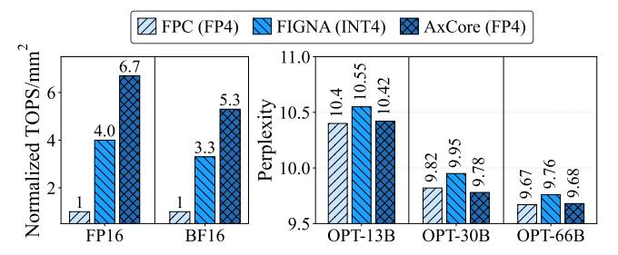

# 1 Introduction

Large language models (LLMs) have revolutionized natural language processing tasks such as language understanding, translation, and generation [\[10,](#page-12-0) [42,](#page-13-0) [48,](#page-13-1) [53\]](#page-13-2). These models comprise multiple stacked transformer layers, containing billions to hundreds of billions of parameters, leading to substantial memory and computational demands. For instance, GPT-3, with 175 billion parameters, requires approximately 350GB of memory in FP16 representation [\[5\]](#page-12-1), far exceeding the capacity of standard hardware accelerators like GPUs [\[7\]](#page-12-2). The core computational bottleneck in LLMs stems from the transformer architecture, where general matrix-matrix multiplication (GEMM) operations dominate both arithmetic throughput and memory bandwidth. These GEMM kernels, typically implemented using floating-point arithmetic (e.g., FP16 or BF16), are hardware expensive, hindering efficient inference.

Quantization has emerged as a key technique to address these challenges by representing high-precision floating-point values with lower-precision data types. In particular, weight-only quantization, which compresses model weights into low-bit formats (e.g., INT4 or FP4) while preserving higher precision activations (e.g., FP16), has been widely adopted for LLM inference [\[12,](#page-12-3) [15,](#page-12-4) [26,](#page-12-5) [29,](#page-12-6) [30,](#page-12-7) [45\]](#page-13-3). This approach is effective because model weights consume significantly more memory than activations, and activations, being dynamic and input-dependent, are difficult to quantize without compromising model accuracy [\[29,](#page-12-6) [30,](#page-12-7) [51\]](#page-13-4). However, such quantization necessitates mixed-precision GEMM (mpGEMM) units, where specialized hardware directly handles high-precision activations with quantized weights, thereby eliminating the explicit dequantization step required by traditional GEMM units and improving both throughput and bandwidth efficiency [\[22,](#page-12-8) [40,](#page-13-5) [43,](#page-13-6) [46,](#page-13-7) [49,](#page-13-8) [50,](#page-13-9) [54\]](#page-13-10).

∗Both authors contributed equally to this research.

†Corresponding author.

- (a) Compute density comparison
- (b) Accuracy comparison

Figure 1: AxCore achieves significantly higher compute density and comparable or better perplexity compared to conventional FP GEMM cores (FPC) and state-of-the-art INT4-based accelerator FIGNA [22].

Meanwhile, floating-point multiplication approximation (FPMA) using integer addition has gained increasing attention for efficient model inference [24, 33, 36]. Mitchell's logarithm approximation [35] suggests that floating-point numbers can be interpreted within a logarithmic number system, while Gustafsson et al. [20] theoretically demonstrate that floating-point multiplication can be replaced with integer additions. This insight reveals that the costly floating-point multipliers in GEMM units can be substituted with simpler integer adders, offering significant resource savings for the intensive computations required by LLMs. While promising, existing FPMA methods are limited to uniform-precision settings and suffer from accuracy loss when applied to deep LLMs, particularly under low-bit quantization, where subnormal values are frequent and error accumulation is non-trivial.

In this paper, we propose **AxCore**, a quantization-aware, approximate mpGEMM unit tailored for LLM inference. AxCore fuses low-bit quantization with FPMA to deliver highly efficient, multiplier-free mix-precision matrix multiplication, while preserving end-to-end model accuracy. It is built upon the following innovations:

- Mixed-Precision FPMA Processing Elements (PEs): AxCore\nextends FPMA to support direct mpGEMM between high-precision
  activations and low-bit quantized weights, which reduces datapath width and PE complexity. The design supports multiple
  floating-point formats concurrently, enabling flexible inference
  across diverse quantization configurations.
- Lightweight Accuracy-Preserving Co-Design: To mitigate the approximation errors inherent in FPMA, AxCore introduces a lightweight software-hardware co-design featuring: (1) online subnormal number conversion for correctness in low-bit formats; (2) online constant-based error compensation; and (3) adaptive format-aware offline quantization.
- Optimized Systolic Array Architecture: AxCore employs a highly efficient systolic array architecture that shares error correction logic and result normalization logic across PEs to reduce hardware resource consumption.

Extensive evaluations show that AxCore delivers superior hardware efficiency and accuracy. As shown in Figure 1, in the W4A16 setting, AxCore achieves up to 6.7× higher compute density than conventional FP GEMM cores and 1.7× over INT4-based design, FIGNA [22]. Despite its approximate design, AxCore maintains competitive or even better perplexity compared to existing solutions.

For instance, on the OPT-30B model, AxCore achieves a perplexity of 9.78, outperforming both FPC (9.82) and FIGNA (9.95). AxCore enables efficient LLM inference by bridging the gap between approximate computing and mpGEMM operations.

## 2 Background

