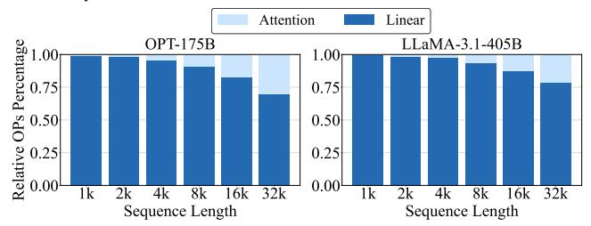
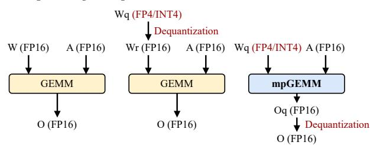

# 2.1 GEMM in LLM Inference

Large Language Models (LLMs) are typically composed of multiple stacked transformer decoder blocks [5, 42, 48, 53], each containing masked self-attention and linear transformation layers. While the attention mechanism offers reasoning capability of transformers, the linear layers, including feed-forward networks and attention projections, dominate the computational workload of LLM inference and contribute the majority of the model parameters [5, 10, 42, 48, 53]. These layers rely heavily on general matrix-matrix multiplication (GEMM) because their core computations are dense linear transformations that map high-dimensional input activations to output activations through large weight matrices.

Figure 2 illustrates the relative number of operations within attention mechanisms and linear layers across various sequence lengths for OPT-175B and LLaMA-3.1-405B. As shown, while the computational proportion of attention increases proportionally with sequence length during LLM inference, GEMM operations in linear layers continue to dominate the computational workload (69% - 99%) at practical sequence lengths (10k–20k tokens) [41]. Notably, during the prefill phase, GEMM is also predominantly used in attention [22], which means that the true computational proportion of GEMM is even larger. This trend highlights that optimizing linear layer GEMM remains critical for improving overall LLM inference efficiency at scale.

Figure 2: Relative proportion of operations (OPs) in attention mechanism and linear layers of OPT-175B and LLaMA-3.1-405B across various sequence lengths with a batch size of 32.

#### 2.2 Weight-only Quantization

To reduce both memory and computational overhead, quantization techniques are widely used in LLM inference. Quantization maps high-precision weights to compact low-bit formats (e.g., INT4 or FP4), significantly shrinking model size and reducing arithmetic bit width. In particular, weight-only quantization is especially practical for LLM inference. Model weights typically consume substantially more memory than activations, making weight quantization highly effective for reducing memory footprint and bandwidth requirements. In contrast, activations are dynamic and input-dependent, and aggressively quantizing them often results in significant accuracy loss [27]. As a result, weight-only quantization—where low-bit weights are combined with higher-precision activations (e.g., FP16

or BF16)—has become the standard in both academic research and industry practice, widely adopted in modern AI hardware accelerators such as GPUs and TPUs [15, 18, 28, 29, 39].

Quantization typically maps a weight w into a lower-bit representation  $w_a$  via a scaling factor s:

$$s = \frac{w_{\text{max}}}{F_{\text{max}}}, \quad w_q = \text{clamp}\left(\text{round}\left(\frac{w}{s}\right), -F_{\text{max}}, F_{\text{max}}\right), \quad (1)$$

where  $F_{\text{max}}$  is the maximum representable value in the target format (e.g., 7 for INT4). The *round* represents the rounding in integer quantization or mapping in floating-point quantization [32, 55]. The *clamp* constrains quantized weights within the representable range  $[F_{min}, F_{max}]$ .

To preserve accuracy under aggressive low-bit quantization, grouped quantization is often applied [15, 29, 55]. This strategy divides weight tensors into smaller groups (e.g., 32 or 128 elements) and assigns each group a dedicated scaling factor (typically in FP16). This fine-grained approach better captures local distributions within each group, reducing quantization error.

#### 2.3 Quantization-Aware GEMM

In LLM inference, GEMM operations involve multiplying large matrices of weights and activations. When executed without quantization, GEMM is performed using full-precision operands (e.g., FP16 × FP16) [5, 29, 42, 48, 53], as illustrated in Figure 3a. With weight-only quantization, there are two common GEMM execution strategies [15, 29, 49, 50]: indirect GEMM (Figure 3b), where quantized weights are first dequantized (i.e., multiplied by a scaling factor) to reconstruct floating-point values before GEMM is performed, and direct mixed-precision GEMM (mpGEMM) (Figure 3c), where GEMM is performed directly between low-bit weights and FP activations, followed by dequantization only on accumulated outputs. Direct mpGEMM is more hardware-efficient because it requires lightweight datapaths of GEMM units and avoids the overhead of per-weight dequantization [22, 40, 43, 46, 49, 50, 54].

(a) Standard GEMM (b) Indirect GEMM (c) Direct mpGEMM Figure 3: Comparison of GEMM computation modes, with 4-bit quantized weights and 16-bit activations.

To reduce the hardware complexity of mpGEMM units, many hardware accelerators adopt uniform quantization formats such as INT4 or INT8 due to their simplicity [22, 40, 54]. For instance, FIGNA [22] uses INT4 quantization and designed INT4-FP16 mp-GEMM units, delivering up to 4 *times* area savings. However, uniform formats distribute values evenly, which does not align well with Gaussian-like distribution of LLM weights [19]. By contrast, non-uniform formats (e.g., FP4, FP8) allocate more representation near zero, showing higher accuracy potential. In this work, we demonstrate that FP-based quantization offers superior accuracy

but also enables more efficient hardware implementation through our proposed AxCore architecture.

