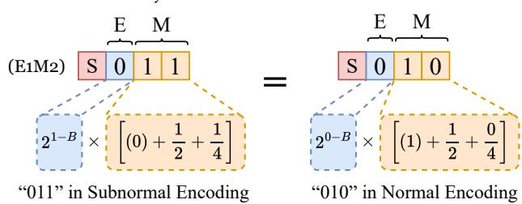
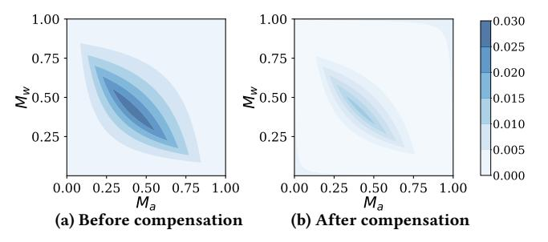
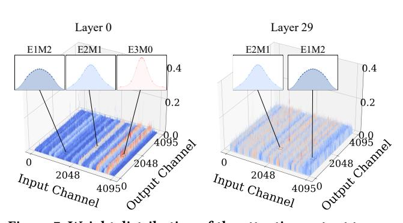
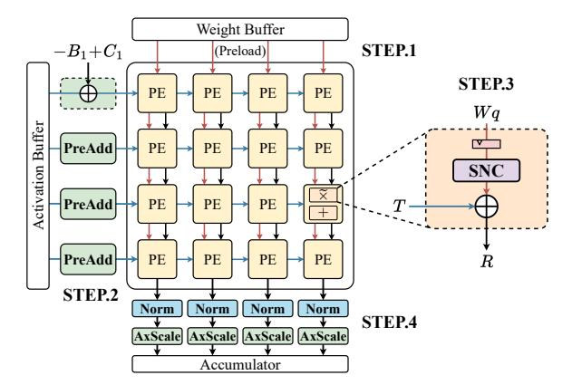
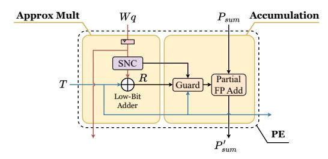
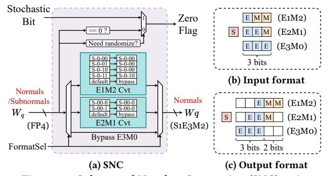
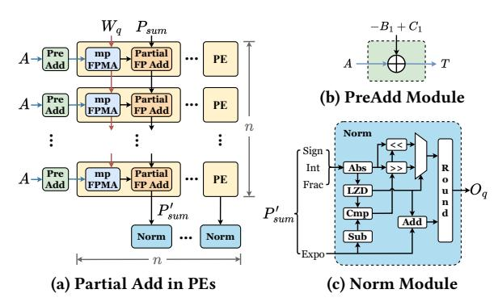
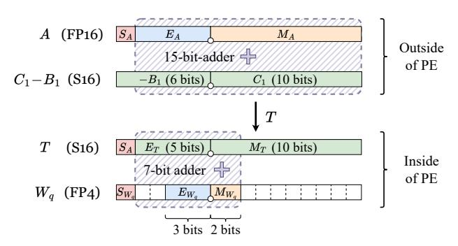
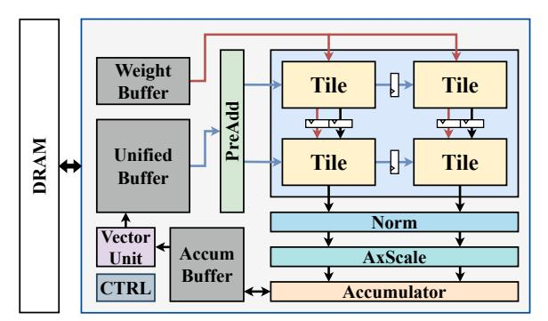

# 4.2 Handling Subnormal Numbers in mpFPMA

As the bit width of floating-point numbers used in quantized LLM inference continues to shrink, particularly with formats like FP4, the handling of subnormal values becomes increasingly critical.

4.2.1 **Problems with Subnormal Numbers**. In floating-point formats, subnormal values are used to represent numbers that are very close to zero, smaller than what can be encoded with the lowest normalized exponent. These values help preserve gradual underflow and allow for finer resolution near zero. A subnormal number has an exponent of 0 and no implicit leading one:

$$x_{\text{sub}} = (-1)^S \cdot 2^{1-B} \cdot M$$
 (10)

with sign bit S, exponent bias B, and mantissa M. Compared to the normalized floating-point number (shown in Equation 2), this removes the "1+" in the mantissa and shifts the exponent range downward. As a result, FPMA approximation no longer holds mathematically due to its reliance on the approximation  $\log_2(1+M) \approx M$ , leading to significant inaccuracies.

Low-bit floating-point formats, such as FP4 or FP8, tend to encounter a much higher proportion of subnormal values compared to higher-precision formats like FP16 or FP32. This arises due to the significantly reduced number of exponent bits. For example, FP4 typically uses only 2 exponent bits, which limits the number of representable exponent values to just four. As a result, the range of normalized numbers is extremely narrow, meaning that many small-magnitude values fall outside this limited normalized range and are encoded as subnormals. While in higher-precision formats subnormals represent extremely rare edge cases with very small magnitudes (often below 10-38 in FP32), in low-bit formats like FP4, subnormals can represent relatively large values, sometimes as high as 0.5. This makes them much more common, particularly

**Table 1: Subnormal Number Conversion Table** 

| M1        |       |               |                   |           |  |  |  |  |
|-----------|-------|---------------|-------------------|-----------|--|--|--|--|
| subnormal | value | normal or 0   |                   | value     |  |  |  |  |
| (0).0     | 0     | $\rightarrow$ | return 0          | 0         |  |  |  |  |
| (0).1     | 0.5   | $\rightarrow$ | (1).0             | 0.5       |  |  |  |  |
| M2        |       |               |                   |           |  |  |  |  |
| subnormal | value |               | normal or 0       | value     |  |  |  |  |
| (0).00    | 0     | $\rightarrow$ | return 0          | 0         |  |  |  |  |
| (0).01    | 0.25  | $\rightarrow$ | (1).00 / return 0 | 0.5↑ / 0↓ |  |  |  |  |
| (0).10    | 0.5   | $\rightarrow$ | (1).00            | 0.5       |  |  |  |  |
| (0).11    | 0.75  | $\rightarrow$ | (1).10            | 0.75      |  |  |  |  |
|           | M3    |               |                   |           |  |  |  |  |
| subnormal | value |               | normal or 0       | value     |  |  |  |  |
| (0).000   | 0     | $\rightarrow$ | return 0          | 0         |  |  |  |  |
| (0).001   | 0.125 | $\rightarrow$ | return 0          | <u>0</u>  |  |  |  |  |
| (0).010   | 0.25  | $\rightarrow$ | (1).000 /return 0 | 0.5↑ / 0↓ |  |  |  |  |
| (0).011   | 0.375 | $\rightarrow$ | (1).000           | 0.5       |  |  |  |  |
| (0).100   | 0.5   | $\rightarrow$ | (1).000           | 0.5       |  |  |  |  |
| (0).101   | 0.625 | $\rightarrow$ | (1).010           | 0.625     |  |  |  |  |
| (0).110   | 0.75  | $\rightarrow$ | (1).100           | 0.75      |  |  |  |  |
| (0).111   | 0.875 | $\rightarrow$ | (1).110           | 0.875     |  |  |  |  |

in quantized weights where small values are frequent. Therefore, subnormals are no longer edge cases in low-bit formats and must be handled carefully in FPMA.

Figure 5: The value represented in subnormal encoding "011" and its equivalent normal encoding "010" in E1M2.

4.2.2 **Subnormal Number Conversion (SNC).** While FPMA support for subnormal values is largely overlooked in existing works, we address this problem by proposing a lightweight subnormal number conversion (SNC) method. We observe that subnormal and normal floating-point encodings can represent values that are numerically close. For instance, as shown in Figure 5, a subnormal value with mantissa "11" in FP4 (E1M2) represents the value  $(-1)^S \cdot 2^{(1-B)} \cdot (0+\frac{1}{2}+\frac{1}{4}) = (-1)^S \cdot 2^{(1-B)} \cdot 0.75$ , according to Equation 10. If we map it to the normalized encoding "10", according to Equation 2, this yields the value  $(-1)^S \cdot 2^{(0-B)} \cdot (1+\frac{1}{2}) = (-1)^S \cdot 2^{(1-B)} \cdot 0.75$ , which is equivalent to the original value in its subnormal form. Therefore, if we convert subnormal inputs to normalized values that are numerically nearest, the mathematical fidelity of FPMA for subnormal values can be preserved.

The conversion relationship between subnormals and normals is presented in Table 1. Because subnormal conversion primarily affects the mantissa, the table organizes the mappings by mantissa bit-width, covering three representative scenarios: M1, M2, and M3. In each case, the first column lists subnormal encodings (with an

Figure 6: Square error distribution of mpFPMA. The x-axis represents activation (FP16) mantissa  $M_a$ , and the y-axis represents weight mantissa  $M_w$  including E3M0, E1M2 and E2M1.

implicit leading zero), while the third column shows the corresponding normalized encodings (with an implicit leading one) that are numerically closest. The second and fourth columns indicate the actual decimal values these encodings represent.

At runtime, AxCore identifies subnormal encodings and replaces them with the nearest valid normalized values based on this predefined mapping. In cases where subnormal values cannot be exactly mapped to a normalized representation, the nearest normalized value is selected. These entries are marked with underlines in the table. Naively rounding all such values in a fixed direction (e.g., always up or down) can introduce systematic bias, which accumulates across matrix multiplications. To mitigate this, AxCore adopts a random selection policy between rounding up ( $\uparrow$ ) and rounding down ( $\downarrow$ ) when approximating subnormals. This strategy ensures that rounding decisions alternate evenly, balancing the accumulated error across large-scale computations.

#### 4.3 Error Compensation for mpFPMA

The approximation used in FPMA (i.e.,  $\log_2(1+M) \approx M$ ) introduces a predictable numerical error, which depends primarily on the mantissa values of the input operands.

4.3.1 Analysis of Error Distribution. To understand and address this, we analyze the error by comparing the approximated result with the exact multiplication result. Figure 6a illustrates the square error distributions for different bit-width mpFPMA configurations. The results reveal a highly non-uniform error distribution that varies across the mantissa space, making it difficult to establish a simple arithmetic relationship between errors and mantissa values for direct compensation [20].

While there are no effective error mitigation techniques specifically designed for mpFPMA, directly extending existing FPMA compensation strategies often incurs substantial overhead. Previous work [31] has used fine-grained compensation strategies by assigning individual compensation values for each  $M_a$ - $M_w$  pair to reduce errors in FP8 formats such as E4M3. However, as precision scales up from E4M3 to E5M10 for activations, the required on-chip storage makes such approaches impractical.

4.3.2 **Mean-Based Constant Compensation**. To overcome these limitations, we propose a constant-based mean compensation strategy that introduces a single, precomputed correction value  $C_1$  to reduce the cumulative approximation error in mpFPMA. This method leverages the observation that the average approximation error

across all possible mantissa combinations provides adequate error correction for LLMs. Figure 6b shows error distribution after applying the proposed compensation. To quantify the approximation error introduced by mpFPMA, we define the element-wise error as  $\varepsilon(m_a, m_w)$ , representing the discrepancy between the exact floating-point product and its approximate counterpart for each mantissa pair. To obtain a single correction value, we average the expected error across all valid mantissa combinations. This yields the format-specific compensation constant  $C_1$ , defined as:

$$C_1 = \frac{1}{2^{N_{M_w}} \cdot 2^{N_{M_a}}} \sum_{m_a, m_w} \varepsilon(m_a, m_w)$$
 (11)

where  $N_{M_w}$  is the bit-width of the weight mantissa, and  $m_a$ ,  $m_w$  denote the sets of representable mantissa values for the activation and weight, respectively.

Therefore, given the number of mantissa bits in the input data format, the error compensation value can be precomputed in a one-time process and applied universally for all models or layers with negligible overhead.

This approach has several practical advantages: it introduces no runtime overhead since compensation values can be precomputed; it requires minimal additional logic; and it generalizes easily across multiple FP format pairs, including FP16  $\times$  FP4, BF16  $\times$  FP4, FP16  $\times$  FP8, etc. Our experiments show that a single constant value per format pair achieves substantial accuracy recovery, making this method both efficient and effective for quantized LLM inference.

### 4.4 Adaptive Format-Aware Quantization

To preserve accuracy under aggressive quantization, we propose a format-aware method that supports multiple low-bit FP formats within a unified framework. This observation stems from the fact that weights within layers of LLMs exhibit increasingly diverse value distributions as the quantization granularity becomes finer [21]. Relying on a single low-bit format (e.g., E2M1) often results in suboptimal quantization when its range or resolution mismatches local data. Our format-aware quantization is novel in two ways: (a) it operates block-wise, allowing finer adaptation to local distributions; and (b) it is co-designed with AxCore's on-the-fly mixed-format processing to assign optimal FP4 formats (e.g., E3M0 for sparse, E1M2 for uniform data) per block. Consistent with NVIDIA's FP4 [38] and LLM-FP4 framework [32], these formats dedicate all bit patterns to encoding valid finite numbers.

4.4.1 **Block-wise Format Selection**. Rather than enforcing a fixed format or tensor-wise format across the model [19, 47], we adopt a block-wise adaptive strategy that selects the optimal FP4 format for each weight block. In the 4-bit quantization case, our approach considers three representative FP4 formats: E3M0 (power-of-two-like), E2M1 (standard), and E1M2 (uniform). Each of these formats provides different trade-offs between dynamic range and granularity, making them more or less suitable depending on the local weight distribution. This format selection is performed using an offline procedure where the weight matrix is first partitioned into blocks of size  $g \times n$ , where g represents the weight group size along the input channels and n denotes the number of output channels per block, with both n and g required to be a multiple of the GEMM array size. Each block contains n weight groups. For each block, we

Figure 7: Weight distribution of the attention output tensor for selected layers in Llama2-7B, illustrating the suitability of different FP4 formats.

evaluate all candidate formats by quantizing the n weight groups and selecting the format that minimizes the mean squared error under the actual input activation distribution using a calibration dataset [16]. This format selection objective is formulated as:

$$Dtype = argmin_{d \in \mathcal{D}} \|A \cdot W^d - A \cdot W\|_2^2$$
 (12)

where  $\mathcal{D}$  denotes the set of candidate FP4 data types E3M0, E2M1, E1M2,  $W^d$  represents the weight tensor after quantization and subsequent dequantization using a specific data type d, W corresponds to unquantized weight tensor, and A represents the activations. This format selection process therefore has a similar overhead to conventional static quantization [28].

Figure 7 visualizes the distribution of weights of attention output tensor in layer 0 and layer 29 of Llama2-7B. Specifically, Layer 0 and Layer 29 exhibit distinct distribution characteristics. In Layer 0, the weight distribution shows sharp peaks suitable for power-of-two-like encoding, and our method selects the FP4 E3M0 format accordingly. In contrast, Layer 29 shows a wider and more uniform distribution, where FP4 E1M2 and E2M1 are more appropriate.

4.4.2 **Integration with FPMA**. We also extend this format-aware quantization to integrate seamlessly with FPMA. Unlike conventional quantization:

$$w_q = \text{clamp}\left(\text{round}\left(\frac{w}{s}\right)\right)$$
 (13)

we redefine quantization and dequantization using FPMA-style approximation:

$$w_q = \text{clamp (round } (w - S + B - C)) \tag{14}$$

$$w_r = w_q + S - B + C_2 (15)$$

Here, S, B, C, and  $C_2$  are precomputed constants representing the binary representation of FP number scale, bias, and format-specific compensation terms, respectively. C represents the compensation applied during quantization, while  $C_2$  denotes the compensation applied during dequantization. Combining Equation 14 and Equation 15 yields:

$$w_r \approx w$$
 (16)

showing that the FPMA compensation values C and  $C_2$  can cancel out, thereby preserving the original value and ensuring correctness.

While conventional floating-point quantization and reconstruction (i.e.,  $w \to w_q \to w_r$ ) introduce numerical drift due to division and multiplication inaccuracies, FPMA-based quantization relies

Figure 8: AxCore systolic spatial array architecture.

only on addition and subtraction, which exhibit less rounding bias and improved numerical consistency.

#### 5 AxCore Architecture

#### 5.1 Overview

In the weight-stationary dataflow of AxCore, quantized low-bit weights (e.g., FP4) are pre-loaded and held stationary within the PEs of each column, while high-precision activations (e.g., FP16) are propagated horizontally across each row. A centralized PreAdd unit pre-computes an intermediate value, T, by applying correction terms to the activation. This is calculated using the formula  $T = A - B_1 + C_1$ , where A is the high-precision activation,  $B_1$  is the exponent bias correction, and  $C_1$  is the format-specific compensation constant. The resulting values are then propagated along the row to minimize logic duplication across PEs.

Inside each PE, AxCore introduces a carefully pipelined microarchitecture. The incoming low-bit weight passes through a dedicated Subnormal Number Conversion (SNC) unit. This module identifies subnormal values and remaps them to nearby normalized representations on a per-format basis. The output of the SNC is unified into a shared internal format (e.g., S1E3M2), allowing downstream logic to remain format-agnostic. This enables support of multiple FP formats (e.g., E3M0, E2M1, E1M2 for FP4) concurrently across the array, which is essential to enable adaptive format-aware quantization. The aligned weight is then summed with the previously computed T using a lightweight integer adder, a simple 2-input addition that replaces traditional multipliers entirely.

Post-processing consists of three stages: Normalization, to adjust the result into standard floating-point format; AxScale, which replaces dequantization multipliers with FPMA-based addition logic for efficient scaling; and Accumulator, which adds scaled partial sums with previously stored values.

## 5.2 mpFPMA Processing Elements

5.2.1 **Overview**. As depicted in Figure 9, each PE is logically composed of two sequential blocks: an Approximate Multiplication (Approx Mult) block and an Accumulation block. The PE receives two primary inputs: the low-bit quantized weight  $W_q$  and the precomputed intermediate value T from the PreAdd unit. The term T is computed externally by the PreAdd unit and propagated across

Figure 9: Architecture of Processing Element in AxCore.

Figure 10: Subnormal Number Conversion (SNC) unit.

all PEs in a row. Upon entering the PE, the quantized weight  $W_q$  is first processed by the SNC unit. This module identifies subnormal values and maps them to the nearest normalized representation. The SNC-processed weight undergoes mantissa alignment. Since the precision of weights is typically lower than that of activations, the weight's mantissa is zero-padded to match the activation's fixedpoint domain. The aligned weight is then added to the term T via a low-bit integer adder, completing the function of the Approx Mult block and yielding the product  $R = T + Align(W_q)$ . The product R is then processed by the Accumulation block, which includes a Guard Unit that checks whether either the activation or weight is zero. If either input is zero, the Guard Unit enforces the output *R* to be zero. The resulting value R is then forwarded to a Partial Floating-Point Adder, which accumulates it with the vertically propagated partial sum  $P_{\text{sum}}$ . This adder, which shares the same width as the activation input, performs accumulation in-place and defers full normalization and rounding to the post-processing stages.

5.2.2 **Subnormal Number Conversion (SNC) module.** The architecture of the SNC unit is presented in Figure 10a, where FP4 is used as the example weight format. SNC unit receives an input quantized weight  $W_q$ , which may be encoded using one of several FP4 subtypes: E1M2, E2M1, or E3M0, as illustrated in Figure 10b. The FormatSe1 signal selects the appropriate format-specific decoder (e.g., M2 Cvt, M1 Cvt), and the input is routed accordingly. Within each decoder block, a small logic table checks for subnormal encodings (e.g., S-0-00) and maps them to nearby normalized values. Since input  $W_q$  may contain both normal and subnormal values, the SNC includes a bypass path for normal entries.

The Zero Flag unit detects all-zero inputs and signals this condition to the downstream Guard unit. Beyond basic zero detection, it also facilitates stochastic rounding for subnormal values that lack exact normalized representations. Since rounding down always

Figure 11: Optimizations for resource sharing across PEs, including advanced correction in PreAdd module and post-poned normalization in Norm module.

results in zero, the Zero Flag is leveraged to control the rounding direction. When a subnormal value requires randomized rounding, the Zero Flag is set using a stochastic bit, sampled from the most significant mantissa bit of the activation. Otherwise, it is determined through conventional zero detection. This mechanism enables alternating rounding directions and reduces bias in repeated approximations.

The converted outputs are all transformed into a unified internal format: S1E3M2. As illustrated in Figure 10b. The reason for choosing S1E3M2 is to provide a common representation that supports all FP4 subtypes simultaneously, enabling adaptive format-aware quantization in AxCore. This design allows each group of weights to flexibly select the most appropriate FP4 encoding format (E1M2, E2M1, or E3M0) during quantization based on distribution characteristics, while still maintaining hardware simplicity during inference.

#### 5.3 Systolic Array Optimizations

5.3.1 **Correction Advancing**. In mixed-precision FPMA (mpF-PMA), the approximate multiplication result is computed as  $R = A + W_q - B_1 + C_1$ , where  $B_1$  and  $C_1$  are bias correction and compensation terms determined solely by the FP formats of the operands. Since these correction values are constant per GEMM row and independent of the weight values  $W_q$ , AxCore extracts their computation from each PE and relocates it into a centralized PreAdd module (shown in Figure 11b). This module computes the shared term  $T = A - B_1 + C_1$  once per row and streams it to all PEs. As a result, each PE only needs to perform a lightweight integer addition  $R = T + \text{Align}(W_q)$ , significantly simplifying its datapath and reducing silicon area.

Figure 12 compares mpFPMA PE designs with and without this technique. In the baseline design (Figure 12a), each PE directly receives the high-precision activation A (e.g., FP16) and the SNC-processed weight  $W_q$  (e.g., FP4). Since the SNC output is expressed in the S1E3M2 format and must be aligned with the FP16 exponent domain, computing  $A+W_q$  requires a 7-bit adder (5 bits from the aligned exponent and a 2 bits from mantissa). To apply correction, a separate 15-bit adder is required to compute  $C_1-B_1$ , which spans both exponent and mantissa fields. The combined term  $C_1-B_1$  can be efficiently viewed as a concatenation of  $-B_1$  and  $C_1$ , because they operate over different bit fields. While functionally effective,

(a) mpFPMA PE without Correction Advancing

(b) mpFPMA PE with Correction Advancing.

Figure 12: Comparison of different designs of mpFPMA.

this double-adder structure requires wide datapaths and substantial logic replication in every PE. In contrast, with Correction Advancing, as depicted in Figure 12b, the activation A is combined with  $-B_1+C_1$  in a 15-bit adder outside the systolic array. The result is a precomputed value T, which is passed along a row of PEs. Each PE then adds T to the aligned  $W_q$  using only a 7-bit adder, which is sufficient for E3M2 weights and FP16 activations (E5M10).

5.3.2 **Normalization Postponing**. Floating-point additions in traditional GEMM architectures typically include in-PE normalization to maintain accuracy. However, this approach introduces significant area and delay due to operations like leading-zero detection (LZD), bit shifting, and rounding. Inspired by [14, 23], AxCore postpones normalization to a shared Norm module outside the PEs, and keeps  $N_{M_a}$  + 2 bit-width mantissa (where  $N_{M_a}$  is the activation mantissa width) to maintain numerical accuracy and additional integer bits needed to prevent overflow. Each PE accumulates partial results without normalization, producing intermediate sums composed of separate fields (sign, exponent, integer, fraction), as shown in Figure 11a. These results are passed to the Norm module, where a pipelined normalization process finalizes the output. This includes components such as Abs, LZD, Cmp, and Round, as shown in Figure 11c. Offloading normalization from each PE to a shared module reduces logic duplication by a factor of n in an  $n \times n$  array, enhancing scalability and energy efficiency.

5.3.3 **FPMA-based Dequantization**. Group-wise quantization requires each output channel to be scaled by a floating-point scaling factor. Rather than using a multiplier, AxCore implements this dequantization using FPMA, forming the basis of the AxScale module. After accumulation, the output  $O_q$  is dequantized as:

$$O = O_q + S - B + C_2 (17)$$

where S is the binary representation of the scale factor, B is the format-specific bias, and  $C_2$  is a compensation constant. This design

Figure 13: Architecture of AxCore-based LLM Accelerator.

reduces the dequantization logic to two integer additions, enabling low-cost scaling in the post-processing pipeline.

#### 5.4 AxCore-Powered LLM Inference Accelerator

Figure 13 illustrates the full system architecture of the AxCorebased LLM inference accelerator. Similar to existing accelerators [22, 40], the design is organized around a tightly integrated GEMM pipeline optimized for quantized models. At the core of the accelerator lies the GEMM Unit (AxCore), structured as a 2D array of processing Tiles, each composed of multiple mpFPMA PEs. To prepare data for computation, a Weight Buffer stores quantized model weights, while a Unified Buffer handles activations and intermediate data. The architecture also includes a Vector Unit, which assists with layer-wise vector operations, and a Control Unit (CTRL) that orchestrates the instruction scheduling and data flow. Data communication with off-chip DRAM is managed through the memory interface linked to the buffers. This modular and systolic-friendly design allows AxCore to efficiently support large-scale transformer inference under low-bit quantization.

