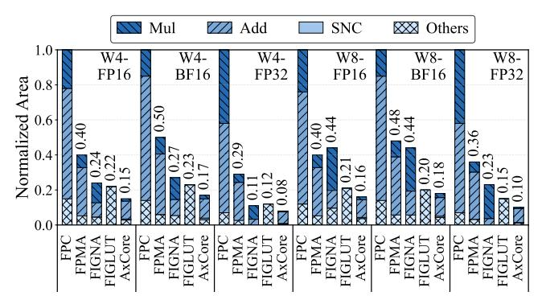
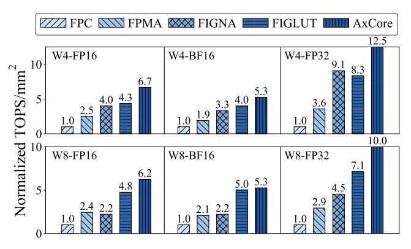
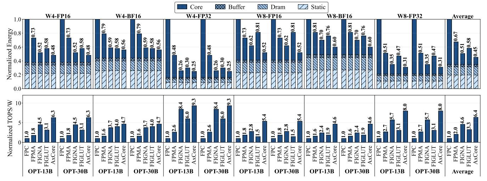

# 6 Evaluation

#### 6.1 Experimental Setup

6.1.1 Accuracy Evaluation Setup. We evaluate AxCore and baseline designs on two widely used LLM families: OPT and LLaMA2. All models are quantized to 4-bit using established weight-only quantization methods [12], with group sizes of 128 for OPT and 64 for LLaMA2 [11, 15, 29]. For block-wise adaptive format quantization, a small calibration set from the Pile dataset [16] is used to prevent overfitting. The block size is set to 128 × 64 for OPT and 64 × 64 for LLaMA2. Following prior work [22, 40], we evaluate model performance on WikiText-2 [34] using perplexity (PPL) with a sequence length of 2048, where lower values indicate better accuracy. Additionally, for zero-shot evaluation, we use four benchmark datasets: ARC-e [8], HellaSwag [52], PiQA [4], and Winogrande [2], evaluated via the lm-eval-harness framework [17].

6.1.2 **Hardware Evaluation Setup**. To assess hardware efficiency, we implement AxCore in SpinalHDL [13] and synthesize the generated Verilog RTL using Synopsys Design Compiler with 28nm TSMC technology node. All designs are synthesized under the same target frequency (1GHz) and normalized to deliver equal peak throughput measured in TOPS. For a fair comparison, baseline and AxCore designs share a  $64 \times 64$  systolic array configuration with  $4 \times 64$  systolic array configuration with  $4 \times 64$  systolic array configuration with  $4 \times 64$  systolic array configuration with  $4 \times 64$  systolic array configuration with  $4 \times 64$  systolic array configuration with  $4 \times 64$  systolic array configuration with  $4 \times 64$  systolic array configuration with  $4 \times 64$  systolic array configuration with  $4 \times 64$  systolic array configuration with  $4 \times 64$  systolic array configuration with  $4 \times 64$  systolic array configuration with  $4 \times 64$  systolic array configuration with  $4 \times 64$  systolic array configuration with  $4 \times 64$  systolic array configuration with  $4 \times 64$  systolic array configuration with  $4 \times 64$  systolic array configuration with  $4 \times 64$  systolic array configuration with  $4 \times 64$  systolic array configuration with  $4 \times 64$  systolic array configuration with  $4 \times 64$  systolic array configuration with  $4 \times 64$  systolic array configuration with  $4 \times 64$  systolic array configuration with  $4 \times 64$  systolic array configuration with  $4 \times 64$  systolic array configuration with  $4 \times 64$  systolic array configuration with  $4 \times 64$  systolic array configuration with  $4 \times 64$  systolic array configuration with  $4 \times 64$  systolic array configuration with  $4 \times 64$  systolic array configuration with  $4 \times 64$  systolic array configuration  $4 \times 64$  systolic array configuration  $4 \times 64$  systolic array configuration  $4 \times 64$  systolic array configuration  $4 \times 64$  systolic array configuration  $4 \times 64$  systolic array configuration  $4 \times 64$  systolic array configuration  $4 \times 64$  systolic array configuration  $4 \times 64$  systolic array configuration  $4 \times 64$  sys

Figure 14: Normalized area breakdown of processing element (PE) under different formats.

4 tilings. To explore performance across various precision settings, we define evaluation scenarios spanning combinations of weight types (INT4, FP4, INT8, FP8) and activation formats (FP16, BF16, FP32). We develop a simulator based on the open-source cycle-level simulator DNNWeaver [44] to evaluate performance. The SRAM module's power is simulated using CACTI [37]. All the accelerator designs are configured with identical SRAM sizes.

6.1.3 **Baselines**. We compare AxCore against four representative GEMM accelerator baselines: a floating-point GEMM core (FPC) [22], FPMA, FIGNA [22], FIGLUT [40] and Tender [25]. **FPC**: Uses standard floating-point fused-multiply-add (FMA) units in each PE, with FP32 accumulators, aligning with FIGNA and FIGLUT configurations. **FPMA**: Replaces FP multipliers with original FPMA logic. Use FP16/BF16 adders for FP16/BF16 activations and FP32 adders for FP32 activations for in-PE accumulation. **FIGNA**: A state-of-the-art FP-INT mixed-precision GEMM unit designed for weight-only quantized LLMs. **FIGLUT**: A state-of-the-art LUT-based FP-INT GEMM design for LLMs. **Tender**: A state-of-the-art INT-based non-mix-precision GEMM design for LLMs.

#### 6.2 Area Efficiency

6.2.1 Area Efficiency of mpFPMA PEs. Figure 14 presents the normalized area breakdown of a single PE under six data type configurations. The breakdown includes multiplication logic, addition logic, subnormal number conversion (SNC), and other components. FIGLUT lacks detailed component data, so its area is grouped under "Others." Among all designs, FPC incurs the highest area due to costly floating-point units, while FPMA reduces multiplier area via approximation. AxCore achieves the smallest PE area across all formats, attributed to its mpFPMA design that eliminates multipliers. Compared to FIGLUT, AxCore reduces PE area by up to 34% in the W4-FP32 case, and by 31% and 22% in the W4-FP16 and W4-BF16 configurations, respectively. Compared to FIGNA, AxCore reduces PE area by 32%–39% in 4-bit formats and 43%–56% in 8-bit formats. Notably, the SNC unit in AxCore introduces minimal overhead, accounting for only 3.5% of the total PE area on average.

6.2.2 **Area Efficiency Across GEMM Designs**. Figure 15 presents the normalized area breakdown of the GEMM unit across different designs and data formats. The area breakdown is categorized into two types: the array composed of all PEs, and Others, which consist of various pre-processing and post-processing modules located

Figure 15: Normalized area breakdown of the GEMM unit under six input format configurations, decomposed into the PE array and shared modules (Others).

along the data path for activations. AxCore consistently achieves the lowest area across all settings, outperforming both FIGNA and FIGLUT. In 4-bit weight scenarios, AxCore reduces total area by 31%, 26%, and 34% compared to FIGLUT for W4-FP16, W4-BF16, and W4-FP32, respectively, and by 37%, 36%, and 29% compared to FIGNA. In 8-bit settings, AxCore achieves an average area reduction of 25% over FIGLUT and over 55% compared to FIGNA.

## 6.3 Compute Density

Figure 16 presents the normalized compute density (TOPS/mm²) of the GEMM array across six input format configurations, focusing on the PE array and excluding final accumulation stages. Results are normalized to the conventional FP32 design (FPC). AxCore consistently delivers the highest compute density across all formats due to its compact mpFPMA datapath, multiplier-free design, and centralized correction logic. In the W4-FP16 setting, AxCore achieves a 6.7× improvement over FPC, significantly outperforming FIGNA (4.0×) and FIGLUT (4.3×). In the W4-FP32 setting, AxCore achieves a 12.5× improvement over FPC and outperforms FIGNA and FIGLUT by 1.4× and 1.5×, respectively. Similar trends are observed in other formats: AxCore reaches 5.3× in W4-BF16, and 6.2× in W8-FP16. Even in higher-precision configurations like W8-FP32, AxCore maintains a 10× density gain over FPC.

### 6.4 Energy Efficiency

Figure 17 presents the normalized energy breakdown and TOPS/W of AxCore and baseline accelerators across multiple input data types evaluated on two OPT models (13B and 30B). We measure energy during the decoding phase with a batch size of 32 and an output sequence length of 1, which is aligned with baselines [22, 40]. All designs have been provided with adequate bandwidth. Among all evaluated configurations, AxCore consistently demonstrates superior energy efficiency, achieving the lowest energy consumption and highest TOPS/W. Both FIGNA and FIGLUT show markedly increased energy consumption in 8-bit scenarios: FIGNA's multiplier overhead scales quadratically with computational bit-width, while FIGLUT's bit-serial architecture necessitates extended computation cycles, increasing energy expenditure. On average, AxCore

Figure 16: Normalized compute density (TOPS/mm²) of the GEMM array across six input format configurations.

achieves averaged  $2.2\times$ ,  $1.5\times$ ,  $1.1\times$  and  $1.3\times$  total energy reduction and  $6.4\times$ ,  $3.1\times$ ,  $1.4\times$  and  $2.0\times$  TOPS/W improvement over FPC, FPMA, FIGNA, and FIGLUT, respectively.

### 6.5 Accuracy Evaluation

6.5.1 End-to-end model accuracy. Table 2 compares the perplexity of AxCore against baseline accelerators. It also shows an ablation study of our optimizations: subnormal number conversion (SNC), constant compensation and format-aware quantization. FPMA uses FP4 round-to-nearest quantization; FIGNA is evaluated using GPTQ quantization [15]; and FIGLUT results are from its published paper [40]. All methods employ symmetric quantization, with a group size of 128 for OPT models and 64 for LLaMA 2 models. Since FIGNA and FIGLUT do not quantize the attention layers, the accuracy reflects linear layer quantization. As shown in Table 2, AxCore consistently delivers competitive or superior perplexity across model sizes. For OPT models (2.7B to 30B), AxCore matches or outperforms existing 4-bit accelerator designs, achieving the lowest perplexity in cases such as OPT-6.7B and OPT-13B. Similarly, on LLaMA 2 models (7B and 70B), AxCore maintains accuracy close to FP16 and performs better than FIGNA and FPMA.

6.5.2 **KV** cache quantization. Alongside linear layers, attention mechanisms are key to LLM inference. To support end-to-end inference on AxCore, we quantize the KV cache to 4 bits with a group size of 64 along the accumulation dim. For OPT models, we use E1M2 for the K cache and E3M0 for the V cache; for LLaMA2 models, E2M1 is used for the K cache and E3M0 for the V cache. The state-of-theart integer-only accelerator Tender [25] applies weight-activation quantization with chunking and reordering to deal with outliers in activation and KV cache. The results in Table 2 show that AxCore achieves better accuracy for end-to-end LLM inference compared to Tender. Furthermore, we observe that the choice of data format in KV quantization significantly affects accuracy, making data format calibration for KV cache a valuable future direction.

6.5.3 Accuracy improvement breakdown. Table 2 also highlights how AxCore's design features improve accuracy. Starting from mpFPMA (only use E2M1 format without constant compensation and SNC), we observe higher perplexity (e.g., 11.83 on OPT-6.7B). Adding SNC (mpFPMA+S) reduces perplexity (11.45), showing the benefit of subnormal number conversion. The introduction

Table 2: Perplexity comparison across OPT and LLaMA 2 models. mpFPMA: base mpFPMA; mpFPMA+S: mpFPMA + SNC; mpFPMA+S+C: mpFPMA + SNC + compensation; AxCore: mpFPMA + SNC + compensation + format-aware quantization; AxCore-KV: AxCore + KV cache quantization.

| Method      | Bits W/A/KV | OPT (Perplexity↓) |       |       |       | LLaMA 2    |      |
|-------------|----------------|-------------------|-------|-------|-------|------------|------|
|             |                | 2.7B              | 6.7B  | 13B   | 30B   | 7 <b>B</b> | 70B  |
| FP16        | 16/16/16       | 12.47             | 10.86 | 10.13 | 9.56  | 5.47       | 3.32 |
| INT4        | 4/16/16        | 13.41             | 11.28 | 10.55 | 9.95  | 5.78       | 3.51 |
| FP4         | 4/16/16        | 12.97             | 11.10 | 10.40 | 9.82  | 5.70       | 3.46 |
| FPMA        | 4/16/16        | 13.40             | 11.37 | 10.56 | 9.93  | 5.82       | 3.53 |
| mpFPMA      | 4/16/16        | 13.83             | 11.83 | 10.80 | 9.99  | \          | \    |
| mpFPMA+S    | 4/16/16        | 13.24             | 11.45 | 10.49 | 9.86  | ١          | \    |
| mpFPMA+S+C  | 4/16/16        | 13.12             | 11.14 | 10.25 | 9.74  | \          | \    |
| FIGNA [22]  | 4/16/16        | 12.87             | 11.04 | 10.23 | 9.62  | 5.69       | 3.42 |
| FIGLUT [40] | 4/16/16        | 12.73             | 11.08 | 10.33 | 9.70  | \          | \    |
| AxCore      | 4/16/16        | 12.87             | 11.01 | 10.20 | 9.60  | 5.65       | 3.40 |
| AxCore-KV   | 4/16/4         | \                 | 11.18 | 10.59 | 9.79  | 5.82       | 3.48 |
| Tender [25] | 8/8/4          | \                 | 14.51 | 13.33 | 14.49 | \          | \    |
| Tender [25] | 4/4/4          | \                 | 17.09 | 21.91 | 21.39 | \          | \    |

Table 3: Zero-shot performance on four benchmark datasets. Higher scores indicate better accuracy.

| Model  | Method | Arc-e | Hella. | Piqa  | Wino. | Avg.(↑) |
|--------|--------|-------|--------|-------|-------|---------|
|        | FP16   | 82.03 | 84.13  | 82.86 | 78.61 | 81.91   |
| LLaMA2 | INT4   | 81.31 | 83.37  | 82.37 | 78.37 | 81.36   |
| 70B    | FP4    | 81.99 | 83.50  | 82.59 | 78.37 | 81.61   |
|        | AxCore | 82.11 | 83.79  | 82.59 | 78.61 | 81.78   |
|        | FP16   | 65.36 | 72.31  | 78.18 | 68.35 | 71.05   |
| OPT    | INT4   | 63.97 | 71.43  | 78.24 | 67.40 | 70.26   |
| 30B    | FP4    | 65.03 | 71.63  | 77.97 | 67.01 | 70.41   |
|        | AxCore | 64.86 | 72.08  | 78.07 | 68.03 | 70.76   |

of constant compensation (mpFPMA+S+C) further improves accuracy (11.14). AxCore further combines the two optimizations with format-aware quantization, achieving the best results among 4-bit designs (e.g., 11.01 on OPT-6.7B, 5.65 on LLaMA 2 7B). In addition, applying KV cache quantization (AxCore-KV) introduces minimal accuracy loss (e.g., 11.18 on OPT-6.7B).

6.5.4 Zero-shot performance. We also evaluate AxCore on four standard zero-shot benchmark datasets (ARC-e [8], HellaSwag [52], Piqa [4], and Winogrande [2]), using the lm-eval-harness framework [17]. Table 3 summarizes the results. For the LLaMA2 70B model, AxCore achieves an average accuracy of 81.78%, which is comparable to the FP16 baseline (81.91%) and outperforms both INT4 (81.36%) and FP4 (81.61%) quantization implementations. Across individual benchmarks, AxCore maintains consistent performance. For the OPT 30B model, AxCore attains an average accuracy of 70.76%, which is close to the FP16 baseline (71.05%).

6.5.5 **Numerical accuracy**. We evaluate AxCore's numerical accuracy with Signal-to-Noise Ratio (SNR) as the metric, which is defined as the ratio of exact matrix multiplication power to approximation noise power in decibels [9]. Higher SNR indicates better preservation of both magnitude and direction in the approximate results. We test fan-in values from 128 to 32,768, which are typical

Figure 17: Normalized energy of AxCore and baseline accelerator designs across various data formats and model configurations.

Figure 18: Signal to Noise Ratio (SNR) analysis of AxCore. mpFPMA: base mpFPMA; S: subnormal number conversion (SNC); C: compensation; SR: stochastic rounding.

for LLMs, using uniformly distributed input data. Figure 18 shows that SNC consistently improves SNR across all tested matrix sizes. Combining SNC with compensation provides additional gains. Stochastic rounding offers normal accuracy improvement at negligible cost, though ineffective for E2M1 format as its subnormal numbers can be exactly mapped to normalized representations.

#### 6.6 Comparison with Non-mpGEMM Designs

To demonstrate the advantage of AxCore's mixed-precision design with high-precision activations, we compare it to the integer-only accelerator Tender [25]. As shown in Figure 19, AxCore (W4A16KV4) achieves higher compute density and superior accuracy than Tender's W8A8KV4 and W4A4KV4 configurations. Specifically, AxCore provides 1.72× and 1.86× higher compute density than Tender W8A8KV4 for FP16 and BF16 activations, respectively, and also exceeds Tender's W4A4KV4 density. In terms of accuracy, AxCore consistently delivers lower perplexity across OPT models. For instance, on OPT-30B, AxCore achieves a perplexity of 9.79, compared to 14.49 for Tender W8A8KV4 and 21.39 for Tender W4A4KV4. These results demonstrate that AxCore's weight-only quantization, combined with high-precision activations and FPMA, achieves a better trade-off between efficiency and accuracy.

(a) Compute density comparison

(b) Accuracy comparison

Figure 19: Comparision with integer-based non-mix-precision GEMM accelerator Tender [25].

#### 7 Conclusion

In this paper, we presented AxCore, a quantization-aware approximate GEMM unit that enables efficient mixed-precision matrix multiplication for LLM inference. By combining floating-point multiplication approximation (FPMA) with low-bit floating-point quantization, AxCore eliminates multipliers and significantly simplifies per-PE logic. To the best of our knowledge, AxCore is the first architecture that exploits the potential of FPMA for LLM inference. AxCore integrates a set of lightweight yet effective techniques: subnormal number conversion, mean-based error compensation, and adaptive format-aware quantization. Evaluations show that AxCore achieves up to 12.5× higher compute density over FP baselines and delivers 50% to 70% area savings over INT4 accelerators while achieving lower perplexity. While AxCore processes standard low-bit FP formats, extending it for custom data types [19, 21] or block-based formats [9] remains a valuable future direction.

#### Acknowledgments

This work is supported by National Key Research and Development Program of China (No. 2024YFB4504200) and the Guangzhou-HKUST(GZ) Joint Funding Program (No.2025A03J3568). We also thank the AMD Heterogeneous Accelerated Compute Cluster (HACC) Program [3] for providing access to hardware resources.

