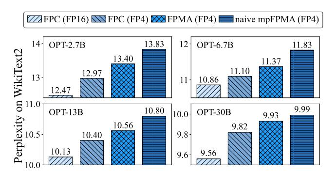

# Feature 1: Efficient mpGEMM Execution via mpFPMA-based Systolic Array Unit.

To tackle the challenge of supporting mixed-precision GEMM with FPMA, AxCore introduces a systolic array of optimized mpFPMA PEs capable of directly computing on compressed low-bit weights and high-precision activations. To reduce datapath width and PE complexity, AxCore applies correction advancing, precomputing correction terms outside the PE and sharing them within rows. Normalization is deferred to a shared unit to reduce per-PE logic,

Figure 4: Perplexity comparison across different OPT model sizes using various computation methods. Activations are in FP16. FPMA and mpFPMA without subnormal handling result in significant accuracy loss.

while FPMA-based dequantization eliminates the need for post-GEMM multipliers.

#### Feature 2: Lightweight Accuracy Preservation Mechanisms.

To address the inherent error introduced by FPMA, AxCore employs a lightweight compensation mechanism designed specifically for mixed-precision settings. This includes precomputed bias and correction terms that stabilize outputs across diverse operand combinations. Crucially, each PE integrates a subnormal number conversion logic, which detects and converts subnormal values to the nearest normalized representations, preventing accuracy degradation caused by malformed mantissa. In addition, AxCore employs adaptive format-aware quantization, dynamically selecting the most suitable FP4 encoding (e.g., E1M2, E2M1, E3M0) per weight group. This fine-grained adaptability further enhances quantization fidelity across layers with varying value distributions. Together, these features enable AxCore to deliver high hardware efficiency while maintaining the accuracy required for LLM inference.

