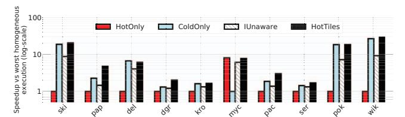
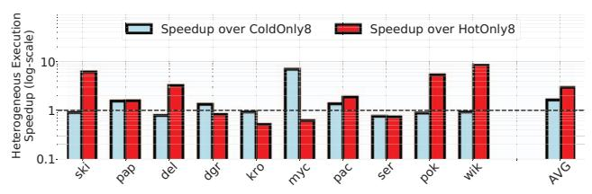

# A. Performance Evaluation

We compare the performance of heterogeneous execution with *HotTiles* against: (1) a homogeneous execution using only the cold workers of each architecture (*ColdOnly*); (2) a homogeneous execution using only the hot workers (*HotOnly*); and (3) a heterogeneous execution that partitions tiles based on the *IUnaware* method. Note that IUnaware is very similar to the partitioning technique used in AESPA [54]. We additionally compare against the *BestHomogeneous* baseline, which manually selects the best homogeneous strategy between *HotOnly* and *ColdOnly* on a per-matrix basis.

Figure 10 presents the results for SPADE-Sextans (with system scale 4), while Figure 11 presents the results for PIUMA. The figures show the speedup over the worstperforming homogeneous execution (hot or cold) on a permatrix basis. We observe that HotTiles is very effective. It outperforms practically all the baselines. For SPADE-Sextans, HotTiles provides average speedups of 8.7x, 1.9x, and 2.0x over HotOnly, ColdOnly, and IUnaware, respectively. Although not shown, it also provides average speedups of 1.25x over *BestHomogeneous*. For PIUMA, the speedups are similar: 9.2x, 1.4x, and 1.4x over HotOnly, ColdOnly, and IUnaware, and 1.4x over BestHomogeneous. Note that, typically, HotOnly is the slower homogeneous execution due to the low density of the benchmark sparse matrices. The exception is the myc matrix, which is the densest matrix in our evaluation. For this matrix, hot workers are significantly better than cold ones for SPADE-Sextans, but only slightly better for PIUMA. This is because the hot to cold worker computational throughput ratio in PIUMA is smaller than in SPADE-Sextans.

Fig. 10: Comparison of homogeneous and heterogeneous execution for SPADE-Sextans.

Fig. 11: Comparison of homogeneous and heterogeneous execution for PIUMA.

Table VI displays the absolute simulated runtimes for the SPADE-Sextans architecture. Since the microarchitectural details of PIUMA are proprietary, we do not release the raw execution times in this use-case.

TABLE VI: Runtime in ms for SPADE-Sextans.

| Matrix | HotOnly | ColdOnly | BestHom | IUnaware | HotTiles |
|--------|---------|----------|---------|----------|----------|
| ski    | 369.4   | 19.8     | 19.8    | 42.3     | 18.3     |
| pap    | 42.1    | 18.6     | 18.6    | 29.0     | 8.9      |
| del    | 138.0   | 20.8     | 20.8    | 34.3     | 22.8     |
| dgr    | 46.8    | 35.6     | 35.6    | 38.5     | 23.3     |
| kro    | 61.3    | 37.9     | 37.9    | 46.3     | 37.2     |
| myc    | 13.5    | 108.6    | 13.5    | 17.9     | 14.1     |
| pac    | 37.7    | 20.2     | 20.2    | 27.4     | 12.6     |
| ser    | 38.8    | 27.0     | 27.0    | 29.3     | 23.1     |
| pok    | 539.0   | 29.7     | 29.7    | 75.3     | 29.7     |
| wik    | 642.2   | 24.3     | 24.3    | 70.5     | 22.1     |

Next, we focus on the four *HotTiles* partitioning heuristics. Recall that during the partitioning step, they generate four different partitioning variants. Then, *HotTiles* selects the one that is predicted to take less time. To provide further insight, we tested the four heuristics for different scales of the SPADE-Sextans system (Table IV). Figure 12 compares the *actual* average performance of *HotTiles* to the average performance of the partitioning suggested by each individual heuristic. We present the average speedup with respect to *BestHomogeneous*. For each scale, we also display the system bandwidth utilization averaged across both homogeneous executions (*HotOnly* and *ColdOnly*).

Fig. 12: Average performance of *HotTiles* and the different heuristics for different SPADE-Sextans system scales.

We observe that, for all scales, *HotTiles* outperforms the best of its heuristics. This is because, for a given scale, *HotTiles* chooses different heuristics for different matrices. We see that, for larger scales, where one worker type is typically sufficient to saturate most of the system bandwidth, the *Serial* heuristics perform better than the *Parallel* ones, since they avoid the merging cost. In addition, focusing on the *Parallel* heuristics, we see that, in smaller scales, due to smaller bandwidth pressure, *MinTime Parallel* performs better, while for larger scales, *MinByte Parallel* performs better. Overall, the four heuristics act in a complementary manner, allowing *HotTiles* to produce a high-quality partitioning under different system scenarios. On average across all system scales, *HotTiles* provides speedups of 16.8x, 2.0x, 2.2x, and 1.3x over *HotOnly*, *ColdOnly*, *IUnaware*, and *BestHomogeneous*, respectively.

To provide further insight, Table VII displays different utilization statistics for two different scales of the SPADE-Sextans architecture. All the statistics are geomean values across the 10 matrices. The table displays: the main memory bandwidth utilization; the number of cache lines accessed from memory normalized to the number of nonzeros of each matrix; and the utilization of the computational units of the cold and hot workers (measured in GFLOP/s) for the time period when each worker type is not idle.

Consider first system scale 1. With *HotTiles*, the bandwidth utilization is increased. This is partly because, with *HotTiles*, both hot and cold workers are actively accessing the memory subsystem in parallel. Note that, although this is also the case with *IUnaware*, this baseline fails to increase the bandwidth utilization due to its unsophisticated IMH-unaware matrix partitioning. In addition, with *HotTiles*, redundant main memory accesses are reduced by an effective mapping of tiles to worker types (Figure 3). Also, in *HotTiles*, the utilization of the SIMD units of the SPADE workers slightly drops, since they are mainly assigned the sparser, less arithmetic intense cold tiles.

TABLE VII: Architecture utilization statistics for SPADE-Sextans (geometric mean).

|                                                | System Scale 1 |          |          |          |  |  |
|------------------------------------------------|----------------|----------|----------|----------|--|--|
| Measure                                        | HotOnly        | ColdOnly | IUnaware | HotTiles |  |  |
| Bandwidth Util. (GB/s)                      | 27.96          | 49.68    | 49.04    | 67.41    |  |  |
| Cache Lines Acc. from Memory per Nonzero | 6.78           | 1.59     | 2.27     | 1.47     |  |  |
| SPADE GFLOP/s                                  | 0.00           | 48.72    | 46.49    | 43.52    |  |  |
| Sextans GFLOP/s                                | 6.44           | 0.00     | 4.94     | 51.14    |  |  |
|                                                | System Scale 4 |          |          |          |  |  |
| Measure                                        | HotOnly        | ColdOnly | IUnaware | HotTiles |  |  |
| Bandwidth Util. (GB/s)                      | 82.61          | 132.28   | 127.03   | 124.68   |  |  |
| Cache Lines Acc. from Memory per Nonzero | 3.13           | 1.60     | 1.99     | 1.02     |  |  |
| SPADE GFLOP/s                                  | 0.00           | 129.58   | 102.50   | 85.63    |  |  |
| Sextans GFLOP/s                                | 41.18          | 0.00     | 25.47    | 228.37   |  |  |

However, this drop is compensated by an 8x increase in the utilization of the Sextans workers.

Most of the *HotTiles* results for system scale 4 are similar. However, (1) the geomean bandwidth utilization of *HotTiles* is slightly lower than in the *ColdOnly* and *IUnaware* baselines and (2) the decrease in redundant main memory accesses is more significant. This is because, as shown in Figure 12, for this system scale, the Serial and the MinByte heuristics are preferred. Given the already high bandwidth pressure caused by the larger number of workers at this scale, *HotTiles* smartly trades-off a marginally lower bandwidth utilization for a significant decrease in the memory accesses—reducing overall execution time.

Next, we compare the performance of heterogeneous execution with *HotTiles* against homogeneous architectures that have double the number of hot or cold workers (Figure 13). We use the SPADE-Sextans system scale 4 as our heterogeneous architecture (*HotTiles4*). For the homogeneous architectures, we use only the hot or only the cold workers from system scale 8 (*HotOnly8* and *ColdOnly8*). *HotTiles4* provides an average speedup of 2.9x and 1.6x against *HotOnly8* and *ColdOnly8*, respectively. This reveals that a heterogeneous architecture with both worker types is more effective than a homogeneous architecture with twice the number of workers of one type.

Fig. 13: Speedup of *HotTiles* with system scale 4 over homogeneous execution with system scale 8.

As discussed in Section VII, for the SPADE-Sextans+PCIe architecture, we test gSpMM variants with higher arithmetic intensity (AI). As AI increases, more SIMD operations are required per nonzero. As the AI increases, a SPADE PE requires more cycles to execute all the arithmetic operations for one nonzero. However, as mentioned in Section VII, we assume an enhanced Sextans that increases its computational power proportionally to the number of arithmetic operations per nonzero to keep up with the increased AI. Since we consider a system scale of 4, the enhanced Sextans can now process 20 nonzeros per cycle irrespective of the AI.

Figure 14 displays the speedup of *HotTiles* over *HotOnly* and *ColdOnly* as the number of SIMD operations per nonzero (and thus the AI) increases. We also show the percentage of nonzeros that are assigned to the hot workers. We observe that, at low AIs, most of the nonzeros are assigned to the cold workers, since they provide enough computational throughput to accommodate the low arithmetic intensity. At these AIs, the speedup of HotTiles against HotOnly execution is high, since the low-bandwidth PCIe bus makes data transfer a significant bottleneck, while the speedup against ColdOnly is low, since most of the nonzeros are assigned to the cold workers anyway. As the AI increases, the situation is reversed, as computational time dominates over data transfers. In all cases, HotTiles offers clear benefits. On average across all AIs, HotTiles provides average speedups of 11.9x, 3.7x, and 2.5x over HotOnly, ColdOnly, and BestHomogeneous, respectively.

Fig. 14: Performance of *HotTiles* for different gSpMM arithmetic intensities for the SPADE-Sextans+PCIe architecture.

Finally, since most of the matrices of Table V favor the cold workers, we evaluated *HotTiles* on an additional set of matrices from SparseSuite. We selected five denser matrices with a similar number of nonzeros and different application domains than the original ten. They are shown in Table VIII. Figure 15 illustrates the effectiveness of *HotTiles* in this new matrix set for SPADE-Sextans with system scale 1 and system scale 4. From the figure, we see that *HotTiles* is again faster than the other architectures. The average speedups of *HotTiles* across both system scales are 1.5x, 3.8x, and 1.4x over *HotOnly*, *ColdOnly*, and *IUnaware*, respectively. It can be shown that the speedup is 1.5x over *BestHomogeneous*.

Fig. 15: Comparison of homogeneous and heterogeneous execution of SPADE-Sextans for higher-density sparse matrices.

TABLE VIII: Additional set of higher-density sparse matrices.

| Benchmark       | Short                    | Domain                    | Rows (Mill) | NNZ (Mill) | Density     |
|-----------------|--------------------------|---------------------------|----------------|---------------|-------------|
| gearbox         | gea                      | gea Aerospace engineering |                | 9             | $4*10^{-4}$ |
| mouse_gene      | mou Molecular biology |                           | 0.05           | 29            | $1*10^{-2}$ |
| nd24k           | nd2                      | 2D/3D prblm.              | 0.07           | 29            | $1*10^{-2}$ |
| RM07R           | rm0 Comput. dynamics  |                           | 0.38           | 37            | $3*10^{-4}$ |
| Si41Ge 41H72 | si4                      | Quantum chemistry      | 0.19           | 15            | $4*10^{-4}$ |

