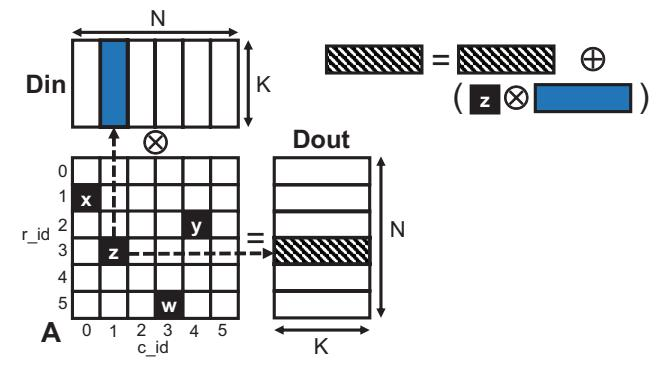
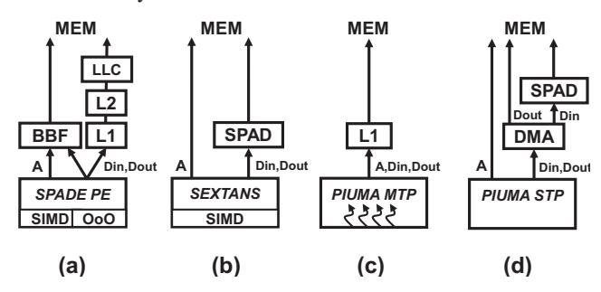
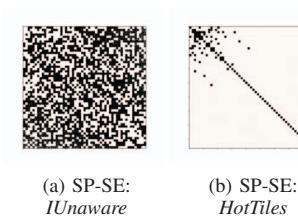

# A. SpMM Basics

SpMM is the multiplication of a sparse input matrix (in our case square)  $A_{NxN}$  with a dense input matrix  $Din_{NxK}$ . The result is a dense output matrix  $Dout_{NxK}$ . In SpMM, each nonzero of A triggers accesses to full rows of the two dense matrices. The rows of the dense matrices that will be accessed for a given nonzero are determined by the nonzero's row index (r\_id) and column index (c\_id). Figure 1 illustrates this for the nonzero with value=z which has r\_id=3 and c\_id=1. This nonzero triggers the access of the row indexed by 1 (c id of z) in Din and the row indexed by 3 (r\_id of z) in Dout. The dense input row is multiplied by the nonzero value z and accumulated on top of the output row in a SIMD manner as shown in the upper right part of Figure 1. It is evident that the structure of the input sparse matrix is highly correlated with the reuse opportunities for Din and Dout. For example, a denser sub-region of A will have more nonzeros in the same column or row, which will trigger more reuse of the same Din or *Dout* row, respectively.

A generalized version of SpMM (gSpMM) over algebraic semirings is presented by Davis et al. [19]. gSpMM has the

Fig. 1: gSpMM operation.

same memory access pattern as SpMM but can have different arithmetic intensity. Similar to SpMM, dense rows indexed by the r\_id and c\_id are accessed for every nonzero. However, the operations involved differ. The multiplication operation is substituted by the generalized multiplicative monoid  $\otimes$ , while the addition operation is substituted by the generalized additive monoid  $\oplus$ . Depending on the computational cost of these monoids compared to their vanilla versions, the arithmetic intensity of the kernel can increase or decrease. The generalized version of SpMM is an important primitive for GNN applications [63].

## B. Processing Elements Used in SpMM Accelerators

In this section, we give a high-level description of the processing elements (PEs) that we use as building elements for our heterogeneous accelerator architectures.

**SPADE:** The SPADE accelerator [24] has lightweight PEs (Figure 2(a)) that are out-of-order (OoO) non-speculative vector engines. The PEs operate on tiles of the sparse matrix. The SPADE architecture includes three levels of caches and a Bypass Buffer (BBF) that bypasses the cache subsystem. The BBF is used to access the sparse matrix A and, depending on A, potentially the Din and/or Dout dense matrices. The out-of-order PE design overlaps many outstanding memory accesses with computation and allows for latency tolerance and scalability.

Fig. 2: PEs used in our SpMM accelerators.

**Sextans:** Sextans [58] is an accelerator for SpMM that relies on streaming accesses for both the dense and sparse structures. It employs large scratchpads in order to utilize the reuse of dense rows (Figure 2(b)). Similar to SPADE PEs, Sextans executes computations in a SIMD manner and

offers high computational throughput. Since Sextans relies on a scratchpad, full dense tiles should be streamed in and out, regardless of whether all their contents are necessary in a given sparse matrix tile. As explained later in Section III-A, PEs employing scratchpads are more effective for relatively denser sparse matrix regions and less effective for sparser ones.

PIUMA: PIUMA [1] is an architecture designed by Intel to address graph analytics challenges at scale. The PIUMA architecture includes two types of pipelines: Multi-Threaded Pipelines (MTPs) and Single-Threaded Pipelines (STPs). The MTPs are designed to tolerate high memory access latencies through fine-grained round-robin multithreading, whereas the STPs are simple in-order cores designed for single-threaded tasks (Figures 2(c) and (d)). Both STPs and MTPs implement the same custom RISC ISA. In addition to the pipelines, the PIUMA architecture includes scratchpads, DMA engines capable of executing arithmetic operations near memory, collective engines, and atomic engines. In this work, we aim to accelerate SpMM by using the various heterogeneous features of the PIUMA architecture.

#### III. MOTIVATION

In this section, we first motivate the need for heterogeneous PEs when processing heterogeneous sparse matrix regions. We then discuss the pitfalls of Intra-Matrix Heterogeneity (IMH)-unaware performance modeling and partitioning in SpMM accelerator architectures with heterogeneous PEs.

#### A. Heterogeneous PEs for Heterogeneous Matrix Regions

We start with a motivating example of how different worker (i.e., PE) types are more appropriate for different sparse matrix regions. We refer to the workers that are better suited for compute-bound, denser regions as *Hot Workers*, while we refer to the workers that are better suited for highly memory-intensive, sparser regions as *Cold Workers*. We also refer to the tiles that are assigned to the corresponding worker type as *Hot* and *Cold*. The main tasks of an SpMM accelerator worker are reading the appropriate elements of the sparse input, dense input, and dense output; executing the SIMD multiply-accumulate (MAC) operation; and writing back the final dense output elements. Naturally, workers of different types execute and overlap these operations in different ways.

As an example, Figure 3 focuses on the task of reading the dense input (Din). Recall that the nonzero c\_ids index the rows of Din that need to be accessed. The figure includes two workers: Worker 1 (cold), which does not store Din in any fast local memory (FLM), and Worker 2 (hot), which uses a scratchpad. We consider two different 3x3 tiles (T1 and T2) of a sparse matrix. T1 is highly sparse and contains only a single nonzero, while T2 is denser and contains five nonzeros.

Figure 3(a) shows the cold worker processing T1. Since the cold worker does not use any FLM and accesses Din on demand, it only issues a memory access for a single Din row during T1 execution. Figure 3(b) shows the hot worker processing T1. The hot worker is forced to transfer from memory to its scratchpad all three Din rows that might

Fig. 3: Number of memory accesses to *Din* for two different sparse matrix tiles and two different worker types.

be accessed during T1 execution. This is because, unlike caches, scratchpads do not include a hardware mechanism for detecting and handling misses. Unfortunately, since only the first Din row is eventually useful, two of the main memory accesses are unnecessary.

Figures 3(c) and 3(d) illustrate the main memory accesses issued by the cold and hot workers, respectively, for the denser tile T2. The cold worker requests one row for every nonzero of the tile. Therefore, it requests a total of five rows from main memory. On the other hand, since the hot worker can reuse data through its scratchpad, it only requests three rows from main memory. Therefore, for T1, the cold worker accesses Din more efficiently than the hot worker while, for T2, the hot worker is better. Thus, we classify T1 as a Cold tile and T2 as a Hot tile.

In practice, accurately predicting which worker type is more suitable for each tile requires taking into account more factors than the number of memory accesses due to the presence of scratchpads. As a second example, consider two workers with scratchpads that have the following differences: (1) the cold worker can overlap memory requests, effectively hiding some of the memory access latency, and (2) the hot worker has higher computational capability. Assuming the same tiles as the ones in Figure 3, there is no difference in the amount of Din memory accesses—both workers access memory three times. For T1, both workers perform three Din memory accesses and one SIMD MAC operation (for nonzero a). For T2, both workers perform three Din memory accesses and five SIMD MAC operations. Thus, one can expect that, for T1, the

Fig. 4: Comparing the performance of IUnaware and homogeneous execution.

cold worker will do better than the hot one, while for T2, the hot worker will likely do better than the cold one (depending on the relative cost of accessing memory and performing a SIMD MAC).

In fact, determining the appropriate worker for each tile is a much more complex task, since one should also consider the Dout reads and writes, the sparse input reads, and the overlapping of the different operations in each PE. In Section IV, we describe our IMH-aware performance models.

## *B. Pitfalls of IMH-unaware Modeling and Partitioning*

In this section, we discuss a method to model and partition sparse matrices without considering IMH and discuss its pitfalls. We refer to the heterogeneous execution that stems from this modeling and partitioning as *IUnaware*.

We start by estimating the performance when processing the whole matrix by a single worker. We use the Roofline model [66], where the execution time is estimated as the maximum of the computation time and the memory access time. The computation time is the number of GFLOPs needed to process the whole matrix divided by the computational throughput of the worker. The number of GFLOPs needed is determined by the number of nonzeros in the matrix and is not affected by the nonzero distribution. The memory access time is the number of memory bytes accessed divided by the memory bandwidth. To estimate the number of memory bytes accessed, we assume a uniform distribution of nonzeros in the matrix, similar to AESPA [54]. With this model, we compute the predicted execution time with a single hot worker (th) and the predicted execution time with a single cold worker (tc).

We can now partition the processing of the matrix among hot and cold workers as follows. Assume we have Nhw hot workers and Ncw cold workers. If we use only the hot workers operating in parallel, the total execution time of processing the matrix can be approximated as Exhw = th/Nhw; if we use only cold workers, it can be approximated as Excw = tc/Ncw. We would like to use all hot and cold workers working in parallel and assign a fraction of the tiles to each type of worker so that the total execution time is minimized. To find the fraction of tiles to be assigned to each type of worker, we use the technique proposed by Huang et al. [34]. Specifically, the fraction of tiles to be assigned to hot workers is:

$$frac\_tile_{hot} = \frac{Ex_{cw}}{Ex_{cw} + Ex_{hw}}$$
 (1)

Then, we distribute tiles randomly to the two worker types while ensuring that the total fraction of tiles assigned to hot workers satisfies Equation 1. This partitioning scheme, which we call IUnaware, resembles the one used by AESPA [54].

In Figure 4, we compare the heterogeneous execution using the IUnaware method to homogeneous executions, in which the whole matrix is assigned to either hot workers or to cold workers. We use ten matrices from SparseSuite [20] (Table V) with a tile size of 8192x8192, and two different heterogeneous architectures that will be described in Section VI. One of the architectures consists of SPADE (cold) and Sextans (hot) workers; the other consists of PIUMA MTPs (cold) and STPs (hot). For SPADE-Sextans, we use 16 cold workers and a single high-performance hot worker (Ncw=16, Nhw=1), while for PIUMA, Ncw=4 and Nhw=2. For each matrix, we present the speedups over the worst-performing homogeneous execution (hot or cold). Note that, for a given matrix, the three bars correspond to different numbers of workers used.

As shown in Figure 4, IUnaware delivers speedups over the worst-performing homogeneous execution for all the matrices and architectures. However, compared to the best-performing homogeneous execution, the results are unimpressive. Specifically, in PIUMA, IUnaware performs about the same as the best-performing homogeneous execution. Further, in SPADE-Sextans, IUnaware performs significantly worse than the bestperforming homogeneous execution. The reason is that, in SPADE-Sextans, the cold workers already have enough compute power, and execution is mostly limited by memory accesses. Adding hot workers in an IMH-unaware manner as in IUnaware increases the pressure on the memory bandwidth without visibly improving the compute time. The result is an increase in execution time. Overall, our results reveal that heterogeneous execution with IMH-unaware modeling and partitioning is undesirable.

To improve the performance of heterogeneous execution, this paper proposes to assign individual tiles to the most appropriate worker type, using IMH awareness, as presented in Sections IV and V. We call this approach *HotTiles*. To see if HotTiles would generate an assignment of tiles to workers that is significantly different than in IUnaware, we generated Figure 5. The figure shows, for SPADE-Sextans (SP-SE), the tiles assigned to hot workers in black and the tiles assigned to cold workers in white, in IUnaware and in HotTiles. The data corresponds to the coPapersCiteseer (*pap*) matrix (Table V) with an 8192x8192 tile size.

The figure shows that IUnaware and HotTiles assign the tiles very differently. IUnaware assigns tiles in a random manner,

Fig. 5: Assignment of tiles to hot workers (in black) and to cold workers (in white) in IUnaware and HotTiles for the *pap* matrix.

with the only constraint that the fraction of hot tiles satisfies Equation 1. HotTiles, instead, exhibits an obvious pattern: tiles classified as hot do cluster around the diagonal and in the upper left corner. Upon inspection, we find that the pap graph, which represents a paper citation network, forms denser sub-communities around the diagonal. This observation agrees with the findings in [5]. HotTiles realizes that these subcommunities are associated with higher arithmetic intensity and assigns them to hot workers. As a result, the percentage of nonzeros assigned to hot workers changes from 52% in IUnaware to 72% in HotTiles.

