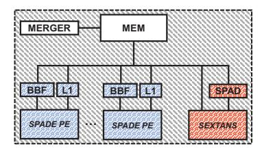
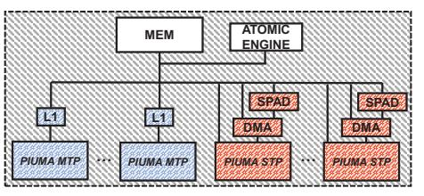

# B. Proposed Heuristic Partitioning

In order to find the optimal solution, an exhaustive search over all the possible combinations of hot and cold tiles would be required. This corresponds to  $2^{N_{tiles}}$  combinations, making the complexity of such an approach prohibitive. To solve the problem approximately, we decompose it into four simpler subproblems, each of which has NlogN complexity, as explained later. Each of the subproblems produces a different partitioning. We then compare the predicted runtime of each of the four partitioning decisions and keep the one with the lowest predicted runtime. The four subproblems produce different heuristic-based partitioning decisions (HotTiles heuristics). They aim at either minimizing the execution time assuming that the system has sufficient memory bandwidth (MinTime heuristics) or at minimizing the bytes read/written from main memory (MinByte heuristics). In addition, they either assume that the heterogeneous workers are operating in parallel (Parallel heuristics) or serially (Serial heuristics).

Each heuristic is expected to work best for different system configurations. For example, when one worker type is already able to saturate the memory bandwidth (which is a shared resource of the architecture), the *Serial* heuristics are expected to perform better. This is because bandwidth contention will limit the performance of *Parallel* heuristics, and the benefit of parallel execution will not outweigh the cost of merging the partial output buffers. In addition, in bandwidth-constrained

configurations, the *MinByte* heuristics are expected to perform better than the *MinTime* heuristics since they reduce main memory accesses. Importantly, the effectiveness of each heuristic also depends on the structure of the input sparse matrix. For the same heterogeneous architecture, different heuristics may work best for different sparse matrices. We summarize the four heuristics in Table II.

TABLE II: HotTiles heuristics

| Heuristic        | Minimizes | Worker execution | Effective when memory bandwidth pressure is |
|------------------|-----------|---------------------|---------------------------------------------------|
| MinTime Parallel | time      | parallel            | low                                               |
| MinTime Serial   | time      | serial              | medium                                            |
| MinByte Parallel | bytes     | parallel            | medium                                            |
| MinByte Serial   | bytes     | serial              | high                                              |

We now discuss how we derive the partitioning decisions by solving the four optimization subproblems (Figure 8). All of the optimization subproblems can be easily solved by sorting the tiles and performing a linear pass over the sorted arrays. For the MinTime heuristics, we create an array that is sorted in increasing difference  $th_i - tc_i$ . Hence, tiles estimated to be executed faster by hot workers are placed first in the array. Then, we initialize a pointer to the beginning of the array, which represents the cutoff point between hot and cold tiles. We call this pointer *cutoff index* (Figure 8). We start moving the cutoff index to the right. Every time we move the cutoff index, the partitioning assignment changes and we calculate the new value of the subproblem optimization objective. If the value has decreased, we continue moving the cutoff index. Otherwise, we roll back to the previous position and the algorithm has converged, producing an approximate partitioning solution. Note that the optimization objective is different for the MinTime Parallel and MinTime Serial heuristics.

To estimate the final execution time of the resulting partitioning we use the formulas in the final column of Figure 8. Of course, the formulas are different for *MinTime Parallel* and *MinTime Serial*. Note that although we do not take into account the system bandwidth effect or the merging cost while deciding on the partitioning, we take these factors into account when determining the predicted runtime.

The procedure for the MinByte heuristics is similar. The only differences are: (1) the tiles are initially sorted in in-

(a) SPADE-Sextans

(b) SPADE-Sextans+PCle

(c) PIUMA

Fig. 9: Heterogeneous architectures evaluated.

creasing difference of  $bh_i-bc_i$  and (2) the optimization subproblem objective is different. Again, the final predicted runtime is different between *MinByte Parallel* and *MinByte Serial* heuristics.

Finally, we compare the predicted runtime of all four heuristics and keep the partitioning from the heuristic that produces the lowest runtime. Note that some architectures support special writes that avoid data races when heterogeneous workers perform read-modify-write operations to the same memory location. Then, there is no need for the output buffers, and  $t_{merge}$  is zero. In such cases, it can be shown that, under our model, there is no benefit in serial operation and, therefore, we only consider the MinTime Parallel and MinByte Parallel heuristics. Overall, the complexity of the proposed heuristics is NlogN: the array sorting is known to have NlogN complexity and the cutoff index placement can be completed in linear time.

#### VI. ARCHITECTURES AND FRAMEWORK

