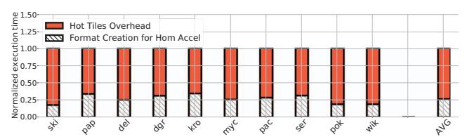

# *C. Preprocessing Cost*

*HotTiles* requires the data preprocessing steps shown in Figure 7: matrix scan, matrix partitioning, and creation of the sparse matrix formats for the two worker types. In reality, code generation for homogeneous accelerators such as SPADE or Sextans also needs the third preprocessing step, except that it is for a single worker type. For example, the input matrix may be stored in matrix market file format [12], and should be converted to the specific format that the accelerator operates on. Hence, when we quantify *HotTiles*' preprocessing overhead, in the third step, we only consider the cost of generating the matrix format for one additional worker type.

The *HotTiles* preprocessing overhead is a one-time cost only. For example, it can be incurred once during GNN training and not affect GNN inference later on, or it can be incurred once and amortized across many SpMM iterations.

Figure 18 shows the normalized execution time of the preprocessing operations on a Xeon host for the PIUMA architecture. We break it down into matrix format creation for a homogeneous accelerator (which is not *HotTiles* specific), and the rest of the preprocessing steps listed above, which we call *Hot Tiles Overhead*. On average, *Hot Tiles Overhead* is 73% of the total preprocessing overhead. This means that *HotTiles* has about four times the preprocessing overhead of a homogeneous accelerator. This is a small overhead, which is amortized over many SpMM iterations. We obtain similar numbers for SPADE-Sextans and SPADE-Sextans+PCIe. Finally, note that, in practice, this overhead is dwarfed by the overhead of reading the matrix from disk. If we include reading the matrix from disk in the preprocessing overhead, it can be shown that *Hot Tiles Overhead* increases the preprocessing overhead by only 6% on average.

Fig. 18: Normalized execution time of the preprocessing operations on a Xeon host for the PIUMA architecture.

