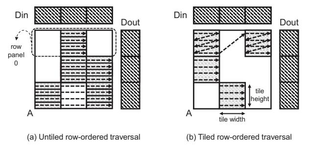

# IV. INTRA MATRIX HETEROGENEITY (IMH) AWARE PERFORMANCE MODELING

The goal of an IMH-aware performance modeling methodology is to extract quantitative metrics that will enable us to determine a suitable worker type for each sparse matrix tile. The sparse matrix should be initially partitioned into tiles of a specific size. If one or both of the worker types use scratchpads to store Din and/or Dout, then the tile width and/or height are set to the largest value that does not overflow any of the worker's scratchpads. For example, in Figure 3, the tile width is set to 3 elements, since any larger value would overflow the hot worker's scratchpad. If none of the worker types uses scratchpads for Din, then the tile width is free and can be set to any value; if none of the worker types uses scratchpads for Dout, the tile height can be set to any value. For a free dimension, the IMH-aware modeling and partitioning methodology can be iteratively applied to find the value that is predicted to deliver the maximum performance. For the rest of this work, tile width and tile height will refer to the tiles of the sparse matrix.

After the tile height and width have been defined, we assume that each tile could be executed by a hot or by a cold worker. Then, we predict the tile's execution time and the number of main memory accesses for each worker type. For the execution time, we assume that each worker is operating independently, without any other worker of the same or different type being active. Thus, when we compute the execution time, we ignore memory bandwidth contention. We account for the computation time, the memory access time (ignoring bandwidth contention), and their overlapping. Specifically, we take the maximum of the two times for workers that overlap memory accesses with computation, and the sum of the two times for workers that do not. We estimate the number of main memory accesses separately in order to account for potential memory bandwidth contention when multiple workers are operating in parallel.

## *A. Estimating the Number of Main Memory Accesses*

When predicting the execution time, we must also estimate the number of main memory accesses. Consider a scenario where a worker type is estimated to be much faster for a given tile, but at the cost of significantly more main memory accesses. This may introduce significant pressure on the memory bandwidth, which is a shared resource of the heterogeneous architecture. For accurate prediction of the execution time, this effect should be taken into account.

The number of main memory accesses depends on the worker's fast local memory (FLM), the ordering of nonzeros in the sparse matrix (i.e., row or column ordered), the sparse matrix compression format (e.g., CSR or COO), and the matrix traversal order (i.e., the order in which the elements of the sparse matrices are accessed). Note that it is not necessary that all workers traverse the sparse matrix in a tiled manner. Depending on the traversal order, a worker may not need to finish processing all the nonzeros of a tile before processing nonzeros from another tile. Figure 6 illustrates untiled (Chart a) and tiled (Chart b) traversals of a sparse matrix with rowordered nonzeros. The arrows represent the order in which a worker processes the nonzeros of its assigned tiles. The matrix traversal order directly impacts the number of accesses to main memory and affects the reuse behavior of Din and Dout.

Fig. 6: Untiled and tiled row-ordered sparse matrix traversal.

We consider four main types of data reuse:

Inter-tile: This reuse occurs when the dense rows needed for a tile have already been brought in to fast local memory by a previous tile. For example, consider a worker that stores Dout in its scratchpad. In this case, the Dout rows requested from memory by the first tile of a row panel (Figure 6) are reused by the rest of the tiles of the row panel.

Intra-tile (stream): This reuse occurs when a worker streams a full tile of dense rows into its scratchpad before the nonzeros of the sparse tile are accessed. The reuse of Din by the hot worker of Figure 3(d) falls into this category. For Din, a full dense tile includes tile width rows, while for Dout, it includes tile height rows.

Intra-tile (demand): This reuse occurs through registers or caches. For example, consider a sparse matrix where the nonzeros are row-ordered (Figure 6). When processing a tile, all the nonzeros with the same r id access the same Dout row. Hence, when a nonzero brings a Dout row to registers or caches, the subsequent nonzeros with the same r id can reuse it. As a result, the total number of Dout rows that will be accessed from memory is equal to the number of unique r ids of the nonzeros in the tile (*tile uniq rids*).

None: This case happens when each nonzero ends up bringing from memory a dense row of the corresponding dense matrix. As an example, consider two nonzeros of A in Figure 6(a) with the same c id and in consecutive rows. If, between processing the first and the second of these two nonzeros, there is a large number of nonzeros to process and the worker does not have a large enough FLM, Din rows will not be reused from the FLM.

The upper part of Table I shows, for the different reuse types, the number of dense rows from Din and Dout accessed from main memory during the processing of a tile of the sparse matrix.

TABLE I: Dense rows (upper subtable) and sparse input data items (bottom subtable) accessed from main memory during the processing of a tile under different reuse types and sparse formats. Tile refers to sparse matrix tiles.

| Reuse Type             | Dense Input Rows Accessed From Memory     | Dense Output Rows Accessed From Memory |  |  |
|------------------------|-------------------------------------------------|----------------------------------------------|--|--|
| Inter-tile             | 0                                               | 0                                            |  |  |
| Intra-tile (stream) | tile width                                      | tile height                                  |  |  |
| Intra-tile (demand) | tile uniq cids                                  | tile uniq rids                               |  |  |
| None                   | tile nnzs                                       | tile nnzs                                    |  |  |
| Sparse Format          | Sparse Input Data Items Accessed From Memory |                                              |  |  |
| COO-like               | tile nnzs * 3                                   |                                              |  |  |
| CSR-like               | tile height + tile nnzs * 2                     |                                              |  |  |

The bottom part of Table I shows, for two sparse formats, the number of sparse input data items accessed from main memory during the processing of a tile of the sparse matrix. By data item, we mean, for example, the r id, c id, or val of a nonzero element in a COO-like format. For COO-like formats, 3 ∗ tile nnzs data items are accessed per tile, since each nonzero is represented with an r id, c id, and val. For CSR-like formats, the r ids array is substituted by an array holding the begin offsets of each row in the c ids and vals arrays. Since each tile has tile height rows, a total of 2 ∗ tile nnzs + tile height data items are accessed per tile.

We refer to the total number of bytes accessed from main memory for tile i as bhi or bci, depending on whether the tile is processed by a hot or a cold worker, respectively. Naturally, these bytes are the sum of the bytes from Din, Dout, and A.

## *B. Estimating Execution Time*

To estimate the execution time, we model the time needed for each worker to perform all its five *tasks*: read the sparse input; read the dense input; read the dense output; execute the SIMD multiply-accumulate operation; and write back the dense output. For each nonzero, a SIMD multiply and accumulate operation is performed on rows with K elements (Section II). Thus, the FLOPs associated with each sparse matrix tile are 2 ∗ K ∗ tile nnzs. By dividing these FLOPs by the computational throughput of a given worker, we can get an estimate of the time needed by that worker to perform the computation. To estimate the time needed for the memory accesses, we multiply the number of bytes read/written from main memory in each task by a parameter that we call *visible latency per byte* (vis lat). This parameter captures the latency hiding that a worker type is capable of. Quantifying this parameter analytically is challenging. Hence, we determine it in a data-driven manner by measuring the runtime of homogeneous executions. More details about how vis lat is obtained are given in Section VI-B.

To estimate the final tile execution time, we sum-up the estimated times of the five tasks, while accounting for any overlap of the tasks. For example, for a worker that overlaps all the tasks, the execution time is given by the longest task, while for a worker that does not overlap any task, the execution time is given by the sum of the times of all the tasks. Workers may overlap only some of these tasks.

In summary, the main novelty of our IMH-aware modeling approach over IUnaware is that we model the execution time of each individual tile, while IUnaware only models the execution time of the whole matrix. Modeling at tile granularity enables HotTiles to capture the unique sparsity pattern of the input matrix. This type of modeling requires taking into account the different inter- and intra-tile reuse types of Table I. An additional novelty of HotTiles is the data-driven modeling of memory access latency hiding through the vis lat parameter.

## *C. Modeling Limitations*

In this subsection, we discuss two limitations of our modeling methodology. The first one results from the fact that, without knowing the final assignment of tiles to worker types (which is decided in Section V), it is impossible to determine the reuse types of Din and Dout in certain tiles. To understand this limitation, note that our assignment of tiles to workers in Section V takes all the tiles in a row panel and assigns all the tiles deemed cold to a *single* cold worker, and all the tiles deemed hot to a *single* hot worker. Moreover, the hot worker can reuse state across its tiles without caring about the potentially interleaved cold tiles in the same row panel assigned to the cold worker (and vice-versa).

Keeping this in mind, we give two examples of this limitation. First, consider a worker that streams Dout to its scratchpad and implements a tiled row-ordered traversal (Figure 6(b)). The reuse type for the first tile assigned to it in a row panel is *Intra-tile (stream)*, while the reuse type for the remaining tiles assigned to it from the row panel is *Intertile*. However, without knowing the final assignment of tiles to worker types, it is impossible to determine whether a given tile is the first one of its type in the row panel or not. In our algorithm, we assume maximum reuse and, therefore, assume that a tile is never the first one of its type in the row panel.

In a second example, consider a worker that uses an untiled row-ordered sparse matrix *traversal* such as in Figure 6(a). In

Fig. 7: HotTiles preprocessing steps.

this case, the tile where a nonzero with a given r\_id appears for the first time in the row has *Intra-tile* (*demand*) reuse for *Dout* for this r\_id. All other tiles where a nonzero with this r\_id appears have *Inter-tile* reuse. Again, without knowing the final assignment of tiles to worker types, it is impossible to determine whether a tile is the first one of its type with a nonzero with this r\_id or not. As before, we assume maximum reuse and, therefore, assume that the tile is never the first tile of its type with a nonzero with this r\_id.

In the tile assignment of Section V, we initially use this maximum reuse assumption. After that, when we know the final assignment of tiles to worker types, we readjust the reuse types if needed when predicting the final execution time. It is evident that, since the tile assignment is done based on an imprecise model, the quality of the derived solution is slightly degraded.

The second limitation of our approach is that it disregards any reuse through caches. Caches could help exploit two types of reuse in Table I: Intra-tile (demand) and Inter-tile. However, since caching effects are hard to model analytically, we make this pessimistic assumption.

Despite our assumptions of maximum reuse and no reuse through caches, our evaluation (Section VIII) suggests that our modeling approach has low prediction error in the majority of cases.

