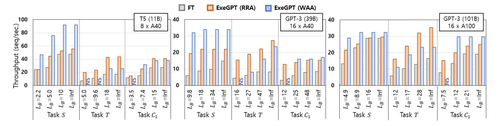
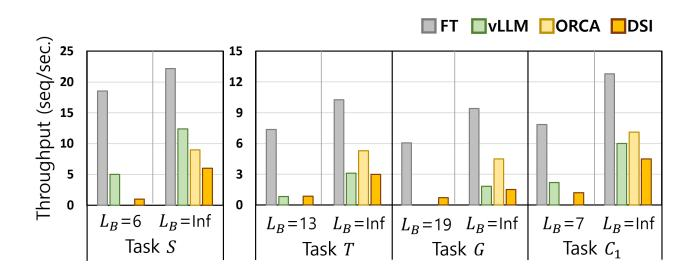

# 6 Simulation with Sequence Distribution

We implemented XSimulator, an execution simulator that utilizes the probability distribution of input and output sequence lengths. It incorporates profiling results to accurately estimate the execution times of encoding/decoding layers by evaluating a single encoder/decoder with all possible parallel configurations of the four variables, i.e., batch sizes, decoder micro-batches, partial tensor parallelism, and encoding frequency.

As encoding and decoding are decoupled in our approach, queries from different encoding iterations may be decoded in a same batch. Hence, those queries in the batch are, on average, completed at different decoding iterations. We take this into account to maintain a consistent average encoding/decoding workload and achieve accurate scheduling results.

For both RRA and WAA Schedule, we assume probability distributions  $P_E(S)$  and  $P_D(S)$  for input and output sequence lengths, respectively.  $P_E(S)$  and  $P_D(S)$  may or may not be correlated, which we discuss with public datasets in our evaluation, and we assume they are uncorrelated in our simulator. When input and output length are correlated, we can introduce randomization in the input lengths across different batches to mitigate potential biases by varying input lengths. Simulating RRA Schedule. The simulator takes as input the encoder batch size  $B_E$ , the encoding frequency (i.e., the number of decoding iterations  $N_D$  between encoding), and the sequence distributions  $P_E(S)$  and  $P_D(S)$ . Using  $P_D(S)$ , we compute the distribution  $P_D(U)$ , the probability of completing the decoding of a query at U'th iteration after the previous encoding phase ( $U \le N_D$ , details described below). It then sets the encoding batch size  $B_E$  to  $B_D \sum_U P_D(U)$ , which is the expected number of completed queries after

 $N_D$  decoding iterations. This ensures that the encoding and decoding batch sizes are consistent across executions. Using the calculated batch sizes, the simulator estimates the expected encoding and decoding times of each pipeline stage accurately.

To compute  $P_D(U)$ , we first consider the conditional distribution  $P_D(U|S=s)$ , which represents the probability of completing the decoding of a query in U iterations after the most recent encoding phase, given that the query generates a sequence of length S=s.  $P_D(U|S)$  is calculated as follows.

$$P_D(U|S) = \begin{cases} 1, & \text{if } U = S \\ 0, & \text{otherwise} \end{cases}, & \text{if } S \leq N_D \\ \frac{1}{\lceil \frac{S}{N_D} \rceil}, & \text{if } U = 1 + (S - 1 \bmod N_D) \\ 0, & \text{otherwise} \end{cases}, & \text{if } S > N_D \end{cases}$$

In the above, decoding a sequence of length  $S>N_D$  requires  $\lceil \frac{S}{N_D} \rceil$  decoding phases. Thus, the probability of completing the decoding in U iterations during any specific decoding phase is calculated as  $\frac{1}{\lceil \frac{S}{N_D} \rceil}$ , with the complement representing the probability of not completing the decoding during that phase.

 $P_D(U)$  is calculated as follows:  $P_D(U) = \sum_S P_D(U|S) P_D(S)$ . Using  $P_D(U)$ , we set the decoding batch size  $B_D$  to  $\frac{B_E}{\sum_U P_D(U)}$ . We then use  $B_E$  and  $P_E(S)$  to estimate the expected encoding workload, and  $B_D$  and  $P_D(U)$  to compute the expected decoding workload and their corresponding execution times. With these calculated times, the simulator creates an execution timeline and estimate the throughput and latency.

Simulating WAA Schedule: This is similar to the RRA case with encoder running once after each decoding iteration. As  $N_D = 1$ , the probability of query completion at any decoding iteration in WAA is equivalent. Thus, we can simply use the average input and output sequence length ( $S_E$  and  $S_D$ , respectively) to compute the workload sizes. We set the decoding batch size  $B_D$  to be  $B_E \cdot S_D$  for given  $B_E$  to ensure consistent batch sizes across executions. Then the average workload sizes ( $B_E \cdot S_E$  for encoding and  $B_D$  for decoding) are used to estimate the total encoding and decoding times with the profile results. We allocate GPUs proportional to those times, as explained in Section 4. The computed execution times, including buffer time for dynamic adjustments, are used to simulate the timeline and estimate throughput and latency.

#### 7 Evaluation

In this section, we present the evaluation of our prototype ExeGPT system. To evaluate the effectiveness of our scheduling strategies and constraint-aware scheduling algorithm, we conducted a comprehensive evaluation using six different LLM configurations across twenty scenarios. Moreover, we compared the evaluation results with those of FasterTransformer, DeepSpeed Inference (DSI), ORCA, and vLLM, which

Table 1. Evaluated Models and Configurations

| Model | # Params | # Layers | Hidden Size | # Atten. Head |
|-------|----------|----------|-------------|---------------|
| T5    | 11B      | 48       | 1024        | 128           |
| OPT   | 13B      | 40       | 5120        | 40            |
|       | 39B      | 48       | 8192        | 64            |
|       | 101B     | 80       | 10240       | 80            |
| GPT-3 | 175B     | 96       | 12288       | 96            |
|       | 341B     | 120      | 15360       | 120           |

are state-of-the-art LLM inference systems. In the following sections, we describe our evaluation methodology and present the evaluation results.

#### 7.1 Evaluation Methodology

Evaluated Models and System Settings. The existing LLMs are primarily based on Transformer structures. Some models, such as T5 [28] and UL2 [38], consist of both encoders and decoders, while others, such as GPT-3 [5] and LaMDA [39], are decoder-only models. To evaluate how our proposed techniques affect performance on different LLM configurations, we conducted experiments using representative models: T5, OPT [52], and GPT-3, covering both encoderdecoder and decoder-only models. We evaluated small to large versions of these models in half-precision (FP16) with various configurations as shown in Table 1, which covers most model configurations in the ORCA and DSI papers [1, 47]. Note that recent models like Gopher [27], LLaMA [40, 41] and Alpaca [36] are either structurally equivalent to these models or very similar, with any minor differences resulting in the same amount of computation [33].

We executed the inference of these models on two GPU clusters, the A40 cluster and A100 cluster as shown in Table 2. The A40 cluster is a private cluster having six machines, each with eight A40 GPUs with 48GB of memory, for a total of 48 GPUs, connected via PCIe 4.0×16. The machines are connected via 100Gb Infiniband network. The A100 cluster consists of two NDm A100 v4 VMs on the Microsoft Azure cloud, each with eight A100 GPUs with 80GB of memory, for a total of 16 GPUs, connected via NVLink 3.0. The VMs are connected via Infiniband with 1.6Tb bandwidth between VMs using 8×200Gbp Mellanox HDR Infiniband adapters.

Table 2 also shows the LLM configurations and the subclusters on which the models are executed. We tested the GPT-3 175B model on both the A40 and A100 clusters, as it is widely studied in NLP and other domains. While a subset of the models in the table can manage running with half the number of GPUs we used, doing so results in very long latencies that make it infeasible to balance latency and throughput. Moreover, running on the smaller GPU clusters requires the use of very small batch sizes, which results in poor resource utilization and low computational throughput.

Table 2. GPU Clusters and Deployed LLMs

| GPU (Mem)   | Cluster Size (per node×# node) | Interconn. (Intra/Inter) | Model: # GPUs                                                                                   |
|-------------|-----------------------------------|-----------------------------|-------------------------------------------------------------------------------------------------|
| A100 (80GB) | 16 (8×2)                       | NVLink/Infini.              | GPT-3 (101B): 16 GPT-3 (175B): 16                                                            |
| A40 (48GB)  | 48 (8×6)                       | PCIe 4.0/Infini.            | T5 (11B): 8 OPT (13B): 4 GPT-3 (39B): 16 GPT-3 (175B): 32 GPT-3 (341B): 48 |

Baseline and Other Compared Systems. As the baseline for the evaluation, we used FasterTransformer (FT) [23], an efficient system for LLM inference. FT supports pipeline and tensor parallel execution, as well as their combinations. For our evaluation of FT, we used the configuration that maximizes tensor parallelism for GPUs on the same machine. For example, when running with eight GPUs on one machine, we run only with tensor parallelism, and with sixteen GPUs on two machines, we run inference with two pipeline stages. This setting for FT is the same as that used in ORCA [47].

We also compared the performance of ExeGPT with that of DSI [1], ORCA [47], and vLLM [15]. For these systems, we used the same parallel configuration as FT, maximizing tensor parallelism for GPUs on the same machine, which is the setting that the authors used for their evaluation. For the evaluation of ORCA we used vLLM's iteration-level scheduling mode, as ORCA is proprietary system and not publicly available. In its iteration-level schedule mode, vLLM executes only one input encoding with other decoding computations in a batch, minimizing workload variance across batches and maximizing inference throughput. With vLLM's paging mechanism for efficient key/value cache management and early-termination of completed queries, vLLM's iterationlevel schedule mode performs equivalently to ORCA's execution.

Evaluation Scenarios. We evaluated our techniques with four representative NLP tasks, namely, summarization, translation, code generation, and conversational question answering, as shown in Table 3. Summarization is the task of generating a shorter version of the input text. Translation is the task of converting a sequence of text from one language to another. Code generation synthesizes program code from a natural language description of it. Conversational question answering requires understanding and responding to user questions in a conversational manner with various lengths of context.

To determine the sequence distribution for the tasks, we reviewed existing NLP datasets [2, 3, 6, 7, 12, 13, 18, 29, 30, 32, 50, 53]. After careful examination, we found out that a truncated normal distribution (truncated below zero) provides a more accurate representation of the datasets compared to

Figure 6. Throughput of ExeGPT and FT with four latency bounds () in seconds. is for generating 99ℎ pctl-length sequence.

normal, log-normal, or skewed normal distributions. Therefore, we generated input/output sequences with truncated normal distribution using average and variance parameters that reflect those of the datasets corresponding to the tasks. In addition, we investigated the correlation of input and output lengths in these datasets. In all tasks except the translation task, the correlation between input and output sequence lengths is low, its (absolute) coefficient value ranging 0.08– 0.21. For the translation task, the correlation is high (0.57– 0.94), for which we can apply input length randomization across batches.

With the sequence distribution for the tasks, we generate input and output sequences for the evaluation. To enforce the sequence lengths, we made the decoding iterations continue for the given sequence lengths without emitting the endof-sequence token, similar to the evaluation of ORCA. We performed majority of the evaluation with synthesized data in this way because existing NLP datasets are not designed to evaluate LLM inference systems. However, for a subset of our experiments, we also evaluate performance with realworld datasets and report the results for a comprehensive evaluation.

To account for diverse service conditions and SLAs, we used four latency constraints for each task, ranging from a tight bound to a more relaxed one. To select latency constraints, we first ran the LLMs on FT with minimum to maximum batch sizes in multiples of four. We then used the bottom 10%, 30%, and 70% of latencies, as well as infinity, which varied for different models and tasks. We specify these bounds for all experiments. When selecting the bounds, we used the sequence length at the 99ℎ percentile (pctl in short) in the distribution. Generally, this corresponds to the longest response time at the 99ℎ pctl. For each system, we determined scheduling parameters to ensure that the worst-case execution satisfies the latency constraint. That is, for FT and DSI, which do not apply early termination of completed queries, we applied the latency bound to generating an output sequence of maximum length. For ORCA, vLLM, and

Table 3. Evaluated NLP Tasks and Configurations

| Task                    |          | Task ID Input Length (Avg., Std., Max) | Output Length (Avg., Std., 99𝑡ℎ, Max)                    |
|-------------------------|----------|-------------------------------------------|-------------------------------------------------------------|
| Summarization           | 𝑆        | (256, 252, 512)                           | (32, 13, 63, 80)                                            |
| Translation             | 𝑇        | (128, 81, 256)                            | (128, 68, 292, 320)                                         |
| Code Generation         | 𝐺        | (64, 23, 128)                             | (192, 93, 417, 480)                                         |
| Conversational Q & A | 𝐶1 𝐶2 | (256, 115, 512)                           | (64, 30, 137, 160) (512, 252, 1024) (256, 134, 579, 640) |

ExeGPT, we applied the same latency bound to generating the sequence length at the 99ℎ pctl in the distribution.

### 7.2 Performance Comparison of Existing Systems

We first evaluated the performance of existing systems: FT, DSI, ORCA, and vLLM. Because DSI and vLLM (their public versions) only support tensor parallelism, but not pipeline parallelism, we conducted the evaluation using a small LLM (OPT 13B) with four A40 GPUs.

Figure 7 shows the evaluation results. We first noticed that FT's performance is higher than those of DSI, vLLM, and ORCA for all tasks and latency bounds. While vLLM runs with larger batch sizes than FT, its executor is implemented in Python and certain execution overhead that is not masked by GPU kernels degrades its performance. Moreover, while ORCA's iteration-level scheduling improves the throughput

Figure 7. Throughput comparison of LLM inference systems.

Figure 8. Throughput of ExeGPT and FT with four latency bounds () in seconds. is for generating 99ℎ pctl-length sequence.

at times, it also increases overall latency, making it hard to meet latency bounds. With FT outperforming existing systems, we subsequently compare ExeGPT to FT for further evaluation.

We conducted two separate sets of evaluations, one with small to mid-sized LLMs (11B–101B) and another with larger LLMs (101B–341B). This is because of different performance trade-off of RRA and WAA with small and large LLMs. Moreover, some tasks are known to work well with small LLMs while others require larger ones [5, 8, 26, 28]. This section presents the evaluation results with small to mid-sized LLMs; the results with larger LLMs are shown in the next section.

