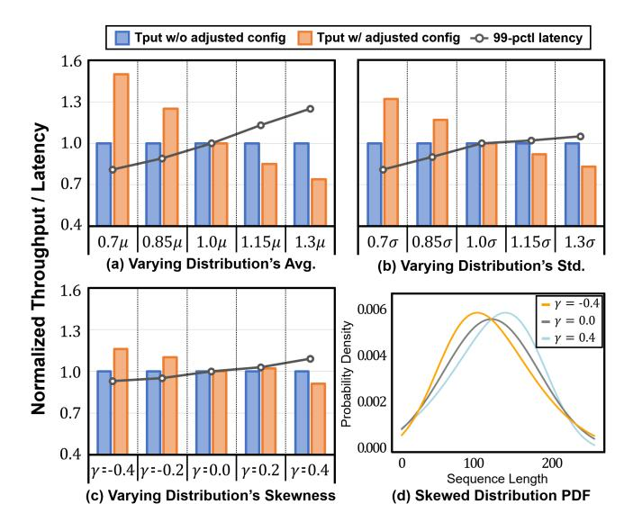

# 7.7 Cost of Profiling, Scheduling, and (Re-)Deploying

To run inference, we must undergo the profiling and scheduling steps, and thus, we evaluate the cost of these steps. During profiling, we measure the execution times of a single encoder/decoder with varying the control variables. This step is done once per LLM and GPU cluster, while the scheduling needs to be executed when the sequence distribution changes to ensure the latency bound is satisfied. For the evaluated models the profiling takes less than two hours (on AMD EPYC 7313). Scheduling for the models takes three seconds to two minutes for RRA and one to five minutes for WAA. In comparison, scheduling with exhaustive search needs a minimum of five hours and can extend to an entire day.

Deploying a model instance according to the selected schedule involves loading the model from SSD to GPU memory in parallel. In the case of distribution changes, re-deploying the model, to adjust resource allocation accordingly, requires reloading the model either from CPU DRAM or SSD. We

Figure 11. Performance of WAA with changing sequence distribution. The line plot is 99ℎ pctl latency, and blue bars are throughput for the execution with the same schedule. Orange bars are the throughput of the optimized execution for each changed distribution.

Table 4. The cost of loading LLMs from SSD or CPU's DRAM

| Model | #GPUs | Loading from DRAM | Loading from SSD |
|-------|-------|-------------------|------------------|
| 39B   | 16    | 0.9 secs.         | 2.1 secs.        |
| 101B  | 32    | 1.3 secs.         | 7.1 secs.        |
| 175B  | 32    | 2.1 secs.         | 11.9 secs.       |
| 341B  | 48    | 3.5 secs.         | 15.1 secs.       |

measured the costs of deploying and re-deploying and summarized the results in Table 4. The deployment cost, i.e., loading the model from SSD, ranges from 2.1 to 15.1 seconds across small to large LLMs. Re-deploying the model to load the model from CPU's DRAM takes 0.9 to 3.5 seconds. We consider these re-deployment costs to be reasonably modest in real-world LLM serving scenarios.

#### 7.8 Monotonicity and Throughput/Latency Trade-off

To assess the monotonicity, we run experiments with T5 and GPT-3 (39B and 101B) and with all tasks. In the experiments, we adjusted the variables individually, observing the corresponding changes in throughput and latency. That is, we swept through a range of values for a variable while keeping the others fixed, and repeated the measurement for all combinations of those other variables. Then we quantify the fraction of the points in the range that the monotonicity property holds.

Table 5 shows the results for GPT-3 39B. We noted that the control variables generally exhibit monotonic behavior

1The skewness in skew normal distribution is limited to interval (-1, 1).

Table 5. Percentage of non-monotonic points\*

| Task | Tol. † | RRA        |            | WAA        |            |             |
|------|-------------------|------------|------------|------------|------------|-------------|
|      |                   | $B_E$      | $N_D$      | $B_E$      | TP         | $B_{m}$     |
|      | 2%                | (0.6, 2.3) | (0.0, 0.0) | (0.0, 0.0) | (0.0, 0.0) | (0.8, 0.0)  |
| S    | 5%                | (0.6, 0.3) | (0.0, 0.0) | (0.0, 0.0) | (0.0, 0.0) | (0.5, 0.0)  |
|      | 10%               | (0.3, 0.0) | (0.0, 0.0) | (0.0, 0.0) | (0.0, 0.0) | (0.4, 0.0)  |
| Т    | 2%                | (0.2, 0.1) | (0.0, 0.0) | (0.1, 0.0) | (1.2, 0.0) | (10.9, 0.0) |
|      | 5%                | (0.2, 0.0) | (0.0, 0.0) | (0.0, 0.0) | (0.8, 0.0) | (10.6, 0.0) |
|      | 10%               | (0.2, 0.0) | (0.0, 0.0) | (0.0, 0.0) | (0.4, 0.0) | (10.4, 0.0) |

 $\ast$  Each cell represents (Latency, Throughput).

Table 6. Selected Schedule and the Optimal Configurations

| $L_B$              | Selected Schedule | Control Variables              | Latency (sec.) | Tput (seq./sec.) |
|--------------------|----------------------|--------------------------------|----------------|------------------|
| 3.1                | WAA                  | $B_E$ =4, $T_P$ =2             | 3.01           | 22.41            |
| 5.9                | WAA                  | $B_E$ =10, $T_P$ =2            | 4.11           | 23.76            |
| 11.5               | RRA                  | $B_E$ =52, $N_D$ =13, $T_P$ =4 | 10.23          | 25.23            |
| $\overline{Inf}$ . | RRA                  | $B_E$ =49, $N_D$ =7, $T_P$ =4  | 16.87          | 26.15            |

with throughput and latency. With 5% tolerance values, 97% of points in total (including all control variables in RRA and WAA) show monotonicity in throughput, and 96% in latency. Decoder micro-batch ( $B_m$ ) has slightly more non-monotonic points for task T due to its potential interference with partial tensor-parallelism. The two control variables, when used in combination, may significantly reduce the workload to a very small size, resulting in non-monotonic execution latencies. After excluding those points, less than 5% of its remaining points show a non-monotonic behavior.

Case Study. We looked into throughput/latency trade-off of our scheduling for different latency bounds with OPT 13B and task S. Table 6 summarizes the selected values of the control variables and schedules with four different latency bounds. As the bound  $L_B$  relaxes, different control variables are adjusted: first, encoder batch size  $B_E$  increases, then the schedule shifts from WAA to RRA. When  $L_B$  approaches infinity, encoding frequency doubles (or  $N_D$  halves). The shortest  $L_B$  yields 80% of the maximum throughput demonstrating efficient trade-off by our scheduler.

