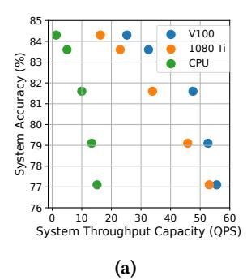
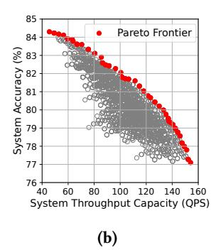

# 1 Introduction

The growing popularity of machine learning (ML) has led to the development of inference-serving systems1 , where cloud providers execute pre-trained ML models on their infrastructure to provide fast and accurate responses to inference queries. In such a system, the provider guarantees certain service level objectives (SLOs) to users in terms of latency deadlines. Meanwhile, the provider wants to maximize their hardware utilization by increasing throughput in order to serve as many queries as possible in a short amount of time.

Recent years have seen considerable interest in developing high-throughput inference-serving systems. Prior work has focused on enhancing system throughput through techniques such as multi-tenancy [28, 35], batching [8, 9, 36], and low-level optimizations [14, 42, 46]. While these optimizations are effective, they primarily rely on hardware scaling, i.e., adding more devices or using more powerful accelerators, to accommodate higher query demands (in terms of queries per second or QPS). However, hardware scaling may not be feasible for private clouds owned by enterprises or edge clusters due to the limited availability of hardware resources. Purchasing and maintaining more devices to cater to peak demands can be expensive and cost-ineffective.

To address the limitations of hardware scaling, this paper focuses on an orthogonal perspective, accuracy scaling, which adapts model accuracy instead of hardware resources to meet varying query demands. Accuracy scaling is motivated by the fact that ML models can offer varying degrees of accuracy depending on the time spent computing the answer. Less time spent on computation leads to less accurate

1 Inference-serving systems have also been referred to as model-serving systems in the literature.

results but higher throughput. When the demand is high, an inference-serving system can serve queries using less accurate model variants to avoid SLO violations. Similarly, when the demand drops, it can serve queries using more accurate model variants to improve accuracy. These different accuracy levels are provided by different variants of deep neural networks (DNNs), which can be created through existing compression techniques such as quantization [39] and pruning [6], or as part of the neural network architecture design. The creation of these variants is complementary to our work. Throughout the paper, we use the term "model variants" to refer to DNN models with varying accuracy and performance profiles.

In this paper, our goal is to build an inference-serving system on a heterogeneous cluster via accuracy scaling such that the system can serve varying query demands with high system accuracy. System accuracy refers to the averaged accuracy of queries that are served by the system. We assume that every query prefers the most accurate model variant if resource permits, but is willing to accept lower accuracy in exchange for timely response when resources are tight. This assumption is practical in many cases such as recommendation systems and real-time applications where a timely response can be more critical than an accurate yet sluggish response, or even worse, dropped requests [13, 23].

To achieve this goal, we need to address two challenges raised by accuracy scaling when managing resources on an inference-serving system. The first challenge is to determine the right amount of accuracy scaling to serve a target query demand with high system accuracy. The system can overshoot the query demand by hosting less accurate model variants but introduce unnecessary accuracy drops to end-users. On the other hand, if the system undershoots the target query demand by hosting more accurate model variants, users will experience SLO timeouts.

To address the first challenge, our key insight is that identifying the right amount of scaling requires jointly optimizing three sub-problems when allocating system resources. Missing any of these sub-problems results in a sub-optimal solution that leads to high SLO violations and/or high accuracy loss. The first sub-problem, model selection, aims to choose the appropriate set of model variants and the number of replicas for each model variant. As the accuracy-throughput trade-off for a model variant varies across different device types, the second sub-problem, model placement, determines the placement of each selected model variant on a particular device of a heterogeneous cluster. In addition, an inferenceserving system is usually shared by multiple applications, each corresponding to a query type. The last sub-problem query assignment specifies the percentage of queries from each query type that can be assigned to a model variant hosted on a particular device.

Based on this insight, we formulate the problem using a mixed integer linear programming (MILP) framework to derive the optimal resource allocation given a target query demand. Since the target query demand changes over time, it is necessary to keep adjusting the plan accordingly. Ideally, each query arrival could trigger the MILP solver; however, in this case, solving the MILP problem would lie in the critical path of query execution, introducing significant run-time overhead. This motivates us to decouple the control path that manages resources from the data path that serves queries. We trigger the MILP solver in response to macro-scale changes in query demand over a period of time to ensure that the system has sufficient capacity to serve incoming queries. We then rely on per-device query execution to handle the micro-scale variations in the arrival times of queries.

This raises the second challenge: how to adaptively batch queries on each device to handle variations in query arrival times such that SLO violations are minimized? Query execution on individual devices typically batches multiple inference queries together to improve throughput. When queries arrive at a uniform rate, it is easy to determine a fixed batch size that can maximize throughput without incurring SLO violations. However, when there is variation in the query inter-arrival times, batching needs to be adaptive due to two reasons: (i) the number of queries arriving per second may change over time, requiring a different batch size, and (ii) delaying query execution slightly can improve throughput and absorb micro-scale query arrival variations. We present a non-work-conserving approach to adaptive batching that can handle micro-scale query load fluctuations effectively without requiring any changes to the underlying ML framework. It can delay requests momentarily if it results in higher throughput and dynamically determines suitable batch sizes based on the queue status and query latency requirements.

Based on the proposed techniques, we build an inferenceserving system called Proteus2 . We evaluate Proteus against three state-of-the-art inference-serving systems, INFaaS [35], Sommelier [17], and Clipper [9], using query workloads derived from a real-world Twitter trace and synthetic traces. Our experiments show that compared to baselines that do not scale accuracy, Proteus improves system throughput by 60% and reduces SLO violations by 10× due to accuracy scaling; and compared to baselines that also scale accuracy, Proteus minimizes accuracy drop by up to 3.2× and reduces SLO violations by up to 4.3× because of better resource allocation and batching algorithms.

Our contributions. We make the following key contributions.

• We present a theoretical framework for resource management of an inference-serving system that exploits accuracy scaling to ensure that the system throughput is sufficient to meet the query demand while maximizing system accuracy.

2Proteus is named after a Greek god of the same name who had the ability to change shape and form to avoid capture by the enemy.

**Figure 1.** Illustration on how different resource allocation configurations affect system throughput capacity and accuracy. Models are EfficientNet variants and batch size is one. (a) Accuracy-throughput trade-off on three different devices for EfficientNet variants. (b) Accuracy-throughput trade-offs for all possible configurations with five EfficientNet variants and five devices.

- We propose a proactive adaptive batching algorithm that can handle query load fluctuations effectively via a non-work-conserving approach. The algorithm is easy to implement without requiring modifications to the underlying ML framework and reduces SLO violations by up to 4× compared to baselines.
- We design Proteus, a high-throughput inference-serving system with accuracy scaling. Proteus decouples the control and data paths of inference-serving to perform optimal resource allocation asynchronously from query serving. To the best of our knowledge, Proteus is the first system to study accuracy scaling in a cluster setting.
- We evaluate Proteus on a production system that is currently used by actual users within a large enterprise and perform trace-based simulations of the system. We show that Proteus reduces the accuracy drop by up to 3.2× and SLO violations by 2.8-10× compared to state-of-the-art baselines while meeting throughput requirements. We also show that our simulation results closely match the results from our production system.

