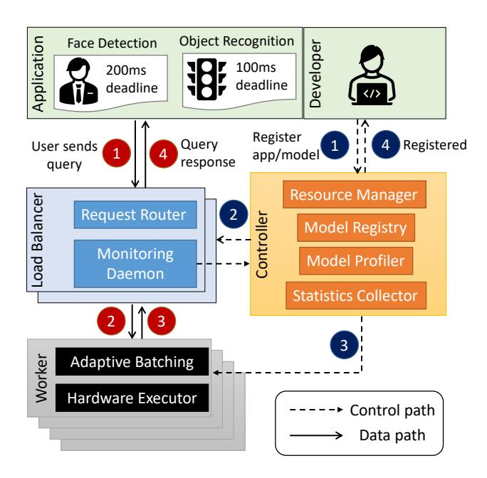

# 3 Overview of Proteus

We present Proteus, a high-throughput inference-serving system that leverages accuracy scaling to handle varying query demands. This section presents an overview of the system architecture while Sections 4 and 5 will elaborate on the core modules of Proteus.

Figure 2 illustrates the overall system architecture of Proteus. It has three major components: Controller, Load Balancers, and Workers. These components are involved differently in two types of interactions with the system.

The first type of interaction is for developers to register an application and its model variants. The pipeline is marked with dotted arrows in Figure 2. After the controller

Figure 2. System architecture of Proteus.

receives an application register command, it creates a new load balancer for that application and sets up workers to serve queries from that application. Proteus will automatically manage which model variant to use to serve each query and where to place the model variants. This model-less interface is similar to the recent work, INFaaS [35]. Our core system design contribution lies in how resources are managed when serving queries, i.e., the second type of interaction described next.

The second type of interaction is for registered applications to send inference queries and receive query responses. The data path is marked with solid arrows in Figure 2. A query from a registered application is directly sent to the application's assigned load balancer. The load balancer then routes the query to an appropriate model variant that is hosted on a worker machine for query execution. Proteus responds to the application with the inference results. Since queries from each application are handled by its specific load balancer, Proteus avoids a single-point performance bottleneck when supporting many applications. The separation of the controller and load balancer is a design choice that makes Proteus more flexible and robust, allowing it to perform resource allocation without being on the critical path to inference-serving.

**Controller.** The controller receives the registration of the application and model variants and confirms the registration status. It has four modules: (1) a *resource manager* that determines the resource allocation strategy including model selection, placement, and query assignment when the query demands change, (2) a *model registry* that handles application and model variant registration, (3) a *model profiler* that profiles the performance of each model variant on different types of devices, and (4) a *statistics collector* that collects

query demand statistics from all load balancers, used to determine when to re-allocate resources. If re-allocation is needed. these statistics are used as inputs to the resource manager to derive a new optimal resource allocation configuration. Moreover, the resource manager also consults the model registry and model profiler to make re-allocation decisions, in order to identify model variants that can meet demand with high accuracy. The model profiler is invoked every time new models are registered, as well as periodically to poll the inference latency of currently hosted model variants running on the workers, and stores the profiling information in an in-memory key-value store, keyed by the 3-tuple (model variant, device type, batch size) to ensure a O(1) lookup time. Load Balancer. A load balancer receives inference queries from its designated application and responds to them with model execution results. Load balancers for different registered applications could be distributed across multiple machines to avoid network congestion. Each load balancer includes two modules: (1) a request router that dispatches queries to model variants hosted on worker machines based on a query assignment policy, and (2) a monitoring daemon that monitors query demands at runtime and reports the statistics to the controller periodically. The query assignment policy is determined by the controller. If the load balancer detects a burst of requests or overload on any of its workers, it calls the controller to re-allocate resources. There is one load balancer for each query type (i.e., application), and usually multiple workers for each query type.

**Workers.** Each worker executes its hosted model variant to serve inference queries assigned by the request router. A worker includes two modules: (1) an *adaptive batching* module that dynamically determines the suitable batch size to improve throughput while meeting query latency constraints, and (2) a *hardware executor* that manages the deployment and execution of model variants.

We next explain the two core modules, the Resource Manager in Section 4 and Adaptive Batching in Section 5.

### 4 Resource Management

The Resource Manager identifies the optimal model selection, model placement, and query assignment solution to meet a target query demand while maximizing system accuracy by solving an MILP optimization. Depending on the solution, it could terminate some instances of model variants currently hosted on devices and start instances of other model variants. It also propagates a new query assignment policy to the request routers. Under stable query demand conditions, the Resource Manager is invoked periodically. However, if the demand changes rapidly in a short period of time, the monitoring daemon in the load balancers invokes the Resource Manager to respond to the burst.

Note that the Resource Manager responds to *macro-scale* changes in the workload, measured by the incoming demand in terms of QPS, whereas the adaptive batching, as explained

#### Constants/subscripts:

the *q*-th query type. Each type is a registered application.

the *m*-th model variant for a query type m

the d-th device

the accuracy of model variant *m* 

 $B_{m,q}$  true if model variant m serves query type q; false other-

 $P_{d,m,q}$  the peak throughput capacity of model variant m on device d serving query type q

#### Inputs:

 $s_q$  throughput in QPS required for the query type q

 $x_{d,m}$  true if model variant m is hosted on device d; false other-

 $y_{d,q}$  percentage of queries of type q routed to device dIntermediate variables:

sum of accuracy of all queries of type q

number of queries served by device d of query type q

**Table 1.** Notation used for the optimization

in Section 5, responds to micro-scale changes in terms of varying query inter-arrival times.

The resource management problem. We now formulate the resource management problem with accuracy scaling using MILP. The objective is to maximize accuracy while meeting a target serving throughput. We first explain two optimization variables collectively representing the resource allocation plan and then define the system serving throughput and system accuracy based on the two variables. Lastly, we present the MILP formulation of the resource management problem. Table 1 summarizes the notations.

*Optimization Variables:* Let  $\{x_{d,m}\}$  be Boolean variables indicating the model selection and placement policy, together called model allocation.  $x_{d,m}$  is True if model variant m is hosted on the device d. Let  $\{y_{d,q}\}$  be a query assignment plan where  $y_{d,q} \in [0,1]$  indicates the percentage of queries of type q routed to device d. Each query type corresponds to one registered application and can only be served by the registered set of model variants.

The two variables must meet three constraints. First, in this work, we consider that each device hosts at most one model variant to avoid interference (Eq. 1). Second, the total ratio of queries for a given type routed to all devices can never be larger than one (Eq. 2). Third, a query assignment must ensure that the model variant hosted on a device supports the assigned query type (Eq. 3). Let  $B_{m,q}$  be the Boolean constant that denotes whether model variant *m* can serve query type q. We formalize the three constraints as follows:

$$\sum_{m} x_{d,m} \le 1 \qquad \forall d \qquad (1)$$

$$\sum_{d} y_{d,q} \le 1 \qquad \forall q \qquad (2)$$

$$\sum_{d} y_{d,q} \le 1 \qquad \forall q \qquad (2)$$

$$\sum_{m} \sum_{d} B_{m,q} x_{d,m} y_{d,q} = \sum_{d} y_{d,q} \qquad \forall q \qquad (3)$$

Serving Throughput: Let  $z_{d,q}$  be the number of queries per second of query type *q* served by the device *d*. System serving throughput is the number of queries served by all devices:  $\sum_{d}\sum_{q}z_{d,q}$ . Note that  $\sum_{q}z_{d,q}$  cannot be larger than the total number of queries assigned to device d (Eq. 4) or the peak throughput capacity of that device (Eq. 5). Furthermore, we require that all incoming demand be served by the system (Eq. 6). Let  $s_q$  be the number of queries per second (QPS) for the query type q. The total number of queries assigned to device d is:  $\sum_{q} y_{d,q}.s_{q}$ . Let  $P_{d,m,q}$  be the peak throughput capacity of the model variant *m* profiled on device *d* for the query type q. The peak throughput of device d for query type q is then  $\sum_{m} P_{d,m,q}.x_{d,m}$ . The serving throughput of a device *d* follows three constraints:

$$\sum_{q} z_{d,q} \le \sum_{q} y_{d,q}.s_q \qquad \forall d \qquad (4)$$

$$z_{d,q} \le \sum_{m} P_{d,m,q}.x_{d,m} \qquad \forall d, q \qquad (5)$$

$$\sum_{d} z_{d,q} = s_q \qquad \forall q \qquad (6)$$

Effective Accuracy (also called System Accuracy): For each model variant m, the number of queries of query type qserved by it is  $\sum_{d} \sum_{q} x_{d,m}.z_{d,q}.s_{q}$ . Let  $A_{m}$  be the accuracy of model variant m. We can get the accuracy of all queries of type q as:  $a_q = \sum_m A_m.(\sum_d x_{d,m}.z_{d,q}.s_q)$ ). Effective accuracy is the average accuracy of all queries served as  $\sum_{q} a_{q}$ .

MILP Formulation: The resource management problem identifies the optimal model selection and placement  $\{x_{d,m}\}^*$ and the query assignment  $\{y_{d,q}\}^*$  to maximize effective accuracy  $\sum_{q} a_q$  while reaching a target serving throughput  $\sum_{d} \sum_{q} z_{d,q}$  high enough to serve the incoming queries  $\{s_q\}$ . The problem can be formulated as:

$$\max_{\{x_{d,m}\},\{y_{d,q}\}} \sum_{q} a_q \quad s.t. \text{ Constraints Eqs. 1-6}$$
 (7)

**Solving the MILP.** The Resource Manager solves the MILP exactly to identify a global optimal model allocation and query assignment policy. Note that the time overhead to solve the MILP does not lie on the critical path of query serving as the MILP is called asynchronously. We provide overhead details in Section 6.8. When solving the MILP,  $s_a$ is set to be the demand by default. However, if demand increases beyond a certain point, even using the lowest accuracy model variants for every query type might still not meet throughput demand. In this case, the MILP solver immediately reports that the constraints are infeasible, and we solve the MILP again by decreasing  $s_q$  by a small value.

Estimation of throughput capacity. Solving the MILP problem requires us to estimate each  $P_{d,m,q}$ , the throughput capacity of each model variant on a device for a query type. Increasing the batch size improves the throughput of a model variant but also increases the processing latency. So we first estimate the maximum batch size that we can use for each model variant without violating a query's latency SLO and then profile the throughput capacity using that batch size. Specifically, [36] observes that to prevent latency timeouts, the maximum inference latency for any model cannot exceed half of its latency SLO since in the worst case, a query arriving just after a batch starts executing must be executed with the next batch, so the response time for the query is at most twice the processing latency. Using this observation, we calculate the maximum batch size for each (d, m, q) pair that meets the SLO requirement. Note that in addition to latency constraints, the maximum batch size is also bounded by the memory constraint of each device, since larger batch sizes require more memory. Hence, the maximum allowed batch size is the minimum of the following: (i) the maximum batch size that meets SLO, (ii) the maximum batch size that fits in the memory of d.

We use the maximum allowed batch size of each (d, m, q) pair, along with the profiled latency of model variant m on device d for query type q, to calculate the throughput capacity  $P_{d,m,q}$  of that pair.

$$P_{d,m,q} = \frac{\text{Maximum allowed batch size for } d, m, q}{\text{Profiled latency (seconds)}}$$

