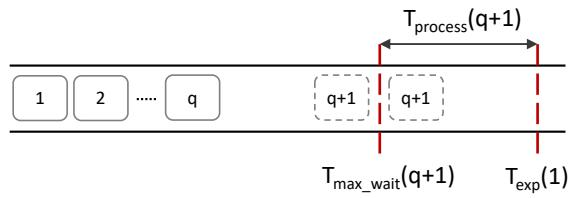

# 5 Adaptive Batching

While the Resource Manager makes model allocation and query assignment decisions based on a target serving throughput, it is the responsibility of each device to serve queries assigned to it without violating the latency constraints. Adaptive batching dynamically determines the optimum batch size to use based on queue conditions to minimize SLO violations.

The Proteus adaptive batching algorithm is based on two key ideas. Firstly, it is a *proactive* algorithm: it ensures that no queries in the queue timeout unnecessarily since we proactively start processing the queries just before the first query in the queue is in danger of violating its latency SLO. Secondly, it is *non-work-conserving*: it may leave the device idle at times if this helps to accumulate more queries before starting batched execution. This allows the algorithm to improve throughput as much as possible on a given device without violating latency SLOs. This also helps to smooth out non-uniform query inter-arrivals in order to handle micro-scale query demand variations.

Figure 3 illustrates the approach. Suppose that we have q queries in the queue and that the first query will expire at  $T_{exp}(1)$ . To process a batch of q+1 queries, time  $T_{process}(q+1)$  is required. We define  $T_{max\_wait}(q+1) = T_{exp}(1) - T_{process}(q+1)$ , or in other words, the maximum time that we will wait for the  $q+1^{st}$  query to arrive. If we have not reached  $T_{max\_wait}(q+1)$  yet, we can wait for more queries to arrive in the queue since we are not in danger of violating any query's latency SLO. While waiting until  $T_{max\_wait}(q+1)$  to fill up the batch, there can be two possibilities:

Figure 3. Adaptive batching in Proteus

**Case 1:** We do not receive any query until  $T_{max\_wait}(q+1)$ . In this case we will start executing the current queries in the queue with a batch size of q at  $T_{max\_wait}(q+1)$ , because if any query arrives after this time and we were to execute with a batch size of q+1, the first query in the queue would expire by the time the batch finishes processing.

**Case 2:** We receive the  $q + 1^{st}$  query before  $T_{max\_wait}(q + 1)$ . In this case, we calculate  $T_{max\_wait}(q + 2)$ . Note that  $T_{max\_wait}(q + 2) < T_{max\_wait}(q + 1)$  since  $T_{process}(q + 2) > T_{process}(q + 1)$ . If we are already past  $T_{max\_wait}(q + 2)$ , that means we cannot wait for the  $q + 2^{nd}$  query; otherwise, our first query will expire, so we execute with a batch size of q + 1 which will not result in any timeouts since we execute before  $T_{max\_wait}(q + 1)$ . If we are not past  $T_{max\_wait}(q + 2)$ , then we wait to accumulate more queries in the queue and repeat the same procedure with q' = q + 1.

As we will see in Section 6.4, the proposed batching algorithm outperforms re-active approaches, e.g., Clipper's AIMD batching, and even proactive work-conserving approaches, e.g., Nexus's early drop batching.

#### 6 Evaluation

This section evaluates the efficacy of Proteus. We begin by describing the experimental setup common to all experiments (Section 6.1). We provide an end-to-end quantitative analysis on the performance of Proteus and baselines (Section 6.2). We also measure the responsiveness of each of these approaches to bursty workloads (Section 6.3). We evaluate Proteus's adaptive batching algorithm individually to Clipper and Nexus's batching algorithm (Section 6.4). We then perform an ablation study of Proteus to quantify the benefit of its individual components (Section 6.5). We also report the effect of varying latency SLOs (Section 6.6) and the performance breakdown for different model families (Section 6.7). Finally, we quantify the overheads of Proteus's decision-making (Section 6.8).

