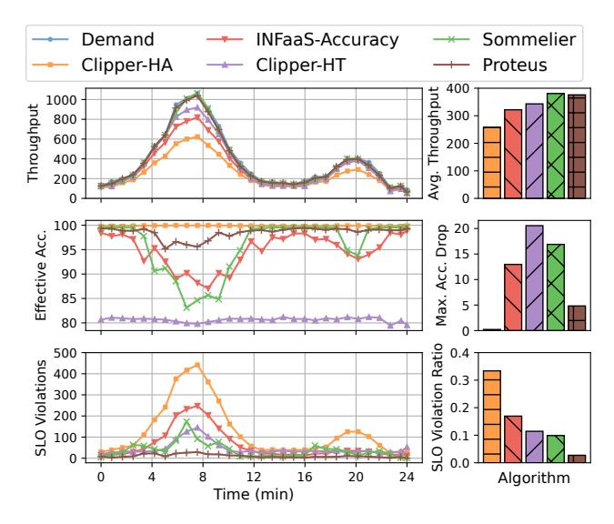

# **6.1.5 Implementation.** We describe our simulator-based and cluster-based implementations below.

Simulator-based Implementation. We implement Proteus in a simulator in  $\sim$ 6000 lines of Python code. It uses an event queue and a timer to record the arrival and processing of inference queries. We use the average profiled latencies of the model variants as the processing time for the queries. We show that the results from our simulator match closely with results from our cluster-based implementation, with a slight discrepancy mainly due to the variance in processing time of queries when they run on the actual hardware accelerators and the networking effects between the hosts. Our simulator code and workload traces are available on GitHub $^5$ .

Cluster-based Implementation. We implement Proteus on top of an enterprise inference-serving system to test its performance and feasibility on real-world workloads and hardware accelerators. The system is used internally by the enterprise to serve inference queries for its employees who use it for a wide variety of applications and use cases, ranging from standard image classification and voice recognition models to complex pipelines for autonomous vehicles and augmented reality. Note that while we use the software infrastructure and the hardware accelerators of the enterprise in our cluster-based implementation, we do not use any proprietary models or workload traces.

Our inference-serving system consists of a cluster of 20 Intel(R) Xeon(R) Gold 6126 @ 2.60GHz CPU workers, 10

**Figure 4.** End-to-end performance comparison. Proteus offers the lowest accuracy drop amongst scaling approaches as well as the lowest SLO violation ratio while meeting query demand. Against the non-scaling approach, Proteus improves throughput by 60% while reducing SLO violations by 10×.

NVIDIA GeForce GTX 1080 Ti GPU workers, and 10 NVIDIA V100 GPU workers. We use Docker containers [31] to host the models in our cluster on top of Kubernetes. We extend Kubernetes with a resource optimizer plugin to implement our Resource Manager which runs on one of the CPUs. Inside the Docker containers, we run the models using the ONNX runtime [10] with the CUDA execution provider for GPUs and the CPU execution provider for CPUs.

To solve our MILP in the simulator as well as the cluster-based system, we use the Python interface for Gurobi [18]. We set the invocation period of the MILP to be 30 seconds as it works well for our evaluation.

