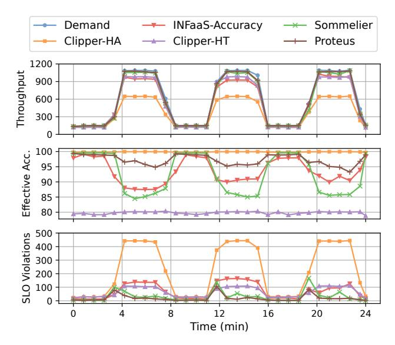
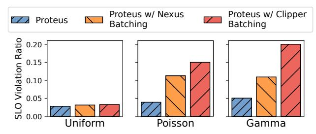

# 6.2 End-to-End Performance Comparison

We first show results from the end-to-end evaluation of Proteus and the baselines on our cluster testbed. Figure 4 shows the timeseries graphs for demand and throughput, effective accuracy, and the SLO violations, as well as the averaged SLO violation ratios across the trace.

We see that *Clipper* performs the worst amongst all the approaches. Even though *Clipper-HA* provides the highest effective accuracy as it never swaps out high accuracy models for low accuracy models, it suffers the highest number of SLO misses throughout the trace. Moreover, its throughput also drops significantly at the diurnal peaks during the day. For instance, during the first peak, its throughput drops to half of the query demand. On the other hand, *Clipper-HT* has significantly lower SLO violations and higher throughput than *Clipper-HA*, though it comes at the cost of the lowest effective accuracy and the maximum accuracy drop (20%).

&lt;sup>5https://github.com/UMass-LIDS/Proteus

Sommelier performs better than Clipper since it scales accuracy, but still suffers from a high accuracy drop (16% at peak) due to its inability to perform model placement dynamically. INFaaS achieves the lowest maximum accuracy drop across the baselines (13.7%) as it performs both dynamic model selection and placement. However, since it uses a greedy heuristic to do so which is prone to get stuck in local optima, it suffers from a significant drop in throughput and increase in SLO violations around peak times. INFaaS has to use a greedy heuristic because its resource allocation decision must be made on a query's arrival. Therefore, it needs a faster solution than a MILP to identify a new allocation policy in time. Proteus avoids this problem by removing MILP solvers from the critical path of serving a query.

We see that Proteus drops the least accuracy while closely meeting query demands. Its maximum accuracy drop is 4.85% at the highest peak, which is 2.8× lower than *INFaaS* and 3.2× lower than *Sommelier*. We attribute this to its optimal resource allocation obtained from the MILP. It also experiences the lowest number of SLO violations, 2.8× lower than *Sommelier*, 4.3× lower than *INFaaS*, and more than 10× lower compared to *Clipper*. We attribute this to its adaptive batching algorithm. To understand the performance of Proteus's adaptive batching further, we do a deep dive in Section 6.4.

The results from our simulator match the behavior of the cluster testbed very closely. In particular, we observe an average difference of 0.12% and 0.82% between the simulator and the cluster testbed in terms of the effective accuracy and system throughput respectively. We attribute the decrease in throughput to background traffic on the cluster, container startup delays, and other background effects not captured by the simulator. We also report an average difference of 0.5% in the SLO violation ratios. We expect this to be due to the variance in runtimes of queries from the profiled runtimes.

Therefore, we show simulation-based experiments for the remaining subsections to perform a deep dive into these results in a time and cost-efficient manner.

#### 6.3 Bursty Workload

We now evaluate Proteus and the baselines on a synthetic *macro-scale* bursty workload to evaluate the responsiveness of resource allocation. We generate the trace by interleaving periods of flat, low query demand with periods of high query demand, having query inter-arrivals sampled through a Poisson process to introduce *macro-scale bursts*. As we are only interested in studying resource allocation in this experiment, we show timeseries plots in Figure 5 and skip the summarized SLO violation chart in the interest of space.

We note that *INFaaS* reacts the fastest to the burst in demand, due to the fact that its resource allocation lies on the critical path to inference-serving, so it can detect this change sooner and change its allocation accordingly.

Proteus first incurs a small number of SLO violations when the burst starts. The increase in query demand triggers its

**Figure 5.** Responsiveness to bursty workload for Proteus vs. baselines. Proteus adjusts allocation after an initial spike in SLO violations, but provides the lowest SLO violations and accuracy drop once it re-allocates.

Resource Manager to adjust allocation, resulting in the SLO violations decreasing again as it performs accuracy scaling to meet this burst. Thus Proteus's decoupling of resource allocation from the critical path of inference-serving comes at the cost of a slightly slower response to sudden changes in workloads. Once *INFaaS* and Proteus adjust their respective allocations in response to the burst, Proteus continues to have significantly lower SLO violations and higher effective accuracy.

#### 6.4 Adaptive Batching

Proteus's adaptive batching dynamically chooses batch sizes based on the arrival time of queries and queue status on a device to minimize SLO violations. We compare it with Clipper's AIMD batching and Nexus's [36] early-drop batching in terms of SLO Violation Ratio. To separate the effect of batching from resource allocation and query assignment, we implement each of these batching algorithms on top of Proteus in order to study them in isolation without other free variables. Since the batching of *INFaaS* is tied with its resource allocation, it cannot be evaluated separately by implementing it on top of Proteus as a module. We study its batching as part of its resource allocation as in Section 6.2.

We evaluate adaptive batching on three synthetic traces with query inter-arrivals following uniform, Poisson, and Gamma (shape 0.05) distributions. The Gamma arrival trace has highly bursty query inter-arrivals, thus introducing *microscale bursts*. We set the incoming load (QPS) to be the same throughout these traces as we are interested in how the batching algorithms react to query inter-arrivals, when resource allocation is unchanged. Note that burstiness in query interarrivals is different from the bursty workload in Figure 6.3,

**Figure 6.** Comparison of Nexus and Clipper batching with Proteus. All do well on uniform traces, but Proteus reduces SLO violations by 2-4× on Poisson and Gamma traces. where the overall demand is bursty but the query interarrivals have a Poisson distribution (*macro-scale bursts*).

Figure 6 shows the SLO violation ratios using three batching approaches: (i) Proteus with its original adaptive batching, (ii) Proteus with Clipper's AIMD batching, (iii) Proteus with Nexus's early-drop batching. We note that all batching algorithms perform well with uniform arrivals as the optimal batch size remains same throughout the trace, thus no adaptive adjustment is required. We see that Nexus experiences about 2-3× higher SLO violations on the Poisson and Gamma traces. The difference in performance between Proteus and Nexus batching is due to the work-conserving nature of Nexus. Nexus dispatches an inference batch to each device as soon as the previous batch is finished. As the query inter-arrivals get more and more non-uniform, it is more advantageous to wait for queries to arrive and a non-workconserving approach works better in that case, so Proteus's adaptive batching outperforms that of Nexus.

On the other hand, *Clipper* experiences 3.8-4× higher SLO violations on the Poisson and Gamma traces. Though it is very easy to implement as a simple heuristic in any system, its simplicity comes at the price of poor performance. As AIMD is reactive, it does consider the current queue length nor when any of the queries currently in the queue would expire. It keeps incrementally increasing batch size until it experiences latency timeouts, at which point it backs off multiplicatively. While this works for a uniform trace where the optimal batch size does not change over time, it does not work well for Poisson or Gamma (bursty) arrivals.

