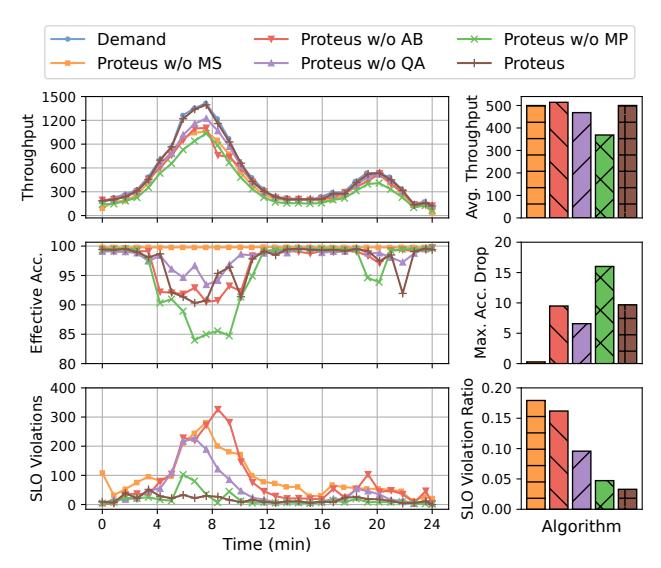
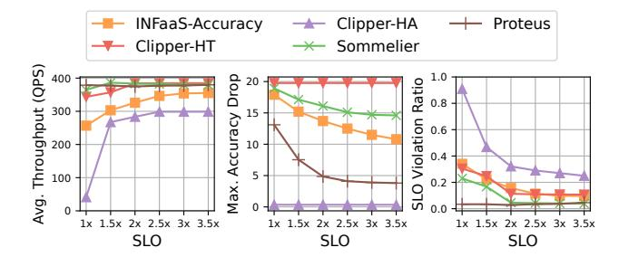
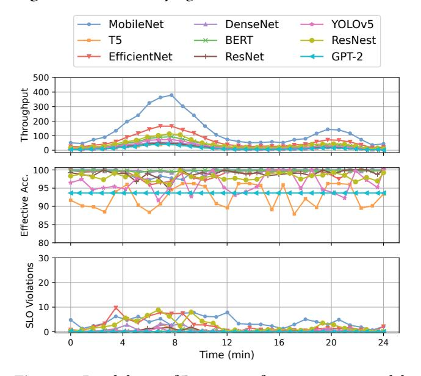
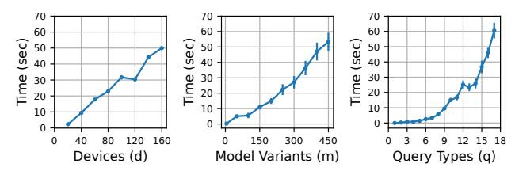

# 6.5 Ablation Study

We present an ablation study of Proteus in Figure 7 to quantify the performance benefit of each of its components in isolation

Proteus w/o MP (Model Placement) places the models on accelerators initially using the MILP, but does not change this placement over time. However, it can perform model selection to do accuracy scaling by changing model variants without moving them around. This baseline is the same as the Sommelier baseline in Section 6.2, which suffers from the largest maximum accuracy drop (16%). Proteus w/o MS (Model Selection) represents a baseline that performs model placement and query assignment optimally using the MILP

**Figure 7.** Proteus ablation study. Removing model selection increases SLO violations the most, while removing model placement degrades effective accuracy most.

and performs adaptive batching, but does not scale accuracy in response to workload changes. Since it does not drop any accuracy, its effective accuracy stays at 100% throughout the experiment, however, it experiences the largest overall SLO violation ratio at 0.18, due to its inability to adapt to varying demand by scaling accuracy. Proteus w/o AB (Adaptive Batching) represents our approach while setting batch size statically to 1. This approach has the highest absolute number of SLO violations during the peak as it is unable to batch a large number of queries together to increase throughput while meeting SLO, however this decreases when demand is low since executing with a small batch at low loads does not backlog the queues. Proteus w/o QA (Query Assignment) distributes queries uniformly to all devices that host the respective model variants, regardless of their serving capacity. It also suffers from a high SLO violation ratio of 0.1.

Overall, we note that with respect to SLO violations, removing model selection causes the highest degradation as the system is not able to scale accuracy to meet the increased demand (and hence, is forced to drop queries), followed by adaptive batching, query assignment, and then model placement. In terms of effective accuracy, removing model placement causes the highest degradation, followed by adaptive batching, query assignment, and then model selection.

## 6.6 Sensitivity to Latency SLO

We now vary the latency SLO and study its effect on all approaches, as shown in Figure 8. As mentioned before, our system hosts models from diverse tasks that have significantly different performance profiles from each other. Therefore, instead of setting the same latency SLO for all of them, we set the SLO for a query type to be a multiple of the profiled runtime of fastest model variant that runs on a CPU with a batch size of 1. We vary this multiple from 1× to 3.5× with

Figure 8. Effect of varying SLOs on Proteus and baselines.

**Figure 9.** Breakdown of Proteus performance w.r.t. model families.

an interval of 0.5 and study its effect using the real-world Twitter trace. To show results from a large number of experiments, we show (i) averaged throughput across time, (ii) maximum accuracy drop across time, (iii) average SLO violation ratio across time.

Overall, Proteus consistently offers the lowest accuracy drop across all baselines that perform scaling, and the lowest SLO violation ratios. As the SLO increases, the SLO violation ratio decreases, and throughput increases for all baseline approaches. The maximum accuracy drop decreases for all approaches except *Clipper* as it does not dynamically scale accuracy and thus suffers from high SLO violations. Proteus can maintain the same high throughput and low SLO violation ratios across all values of SLO. Its maximum accuracy drop decreases as SLO values increase, since higher accuracy model variants with slower runtimes can meet larger SLOs.

### 6.7 Performance Breakdown

We now present a breakdown of the end-to-end performance of Proteus with respect to different model families on the Twitter trace. Figure 9 shows that every model family experiences different throughput as the workload has a Zipf distribution with respect to model families as described in

Section 6.1. Since Proteus optimizes effective accuracy at the system level, we note variations across model families. We first observe that T5 experiences the highest variation across time, which we attribute to the fact that it has a lower incoming request rate compared to other model families, and hence carries a lower weight in the overall system effective accuracy. We also observe that GPT-2 has the lowest variation in effective accuracy since it is the most heavyweight model and cannot fit into most accelerators, hence the system loads it once in the accelerator with the highest amount of memory. In terms of SLO violations, we see relatively consistent behavior across model families, since adaptive batching is responsible for minimizing SLO violations and it executes on a per-device level. We discuss the fairness implications of these results in Section 7.

#### 6.8 Decision Overhead

We measure the overhead of Proteus in two ways: (i) overhead of the Request Router on the critical path of queries, (ii) overhead of the Resource Manager. Since the Request Router lies on the critical path for serving every query, it is imperative that it should incur only a small delay to route the queries. Recall that the Request Router stores a routing table with an entry for each model variant as well as accelerator. We measure the latency of the Request Router to search this table to be less than 1ms. Note that there is also a space overhead of this routing table that is  $O(D \times M \times Q)$  where D is the number of server devices, M is the number of model variants, and Q is the number of query types.

The overhead for solving the MILP inside the Resource Manager is also important as we need to make allocation changes quickly in order to be able to adapt to fast workload changes. We show how the runtime of the MILP scales with respect to its input parameters in Figure 10. We show the increase in the average run-time when increasing one of our input parameters (d, m, q) while keeping the other parameters constant. We also show the 95% confidence interval for each value as an error bar. As our evaluation uses an invocation period of 30 seconds for the MILP under stable conditions, we show run-times up to 60 seconds since we observe that beyond this point, our workload changes significantly and the time taken to solve the MILP makes it infeasible to adapt to workload changes quickly, forcing the system to rely on heuristic solutions. We note that the MILP can scale up to 160 devices, 450 model variants, or 17 query types while being solvable in under 60 seconds.

In our case, we measure the average time to solve our MILP to be 4.2 seconds. At this speed, the Resource Manager is able to change the resource allocation quickly without incurring any significant overhead on the system since it does not lie on the critical path to inference.

**Figure 10.** Scalability of MILP with respect to input parameters (d, m, q)

#### 7 Discussion

We now discuss the limitations of our work and potential future work opportunities.

**Varying Input Sizes.** We consider models from a wide variety of domains in this work, such as computer vision and natural language processing. While computer vision models typically have fixed-size inputs, many natural language models can have variable-size inputs and their throughput may change depending on the size of input passed to the model for inference. While our MILP does not consider variable input sizes of queries when calculating the throughput of a model variant ( $P_{d,m,q}$ ), adaptive batching does take into account the real-time query execution. However, for the scope of this work, we do not consider the effect of variable-size inputs on inference-serving and leave it open for future work.

Fairness. We consider accuracy scaling at a system level in this work. This can mean that despite most requests meeting the latency SLO and throughput requirements, some requests may experience better accuracy than others at times. This opens the door to fairness as an alternate objective for optimization in an inference-serving system. However, it is not straightforward to optimize fairness simultaneously with accuracy. The system can improve fairness by reallocating resources from a query type experiencing a low degree of accuracy drop to a query type experiencing a higher degree of accuracy drop; however, this would decrease overall effective accuracy at the system level. Thus, there is a trade-off between fairness and system-wide effective accuracy, which remains an interesting direction to explore for future work.

Hardware Scaling. In this work, we present accuracy scaling as an alternative to hardware scaling for resource-constrained inference-serving systems. However, accuracy scaling can also work in tandem with hardware scaling for systems that have the ability to add hardware resources. Since hardware scaling involves provisioning and starting new servers which takes time, accuracy scaling can be used on a finer-grained timescale to absorb sudden unexpected bursts of load by dropping accuracy for a short time while waiting for new servers to be allocated.

