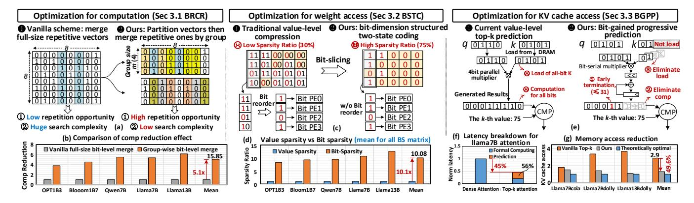
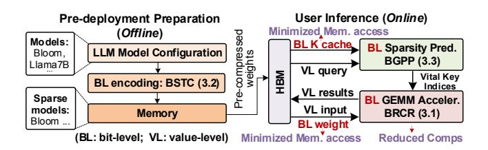

# 2.3 Opportunity and Observation at Bit-level

Fig. 4 (a) shows that value-level representation obscures bit-level optimization opportunities. In the 2-bit value matrix, only six elements are zero, and no column vectors are repeated (Repeated column vectors can be used to accelerate GEMM). This is due to bit concatenation, where a k-bit zero requires all k bits to be zero simultaneously. In contrast, decomposing the matrix into two 1-bit slices (MSB and LSB) reveals enhanced sparsity and redundancy. The MSB slice exhibits 14 zeros, yielding a 70% sparsity rate (14/20).

Figure 4: Bit-level sparsity and repetition opportunities.

This aligns with the near-Gaussian distribution of weights [35, 52], where higher-order bits tend to be zero. Additionally, the 1st and 2nd columns in the LSB slice are identical to the 3rd and 5th, respectively, indicating increased repetition after bit-level decomposition. Notably, a 2-bit integer GEMV is functionally equivalent to a shift-and-accumulate operation over the two bit-slice matrices, where the MSB slice is weighted by  $2^1$  and the LSB by  $2^0$ . This demonstrates that bit-level decomposition preserves full compute equivalence while exposing fine-grained sparsity and redundancy. We refer to the above two opportunities as **BS sparsity** and **BS repetitiveness**.

However, directly computing with BS sparsity or repetitive vectors in a naive manner is still inefficient. With the LSB slice matrix in Fig. 4 (a) as an example, Fig. 4 (b) illustrates computing each BS vector independently. This results in redundant operations. Specifically,  $x_1 + x_4$  is calculated three times across  $Y_0$ ,  $Y_1$  and  $Y_2$ , while  $x_0 + x_2 + x_3$  is recalculated twice, leading to a 30% more operations. This inefficiency arises from failing to exploit redundancy across BS vectors. Naturally, this raises a key question: how can we harness such inherent repetitiveness to reduce overall computation?

**Opportunity**: Fig. 4 (c) illustrates an effective computation reduction strategy. First, it transforms the LSB matrix (denoted as W) involving repetitive column vectors into an enumeration matrix (E) and an index matrix (I). Specifically, E stores unique column vectors from W and I records the mapping between each column in W and its corresponding vector in E. For example, the 3rd column of W matches the 1st column of E, so the value of I (1,3) is 1. This transformation rewrites  $W \times X$  as  $E \times I \times X$ . The intermediate result  $X' = I \times X$  requires 2 additions, and  $E \times X'$  requires 4 additions, yielding a 30% reduction compared to the naive computation that demands 9 additions. We refer to this approach as a redundancy elimination strategy based on BS vector grouping. By grouping multiple BS vectors as a group matrix, the strategy identifies and eliminates redundant computations among them. Its effectiveness depends on the **repeated column vectors** within the group matrix: more repetition leads to lower computation.

**Challenges**: Despite its promise, designing an efficient bit-level accelerator for LLM inference remains a challenging task.

**(Challenge 1)** Directly grouping a large number of BS vectors results in low repetition rates among column vectors.

As depicted in Fig. 5 (a), the number of repetitive column vectors in an  $8 \times 8$  BS matrix is significantly smaller than the number of repetitive column vectors after decomposing it into two  $4 \times 8$  submatrices, where we denote 4 as the group size m. This follows from the pigeonhole principle [1]: When the number of holes is less than the number of pigeons, at least one hole will contain more than one pigeon. As m decreases, the number of available "holes" (i.e., at most  $2^m$ ) is reduced, thus the probability of repetitive column vectors increases. Our analysis across five LLMs in Fig. 5(b) reveals that, compared to the vanilla full-size merge, the group-wise merge achieves, on average, a  $5.1 \times$  reduction in computation.

**Key idea.** We decompose the large weight matrix  $\in \mathbb{R}^{H \times H}$  in LLMs into several smaller group matrices of size  $\mathbb{R}^{m \times H}$ , where H is hidden dimension. To support this, we design a CAM-based match unit, which significantly reduces the latency associated with the search process for repetitive column vectors along the H dimension.

**(Challenge 2)** Value-level compression is incompatible with bit-level computation paradigms and obscures BS sparsity.

As shown in Fig. 5 (c), this inefficiency stems from two primary factors: (1) Value-level compression achieves only a 30% sparsity rate (SR), which is 2.5× lower than bit-level sparsity; (2) Value-level formats require bit reordering for bit-level PEs, which incurs additional on-chip overhead. Fig. 5 (d) further show that, across five LLMs, bit sparsity is on average 10.1× higher than value sparsity.

Illustration for the bit reorder: Traditional memory layouts store multi-bit activations contiguously across bits. As a result, when computing the MSB slice, a large number of LSBs are also fetched unnecessarily. To enable bit-slice-based processing, a bit-reordering step is required to extract and reorganize the relevant MSB data into a contiguous MSB slice for input to the processing elements (PEs). We refer to this operation as bit-reorder.

**Illustration for the bit sparsity**: For a k-bit matrix, we first compute the bit sparsity of the bit-slice matrices for each bit position. The overall bit sparsity of the 8-bit matrix is then the average bit sparsity across all bit-slice matrices for each bit position.

**Key idea.** We propose an effective two-state coding scheme operating along the bit-slice dimension, naturally aligned with bit-level computation and eliminating the overhead of data reordering. The coding and computation are associated designed and operates at the same group granularity to ensure global maximum benefits. Lightweight en/decoders are designed to enable greater parallelism and low-power data coding within the same area budget.

(Challenge 3) The current Top-k prediction is coarse-grained and involves redundant computation and memory access.

As depicted in Fig.5 (f), although the top-*k* prediction successfully reduces the overall attention latency by 45%, the bottleneck shifts to the prediction process itself. Therefore, it is imperative to

Figure 5: Challenges and our strategies for applying bit-level computing to computation-memory-efficient LLM inference.

Figure 6: The preparation and execution flow of MCBP.

further optimize the top-k prediction process. Fig.5 (e) illustrates inefficiencies in value-based top-k prediction using an example where the threshold is 75. To identify whether the current Key (0101) belongs to the top-k set, the value-based approach loads the 4bit K entry from HBM and then executes computation for 8bit results. However, we observe that the top 2 bits alone are sufficient to determine that the final result ( $\leq$ 31) will fall below the threshold, making the remaining 2-bit computation and memory access unnecessary.

**Key idea**. We propose a bit-grained progressive prediction with early termination. Attention scores are estimated bit-wise from MSB to LSB. This allows computation and KV cache access to be terminated early once the partial result exceeds the feasible top-k range. As shown in Fig. 5 (g), this reduces KV cache accesses by up to 50% across three scenarios, compared to value-level prediction.

Review of Transformer accelerators. Unfortunately, current Transformer accelerators still struggle with computation and memory access issues, due to their inability to exploit bit-grained opportunities for coordinated optimization. Table 1 summarizes their features. The majority of existing works [25, 26, 59, 75, 104] focus on accelerating attention whose quadratic complexity dominates earlier encoder-based models, like BERT. However, their strategies are less effective for decoder-only LLMs during the autoregressive decoding stage, where performance is severely constrained by memory access. While Energon [113] and SpAtten [94] realize challenges with memory access, their coarse-grained pruning fails to handle fine-grained bit-level optimizations for both linear weights and KV cache. SOFA [92] exhibits compute-memory co-optimization, but is restricted to attention. FACT [72] targets whole model computation reduction but lacks support for fine-grained KV cache and weight loading optimizations. These limitations motivate us to design an

Table 1: Summary for SOTA Transformer Accelerators.

| Accelerator   | GEM       | M        | Memo   | ry access | P & D  | Optimiz. |  |
|---------------|-----------|----------|--------|-----------|--------|----------|--|
| Accelerator   | QKV & FFN | Atten.   | Weight | KV Cache  | stage  | Level    |  |
| $A^{3}[25]$   | ×         | ✓        | ×      | ×         | P only | Value    |  |
| ELSA [26]     | ×         | ✓        | ×      | ×         | P only | Value    |  |
| Sanger[59]    | ×         | ✓        | ×      | ×         | P only | Value    |  |
| DOTA [75]     | ×         | ✓        | ×      | ×         | P only | Value    |  |
| DTATrans[104] | ×         | ✓        | ×      | ×         | P only | Value    |  |
| Energon [113] | ×         | ✓        | ×      | Low       | P only | Value    |  |
| SpAtten[94]   | ✓         | ✓        | ×      | Low       | P & D  | Value    |  |
| SOFA [92]     | ×         | ✓        | ✓      | ×         | P only | Value    |  |
| FACT[72]      | ✓         | ✓        | Low    | ×         | P only | Value    |  |
| MCBP          | /         | <b>'</b> | ~      | <b>/</b>  | P & D  | Bit      |  |

efficient LLM inference accelerator that jointly optimizes GEMM computation, weight access, and KV cache access across both prefill and decoding stages.

