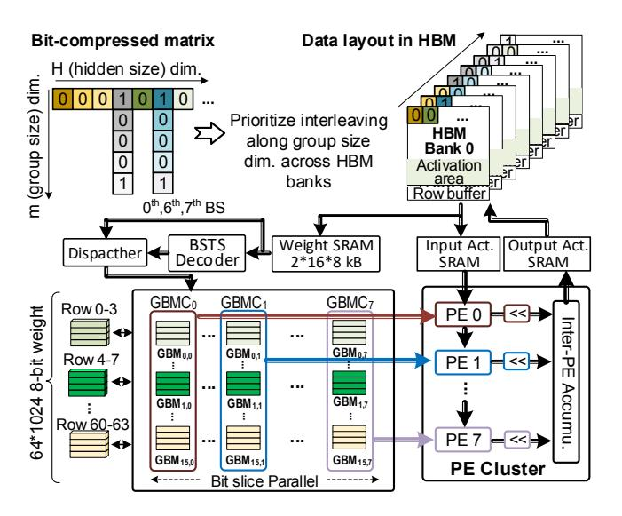

# 4 Architecture and Hardware Innovation

#### 4.1 Architecture Overview

Fig. 10 illustrates the MCBP architecture (bottom) and its workflow (top) for efficient Transformer inference under attention sparsity (§2.2). The accelerator operates through eight key steps, with numbered markers on the timeline indicating their positions within the overall pipeline. First, the controller sends token indices and bit-slice (BS) weights to the data fetcher, which decodes physical addresses and loads data into on-chip SRAM **1**. The BSTC decoders

Figure 13: The bit-grained computation dataflow of MCBP.

then decompress the weight matrices **②**, forwarding them to the BRCR unit **③**, where a CAM-based module identifies repetitive BS weight entries. These indices are returned to the fetcher, translated into SRAM addresses, and used to fetch corresponding activations back to the BRCR unit **④**. Finally, the computed GEMM results are written back to off-chip DRAM **⑤**.

To efficiently handle dynamic attention sparsity (§2.2) and hide prediction latency, BGPP operates concurrently with the BRCR unit. Its workflow begins by retrieving QK tensors from the data fetcher **6** and performs an initial prediction. The selected indices are then returned to the data fetcher **o** to fetch the required Keys for the next round (as Fig. 9). This process continues iteratively until the preset number of iterations is reached, and the final KV indices are stored in Temp SRAM **3**. In this dedicated dataflow, once computation proceeds to the attention part, the BRCR unit can merely calculate attention scores with those vital KVs, based on these KV indices generated by BGPP. To fully support Transformer computation, MCBP integrates an Auxiliary Processing Unit (APU) that includes an embedding unit for generating input token embeddings via table lookup, a special function unit (SFU) implemented in FP16 using a combination of lookup tables and polynomial approximation [73] to compute non-linear functions such as GELU, softmax, and layer normalization, and a quantizer that handles data conversion between FP16 and INT8. Notably, the concatenation in MHA is performed during data movement.

**Processing of scaling and zero point.** Fig. 11 (a) illustrates the quantization process in MCBP, where weights are quantized using per-channel symmetric quantization, and activations are quantized using per-tensor asymmetric quantization, as [38, 98, 101]. Taking activations as an example, the quantized input activation is computed as  $X_q = X_f / \Delta_x + Z_x$ , where  $\Delta_x$  is the scaling factor and  $Z_x$  is the zero-point offset. Notably,  $\Delta_w$ ,  $\Delta_x$ ,  $\Delta_y$ ,  $Z_x$  and  $Z_y$  can be preknown by the calibration dataset. Based on the derivation in Fig. 11 (b), the final output is expressed as  $Y_q = Scale \odot (W_q X_q) + Bias$ , where the INT GEMM  $(W_q X_q)$  is accelerated by the BRCR unit via

Figure 14: A PE cluster of CAM-based fast-match BRCR unit.

efficient bit-slice processing and shift-accumulation. The results are then processed by the quantizer with the scaling and bias terms.

**Tiling Strategy.** Fig. 12 illustrates the tiling strategy of MCBP and its corresponding loop representation for the output-stationary dataflow. To maximize weight reuse, MCBP stores slices included in the  $T_M \times K$  weight tile into the weight SRAM at once, if possible. Then the BRCR unit assigns a  $T_M \times T_K$  weight tile together with a  $T_K \times T_N$  activation tile to each PE cluster, where 8 PEs concurrently process each bit-slice of the weight tile in parallel. In this work, we set  $T_M = 64$ ,  $T_K = 256$ , and  $T_N = 32$ .

