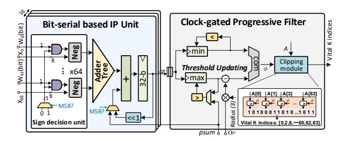

# 4.4 Lightweight BSTC CODEC and Data Layout

We first design a lightweight encoder-decoder that enhances parallelism within the same area budget. Then, we introduce a segmented interleaved data layout in SRAM to support parallel en/decoding.

Figure 16: Threshold-aware clock-gated BGPP unit.

Fig.15 (a)(b) depicts the lightweight BSTC en/decoder architectures. The encoder comprises a 4 bit comparator (CMP) and a MUX. If the input is non-zero, it adds a 1-bit '1' ahead the MSB and outputs the result; Otherwise, it outputs a 1-bit '0'. The decoder includes a 1-bit CMP, a 5-bit serial-in parallel-out (SIPO) register (for m=4), and a leading one eliminator. When a '0' is detected in the bit stream, it outputs four consecutive 0's. Otherwise, it buffers received bits in the SIPO, which outputs the buffered content once full.

Fig.15 (c) illustrates the segmented weight layout during a decompression process. To enable parallel decoding, the weight matrix is partitioned along the hidden dimension into multiple subweights, each stored independently in separate banks. Given variable compression ratios, the starting address of each sub-weight is recorded. Before decompression, the controller fetches these starting addresses from the address area ①. Based on the retrieved addresses ②, sub-weight data is accessed row-wise and sent to the BSTC decoder ③ for decompression. Each bank has 64 columns and 1024 rows, we use a 6-bit column address and a 10-bit row address to locate the first data of each sub-matrix. One row can store the address of four 1k-length sub-matrices, and three rows suffice to index up to 12 sub-matrices, covering the weight size of most LLMs.

