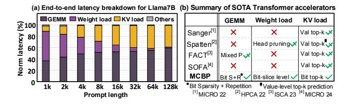
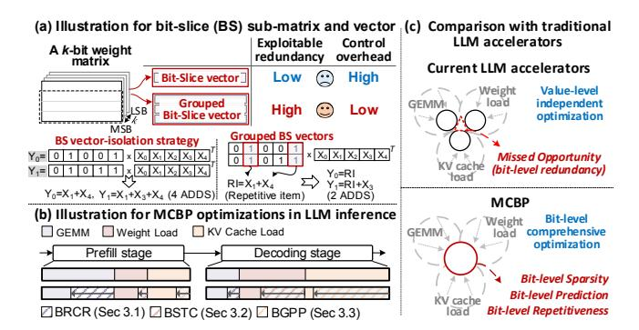
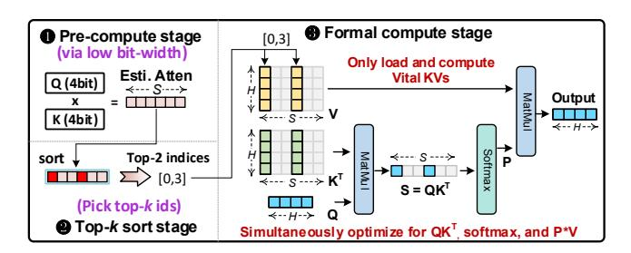

# Keywords

Transformer accelerator, Bit-serial, Repetition, Sparsity, Latency

#### ACM Reference Format:

Huizheng Wang, Zichuan Wang, Zhiheng Yue, Yousheng Long, Taiquan Wei, Jianxun Yang, Yang Wang, Chao Li, Shaojun Wei, Yang Hu, and Shouyi Yin. 2025. MCBP: A Memory-Compute Efficient LLM Inference Accelerator Leveraging Bit-Slice-enabled Sparsity and Repetitiveness. In 58th IEEE/ACM International Symposium on Microarchitecture (MICRO '25), October 18–22, 2025, Seoul, Republic of Korea. ACM, New York, NY, USA, [17](#page-16-0) pages. [https:](https://doi.org/10.1145/3725843.3756037) [//doi.org/10.1145/3725843.3756037](https://doi.org/10.1145/3725843.3756037)

Figure 1: (a) Key bottleneck breakdown of end-to-end latency for Llama7B (Batch=4) on NVIDIA A100 GPU with TensorRT-LLM. (b) Summary of current Transformer accelerators.

#### 1 Introduction

Large language models (LLMs) are transforming AI with impressive capabilities across tasks, like code generation [10, 65, 76], chatbots [12, 87]. As many LLM-based services rely on real-time interactions [40, 51, 70], inference latency has emerged as a critical performance metric.

LLM inference [84] comprises two stages: prefill and decoding. In the prefill stage, the model processes all input tokens (i.e., prompt) in parallel to generate the first token, while storing intermediate Key/Value (KV) tensors, known as the *KV Cache*. In the subsequent decoding stage, the model generates tokens autoregressively, each iteration requiring access to the full model weights and KV cache.

However, the differing processing characteristics of the prefill and decoding stages, each presenting distinct resource intensities, make end-to-end inference optimization more challenging. Fig. 1 (a) shows an end-to-end latency breakdown for LLaMA-7B under varying prompt lengths, including both the prefill and decoding stages. In this setting, the decoding is fixed at 16 tokens. The major latency contributors are categorized into GEMM computation, weight loading, KV cache loading, and others. The results indicate that all three factors significantly impact end-to-end latency across different prompt conditions. For short prompts (e.g., 1k tokens), weight loading during the decoding stage dominates, accounting for 52.4% of the latency. As prompt length increases, GEMM computation in prefill stage and KV cache loading during decoding emerge as the primary bottlenecks. These trends highlight the need for joint optimization of GEMM computation, weight access, and KV cache access to enhance end-to-end inference efficiency.

As summarized in Fig.1 (b), though numerous Transformer accelerators have been proposed [25, 26, 59, 72, 74, 75, 92, 94, 104, 113], most of them focus on leveraging token sparsity to mitigate the quadratic complexity of attention, which becomes a bottleneck for long inputs. Although this also partially reduces the KV load, their value-level top-k prediction involves redundant computation and memory overhead, leading to inefficiency. In addition, while FACT [72] and Spatten [94] can partially mitigate the GEMM and weight load bottlenecks via mixed-precision computation and head pruning, respectively, they lack a holistic optimization strategy that addresses all performance bottlenecks. These limitations motivate a specialized LLM accelerator capable of jointly optimizing GEMM computation, weight access, and KV cache access.

We conduct an in-depth analysis of the root causes behind computation and memory inefficiencies in LLM inference, identifying that these challenges can be effectively addressed via a co-designed bit-level data storage and computation scheme. As illustrated in Fig. 2 (c), this work takes the first step toward addressing all major LLM bottlenecks through a unified bit-level optimization strategy.

As depicted in Fig. 2 (a), we introduce the "grouped bit-slice (BS)" effect, wherein redundancy among BS vectors can be maximally exploited to reduce computation complexity while minimizing extra overhead. Throughout this paper, for an INT-quantized k-bit vector, it can be decomposed into k individual 1-bit vectors, and referred to as bit-slice vectors for clarity. Assuming that two bit slices of weight vectors are multiplied with a set of INT8 vectors X, resulting in outputs  $Y_0$  and  $Y_1$ . As exemplified in Fig. 2 (a), computing  $Y_0$  and  $Y_1$  with a naïve BS-vector-isolation strategy requires 4 additions, whereas the group BS approach needs at most 2 ADDs, by leveraging the intrinsic repetitiveness among BS vectors.

However, it is non-trivial to harness the newly identified redundancy and sparsity at bit level. The optimal granularity for bit-level processing and data compression must be carefully determined to avoid diminishing returns from control overhead due to overly fine-grained processing. Specifically, we elaborate on three key opportunities and challenges that arise from adopting bit-level processing and data compression:

- a) Unexploited redundancy among BS vectors. Existing designs lack an effective method to exploit redundancy across BS vectors without incurring significant bit-level control overhead. While some prior works [31, 79, 93, 95] have explored leveraging redundancy across convolution channels in CNNs to accelerate computation, such techniques are not applicable to LLMs. This is due to: (1) the relatively small number of channels in CNNs, which eliminates the need for fine-grained granularity control; and (2) the small convolution kernel sizes, which incur small matching overhead for repetitive items. By contrast, the huge matrix sizes in LLMs make it challenging to efficiently identify redundancy across BS vectors in hardware, and highlight the need for a carefully selected grouping granularity to balance efficiency and overhead.
- b) Untapped sparsity resided in BS weight matrix, due to the mismatch between value-level compression and inherent BS level sparsity. This limitation stems from the conventional value-centric memory storage paradigm, which inherently favors value-level compression techniques [28, 29, 110]. While such methods are straightforward and widely adopted, they hinder the full exploitation of the fine-grained sparsity present at the bit-slice level. This underscores the need for a bit-dimensional compression strategy, with consistent data organization across the memory hierarchy.
- c) **Inefficient Top-k prediction mechanism**, due to redundant KV cache access. The widely used top-k mechanism in LLMs alleviates attention complexity by speculating attention sparsity and avoiding trivial token computation [72, 92, 94, 104]. However, current value-based top-k prediction is inefficient, leading to redundant IO traffic, which in turn makes the prediction itself become a bottleneck in latency. A finer-grained top-k mechanism is needed to reduce I/O overhead while maintaining sparsity effectiveness.

To this end, we propose an algorithm-hardware co-design for LLM inference optimization, named MCBP. It features three key designs that correlate to three challenges, as shown in Fig. 2 (b).

Figure 2: Comparison between MCBP and existing works.

1) We propose a BS-repetitiveness-enabled computation reduction (BRCR) strategy for accelerating GEMM. It identifies and reuses repetitive computations between multiple weight-BS vectors by grouping them at an appropriate granularity. This eliminates repetitive operations among grouped vectors while amortizing bit-level control overhead across them.

2) We propose a BS-sparsity-enabled two-state coding (BSTC) for weight de/compression. It strategically employs bit-slice independent encoding to exploit the significant sparsity commonly hidden in high-order bit slices. Meanwhile, we perform a joint exploration of BSTC granularity and BRCR granularity, identifying the optimal granularity configuration for seamless weight decompression and computation that maximizes overall system benefits.

3) We design a bit-grained progressive prediction (BGPP) mechanism, to reduce unnecessary KV cache traffic during the attention sparsity prediction stage. BGPP employs a progressive bit-level filter to incrementally eliminate trivial Keys in each prediction round, enabling early termination to avoid redundant computation and memory access associated with them.

To support the above optimization mechanisms effectively, we design a dedicated accelerator named MCBP: 1) For BRCR, it employs a Content Addressable Memory (CAM) to accelerate the identification for repetitive computations, thus significantly reducing merging latency for repetitive operations. 2) For BSTC, lightweight and customized encoders/decoders are designed to enhance data compression and decompression efficiency. Additionally, it reformulates the data layout in memory to facilitate seamless bit-prioritized computation, thereby reducing data reorder overhead. 3) For BGPP, a bit-grained adaptive threshold-aware clock-gated prediction module is designed to achieve low-power attention sparsity prediction. The MCBP accelerator achieves an average energy efficiency of 22740 GOPS/W, which is 31.1×, 35×, 5.2× and 3.2× higher than A100 GPU, SOTA accelerator Spatten, FACT and SOFA, respectively.

#### 2 Background and Motivation

#### 2.1 Large Language Models (LLMs)

LLMs [4, 9, 85] are based on Transformer architectures [90]. Initially, a length-S sequence is projected into three spaces, termed Query (Q), Key (K) and Value (V), respectively. Next, Q and K are multiplied to generate an attention matrix  $\mathbf{A}$  with  $\mathbb{R}^{S \times S}$ , which represents the correlation of each token pair. The attention matrix is then passed

Figure 3: Top-*k* sparsity prediction for attention acceleration.

through a softmax operation and multiplied with V activation, resulting in a matrix  $\mathbf{O} \in \mathbb{R}^{S \times H}$ , where H denotes hidden dimension. Finally, a feed-forward network generates the output results.

LLM Integer Quantization. Quantization reduces LLMs' compute and memory costs. Early work like Q8-BERT [109] achieves INT8 weight quantization with minimal accuracy loss. In 2022, LLM.int8 [17] scaled INT8 quantization to 175B models with few INT16 outliers. SmoothQuant [101] later enabled lossless 8-bit weight and activation quantization for LLMs with up to 530B. In 2024, Atom [112] implements 8-bit KV cache quantization. Quantization has become a prominent trend for deploying LLMs, supported by frameworks like TensorRT [66]. Thus, optimizing compute and memory access for integer-quantized LLMs is an increasingly critical topic.

