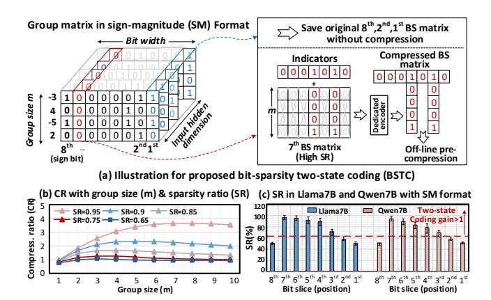

# 3.1 BS-Repetitiveness-enabled Computation Reduction for GEMM (BRCR)

As depicted in Fig.7 (a), the core idea of BRCR is first to decompose an k-bit weight matrix into k bit-slice (BS) matrices. Then, for each BS matrix, it extracts m rows of these matrices and merges them as a *Group matrix*. Thus, it will process m rows each time, instead of all rows. For clarity, we use GEMV to illustrate the acceleration mechanism, which is also effective in GEMM scenarios. Overall, two key steps are required to achieve computation acceleration.

1) Merging repetitive operations. As depicted by Fig. 7 (b), this step first ① identifies repeated entries (i.e., column vectors) in the *Group matrix* G, then ② merge their corresponding activations

Figure 7: Bit-slice-repetitiveness-enabled computation for GEMM (BRCR).

Figure 8: BS-sparsity-enabled two-state coding (BSTC).

into a *merged activation vector* (MAV), denoted as Z. This is implemented by accumulating each activation into the partial sum of the corresponding entry in Z, based on the value of each column in G (We denote as Grouped index). For example, the 3rd and 4th columns of the group matrix are both 010 (i.e.  $G_3=G_4=2$ ), so their corresponding activations,  $x_3$  and  $x_4$  are added to the entry ( $z_2$ ) of the Z. Notably, for a bit column vector with m elements, there are  $2^m$  possible types. Thus, the MAV has a length of  $2^m$ . Mathematically, this step is equivalent to the I × X in Fig. 4 (c). Notably, non-zero entries in the MAV indicate multiple rows in a weight share the same addition operation. For instance,  $z_3$  (Grouped index is 011) denotes the repetitive additions among rows 1 and 2, while  $z_0$  represents activations multiplied by zero, which can be directly eliminated. With bit sparsity ratio bs, this step consumes at most  $H \times (1 - bs)$  additions, regardless of group size m.

**2) Computation reconstruction.** As depicted in Fig.7 (c), this step is to reconstruct the GEMV results by multiplying the *Enumeration matrix* with the MAV. It is noteworthy that for a Group matrix  $\mathbb{R}^{m \times H}$ , when H is very large, we can reasonably assume that all possible  $2^m$  column vectors will appear. Thus, the Enumeration matrix contain all  $2^m$  distinct column vectors. In this way, each row of the enumeration matrix can contain at most  $2^{m-1}$  ones. Therefore, the computation reconstruction step requires at most  $m \times 2^{m-1}$  additions for reconstructing m-row GEMV.

In summary, for a k-bit, m-row GEMV with bit sparsity ratio  $\tilde{bs}$  and value sparsity vs, where  $\tilde{bs}$  is the average bit sparsity ratio across all ( $\in [1, k]$ ) bit-slice matrices. The total additions required

by BRCR is  $k(H\times(1-\tilde{bs})+m\times2^{m-1})$ . By contrast, existing sparsity-aware bit-serial computing (BSC) [2, 15] consumes  $k(H\times m\times(1-\tilde{bs}))$  additions. And the value-based sparsity scheme consumes  $H\times m\times k\times vs$  additions. For typical LLM models (H~4k,  $\tilde{bs}$ ~0.70, vs~0.07, m=4), BRCR achieves up to 12.1× and 3.8× computation reduction compared to value sparsity and naive BSC.

Verify the existence for redundancy based on pigeonhole principle. Any m-row binary matrix can have at most  $2^m$  types of column vectors. Since LLMs (e.g., Bloom-7B, GPT-3) have hidden dimensions H (4k-12k) far exceeding  $2^m$ , there are abundant opportunities for redundancy in LLMs.

Key Insights: There is a key sweetspot of m that achieves the maximum computation reduction while minimizing reconstruction overhead. For a GEMV with a k-bit weight matrix  $\in \mathbb{R}^{H \times H}$ , the total operations of BRCR are  $kH^2/m \times (1-\bar{bs}) + kH2^{m-1}$ . The group size m introduces an interesting trade-off. If m is too small, it fails to exploit sufficient redundancy between the bit-slice vectors. Conversely, if m is too large, the exponentially increasing reconstruction cost (i.e.,  $2^{m-1}$ ) offsets the benefits of redundancy removal. The DSE for optimal m is provided in §5.2.

