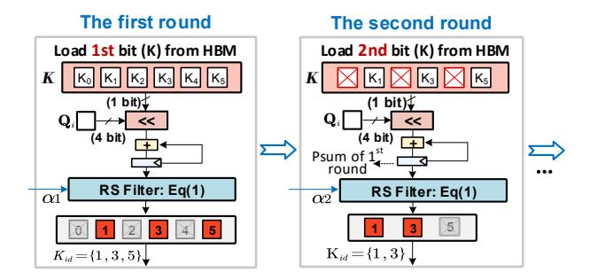
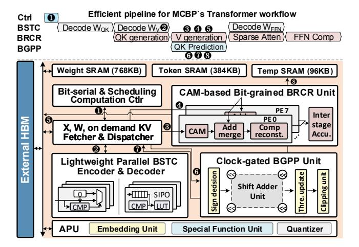

# 3.2 BS-Sparsity-enabled two-state Coding (BSTC)

While numerous studies [28, 29, 62, 63, 73] have explored coding techniques for sparse weight compression, they largely focus on value-level sparsity, limiting their effectiveness. In contrast, BSTC exploits the key insight that quantized weights exhibit Gaussian-like distribution [52], thus most non-zero weights own zero bits. To this end, BSTC encodes data at different BS matrices separately, to exploit the high sparsity in high-order bit plane. In addition, the encoding of BS matrices aligns with the computation granularity of BRCR, i.e., group size m, thus avoiding extra data conversion overhead

Fig. 8 (a) illustrates BSTC's design. To exploit bit-0 sparsity in high-order bits (near MSB part), we adopt the sign-magnitude (SM) format for all weights. Given varying sparsity across bit positions, only bit-slice matrices from bits 3-7 are compressed, while bits 1, 2, and 8 remain uncompressed. Despite redundant sparsity in high-order bits, naively encoding would result in irregular data re-assignment for computation, leading to severe overhead. To this end, we employ a *two-state* encoding, which distinguishes only zero data and non-zero data. Zero is encoded as 1'b0, and non-zero is encoded as a (m + 1)-b symbol:  $\{1'b1, m'b \text{ data}\}$ . For instance, in Fig. 8 (a), we have  $\{0000\} \rightarrow \{0\}$  and  $\{0001\} \rightarrow \{10001\}$ , where 1 is

Figure 9: Bit-grained progressive top-k prediction (BGPP).

Figure 10: High-level block diagram for MCBP accelerator.

an indicator that facilitates decoding. In this way, BSTC provides regularity at the bit-column level and achieves lossless compression.

Since BSTC introduces a 1-bit indicator for each non-zero column vector, its applicability must be carefully evaluated; otherwise, the overhead may offset the encoding gains. Fig. 8 (b) illustrates the compression ratio (CR) of BSTC under varying sparsity ratio (SR) as the group size (m) changes. There are some interesting insights: First, an excessively large m may reduce the compression ratio due to fewer co-occurring zeros across data elements within larger groups. Second, when the SR is high, a larger group size *m* tends to yield a higher compression ratio, as it reduces the relative overhead of storing indicators. Last, we can figure that when SR exceeds 65%, BSTC can achieve positive benefits (i.e. CR>1). Further, Fig. 8 (c) analyzes the SR of bit-slice (BS) matrices across different bit positions in Llama7B and Qwen7B. It is observed that the SR for the 3rd to 7th BS matrices all exceed 65%. Thus, we apply BSTC compression to these BS matrices. By contrast, for BS matrices with low SR, such as the 1st BS matrix, no compression is applied

