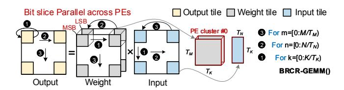

# 3.3 Bit-grained Progressive Prediction (BGPP)

As introduced in §2.2, the core idea of top-k prediction is to estimate the attention matrix with a low-overhead paradigm, then pick up important Key indices. However, even utilizing the low-precision paradigm (e.g. 4bit with MSB only), the value-based strategy still

Figure 11: Illustration for quantization process in MCBP.

Figure 12: The tiling strategy for GEMM in MCBP.

causes unnecessary memory access and computation (Fig.5 (c)). Therefore, a more efficient prediction scheme is a must.

BGPP addresses this by leveraging the relative nature of softmax: if an input's gap from the current max exceeds a threshold, its softmax output will be near zero[72]. Thus, the gap (termed *radius*) with the current max value can be used to filter trivial Keys.

We propose a bit-grained progressive filter mechanism to achieve this. *Progressive* means: it performs multiple rounds of filtering, where in each round, incremental filtering is applied based on the Keys (Ks) selected in the previous round. Fig. 9 gives an illustration for this procedure. Assume the initial state consists of 6 Ks (K0-K5). In the first round, we fetch the MSB of all Ks for computation with  $Q_i$  (with 4 bit), and obtain the estimated Max attention value denoted as  $\max(\hat{A}_i^1)$ . Then, based on Eq.(1), a radius-calculated (RS) filter obtains the filtering threshold for the current round. Then, it retains the indices ( $K_{id}$ ) of the Ks (e.g. 1,3,5), whose attention values are greater than this threshold. In the next round, we only fetch the second bit of the  $\{1,3,5\}$ -th Ks from HBM. This process continues for the predetermined number of rounds.

Instead of directly adopting a fixed value as the threshold, for round r, we set the filter threshold of the i-th row as  $\theta_i^r$ :

$$\theta_i^r = \max(\hat{A}_i^r) - \alpha_r \times radius, \ 0 \le \alpha_r \le 1,$$
 (1)

where  $\hat{A}_i^r$  is the estimated attention of the *i*-th row (During *decoding* stage, i=0). Based on our experiments, we empirically set the default radius to 3 and use a parameter  $\alpha_r \in [0, 1]$  to control the threshold. By adjusting  $\alpha_r$ , we can control the pruning ratio in each round.

