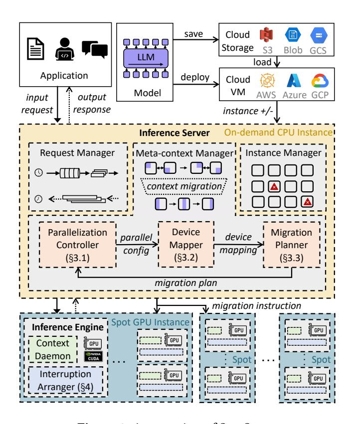

# 3 SpotServe Design

The increased request inference latency caused by instance preemption is mainly manifested in three aspects. Firstly, once a preemption happens, the entire inference pipeline comes to a halt, which may result in request waiting overhead and/or additional request pending overhead (i.e., rerouting to another inference pipeline). Secondly, after a new instance joins, there are necessary system initialization costs, such as launching the distributed inference engine and loading model parameters. Finally, throughout this process, the overall reduction in system throughput can potentially lead to an accumulation of subsequent incoming requests, thereby amplifying their inference latency.

We develop SpotServe to mitigate the impacts of these issues on the end-to-end inference latency. First, to alleviate the waiting time caused by the integration of new instances, SpotServe facilitates the integration of on-demand instances to ensure swift instance acquisition. Second, to reduce the runtime overhead of system re-initialization, SpotServe introduces an efficient context management mechanism that leverages inter-instance network links to preserve inference progress (in the form of KV cache) and obviate the need for expensive model parameter reloading. Third, to strike a better balance among serving throughput, latency, and monetary cost during node availability fluctuations, SpotServe incorporates a workload-aware adaptive configuration optimization algorithm, which dynamically selects an optimal parallel configuration, enabling real-time dynamic context migration and seamless configuration transitions.

**Figure 3.** An overview of SpotServe.

