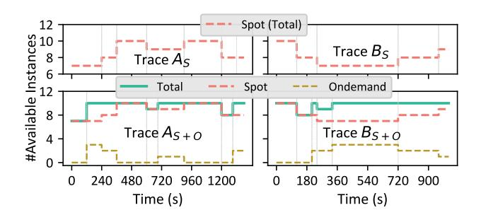

# 6 Evaluation

## 6.1 Experiment Setup

**Baseline.** To our knowledge, SpotServe is the first distributed LLM serving system for spot instances. Therefore,

**Figure 5.** Trace  $A_S$  and  $B_S$  are extracted from real trace, while  $A_{S+O}$  and  $B_{S+O}$  are traces created by Algorithm 1 mixing ondemand instances based on  $A_S$  and  $B_S$ . Each instance has four GPUs.

we build two baseline systems on top of FasterTransformer by generalizing two representative ideas of prior work. The first baseline is request *rerouting*, which dynamically reroutes interrupted requests to other available pipelines when preemption happens. It takes a fixed pre-defined model parallel configuration and adaptively drops/adds inference pipelines. The second baseline performs model *reparallelization*, which changes the parallel configuration like SpotServe but has to restart and reinitialize all instances without context migration. Both of them handle preemption in a reactive manner that interrupts all current requests and recompute them later. They are implemented using the same inference engine as SpotServe to conduct fair comparisons. Redundancy-based approaches, which serve several model replicas at the same time, are not included due to the huge cost of serving LLMs.

*Models.* We evaluate SpotServe on three LLMs at different scales, including OPT-6.7B [60], GPT-20B [40], and LLaMA-30B [49]. Table 1 summarizes the minimum number of GPUs to serve these models and the corresponding model parallel configurations and their single-request execution latencies.

**Setting.** We collect a real 12-hour availability trace using the AWS g4dn spot instances and extract two representative 20-minute segments (i.e.,  $A_S$  and  $B_S$  in Figure 5) with different dynamic behaviors. For reproducible comparisons, we replay these traces on the AWS g4dn.12xlarge instances (4 NVIDIA Tesla T4 GPUs per instance) in our evaluations. We include both stable and fluctuating inference request arrival workloads. For static workloads, considering that different models have different computational requirements, we set different request arrival rates for them (i.e., 1.5, 0.35 and 0.2 requests/s for OPT-6.7B, GPT-20B and LLaMA-30B by default respectively). To simulate the bursty in real workloads [28], we use the Gamma request arrival process with a coefficient of variance (CV) of 6. Moreover, we separately evaluate the system performance under the condition of whether to allow

**Figure 6.** End-to-end serving performance comparison among SpotServe, Reparallelization, and Rerouting. The x-axis shows the average and various tail latencies achieved by different approaches, while the numbers report SpotServe's latency improvement compared to the baselines.

Figure 7. Monetary cost comparison on GPT-20B.

mixing with on-demand instances. To achieve that, we generate two additional traces (i.e.,  $A_{S+O}$  and  $B_{S+O}$  in Figure 5) following Algorithm 1 to opportunistically allocate on-demand instances and mix them up with spot instances. For dynamic workloads, we include a production trace MAF [42] publicly released by Microsoft and discussed in §6.3. In our experiments, we set  $S_{in}$  and  $S_{out}$  to be 512 and 128 respectivey, and select the maximum batch size B from {1,2,4,8}.

## 6.2 Comparison on Stable Workload

End-to-end inference latency. Figure 6 shows the latency performance of all three models on stable workloads. SpotServe outperforms both Rerouting and Reparallelization in terms of all latency metrics on four different traces. Taking the P99 latency as an example, SpotServe outperforms Reparallelization and Rerouting by 1.34-2.43× and 2.14-9.13× respectively on the largest LLaMA-30B model. The improvement mainly comes from three aspects: dynamic reparalleization, efficient proactive migration, and stateful inference recovery.

Compared with Reparallelization, a key advantage of Spot-Serve is its lightweight context migration mechanism. Prior approaches such as Varuna [12] require restarting the system for each reparallelization and their contexts are lost. In addition, reloading all model parameters and recomputing all interrupted requests also incur long tail latency.

Compared with Rerouting which directly drops an entire inference pipeline to handle preemption, SpotServe achieves better resource utilization thanks thanks to the reparalleization and migration optimizations. It also explains why many cases of Rerouting in Figure 6 are overload (i.e., marked with dashed line, representing the system serving capability becomes lower than the request arrival rate and request accumulation happens). Taking GPT-20B as an example, when the instance availability is high ( $\geq 8$  instances), Rerouting supports a configuration of (D = 2, P = 2, M = 8) with minimum inference latency and sufficient system throughput (i.e., larger than 0.35 requests/s). Once an instance is preempted, Rerouting has to drop one inference pipeline and degenerates to (D = 1, P = 2, M = 8), which makes upcoming requests stacked and unable to be served in time. However, SpotServe will serve requests using the parallel configuration (D = 2, P = 3, M = 4) to avoid overload. Spot-Serve may occasionally propose the same configuration as Rerouting but still achieves superior performance because of the KV-cache recovery mechanism. Another observation is that mixing on-demand instances helps alleviate overload due to the faithful instances acquisitions.

Monetary cost. Besides inference latency, we also study their monetary cost to understand whether it is cost-effective to serving LLM using preemptive instances. Figure 7 presents the per-token costs of all baseline systems and their latency on GPT-20B. We also show the results (with the dashed line) of only using on-demand instances, which are more expensive than spot instances (e.g., 3.9 USD/h v.s. 1.9 USD/h for each g4dn.12xlarge instance). As the cost decreases, the latency of on-demand instances exhibits a significant increase since it is unable to meet the required serving capability with fewer on-demand instances. In contrast, serving LLMs on spot instances strikes a better balance between inference latency and monetary cost. SpotServe reduces monetary cost by up to 54% while tolerating a relatively modest increase (i.e., less than 18%) in average latency and 90% reduction in

**Figure 8.** (a) Rescaled MAF trace. (b) The selected trace segment. (c)(d) Two traces based on the fluctuating workload trace. (e)(f) End-to-end serving performance. (g)(h) Per-request latency throughout the traces, and parallel configurations (D,P,M) after each re-parallelization. Note that the configuration of Rparallelization is always consistent with SpotServe.

P99 tail latency. Such cost advantage would be more significant on other instance types with higher ratios between on-demand and spot prices.

Ablation study. Figure 9 shows the P99 tail latency and average latency of GPT-20B on two traces with different Spot-Serve components. We start from SpotServe and gradually disables each system optimization one by one. By removing the parallelization controller, the tail latency increases by 179% on trace  $B_S$ . This is because the parallelization controller suggests switching to a new configuration with higher throughput to handle the stacked requests. If we further disables the migration planner, the tail latency further increases by 1.4× and 3.1× on traces  $A_S$  and  $B_S$  respectively. Note that the migration planner also reduces the minimum number of GPUs to serve GPT-20B from 16 to 12, which enlarges the parallelization controller's exploration space. The interruption arranger also contributes to 29% tail latency reduction on trace  $B_S$  as it transfers the cache context during migration and avoids redundant computation for interrupted requests. Finally, after removing the device mapper, the system degrades to a plain approach that only enables model context maintenance without any other optimizations. On the whole, combining these optimizations reduces the tail latency by 1.61× on trace  $A_S$  and 3.41× on trace  $B_S$  respectively.

## 6.3 Comparison on Fluctuating Workload

To study SpotServe's auto-scaling performance, we replay a piece of the MAF trace [42] and rescale its arrival intensity like prior work [10, 18, 59] to make it compatible with our experimental setup. Figures 8a and 8b show that the selected trace includes fluctuating and bursty workload, which is representative in real-world environments. We enable mixing with on-demand instances in this experiment, and the generated instance availability traces (i.e.,  $A_{S+O}^{'}$  and  $B_{S+O}^{'}$ ) are

**Figure 9.** Ablation study of GPT-20B on traces  $A_S$  and  $B_S$ .

listed in Figures 8c and 8d. The end-to-end inference latency statistics are shown in Figures 8e and 8f. Compared with Reparallelization and Rerouting, SpotServe reduces the P99 tail latency by up to 2.94× and 1.73×, respectively.

**Per-request latency study.** Figures 8g and 8h show the inference latency of individual arrival requests over time for both traces. SpotServe almost always achieves the lowest latency during the whole trace due to its flexible parallel configuration optimization and the lightweight context migration. We take Figure 8h as an example to conduct an in-depth analysis. First, all approaches start with a feasible parallel configuration of (D = 2, P = 2, M = 8) as there are ten spot instances available at t = 0s. Preemption first occurs at t = 120s and t = 240s but the total available instances are still enough to support (D = 2, P = 2, M = 8). Two short concave segments (i.e., 120s-310s, 240s-330s) in the number of available instances are following because the new instance launching and initialization overhead is longer than the 30s grace period. From t = 270s, the increasing arrival rate overwhelms the system processing capacity. After 30s, such overload is detected and both SpotServe and Reparallelization change the parallel configuration to

(D=3, P=3, M=4). The instance acquisition completes at t=450s, so they change to (D=3, P=2, M=8) for lower latency. But Reparallelization is suffering from expensive restarting overheads, resulting in the highest peak latency. Rerouting only changes the number of pipelines and incurs some request waiting overheads. After t=600s, the arrival rate decreasing is detected and on-demand instances start to be released, then both SpotServe and Rerouting turn back to (D=2, P=2, M=8). As a result, SpotServe significantly outperforms the two baselines for the fluctuating workloads.

#### 7 Related Work

**DNN** inference system. The widespread DL applications bring great market values and lead to significant DL serving traffics. Some prior approaches (e.g., Clipper [15], Clockwork [18], Nexus [43], and so on) consider temporal multiplexing and increase the GPU utilization through batching and better scheduling. INFaaS [41] studies the model selection problem when considering multiple models with different inference efficiency or accuracy. Shepherd [59] considers both the resource utilization and the serving system effective throughput and improves the request scheduling. There are also some inference systems take customized GPU kernel optimization for Transformer models, like TurboTransformer [17] and LightSeq [52]. Some recent inference systems (e.g., FasterTransformer [5], Orca [56], DeepSpeed [11], SpecInfer [32], AlpaServe [28]) support LLM inference by leveraging the parallelization techniques from distributed training approaches. Among them, AlpaServe is designed for resource multiplex scenarios and does not show performance superiority in our empirical study on single LLM inference scenarios (i.e., around 3× lower than FasterTransformer C++ version). Almost all of these prior work are designed for dedicated instances and can not tolerate instance preemptions.

**ML Serving over Spot Instance.** Previous approaches have also involved spot instances into ML inference systems. Cocktail [19] leverages cheap spot instances to increase the number of ensembling models and instance preemptions can lead to certain intermittent loss in accuracy. MArk [57] studies the over-provisioning problem in previous auto-scaling systems (e.g., SageMaker) for ML serving and improves the cost-effectiveness by using a SLO-aware resource provision algorithm. It also considers involving spot instances for more cost savings but requires burstable CPU instances to handle the outstanding requests during instance interruptions. More importantly, these systems are mainly designed for traditional ML/DL workloads (e.g., stateless, image/text classification), which are fundamentally different from recent LLM workloads (e.g., stateful, text generation), no matter on per-request inference latency, model parallelization technique or preemption handling complexity. These approaches take a first step to use preemptible instances to serve ML

models and motivate our approach on distributed inference of LLMs.

Serverless Computing and ML Serving. There are some recent approaches [9, 27, 46] applying serverless computing to support ML inference workloads for better cost-effectiveness. However, severless functions are designed to be lightweight with limited computational power, memory and storage, and hard be provisioned with GPUs [14]. And serverless functions cannot directly communicate with each other, which is also necessary to support distributed inference of LLMs. As a result, it works well for small models but can not easily serve LLMs due to the hardware constraints.

#### 8 Limitations and Future Work

We introduce the limitations of our approach and outline avenues of future research in SpotServe. First, the key idea of SpotServe is to proactively handle instance availability changes, which strongly relies on the grace period. Although all cloud providers offer this functionality at present, it is still worth exploring more visionary solutions to improve the system performance, such as the combination with inference workload prediction [59] or instance availability prediction [54]. Second, our approach mainly focuses on single-type GPU instances. It is also possible to integrate heterogeneous instances [14, 30, 33] or even instances from different clouds (e.g., SkyPilot [55]) for monetary advantages. These scenarios also bring new challenges to context migration in SpotServe. Last, our approach currently takes inference latency minimization as the optimization target. As we mentioned in §3.2, it is still meaningful to explore other targets (e.g., strict SLO [20], high throughput [44]) to meet the needs of different inference scenarios. Besides, the exploration space of parallelization configurations can be enlarged to support emerging variants of large models (e.g., mixutreof-experts [26, 38]) in the future. While SpotServe focuses on spot instances, our techniques can easily generalize to other preemptible resources, e.g., resource scheduler may preempt resources for urgent jobs with switching overheads [53]. We believe that our approach inspires a new paradigm for distributed inference on preemptible instances, and the insights gleaned from SpotServe's design can motivate a variety of following-up research along this direction.

#### 9 Conclusion

This paper presents SpotServe, the first distributed LLM serving system on preemptible instances. Several key techniques in SpotServe enable fast and reliable serving of generative LLMs on preemptible instances. First, SpotServe dynamically adapts the parallelization configuration to make the system serving capability compatible with the workload. The configuration optimization considers the trade-offs among throughput, latency and monetary cost. Second, to minimize

the reparallelization overheads, we design the device mapping algorithm and the migration planning mechanism to achieve efficient context migration. Finally, to take advantage of the grace period offered by the cloud provider, we introduce stateful inference recovery, which allows SpotServe to commit inference progress at a much finer granularity. We evaluate SpotServe on real traces and various scales of popular LLMs and show that SpotServe can save 54% monetary cost compared with on-demand instance and reduce the P99 tail latency by 2.4 - 9.1× compared with existing approaches.

