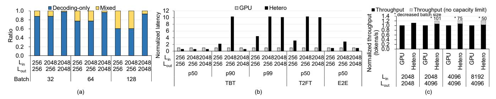
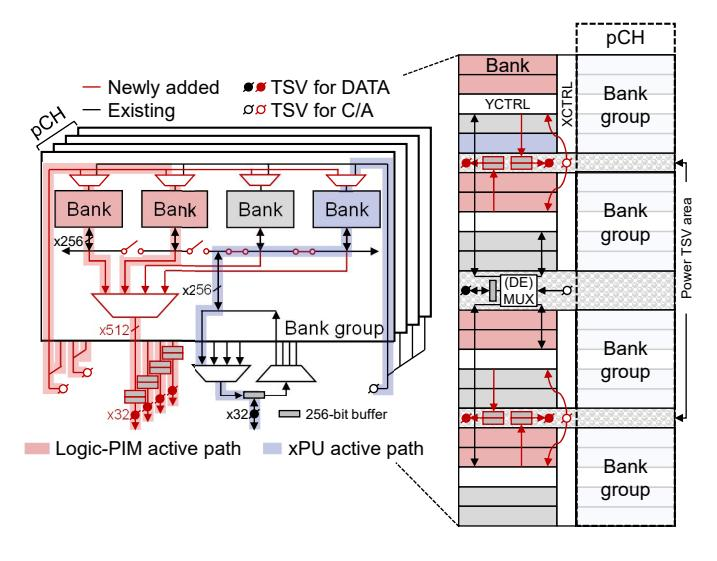

# *A. Implementation of High Op/B Processors*

For high-Op/B operations, conventional accelerators, such as GPUs and TPUs, are eligible candidates for a high Op/B processor. We assume that a popular GPU architecture equipped with HBM serves as a high Op/B processor for

Fig. 5. (a) The ratio of decoding-only stage to mixed stage in Mixtral on a GPU system. (b) The normalized latency of a heterogeneous system compared to a GPU system in Mixtral with a batch size of 32. The GPU system consists of four GPUs, while the heterogeneous system consists of two GPUs and two Logic-PIMs (details in Section IV). (c) The normalized throughput of the heterogeneous system over the GPU system in Mixtral with a batch size of 128.

Fig. 6. Our DRAM die microarchitecture of HBM3 for Logic-PIM. Logic-PIM and xPU can operate simultaneously through independent active paths.

Duplex. Hereafter, we refer to the processor as xPU. Numerous processing units in xPU provide extremely high computational throughput, but the HBM bandwidth is limited due to the physical limitations of the interposer connecting HBM stacks with the main computing die.

