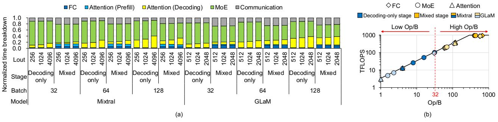

# *C. LLM Inference with Continuous Batching*

LLM inference involves a single prefill (summarization) stage followed by multiple decoding (generation) stages. The former takes the entire input tokens of length Lin, passes them through the model, and generates key and value (KV) matrices as well as the first output token. A sequence of decoding stages follows iteratively; a decoding stage receives a single output token from the previous stage and passes it through the model in a sequential manner. Each decoding stage generates KV vectors for the input token, which are concatenated to the KV matrices, and a new output token. Multiple decoding stages are required to constitute the output response of length Lout.

LLM inference can process multiple requests in a batch to increase serving throughput. Both on the prefill and decoding stages, the FC layers from QKV generation, projection, and FFN layers can be batched to form GEMM operations between the batched input tokens and the weight matrices. However, batching requests is not effective for the attention operation. The attention operation must be performed separately for each request because the unique KV matrices corresponding to the context of each request are used.

To increase serving throughput, continuous batching [\[56\]](#page-14-2) is widely used. It divides each LLM inference into multiple stages and batches the requests at the stage level (see

Fig. 3. Model distribution methodology and operation flow of an LLM in a multi-node/multi-GPU system [46]. For non-expert weights, systems exploit tensor parallelism in the node, and data parallelism across nodes. For expert FFNs, the system allocates each expert FFN to a different GPU.

Fig. 2(b)). This stage-level scheduling can reduce the queuing delay of new requests and the time-to-first token (T2FT), the latency it takes for the first token to be generated upon request arrival. We categorize each stage into the following two types depending on the presence or absence of a prefill stage request. 1) mixed stage: prefill stages of newly added requests are batched with decoding stages of existing requests. 2) decodingonly stage: all requests of a batch are in the decoding stage if there is no new request to be served at the moment a new stage starts. We refer to the latency between two consecutive token generations as token-between-token latency (TBT) and the request handling latency from arrival to completion as end-to-end latency (E2E). In each stage, we refer to the requests performing decoding as decoding sequences and those performing prefill as prefill sequences. Hereafter, batch size is determined by the number of requests in a stage.

## D. High Bandwidth Memory (HBM)

HBM has a 3D-stacked structure with one logic die at the bottom and multiple DRAM dies. The logic die consists of I/O circuitry, memory built-in-self-test, and testing and debugging units [29], [30]. Through silicon vias (TSVs) connect the DRAM dies to the logic die. We focus on 8-hi HBM3, deployed on the latest GPUs (e.g., NVIDIA H100). In HBM3, four DRAM dies form a rank, and each DRAM die has eight pseudo channels. Each pseudo channel is connected to four bank groups of four banks, totalling 16 banks in the rank. The banks share external wires within a single pseudo channel, allowing them to read data from only one bank at a time.

## III. COMPUTATIONAL ANALYSIS

We analyze how MoE-based LLMs with MHA or GQA perform on a multi-GPU system and explore available options to enhance the performance. We follow the data/model/expert parallelism methodologies from [46] for the job distribution among the GPUs. Fig. 3 shows an exemplar model distribution of an LLM with four expert FFNs in the system consisting

of two nodes with two GPUs each. The system uses expert parallelism for the MoE layers, which distributes expert FFNs across the GPUs.1 For the FC layers excluding MoE, the system uses tensor parallelism by partitioning rows or columns of a weight matrix within a node and data parallelism by distributing requests across the nodes.

#### A. Computational Analysis of MoE and Attention Layers

The MoE and attention layers are dominant in both the decoding-only stage and the mixed stage (Fig. 4(a)). Although adopting MoE increases the amount of computation just by k, the number of expert FFNs chosen by a gate (e.g., k=2 [8], [23], [55]), independent requests as a whole are expected to explore most of the expert FFNs in the model ( $N_{ex}$ ); thus, memory access skyrockets to load  $N_{ex}$  expert FFNs, which in turn raises latency. In the case of the attention layer, as shown in prior work [40], the throughput improvement from batching diminishes because each request accompanies its own KV matrices. Therefore, as the sequence length and the batch size increase, the significance of attention layers increases.

MoE and attention layers exhibit low Op/B in the decoding-only stage (see Fig. 4(b)), which severely reduces GPU utilization. Compute utilization becomes lower than 11% for the MoE layer and 2.06% for the attention layer on GPUs. Because the tokens in the batch are distributed among the experts by gate, each expert processes a relatively small number of tokens because k is smaller than  $N_{ex}$ . Still, multiple requests can share the same expert, resulting in the Op/B becoming higher than one. Second, as multiple heads share KV matrices, the attention layer exhibits higher Op/B for GQA (Mixtral) than for MHA (GLaM), but Op/B remains low even with GQA. Unique KV matrices exist for each request and for each head (MHA) or each group (GQA), resulting in a GEMV with a Q vector or a GEMM with a narrow  $deg_{qrp}$ -wide Q matrix,

 $^{1}$ If the number of GPUs ( $N_{\mathrm{GPUs}}$ ) exceeds the number of experts, then each expert is allocated  $\frac{N_{\mathrm{GPUs}}}{N_{\mathrm{ex}}}$  GPUs using tensor parallelism.

Fig. 4. (a) Execution time ratio of each operation in Mixtral [\[23\]](#page-13-6) and GLaM [\[8\]](#page-13-3) varying Lout and batch size while Lin = 2048. Mixtral (GLaM) uses deggrp " 4 p1q for the attention layer and uses 8 (64) experts in the MoE layer with each token selecting the top-2 experts. (b) The roofline graph for each model on GPUs with varying batch sizes (32–128) when Lin = 2048 and Lout = 1024. Details of systems are in Section [VI.](#page-8-0)

where deggrp ranges from four to eight [\[23\]](#page-13-6), [\[51\]](#page-14-4), [\[55\]](#page-14-10). This computation exhibits low Op/B.

The request batch size also significantly impacts the Op/B except for the attention layer, which is performed separately for each request. In particular, utilizing a larger batch size increases the Op/B of the MoE layer as more requests in a batch share the same expert. Nevertheless, for practical batch sizes abiding by the latency limitation imposed by the service level objective (SLO) and memory capacity for KV matrices, the attention and MoE layers stay in the low Op/B region.

In the case of mixed stage, the Op/B of MoE and attention layers increases. A new request added to mixed stage increases the number of tokens that select each expert, increasing the Op/B of the MoE layer. The new request causes numerous tokens, much more than decoding-only stage by Lin, pass through the MoE layer, resulting in a higher number of tokens processed per expert. In the attention layer, the operation for the new request exhibits a high Op/B because Lin Q slices share the same KV matrices for each head.

