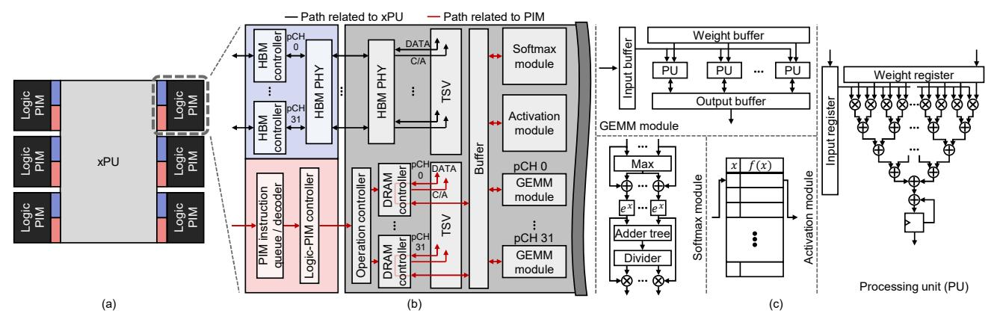
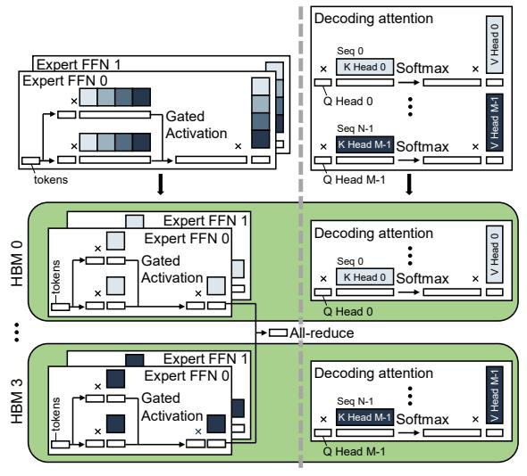
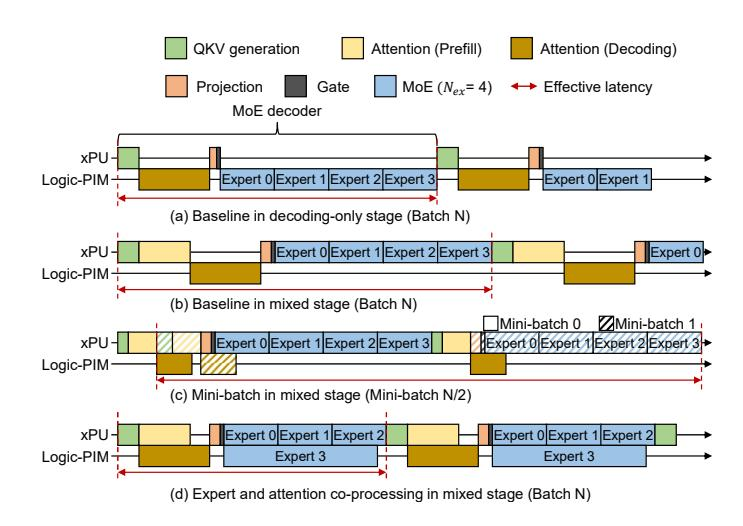
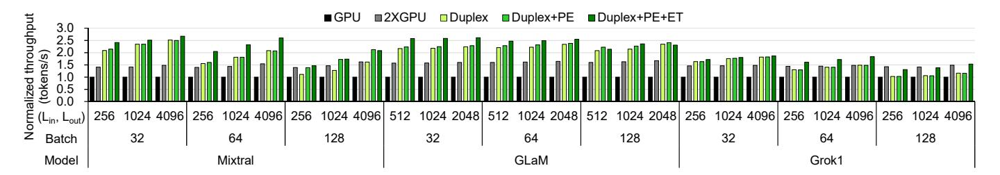
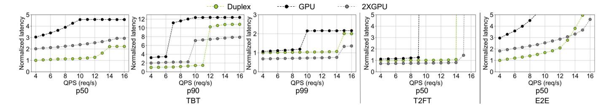
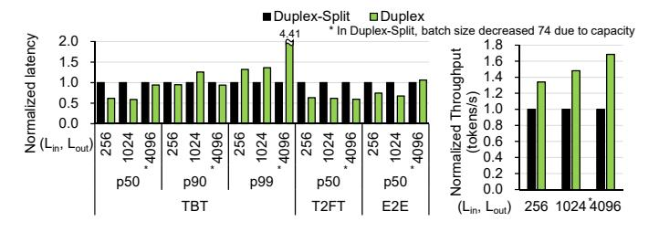

# C. Microarchitecture of Logic-PIM

In designing Logic-PIM, we set two main objectives of minimizing modifications to DRAM and reducing the internal DRAM datapath length to reduce the energy required to read data [37]. In providing  $4\times$  higher memory bandwidth, simply increasing the bandwidth of each bank incurs a significant overhead of quadrupling the prefetch size of the banks and increasing the I/O datapath width by  $4\times$ . This results in a 77% increase in the size of the DRAM banks and necessitates changes to the DRAM bank layout [37].

Instead, we increase the number of banks operating simultaneously without modifying the structure of the DRAM banks. Conventional memory systems share bank I/O and bank group I/O, allowing data to be read from only one bank at a time. We place switches between each bank I/O and separate their paths to enable reading data simultaneously from multiple banks (see Fig. 6). Because reading data from the same bank group takes twice as long (tCCD\_L) as that from different bank groups (tCCD\_S), we simultaneously read from eight banks to achieve 4× higher bandwidth. We divide 16 banks for a single rank and a pseudo channel into upper (colored red in Fig. 6) and lower banks and make each group of eight banks operate as one unit, which we refer to as bank bundle.

We integrate additional TSVs for Logic-PIM in the conventional HBM's power TSV area instead of data TSV area. To

Fig. 7. (a) Top view of Duplex chip, (b) the architecture of Logic-PIM, and (c) the details of processing units.

Fig. 8. The normalized energy-delay-area product (EDAP) of Bank-PIM, BankGroup-PIM, and Logic-PIM by Op/B of FP16 GEMM operation. Weight matrix is (16384×4096). Details about each architecture are in Section VI.

transmit data read from each bank in a bank bundle to the logic die, we must connect the Logic-PIM-path I/O from each bank group to the TSVs. Adding TSVs for Logic-PIM to the existing data TSV area would result in longer datapaths from each bank group, thereby consuming more energy [37]. By placing Logic-PIM TSVs near the areas for power TSVs, we reduce the length of Logic-PIM-path I/O from each bank to TSVs and minimize the wiring overhead.

xPU and Logic-PIM can read data simultaneously using bank bundle parallelism. Logic-PIM sends the same command/address (C/A) to the target bank bundle, thus simultaneously reading data from eight banks. Logic-PIM reads a total of 512 bits from two banks per bank group at intervals defined by tCCD L, which travels to the I/O buffer in the additional TSVs installed, and the data is transferred through the TSV to the logic die. In the case of the xPU path, a simple switch separates it from the Logic-PIM datapath, allowing xPU to read data from the other bank bundles even when Logic-PIM is accessing data. Each pseudo channel comprises four bank bundles, organized into two ranks with two bank bundles per rank, with indices set from one to four. To prevent bank bundle conflicts when simultaneously using Logic-PIM and xPU, we strategically allocate the weights of models and KV matrices considering the index of bank bundles.

#### D. Duplex Architecture

Fig. 7(a) shows the overall design of Duplex. An xPU in the center is responsible for high-Op/B operations. A Logic-PIM (Fig. 7(b)) is connected to a conventional HBM controller to read data for high-Op/B operations, and is also connected

to a Logic-PIM controller, which controls the processing units in Logic-PIM. Unlike HBM controllers, the Logic-PIM controller does not receive data from Logic-PIM. Instead, all computations are performed on the logic die. Thus, only control pins are used to connect Logic-PIM with the controller, resulting in minimal pin overhead.

Logic-PIM consists of a simple DRAM controller for fetching data from HBM, GEMM modules for performing low-Op/B GEMM operations, a buffer, and modules for softmax and activation functions. The Logic-PIM controller sends Logic-PIM the starting addresses of weights and inputs, as well as the dimensions of the GEMM to the operation controller. Upon receiving a compute request from the Logic-PIM controller, the operation controller fetches data via the DRAM controller and performs computations using the GEMM module. The activation module handles the activation in the MoE layers, and the softmax module is used for the attention layer.

#### E. Comparing Duplex with prior PIM architecture

Duplex is more suited for contemporary LLMs than prior PIM architectures that add processing units to DRAM dies. Duplex exhibits a better energy-delay-area product (EDAP) for GEMM operations above 8 Op/B over prior DRAM diebased PIM architectures (see Fig. 8, prior PIM architectures are detailed in Section VI). At Op/B under eight, Bank-PIM, which can utilize the highest memory bandwidth, shows the best EDAP. However, as the Op/B of operations increases, Bank-PIM, with its limited computing power, becomes less efficient compared to Logic-PIM. Although BankGroup-PIM has the same memory bandwidth and computing power as Logic-PIM, it always exhibits a higher (worse) EDAP due to having all its processing units and buffers on the DRAM die, resulting in a larger area overhead than Logic-PIM.

#### V. END-TO-END LLM INFERENCE USING DUPLEX

#### A. Processing MoE and Attention Layers Using Logic-PIM

We propose a method for distributing computations assigned to each device across Logic-PIM stacks. Fig. 9 illustrates how the computations for the MoE and attention layers of decoding sequences are divided into four Logic-PIM stacks. For the expert FFNs in an MoE layer, assigning a different

Fig. 9. MoE and attention layers distributed among HBM stacks in a device. The shades of blue indicate which HBM each chunk of data is stored in.

expert to each Logic-PIM could lead to varying execution times across Logic-PIM due to differences in the number of tokens processed by each expert. We distribute each expert FFN computations across all Logic-PIM for load balancing across Logic-PIM. However, this approach may necessitate inter-Logic-PIM communication to obtain the final results.

To minimize communication, we first distribute the weights for gate-projection and up-projection by slicing them columnwise across all Logic-PIM. Since gated activation is an element-wise operation, it can be performed without additional data movement. Afterward, when computing down-projection, each Logic-PIM ends up holding partial sums of the final output of the expert FFN. Performing an all-reduce operation among the Logic-PIM within the device yields the final result of the expert FFN. This all-reduce operation is processed by an xPU, which reads and processes all the partial sums stored in the memory of each Logic-PIM. We minimize communication overhead by conducting a single all-reduce operation after all expert FFNs have completed their computations, rather than performing it after each expert FFN.

Duplex uses request and head parallelism for attention operations. Because attention operations among different requests have no data dependency, requests can be fully parallelized. As each head operates on separate slices of the Q vector and KV matrices, heads can also be fully parallelized.

#### B. Expert and Attention Co-processing

To increase the utilization of xPU and Logic-PIM, we propose expert and attention co-processing. In LLM inference, the presence of data dependencies between layers makes simultaneous computation in xPU and Logic-PIM challenging. Fig. 10(a) and (b) illustrates a naïve operation flow where only an xPU or Logic-PIM is used at any given time.

One simple way to simultaneously utilize xPU and Logic-PIM is by dividing the workload into two independent mini-batches that have no data dependencies between them (Fig. 10(c)) [17]. These mini-batches enable simultaneous

Fig. 10. Operation flows of Duplex. Comparison of (a)–(d) for the same total batch size (N) with the same capacity of KV cache, considering the total device memory capacity. For convenience, the decoding-only stage is depicted at a larger scale compared to the mixed stage.

operations in xPU and Logic-PIM by alternating between layers, but it has disadvantages. The batching effect is reduced for the FC and MoE layers as these layers operate with half the batch size compared to the baseline method, leading to decreased data reuse. While attention operations are unaffected because each request processes independent values, the FC and MoE layers see no reduction in execution time when their operations are memory-bound, even with a reduced batch size. This can lead to increased latency compared to the baseline. Moreover, processing the same batch size doubles the amount of model parameters being read, resulting in higher DRAM read energy.

We propose expert and attention co-processing to increase the utilization of both processors, while maintaining the batching effect of the FC and MoE layers. Expert FFNs in MoE layers do not have data dependencies between them, enabling simultaneous computation. Because all tokens independently pass through a gate to select experts, the number of tokens processed by each expert can vary. Experts with relatively fewer tokens are processed in Logic-PIM, while the rest are handled in xPU in both decoding-only stage and mixed stage, thus preserving the batching effect of MoE layers while reducing its latency.

Because the number of tokens processed by each expert is determined after passing through gates, selecting which experts to process on each device may incur overhead. Duplex must decide which experts to allocate to either xPU or Logic-PIM based on the time to process each expert with how many tokens are processed with each processing unit. To minimize overhead, Duplex preliminarily estimates and stores the processing times for experts in both xPU and Logic-PIM, depending on the number of processed tokens. At runtime, Duplex uses this lookup table to determine which experts to process in Logic-PIM. First, Duplex calculates the total time to process all experts using only xPU. Then, it progressively assigns the experts with the fewest tokens to Logic-PIM,

aiming to find the best combination for processing experts. Then, xPU sends PIM instructions to Logic-PIM to process the corresponding experts. This lookup table-based decision-making is considerably faster than the actual execution of the expert layer, and its time impact can be considered negligible.

Using expert parallelism may diminish the impact of expert co-processing. With fewer experts processed in each device, the degree to which they can be split between xPU and Logic-PIM is limited, reducing the effectiveness of expert co-processing. Thus, we choose to apply tensor parallelism for MoE layers, splitting each expert across all devices. In the multi-node system, where the bandwidth between nodes is relatively lower than within the same node, we use expert parallelism between nodes and tensor parallelism within nodes.

Second, the mixed stage involves processing attention for both the decoding sequences and the prefilling sequences. As attention operations can be processed individually for each request, the attention of prefilling sequences is handled by the xPU, and that of decoding sequences is processed in Logic-PIM, allowing us to process the attention layer more quickly.

#### C. Memory Allocation and Management

To support co-processing, we divide all the memory space in the device into four sections based on the index of the bank bundle. Each memory space uses bank bundles in all channels. For the expert FFNs, we allocated them one by one across these four memory spaces. During expert co-processing, Duplex processes all the experts within the memory space with either Logic-PIM or xPU, thus preventing any bank bundle conflicts between Logic-PIM and xPU.

For the KV cache used in the decoding sequence, we have alternately allocated it among three of the memory spaces, while the remaining memory space is designated for storing Q, K, and V matrices used in the attention of prefilling sequences, thus enabling attention co-processing. As the K and V matrices used in the prefilling sequences should be cached for the next stages, we need to migrate the K and V matrices to the other bank bundles for the next stage. After the attention operation is finished, xPU moves the K and V matrices to the bank bundle designated to store KV cache. Considering that this migration is performed only once, the overhead is negligible. The parameters for the other layers are used exclusively in xPU and are allocated in any remaining memory spaces.

## VI. EXPERIMENTAL SETUP

We compare Duplex with a baseline NVIDIA H100 GPU [35]. To quantitatively evaluate the performance improvement, we also compare with 2×GPU, a system equipped with twice as many devices. We configured xPU in Duplex to have the specifications equivalent to H100, which replaced HBM3 with our proposed Logic-PIM with no change in memory capacity (16 GB per stack, 8-hi (two ranks) per stack, and 80 GB per device). Logic-PIM gains additional 4× memory bandwidth over conventional HBM3 by adding dedicated TSVs from DRAM dies to a logic die. We incorporated processing units in Logic-PIM to achieve peak FLOPS for 8

TABLE I
MODEL CONFIGURATION USED FOR EVALUATION

| Model                  | Param.              | # layer        | Hidden               | Interm.                 | # head         | $deg_{grp}$                   | $N_{ex}$     | top-k |
|------------------------|---------------------|----------------|----------------------|-------------------------|----------------|-------------------------------|--------------|-------|
| Mixtral   GLaM   Grok1 | 47B 143B 314B | 32 32 64 | 4096 4096 6144 | 14336 16384 32768 | 32 32 48 | 4 (GQA) 1 (MHA) 6 (GQA) | 8 64 8 | 2 2 2 |
| OPT    Llama3       | 66B 70B          | 64 80       | 9216 8192         | 36864 28672          | 72 64       | 1 (MHA) 8 (GQA)            | -            |       |

Op/B (21.3 TFLOPS per Logic-PIM stack). For Bank-PIM, we assume 16× bandwidth than conventional HBM with a peak Op/B of 1, twice as high as HBM-PIM [29]. Bankgroup-PIM has the same memory bandwidth and computing power as Logic-PIM, but processing units are in the DRAM die. Both Bank-PIM and Bankgroup-PIM have softmax and activation units on the logic, similar to Logic-PIM.

To fairly compare the Duplex and GPU, we set the memory capacity of each system to be the same. With eight or fewer devices, we assume they are interconnected using bidirectional 900GB/s NVLink, similar to an HGX system [36]. For configurations with more than eight devices, we assume that each set of eight devices forms a node and that these nodes are interconnected via a system with a 400GB/s Infiniband [13].

We developed a cycle-accurate simulator for modeling systems with Duplex and GPUs using Ramulator [12], [33]. Our simulator is composed of two main components: a serving scheduler and a cluster. To support continuous batching, we implemented a serving scheduler that manages ongoing inference requests. The cluster receives device specifications and system configurations; then, it generates device components. Based on the model distribution methodology, the simulator distributes model weights across these device components. The operation of our simulator proceeds as follows: 1) The serving scheduler generates information about the requests being processed at each stage (e.g. prefilling or decoding of each request and the current sequence length) and sends them to the cluster. 2) Upon receiving the requests, each device component within the cluster executes the assigned operations and results execution times. For Logic-PIM, we have modified the Ramulator, specifically the DRAM controllers and internal DRAM behavior models, to enable simultaneous data reading from all banks in the target bank bundle. We used the timing parameters of HBM3 [21] to simulate memory operations in both Duplex and GPU. For computing units, the timing data is calculated considering the number and the frequency of the computing units. The cluster additionally computes the communication time for data movement between devices considering the latency and bandwidth of the HGX system [36], and based on the execution times received from the device components, calculates the final execution times.

We used Mixtral [23], GLaM [8], Grok1 [55], OPT [61], and Llama3 [34] LLMs for evaluation. Mixtral and Grok1 have a structure with all MoE decoder blocks, while GLaM alternates decoder and MoE decoder blocks. In the MoE layer, Mixtral and Grok1 select two out of eight experts, and GLaM selects two out of 64 experts per token. To evaluate

Fig. 11. The normalized throughput of Mixtral, GLaM, and Grok1 for various ( $L_{in}$ ,  $L_{out}$ ) from (256, 256) to (4096, 4096), and batch sizes (32–128).

Fig. 12. The normalized latency (TBT, T2FT, E2E) of GLaM for various  $(L_{in},\,L_{out})$  from (512, 512) to (2048, 2048) with a batch size of 64.

the performance of Duplex in conventional LLMs without MoE, we also used OPT and Llama3. Mixtral, Grok1, and Llama3 uses GQA, and GLaM and OPT uses MHA. We used FP16 [38], [61] for weight precision. Considering the number of model parameters, we configured the default number of nodes and the number of devices within each node as follows; Mixtral, OPT, Llama3: one node with four devices, GLaM: one node with eight devices, Grok1: two nodes, each with eight devices. Unless specified otherwise, we applied the data and job distribution method described in Section III. For 2×GPU, we first increased the number of devices per node to a maximum of eight and increased the number of nodes. Details of the model configurations are summarized in Table I.

We used synthesized datasets to quantify the performance improvements of Duplex. We sampled the input and output lengths of each request using Gaussian distributions and represented the average of the input and output lengths for the sampled requests. For expert selection, we chose the target experts for each token using a uniform distribution [11]. To evaluate the performance in varying queries per second (QPS) situations, we injected requests into the systems following Poisson distributions [43], [56], [57] in the experiments shown in Fig. 13. Otherwise, we assumed that when the inference of a request is finished, the next request is added to the batch and processed together in the next stage using continuous batching.

To measure area overheads and energy consumption, we synthesized the major components of Duplex devices. We implemented arithmetic units in Verilog and synthesized them using Synopsys Design Compiler with a 7 nm predictive process design kit [6]. We set the operational frequency of arithmetic units of xPU as 1 GHz and Logic-PIM as 650 MHz considering tCCDS of HBM3, which is 1.5 ns. We modified FinCACTI [48] to match the published data of SRAM [4], [20], [22], [24], [50], [54] and used it to model the energy of SRAM-based buffers. We referred to [37] for the activation, read, write, and TSV energy of HBM. We adjusted the area

overhead for processing units and buffers on the DRAM die to 1z-nm DRAM technology [41], [47]. We then scaled the area overhead by factoring in that the DRAM process has  $10 \times 10^{-2}$  larger than the logic process for the same feature size [7].

#### VII. EVALUATION

#### A. Throughput Improvement of Duplex

Duplex shows higher throughput than GPU systems, with even  $2 \times \text{GPU}$  in most cases by efficiently performing low Op/B MoE layers and attention layers using Logic-PIM. Fig. 11 shows the normalized throughput (tokens per second) of Duplex for various batch sizes and  $(L_{in}, L_{out})$  configurations on three models compared to the GPU. To verify the performance enhancement of Duplex, we categorized Duplex into three configurations. Duplex is a device that uses only one of xPU or Logic-PIM at any given time, as shown in Fig. 10(a) and (b). Duplex+PE applies expert and attention co-processing, illustrated in Fig. 10(d). A device that incorporates tensor parallelism for MoE layers, as described in Section V-B, is referred to as Duplex+PE+ET.

Duplex already achieves up to  $2.51\times$  performance improvements compared to the baseline GPU system, even showing the best performance for the  $(L_{in},L_{out})=(4096,4096)$  case of Mixtral. There exist cases that Duplex outperforms the throughput of  $2\times$ GPU as Duplex utilizes greater memory bandwidth than that of  $2\times$ GPU in the low-Op/B operations, which dominates the total execution time.

When only co-processing is applied, we observe an 1.04× on average in throughput compared to Duplex. Because each device processes fewer experts (two in the case of Mixtral and one for Grok1), the benefits of expert co-processing are minimal. While attention co-processing also reduces the latency of mixed stage, it does not significantly improve throughput as decoding-only stage dominates the stages in LLM inference. Duplex+PE+ET enhances the effects of expert co-processing by employing tensor parallelism for experts as well, which increases the number of experts processed on each device, and increases throughput up to 1.36× and 2.67× compared to Duplex and GPU.

In large systems, performance improvements may be limited due to communication overhead between devices and nodes. Grok1 exhibits smaller performance improvements compared to the other models. This is due to Grok1's larger model size, which necessitates using two nodes for LLM inference. Relatively low bandwidth between nodes increases communication

Fig. 13. The normalized latency (TBT, T2FT, E2E) of Duplex, GPU, and  $2\times$ GPU for Mixtral varying queries per second (4 to 16). ( $L_{in}$ ,  $L_{out}$ ) is (4096, 512) and the maximum batch size is 128.

Fig. 14. The normalized throughput of Duplex and Bank-PIM in Mixtral, Llama3, and OPT for various  $(L_{in},\,L_{out})$  from (256, 256) to (4096, 4096) and batch sizes (32–64).

overhead, consequently diminishing the acceleration benefits for the MoE layer and attention layer using Duplex.

#### B. Latency Improvement of Duplex

Duplex significantly reduces the various types of latencies (TBT, T2FT, E2E) over GPU. Fig. 12 shows normalized latencies for  $L_{in}$  and  $L_{out}$  from 512 to 2048 in GLaM with a batch size of 64. On average, Duplex reduces the median TBT value by 58.3% by decreasing the execution times of the MoE layer and attention layer using Logic-PIM compared to GPU. Further, Duplex achieves even lower median TBT latency than 2×GPU. The stage corresponding to the median TBT latency is the decoding-only stage, where the low Op/B MoE and attention layers dominate the execution time. While 2×GPU utilizes twice as many processing units as Duplex to process the high-Op/B FC layer quickly, Duplex can utilize twice the memory bandwidth as 2×GPU for low-Op/B operations using Logic-PIM. By exploiting higher memory bandwidth using Logic-PIM when processing dominant low Op/B operations in the decoding-only stage, Duplex achieves a lower median TBT latency than  $2 \times GPU$ .

Even for median latencies of T2FT and 99th percentile for TBT, which primarily occur in the mixed stage well-suited to GPUs, Duplex+PE+ET achieves competitive latency improvements compared to  $2\times$ GPU. When  $L_{in}$  is 512, Duplex+PE+ET could decrease the 99th percentile of TBT and T2FT latencies up to 16.74% and 26.17% compared to  $2\times$ GPU. The Op/B of the MoE layer in the mixed stage is low enough to be accelerated by Logic-PIM, making the expert and attention co-processing more effective. When  $L_{in}$  is 2048, the Op/B of the MoE layers in the mixed stage increases and the Logic-PIM suffers from processing experts

due to fewer processing units; thus, Duplex+PE+ET shows similar 99th percentile TBT and T2FT with the  $2\times$ GPU. By efficiently handling both decoding-only stage and mixed stage, Duplex+PE+ET reduces E2E latency by an average of 60.20% and 35.38% compared to GPU and  $2\times$ GPU.

To evaluate the performance of Duplex under different serving intensities, we measured the latency of Duplex, GPU, and 2×GPU with varying QPS (see Fig. 13). Duplex always exhibits better median TBT latency than 2×GPU. Because the median TBT latency is generally achieved during the decoding-only stage, Duplex outperforms 2×GPU by exploiting higher memory bandwidth using Logic-PIM compared to  $2\times$ GPU. At low QPS, Duplex outperforms  $2\times$ GPU in the 90th percentile of TBT latency. However, as QPS increases, Duplex shows higher latency compared to  $2\times GPU$ . For high QPS, as the system processes more mixed stages, 2×GPU performs the mixed stage better by utilizing twice as many computing units as Duplex, lowering tail TBT latencies over Duplex. If requests exceed the system's throughput, T2FT latency skyrockets due to the queuing delay. GPU cannot handle requests if more than 9 requests are injected per second. Duplex, which processes the decoding-only stage faster, can handle up to 14 requests per second, nearly equivalent to the capability of 2×GPU. Thus, Duplex always outperforms GPU and demonstrates similar or better performance across various QPS.

#### C. Comparison with Bank-PIM Across Various LLMs

Duplex outperforms Bank-PIM by efficiently accelerating low-Op/B (over 1) operations (see Fig. 14) in LLM with MoE and GQA. Bank-PIM shows up to 2.17× higher throughput than GPU in the batch size of 32 when  $(L_{in}, L_{out})$  is 4096. When the batch size decreases from 64 to 32, the Op/B of the MoE layer is lowered, leading to relatively respectable performance improvements in Bank-PIM. As the batch size increases, the processing units in Bank-PIM struggle with processing the MoE layers due to increased Op/B. Bank-PIM cannot efficiently process MoE layers when the batch size increases, leading to diminished performance gains and showing only 1.18× higher throughput compared to GPU when  $(L_{in}, L_{out})$  is 256 with a batch size of 64. Duplex exploits Logic-PIM equipped with more processing units than Bank-PIM, exhibiting  $2.05 \times$  higher throughput than GPU in the same configuration. As the  $deg_{qrp}$  of Mixtral is 4, Bank-PIM shows similar speedups compared to Duplex in processing the attention layer of decoding sequences, despite having higher

Fig. 15. The normalized energy breakdown of Mixtral, GLaM, and Grok1 for various (Lin, Lout) from (256, 256) to (4096, 4096), and batch sizes (32–128).

Fig. 16. The normalized latency (TBT, T2FT, E2E) of Mixtral for various  $(L_{in}, L_{out})$  from (256, 256) to (4096, 4096) with a batch size of 128. Duplex and Duplex-Split each use a total of 4 Duplex devices. Duplex-Split processes each prefill stage and decoding stage with two Duplex units each.

amplified bandwidth. By providing more adequate memory bandwidth and processing units than Bank-PIM, Duplex shows up to  $1.80 \times$  higher throughput and  $1.49 \times$  higher throughput on average compared to Bank-PIM in Mixtral.

Duplex still achieves acceptable speedups compared to GPU in out-of-target models, such as conventional LLM models without MoE layers. As the attention operations of decoding sequences are low Op/B operations, Duplex shows performance improvement. In Llama3, which uses GQA ( $deg_{grp}$  = 8), Duplex performs better than Bank-PIM. While Duplex can efficiently handle GQA, Bank-PIM suffers from a lack of computing units. In the case of OPT, which utilizes MHA, Bank-PIM performs better than Duplex. Because the Op/B of MHA in the decoding-only stage is extremely low, Bank-PIM processes the attention layer of the decoding-only stage faster than Logic-PIM by utilizing high internal memory bandwidth, leading to higher throughput than Duplex.

