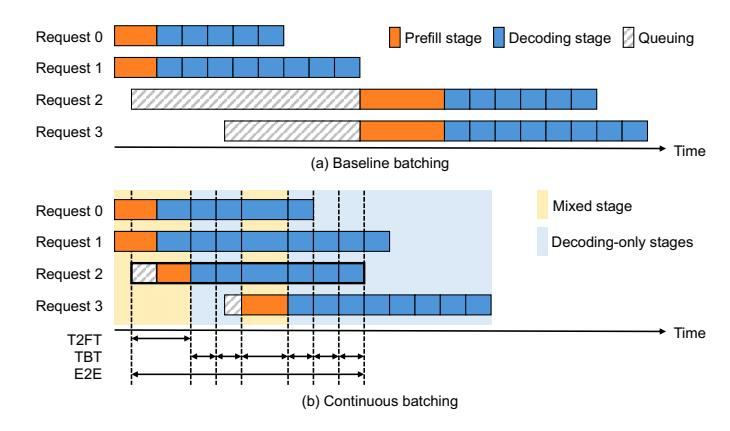

# I. INTRODUCTION

Large language models (LLMs) such as GPT-3 [\[3\]](#page-13-0) and GPT-4 [\[39\]](#page-14-0) are gaining enormous prominence due to their excellent output quality in a vast range of applications. Increasing the number of model parameters has been a principal strategy to improve the quality of an LLM under the premise that the larger the model is, the better the output quality becomes. However, such a straightforward scaling approach cannot persist due to the computational challenge.

Recently, LLMs have employed a Mixture-of-Experts (MoE) [\[2\]](#page-13-1), [\[11\]](#page-13-2), [\[46\]](#page-14-1) construction on top of existing models as an efficient method to increase the number of model parameters without severely bloating the computational overhead, enabling faster training time than LLM without MoE. The MoE layer replaces the conventional feed-forward network (FFN), mainly composed of matrix-matrix multiplication (GEMM) operations between inputs and trained weights, with a collection of multiple expert FFNs (experts in short) and a gate to choose between experts. In GLaM [\[8\]](#page-13-3), for example, by utilizing only two out of the total 64 experts, the computational load remains equivalent to a 10B model, achieving the effect of using a 143B model.

Adopting continuous batching [\[56\]](#page-14-2) in inferring LLMs with MoE layers introduces new computational challenges. Continuous batching is a state-of-the-art scheduling technique that decomposes each inference request into multiple stages and batches these requests at the stage level in a lockstep manner. It maximizes the utilization of computing resources through fine-grained scheduling, allowing newly arrived requests to participate with minimal queuing delay, thereby increasing throughput. However, this batching strategy also increases the number of experts concurrently used in MoE layers, increasing off-chip memory (DRAM) access for loading the parameters of these experts (e.g., 64 for GLaM). Further, the amount of DRAM access in the attention layers in conventional LLMs also increases when batching is applied [\[40\]](#page-14-3). We observed that the MoE and attention layers, which have low arithmetic intensity (Op/B) in most stages, take most of the inference time on conventional systems such as GPUs, falling utilization of its computing resources under 10%.

However, processing an MoE layer only with devices targeting low-Op/B cannot handle the fluctuation of Op/B in MoE layers by continuous batching. Even if the Op/B of MoE layers stays at low-Op/B in most stages, the arrival of a new request significantly increases the Op/B of an MoE layer due to a large number of tokens corresponding to the input sequence passing through the MoE layer. Processing these layers solely with devices targeting low-Op/B struggle due to insufficient computing power, thereby exacerbating the latency of the MoE layer and deteriorating user experience. In such cases, using devices with high computing power (e.g., GPUs) is preferred.

A recent work [\[40\]](#page-14-3) proposed a heterogeneous system that uses processors targeting low-Op/B to alleviate DRAM bandwidth bottleneck in the attention layer and utilizes GPUs to process other layers. Replicating MoE layers to both devices

Fig. 1. LLM architecture and inference process in a gen stage with batched requests. Attention and FFN layers compose a conventional LLM, whereas GQA and MoE are used in place of these two layers, respectively.

and selecting the devices to process the MoE layers based on the Op/B values may handle the fluctuation of Op/B in MoE layers. However, duplicating the parameters of MoE layers, which account for the majority of the model parameters, is inefficient as it requires more devices due to limited memory capacity. Such systems also restrict the number of batched requests due to the wasted memory capacity than homogeneous systems, consequently reducing the system throughput.

To address the above challenges in the heterogeneous system, we propose Duplex, which integrates xPU, processing units for high-Op/B (e.g., GPU), with Logic-PIM that effectively handles low-Op/B operations in LLM inferences. Prior works [28], [29] have suggested processing-in-memory (PIM) for handling extremely low-Op/B (around 1) operations. As an MoE layer exhibits Op/B greater than one, PIM struggles due to its limited computing power. Further, the introduction of grouped-query attention (GQA), employed in recent models like Llama 2 [51] and Mixtral [23], raises the Op/B of attention layers to 4 to 8, making PIM that embeds most ALUs in DRAM dies inefficient for processing the attention layers. The recent trends of decreasing through-silicon via (TSV) pitches to 22um [49] and implementing a logic die with logic process [25], [42] make us propose Logic-PIM, adding more TSVs internally to the high bandwidth memory (HBM) and incorporating processors on the logic die to exploit increased internal bandwidth with massive processing units.

To enhance the utilization rate of xPU and Logic-PIM, we propose expert and attention co-processing for MoE and attention layers. Going further from processing each layer by one of the xPU and Logic-PIM, this co-processing allows the xPU and Logic-PIM to do finer-grained processing within the MoE layer and attention layer. We propose expert co-processing that processes the experts utilizing both xPU and Logic-PIM by leveraging the fact that each expert may handle a varying number of tokens and by choosing which processing units to process each expert in the MoE layers. We assign experts that process a relatively large number of tokens to xPU and the remaining experts to Logic-PIM, reducing the execution time of the MoE layers. We reduce the execution time of the attention layer using attention co-processing that assigns the attention of each request to both processing units, by assigning high-Op/B attention operations of an input request to xPU, and low-Op/B ones of ongoing requests to Logic-PIM.

By flexibly utilizing proper processing units for each layer based on the Op/B and co-processing optimization, Duplex shows up to  $2.67 \times$  higher throughput,  $2.57 \times$  lower end-to-end latency, and 42.03% less energy consumption for LLM inference compared to the baseline GPU without Logic-PIM.

The key contributions of this paper are as follows:

 Through a detailed analysis, we observe that GPU systems exhibit fundamental limitations in LLM inference due to their lack of support for low-Op/B operations.

Fig. 2. (a) Baseline batching, which performs inference at the request level. (b) Continuous batching, which performs inference at the stage level. T2FT, TBT, and E2E latency values for request 2 are also detailed.

- ' We design Duplex to accelerate MoE and attention layers by housing xPU and Logic-PIM in a single device and selecting the processing units based on the Op/B of each layer.
- ' We propose Logic-PIM, which incorporates dedicated TSVs connecting the DRAM dies to the logic die where processing units are placed, offering enhanced support for low-Op/B (1–32) operations compared to previous PIM architectures.
- ' We propose expert and attention co-processing to increase the utilization of xPU and Logic-PIM.

