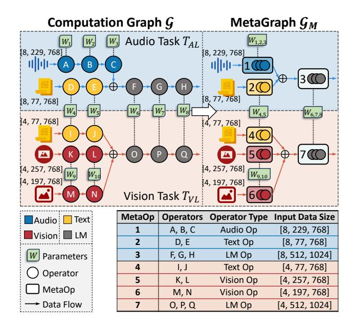
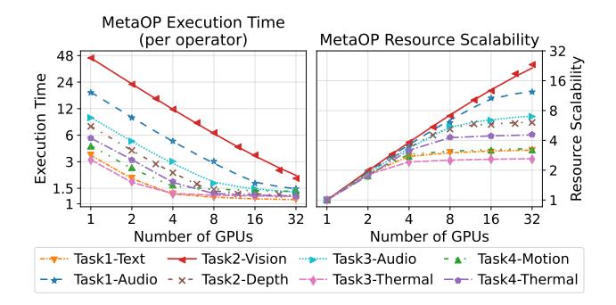
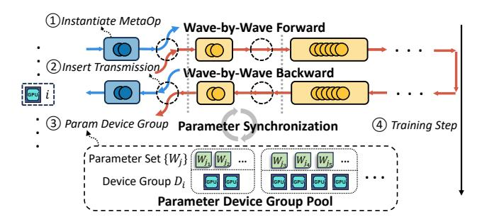
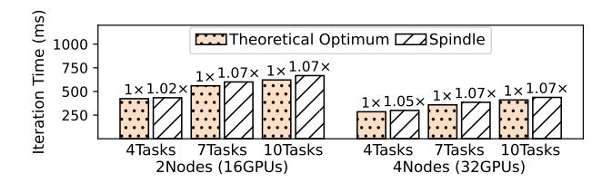

# 2 Preliminary

#### 2.1 Multi-Task Multi-Modal Models

Foundation models, such as GPT series [\[3,](#page-12-0) [11,](#page-13-0) [59\]](#page-15-14), LLaMA series [\[67,](#page-15-2) [68\]](#page-15-3), have set new benchmarks across various language tasks and revolutionized deep learning. They've also been successfully adapted for other modalities and tasks, including image processing [\[10,](#page-13-2) [18,](#page-13-4) [39\]](#page-14-5), audio processing [\[7,](#page-12-1) [57,](#page-15-4) [70\]](#page-15-5), video analysis [\[6,](#page-12-2) [66\]](#page-15-6). Multi-modal models [\[8,](#page-13-6) [9,](#page-13-7) [14,](#page-13-12) [22,](#page-13-11) [56,](#page-14-1) [73\]](#page-15-8) leverage these foundation models to integrate information from multiple data modalities. Multi-modal models typically have the multi-tower structure, utilizing multiple modality encoders to extract modality features, and a crossmodal module for feature alignment and fusing. Some of these models fuse modality information via lightweight contrastive learning objectives [\[22,](#page-13-11) [25,](#page-13-13) [29,](#page-13-14) [56,](#page-14-1) [80,](#page-16-2) [81,](#page-16-3) [84\]](#page-16-4), with CLIP [\[56\]](#page-14-1) being a notable example, and ImageBind [\[22\]](#page-13-11) further extending CLIP to six modalities. Others fuse modalities via the language model with generative loss [\[19,](#page-13-15) [33,](#page-14-7) [34,](#page-14-8) [38,](#page-14-9) [73,](#page-15-8) [74,](#page-15-17) [83,](#page-16-5) [88\]](#page-16-6), some leveraging the powerful pretrained LLMs.

Recently, researchers have begun to construct more complicated multi-task multi-modal (MT MM) models [\[4,](#page-12-3) [8,](#page-13-6) [9,](#page-13-7) [46,](#page-14-3) [55\]](#page-14-10), enabling processing diverse multi-modal tasks within a unified model. This is because each modality encompasses various tasks, and each task often involves multiple modalities as well, and this reflects researchers' aspiration towards general-purpose AI. Fig. [1](#page-1-0) (upper side) illustrates the general structure and training flow of MT MM models. Flamingo [\[4\]](#page-12-3) is among the first to handle multiple vision-language tasks. OFASys [\[9\]](#page-13-7) proposes a general MT MM learning paradigm, as shown in Fig. [1,](#page-1-0) designing distinct modality encoders and cross-modal modules for different tasks and modalities, allowing the activation of different components as required by the task and modality at hand. For example, speech recognition and image captioning tasks shall activate and share the text encoder but feed the visual- and audio-inputs into different encoders. Many empirical results [\[4,](#page-12-3) [8,](#page-13-6) [9,](#page-13-7) [40,](#page-14-2) [55,](#page-14-10) [63,](#page-15-7) [73\]](#page-15-8) have also shown that such a joint multi-task training paradigm achieves better multi-modal capabilities for MT MM models than performing single-task training separately.

### 2.2 Parallelisms in Distributed Training

As model sizes and training data volumes grow, modern DL systems commonly employ various parallelism techniques for distributed training on GPU clusters. Data parallelism (DP) [\[36,](#page-14-11) [61,](#page-15-12) [86\]](#page-16-7) splits the input data, with each device handling a portion of the data storage and computation, and synchronizing model gradients across devices. Model parallelism [\[24,](#page-13-16) [28,](#page-13-17) [47,](#page-14-12) [48,](#page-14-13) [50\]](#page-14-4) partitions model parameters, with each device responsible for a segment of the model. Model parallelisms can be categorized into two popular types: tensor parallelism (TP) partitions the model vertically [\[50\]](#page-14-4), while pipeline parallelism (PP) [\[28,](#page-13-17) [47,](#page-14-12) [48\]](#page-14-13) splits the model horizontally, organizing model execution into a pipeline. Contemporary distributed training systems, such as Megatron-LM [\[50\]](#page-14-4) and DeepSpeed [\[62\]](#page-15-9), leverage multiple parallelisms and implement a hybrid parallelism approach for model training. For example, Megatron-LM introduces 3D parallelism, which concurrently utilizes DP, TP, and PP. Researchers have also developed advanced automatic parallelism [\[31,](#page-13-18) [44,](#page-14-6) [75,](#page-15-16) [87\]](#page-16-1) techniques to facilitate the tuning of optimal parallelism combinations, which integrates multiple parallelism dimensions, employ sophisticated optimization

<span id="page-3-1"></span>

Figure 2. Architecture overview of Spindle.

workflows, and automatically determine the most efficient hybrid parallelism strategy. However, these existing training system are mainly designed for single task and single model training, with limited performance on the complex scenario of training MT MM models.

## 3 System Design

Spindle is a highly efficient and scalable training framework for MT MM models. Fig. 2 depicts its system architecture, comprising the execution planner and the training framework. Given the diverse user-defined training tasks and the GPU cluster, the goal of Spindle is to devise the most efficient execution plan to facilitate effective MT MM training.

**Problem Formulation.** We formalize the optimization problem of Spindle as follows. Firstly, Spindle interprets the input tasks as a unified directed acyclic computation graph  $\mathcal{G} = (\mathcal{V}, \mathcal{E})$ , where each node  $i \in \mathcal{V}$  represents a computational operator and each edge  $\langle i, j \rangle \in \mathcal{E}$  denotes the data flow from operator i to j. Each task activates specific operators and parameters with unique data flows. For instance, a vision-related task activates a vision Transformer layer as an operator, with image features serving as the data flow. The left side of Fig. 3 displays an example of a computation graph. Then, given the computation graph  $\mathcal{G}$  and the GPU cluster with N devices, Spindle aims to minimize the maximal operator completion time C. Specifically, we need to find an execution plan P, which assigns each operator  $i \in \mathcal{V}$ with an **AS**-tuple  $\langle n_i, s_i \rangle \in \mathcal{U}$ , such that the operator i is Allocated  $n_i$  devices and is Scheduled to execute from time  $s_i$ . Here the set  $\mathcal{U} = \{\langle n, s \rangle | n \in \mathbb{N}, s \geq 0\}$  is formed by all valid AS-tuples. We further denote the execution time of operator i when allocated  $n_i$  devices as  $t_i = T_i(n_i)$ . Then, the

optimization problem is formulated as follows. Here (2) is the allocation capacity constraint for any time t, and (3) is the operator dependency constraint.

<span id="page-3-4"></span><span id="page-3-2"></span>
$$\underset{P=\{i \to \langle n_i, s_i \rangle|}{\arg \min} C \coloneqq \underset{i \in \mathcal{V}}{\max} \{s_i + t_i\}$$

$$\underset{i \in \mathcal{V}, \langle n_i, s_i \rangle \in \mathcal{U}\}}{(1)}$$

s.t. 
$$\sum_{t \in (s_i, s_i + t_i), i \in \mathcal{V}} n_i \le N \quad \text{for } \forall t \in \mathbb{R}^+$$
 (2)

<span id="page-3-3"></span>
$$s_i + t_i \le s_j \quad \text{for } \forall \langle i, j \rangle \in \mathcal{E}$$
 (3)

**Sketch of Solution.** Before stepping into the solution, we'd like to first present an overview for better readability. First, Spindle initiates a graph contraction process (§3.1), contracting the original graph  $\mathcal{G}$  into a MetaGraph  $\mathcal{G}_M$  composed of MetaOps (Fig. 3), where each MetaOp characterizes a unique workload. This process further decouples MetaOps into different MetaLevels, ensuring that there are no dependencies among MetaOps within the same MetaLevel. Second, the scalability estimator (§3.2) estimates the execution time and resource scalability for each MetaOp, producing scaling curves (Fig. 4). Following this, the resource allocator (§3.3) deduces the allocation plan for each MetaLevel individually (Fig. 5a). Given the allocation plan, the wavefront scheduler (§3.4) slices the MetaOps and organizes them into waves, and produces the wavefront schedule for execution. Subsequently, device placement (§3.5) strategies are then employed to assign MetaOps to appropriate devices, resulting in the Spindle execution plan (Fig. 5b). Finally, the runtime engine (§3.6) utilizes this plan to instantiate the model on each device and facilitate an efficient MT MM training process.

#### <span id="page-3-0"></span>3.1 Graph Contraction

**Depicting Workload Heterogeneity with** *MetaOps.* Spindle minimizes the execution time by optimizing resource allocation and scheduling for each operator within  $\mathcal{G}$ . This optimization process necessitates an understanding of the workload characteristics for each operator  $i \in \mathcal{V}$ , which can be reflected by its execution time function  $t_i = T_i(n_i)$ , which varies with the device allocation amount  $n_i$ . Given that  $\mathcal{G}$  typically includes a large number of operators while many of them share similar workload characteristics (such as stacked Transformer layers), Spindle initiates a graph contraction process to streamline the complicated graph. It categorizes operators based on their computational workload characteristics, as illustrated in Fig. 3. In this process, operators are contracted into a MetaOp if they meet the following criteria:

- (1) There is a data flow between operator i and j, i.e.,  $\langle i, j \rangle \in \mathcal{E}$ , and both the out-degree of operator i and the in-degree of operator j are 1, ensuring that they are direct predecessors and successors to each other.
- (2) Operator *i* and *j* share the same operator type and input data size, confirming identical workloads.

During graph contraction, we traverse the original graph G in topological order, contracting operators based on the

<span id="page-4-1"></span>

**Figure 3.** Computation graph  $\mathcal{G}$  and contracted MetaGraph  $\mathcal{G}_M$ .

specified criteria until no further pairs of operators meeting these conditions. This results in a contracted MetaGraph  $\mathcal{G}_M = (\mathcal{V}_M, \mathcal{E}_M)$ , with each node  $m \in \mathcal{V}_M$  representing a MetaOp that consists of  $L_m$  consecutive operators in  $\mathcal{G}$ . Since operators in the same MetaOp share the same workload, we slightly abuse the notation and denote the execution time function for each operator in MetaOp m as  $T_m(n)$ .

#### Disentangling MetaOp Dependency with MetaLevels.

To facilitate operator-level resource allocation and scheduling, we further introduce an abstraction called MetaLevel, which signifies the level of dependency. MetaOps at the same level are independent to each other. The level of each MetaOp can be derived by a Breadth-First-Search (BFS), with the level assigned based on the search depth, which inherently ensures no dependency among the MetaOps of same level. By doing so, the problem (1) can be dissected into several simplified sub-problems for different MetaLevels. Next, we introduce how Spindle derives the allocation and scheduling for each MetaLevel individually, and merges them into the final plan.

## <span id="page-4-0"></span>3.2 Scalability Estimator

As MetaOps differ in operator types and/or input data sizes, they characterize heterogeneous workloads and thus necessitate different amount of resources. Furthermore, these MetaOps have distinct resource scalability (i.e., how its execution time varies w.r.t. the amount of allocated resources). For instance, the left side of Fig. 4 shows the execution time of different MetaOps,  $T_m(n)$ , in Multitask-CLIP (a multi-task extension of CLIP, detailed in §5.1). Some MetaOps show almost linear decreases in execution time as resources increase

<span id="page-4-2"></span>

**Figure 4.** An example of the execution time and resource scalability of MetaOps in 4-task Multitask-CLIP, denoted as *scaling curves*.

(e.g., Task2-Vision), while others decrease much more slowly (e.g., Task1-Text). The right side of Fig. 4 further shows the value of  $\varsigma_m(n) = T_m(1)/T_m(n)$ , which measures how much the operator accelerates when using more GPUs, and a value of  $\varsigma_m(n)$  closer to n signifies better resource scalability. As can be seen, different MetaOps not only have varying execution time, but also exhibit different resource scalability, posing a significant challenge for resource allocation.

In response to this issue, Spindle employs a scalability estimator to accurately capture the execution time and the resource scalability of each MetaOp. Previous works [44, 69, 87] have designed effective estimation methods for distributed training, commonly utilizing the  $\alpha$ - $\beta$  modelling [26]. However, although this may work well for homogeneous workloads (e.g., LLMs with homogeneous layers), we find that it does not fit the workload heterogeneous nature of MT MM models. This is because different MetaOps have distinct workload and resource scalability, and the invoked kernels may vary across different per-device workloads, therefore causing distinct performance. In a nutshell, our scalability estimator adopts the *piecewise*  $\alpha$ - $\beta$  modelling for more accurate estimation of heterogeneous MT MM workloads. Given the target MT MM model, it profiles several discrete data points  $(n_i, T_m(n_i))$  for each MetaOp under different parallel configurations, and then fits the curve of piecewise  $\alpha$ - $\beta$ function. To estimate the execution time  $T_m(n)$ , it locates the range that *n* falls into, and returns the estimated time according to the corresponding piecewise function. In practice, the profiling and estimating process for each MT MM model takes within 5 minutes, which is negligible compared to the training time. In Fig. 4, the scatter points represent empirical measurements, while the curves depict the function estimated by our scalability estimator, which we denote as scaling curves. As can be seen, our scalability estimator effectively and accurately estimates the execution time  $T_m(n)$ for each MetaOp. More details are illustrated in Appendix A [2].

<span id="page-5-0"></span>

(a) Illustration of workflow of Spindle allocator, which allocates resources to 3 MetaOps on 4 devices.

(b) Example of Spindle execution plan consisting of 6 waves.

**Figure 5.** Illustration of Spindle allocator and Spindle execution plan.

#### <span id="page-5-1"></span>3.3 Resource Allocator

We now introduce our resource allocator, which allocates appropriate computational resources to MetaOps. We first transition problem (1) into the sub-problem on MetaLevel. We then detail our allocation strategies, which first relax constraints and optimize the continuous problem, and then discretize the optimal solution for practical allocation plans.

**Problem Formulation on MetaLevel.** We first re-formulate the problem (1) on one MetaLevel with a set of MetaOps denoted by  $\widetilde{V}_M$ . In this formulation, we split each MetaOp into different execution part, by assigning it with several ASL-tuples  $\langle n,s,l\rangle\in\mathcal{U}_M$ , such that l consecutive operators of this MetaOp are scheduled to execute from time s with n devices. Here  $\mathcal{U}_M=\{\langle n,s,l\rangle|n,l\in\mathbb{N},s\geq 0\}$  is formed by all valid ASL-tuples. For each MetaOp  $m\in\widetilde{V}_M$ , its execution plan is a set of ASL-tuples  $P_m$ . For a MetaLevel, the execution plan P consists of  $P_m$  for all MetaOps  $m\in\widetilde{V}_M$ , i.e.,  $P=\{m\to P_m\}$ . Given  $m\in\widetilde{V}_M$  and one ASL-tuple  $p=\langle n_m^{(p)},s_m^{(p)},l_m^{(p)}\rangle\in P_m$ , we denote the execution time span, end time, and time interval by  $t_m^{(p)}=T_m(n_m^{(p)})\cdot l_m^{(p)}$ ,  $e_m^{(p)}=s_m^{(p)}+t_m^{(p)}$ , and  $l_m^{(p)}=(s_m^{(p)},e_m^{(p)})$ , respectively. The problem can be re-written as:

$$\underset{P=\{m\to P_m|m\in\widetilde{V}_M,P_m\subset 2^{\mathcal{U}_M}\}}{\operatorname{arg\,min}}\widetilde{C}\coloneqq\underset{m\in\widetilde{V}_M,p\in P_m}{\operatorname{max}}\{e_m^{(p)}\} \qquad (4)$$

s.t. 
$$\sum_{t \in I_m^{(p)}, m \in \widetilde{V}_M, p \in P_m} n_m^{(p)} \le N \quad \text{for } \forall t \in \mathbb{R}^+$$
 (5)

$$I_m^{(p_1)} \cap I_m^{(p_2)} = \emptyset \quad \text{for } \forall m \in \widetilde{\mathcal{V}}_M, p_1, p_2 \in P_m$$
 (6)

$$\sum_{p \in P_m} l_m^{(p)} = L_m \quad \text{for } \forall m \in \widetilde{\mathcal{V}}_M \tag{7}$$

Compared with the original problem (1), the sub-problem (4) on MetaLevel gets rid of the dependency constraint, while the constraint (6) enforces the execution intervals of ASL-tuples in  $P_m$  to be pairwise disjoint, because operators within the same MetaOp cannot execute simultaneously, and (7) ensures all operators are executed for each MetaOp.

**Optimum of the Continuous Problem.** If we relax the constraints, allowing GPU resources and operators to be continuously divisible (i.e., n and l in ASL-tuples are not limited to integers), the problem is transformed into a well-established problem, malleable project scheduling problem (MPSP), with malleable projects and continuously divisible resources [20]. We denote the optimal solution of this relaxed problem by  $P_{MPSP}$ . Prior works [76, 77] have given the following theorem.

<span id="page-5-5"></span>**Theorem 1.** If the execution time functions  $T_m(n)$ ,  $n \in \mathbb{R}^+$ , are positive and non-increasing for every MetaOp  $m \in \widetilde{V}_M$ , then  $P_{MPSP} = \{m \to P_m\}$  satisfies that  $P_m = \{\langle n_m^*, 0, L_m \rangle\}$ ,  $\forall m \in \widetilde{V}_M$ , where the optimum objective  $\widetilde{C}^*$  and allocations  $n_m^*$  can be found from

$$T_m(n_m^*) \cdot L_m = \widetilde{C}^* \text{ for } \forall m \in \widetilde{\mathcal{V}}_M \text{ and } \sum_{m \in \widetilde{\mathcal{V}}_M} n_m^* = N.$$
 (8)

<span id="page-5-2"></span>From Theorem 1, it follows that in the optimal situation, all MetaOps start simultaneously, execute all their operators, and finish together. They share an identical end time  $e_m = \widetilde{C}^*$ , which is exactly the minimized operator completion time.

<span id="page-5-4"></span><span id="page-5-3"></span>To achieve  $P_{MPSP}$ , our allocator utilizes the scaling curves from §3.2 to acquire an estimation of  $T_m(n)$ , and performs a bisection search procedure over  $\widetilde{C}^*$  with the following

equation. The details are illustrated in Appendix B [2].

$$\sum_{m \in \widetilde{V}_M} T_m^{-1} \left( \widetilde{C}^* / L_m \right) = N. \tag{9}$$

**Bi-point Discretized Allocation.** From the continuous problem, we've determined the optimal time  $\widetilde{C}^*$ , as well as the optimal allocations for each MetaOp,  $n_m^*$ , which is a real number. To reinstate n's as integers, our allocator computes each MetaOp's proper discrete allocations individually. For every MetaOp m, it uses two discrete ASL-tuples  $\langle \overline{n_m}, \cdot, \overline{l_m} \rangle$ ,  $\langle \underline{n_m}, \cdot, \underline{l_m} \rangle$  to linearly represent the continuous, optimal solution  $\langle n_m^*, 0, L_m \rangle$  in  $P_{MPSP}$ . To preserve the optimum property of  $P_{MPSP}$ , we require the discretized allocation plan to satisfy the following two conditions:

<span id="page-6-2"></span><span id="page-6-1"></span>
$$L_m = \overline{l_m} + \underline{l_m} \ \ (10a) \quad \ \widetilde{C}^* = T_m(\overline{n_m}) \cdot \overline{l_m} + T_m(\underline{n_m}) \cdot \underline{l_m} \ \ (10b)$$

Cond. (10a) ensures these two discrete ASL-tuples complete the workload of MetaOp m, and Cond. (10b) ensures their total execution time is exactly equal to the minimum operator completion time  $\widetilde{C}^*$  in  $P_{MPSP}$ , thus perserving the optimum property. Here we first select  $\overline{n_m}$ ,  $n_m$  as the closest valid integer numbers such that  $n_m^* \in [n_m, \overline{n_m}]$ , and  $\overline{l_m}, l_m \in \mathbb{R}^+$  are derived naturally. For instance, as shown in Fig. 5a, MetaOp 2 with  $n_2^* = 1.5$ ,  $L_2 = 12$  in  $P_{MPSP}$  is discretized as  $\overline{n_2} = 2$ ,  $n_2 = 1$ and  $\overline{l_2} = 8.4$ ,  $l_2 = 3.6$  in this step. Here we impose the *valid* constraint on the allocation n for MetaOp m for practical reasons. For instance, if an MetaOp is applied data parallelism, its allocation n is supposed to divide its global batch size  $B_m$ to avoid resource under-utilization due to uneven partition of samples. For another example, if an MetaOp is applied tensor parallelism or sequence parallelism with degree 2, its allocation n is supposed to be divisible by this degree, thus n = 3, 5, 7 as invalid. Such *valid* constraint ensures the allocation plan for each MetaOp is practical. Specially, allocation with  $n_m = 0$  is treated as a dummy allocation (e.g., MetaOp 3 in Fig. 5a), which preserves the optimum property of Cond. (10b) but will then be ignored.

Then, we reinstates l's as integers by rounding  $l_m$ ,  $\underline{l_m}$  to the nearest integers. If the rounded l equals 0, this ASL-tuple will be ignored. This rounding procedure preserves the integrity of Cond. (10a) and introduces only minor bias to Cond. (10b). Finally, the discretized ASL-tuples of all MetaOps form the allocation plan. Note that the allocation plan only ensures the longest execution time among all MetaOps is approximately  $\widetilde{C}^*$ , yet it does not specify the start time for each ASL-tuple, which is determined by wavefront scheduler in §3.4.

## <span id="page-6-0"></span>3.4 Wavefront Scheduler

Given the allocation plan from the resource allocator, we now describe how Spindle schedules the execution of MetaOps. We first introduce the concept of *wave*, the scheduling unit of Spindle. Then we present our wavefront scheduling, which

**Algorithm 1:** Wavefront Scheduling for one MetaLevel

```
Input: # Devices N, start time T_{start},
alloc\_plan = \{m \rightarrow \{\langle \overline{n_m}, \cdot, \overline{l_m} \rangle, \langle n_m, \cdot, l_m \rangle\}\}
Output: Wavefront schedule P = \bigcup_k S_k, end time T_{end}

1 T_{current} \leftarrow T_{start}; P \leftarrow \emptyset; S_{remain} \leftarrow alloc\_plan;

2 while S_{remain} is not empty do // schedule for wave k

3 S_{cand} \leftarrow \text{Propose\_Candidate\_Set}(N, S_{remain});

4 S_{cand} \leftarrow \text{Extend\_Resources\_If\_Needed}(S_{cand});

5 T_{wave}, S_{sched} \leftarrow \text{Align\_Time\_Span}(S_{cand});

6 S_k \leftarrow \text{Set\_Start\_Time}(S_{sched}, T_{current}); P \leftarrow P \cup S_k;

7 S_{remain} \leftarrow S_{remain} - S_{sched}; T_{current} \leftarrow T_{current} + T_{wave};

8 \text{return } P, T_{current}
```

schedules the execution of MetaOps greedily for each wave. Finally, the operator dependencies among MetaLevels are reinstated by merging the wavefront schedules together.

**Definition of wave.** It is worthy to note that, although Theorem 1 implies that all MetaOps share the same start and end time in the continuous form, this property does not hold after the discretization process. The reason is that the execution time of ASL-tuples may vary, or the resources are insufficient to execute all tuples concurrently. To cope with this problem, we devise a fine-grained wavefront scheduler that slices the MetaOps and selects a few of them to execute concurrently on different groups of devices. We define wave as the smallest scheduling unit, which corresponds to one concurrent execution as aforementioned. The wavefront scheduler attempts to minimize the device idle time in each wave, by (1) occupying the devices as many as possible to maximize device utilization (Wavefront Scheduling step (1) (2), and (2) aligning the execution time spans of different sliced MetaOps to avoid idle time (Wavefront Scheduling step (3)). As illustrated in Fig. 5b, resource (device) allocation remains unchanged in one wave, and transmission of data flow occurs only between two waves. Next, we introduce our greedy algorithm that crafts the waves to form the scheduling plan.

**Wavefront Scheduling.** As outlined in Alg. 1, the scheduler iteratively crafts waves in a greedy manner. Below we discuss how one wave is crafted with Fig. 5b as an example.

- ① First, the scheduler greedily proposes ASL-tuples to form a candidate set, aiming to utilize as many devices as possible (line 3). For instance with Fig. 5b, the scheduler proposes the first ASL-tuple of MetaOp 1 to craft wave 1 since it occupies all devices. Similarly, for wave 2, it proposes the ASL-tuples of MetaOp 1, 2, and 4, which correspond to 4, 2, 2 devices, respectively, in order to make full use of all devices.
- ② If the candidate set fails to occupy all devices, the cluster resources will be underutilized. To address this issue, we extend the allocated resources in specific tuples to ensure all devices are utilized (line 4). For instance, in wave 4 of Fig. 5b, the allocation of MetaOp 4 is extended from 1 device to 2

<span id="page-7-2"></span>

Figure 6. Illustration of Spindle device placement.

devices. Resource extension is prioritized for MetaOps with larger remaining execution time, with the hope of balancing the remaining workload among the MetaOps.

- ③ In most cases, the proposed ASL-tuples differ in execution time. If we directly craft a wave with them, it would be inefficient since there must be idle devices. Fortunately, this can be avoided by dissecting the ASL-tuples to align their time span (i.e., only a few number of operators in the MetaOp are scheduled in this wave). For instance, in wave 2 of Fig. 5b, the proposed ASL-tuples for MetaOp 1, 2, and 4 correspond to 9, 14, and 3 operators, respectively. To align the execution time, the ASL-tuples for MetaOp 1 and 2 are dissected, with only 1 and 2 operators of them being scheduled, while the remaining 8 and 13 operators left to be scheduled in subsequent waves. Our scheduler simply aligns the time span w.r.t. the ASL-tuple with shortest execution time (e.g., the one for MetaOp 4 in previous example), and computes the aligned time span as the duration of current wave (line 5).
- (4) After the time span alignment, the scheduler concludes the current wave (lines 6-7), including specifying the start time for operators that are scheduled in this wave, and removing them from the remaining set.

Merging MetaLevels. As stated in §3.1, MetaOps are decoupled into MetaLevels to disentangle operator dependencies. Spindle invokes the aforementioned allocation and scheduling for each MetaLevel individually, and merges their wavefront schedules together as the final execution schedule.

#### <span id="page-7-0"></span>3.5 Device Placement

Given the wavefront schedule, which consists of the allocation amount and execution time of each MetaOp, we now discuss how Spindle determines the specific devices for each MetaOp, known as device placement, which affects the interwave communication overhead and memory consumption. Spindle employs several guidelines based on empirical insights or observations to optimize device placement.

Intra-Device-Island Placement. Placement within a device island is always preferred for each MetaOp and data flow between MetaOps. A device island consists of devices connected by high-bandwidth interconnects (e.g., NVLink), typically adjacent devices, such as adjacent GPUs within one node. For MetaOps, prioritizing intra-island placement reduces the potential intra-MetaOp communication costs. For data flow between MetaOps across waves, intra-island



Figure 7. Illustration of Spindle runtime engine.

placement reduces transmission costs leveraging the high intra-island bandwidth or even faster intra-device copying.

Prioritizing High Communication Workloads. When it's infeasible to place all MetaOps and data flows within the device island, Spindle will estimate the communication volume of each MetaOp and data flow to prioritize placing those with higher volumes within a device island. For instance, in Fig. 6, the data flow volume between red MetaOps is significantly higher than that between yellow ones. Therefore, Spindle prefers to place the data flow between red ones within the island. This guideline ensures the most communication-intensive components receive the most efficient hardware configuration to minimize communication overhead.

**Device Memory Balance.** As each device holds heterogeneous MetaOps, the memory overhead varies across devices. Placing too many memory-intensive MetaOps on a single device may cause out-of-memory (OOM) errors. Therefore, Spindle actively balance the memory load across all devices during placement. Specifically, Spindle estimates each MetaOp's memory consumption, tracks available memory on devices, and prioritizes placement on the device with the most available memory. Besides, for MetaOps sharing the same parameters, we prioritize placing them on the same device to minimize redundant storage.

Based on these guidelines, Spindle performs device placement wave by wave greedily, prioritizing the minimization of communication overhead, such as inter-wave transmission, while simultaneously maintaining device memory balance. When OOM occurs due to imbalanced placement, Spindle will consider alternative placements with sub-optimal communication costs and better memory balance. If necessary, backtracking is employed to adjust the placements from earlier waves to effectively address the OOM issues.

#### <span id="page-7-1"></span>3.6 Runtime Engine

The runtime engine is responsible for running the execution plan to facilitate efficient MT MM training, which is more complex than conventional single-task training, as each device handles heterogeneous MetaOps and local computation graphs. Spindle runtime engine operates in four main steps:

- (1) **Localization.** Initially, Spindle localizes the execution plan to each device. Specifically, each device instantiates the corresponding MetaOp of each wave locally, and initializes the required model components and parameters.
- (2) Intra-task Data Dependency. Secondly, Spindle inserts transmission operators to connect the MetaOps across waves to handle the data flow dependencies, including forward activations and backward gradients. According to the devices of MetaOps and data format requirements, operations such as *copy*, *shard*, *concat*, *send*, and *receive* are used to transmit data flows with minimal overhead. This step not only correctly handles data flow dependencies between MetaOps but also links the MetaOps on each device into a complete local computation graph ready for execution.
- (3) **Inter-task Model Dependency.** Then, Spindle manages parameter device groups for synchronization among various tasks by maintaining a global parameter device group pool. During each iteration, for each parameter  $W_j$ , all tasks or modalities that activate it on different devices contribute to its gradient, which needs to be accumulated and synchronized to facilitate parameter sharing. Therefore, before the training process, Spindle scans all devices to determine the device group  $D_i$  for each parameter  $W_j$ , which represents  $W_j$  is shared and should be synchronized within group  $D_i$ . For efficiency, Spindle manages parameters with the same device group collectively and maintains a global parameter device group pool  $\{D_i \rightarrow \{W_j\}\}$ , where each device group  $D_i$  corresponds to a set of parameters  $\{W_i\}$ .
- (4) **Training Step.** Finally, the training process is ready to begin. In each iteration of Spindle, each device executes the forward and backward propagation of the local computation graph in a wave-by-wave manner, which is comprised of the interleaved execution of MetaOps and transmission of data flow. Following the forward and backward phases, Spindle performs group-wise parameter synchronization to maintain the parameter consistency. Specifically, each parameter set  $\{W_j\}$  is synchronized within its corresponding device group  $D_i$  in the parameter device group pool.

#### 4 Implementation

Spindle is an efficient and scalable MT MM training system built on PyTorch with 10K Loc in Python: 2.1K LoC for the execution planner and 7.9K LoC for the runtime engine. We implement the data flow transmission with NCCL batched P2P primitives and the parameter device groups with NCCL communication groups. Spindle provides the users with simple, user-friendly and flexible API for defining MT MM training workloads. Specifically, training tasks in Spindle are represented as *SpindleTask*, and users can define various multi-modal tasks by customizing PyTorch modules and connecting them flexibly through the *add\_flow* API in Spindle. Alternatively, user can also define different computational logic for various tasks implicitly within a single

Table 1. Experimental setups.

<span id="page-8-1"></span>(a) Heterogeneity awareness of system competitors.

| Competitors             | Inter-Task | Intra-Task |
|-------------------------|------------|------------|
| Megatron-LM / DeepSpeed | ×          | ×          |
| DistMM-MT               | X          | <b>✓</b>   |
| Spindle-Optimus         | <b>✓</b>   | X          |
| Spindle                 | <b>✓</b>   | <b>✓</b>   |

(b) Configuration of MT MM models for evaluation.

| MT MM<br>Model | Multitask-<br>CLIP | OFASys  | QWen-VAL |
|----------------|--------------------|---------|----------|
| # Param.       | 1.20B              | 0.66B   | 9.25B    |
| # Modalities   | 6                  | 6       | 3        |
| # Tasks        | 10                 | 7       | 3        |
| Cross-Modal    | Contrastive        | Enc-Dec | Dec-only |
| Module         | Loss               | LLM     | LLM      |

unified model. Spindle can automatically split the modules and construct *SpindleTasks* via PyTorch FX Tracer, streamlining task definition. After the definition of multi-modal tasks, Spindle conducts the optimization workflow automatically, as illustrated in Fig. 2, and the Spindle runtime engine provides efficient and scalable model training process.

## 5 Experiments

#### <span id="page-8-0"></span>5.1 Experimental Setups

Competitors. We compare Spindle with SOTA (state-of-the-art) distributed training systems, Megatron-LM [50] and DeepSpeed [62]. We also introduce other two systems that represent typical strategies for multi-task training, considering inter-task and intra-task heterogeneity respectively. Tab. 1a summarizes the features of competitors.

(1)&(2) Megatron-LM & DeepSpeed: Megatron-LM [50] and DeepSpeed [62] are widely used SOTA training systems tailored for single-task training. The naïve approach to train MT MM models on these systems is to decouple all submodels on separate devices (§1), which requires plenty of resources and is impractical. Therefore, we decouple submodels on temporal dimension within each iteration, where each sub-model takes up the whole cluster within a short time period, and is dependently and sequentially executed. (3) DistMM-MT: DistMM [27] is a recent training system designed for multi-modal models, but focusing on single task only. DistMM-MT represents a multi-task (MT) extension of DistMM. It decouples multi-tasks, and for each single MM task allocates appropriate resources to different multi-tower modality encoders. Then it executes tasks sequentially.

(4) **Spindle-Optimus:** This baseline represents a workload-aware task-level resource allocation strategy, which adapts

<span id="page-9-0"></span>

**Figure 8.** End-to-end performance comparison for Spindle and baseline systems. Shorter bars indicate superior system performance. The numbers above the bars denote each system's speedup compared to DeepSpeed (larger than 1 is faster).

allocations according to the workload at the task level granularity. It's inspired by Optimus [53], an effective cluster job scheduling system which proposes a greedy resource allocation scheme and iteratively assigns devices to the job that has the largest marginal gain. Despite differences between job scheduling and multi-task training (§6), we apply a similar principle and devise the marginal gain as  $(T_m^{(c)}(n) - T_m^{(c)}(n')/(n'-n))$ , i.e., the task completion time reduction scaled by the allocation increment from n to n'. Here n' is the next valid allocation number larger than n.

**Experimental Workloads.** As illustrated in Tab. 1b, we select three models to represent popular MT MM workloads and conduct experiments on these workloads.

- (1) Multitask-CLIP, which adopts the same structure of ImageBind [22], is a multi-task variation to the classic and pioneer CLIP [56] model. Many multi-modal models [22, 25, 29, 56, 80, 84] follow this paradigm for multi-task training. Its cross-modal module (contrastive loss), has much smaller workload compared to its modality encoder, where most computation occurs.
- (2) **OFASys** [9] further generalizes the MT MM paradigm, using a unified LM of encoder-decoder structure for cross-modal processing. In OFASys, the cross-modal module's workload is comparable to that of the modality encoders.
- (3) **QWen-VAL** [8, 14] adopts a modern, compute-intensive decoder-only LLM, with the workload of the cross-modal module usually larger than modality encoders. Recent multimodal models like SPHINX-X [37], DeepSpeed-VisualChat [82], and BLIP-2 [33], employ this structure.

These workloads effectively represent the majority of MT MM workloads (and different workload distribution between modality encoders and cross-modal modules in Fig. 1), regardless of specific model structure variations.

**Protocols.** We conduct experiments on an 8-node GPU cluster. Each node consists of 8 NVIDIA A800 80 GB GPUs equipped with NVLink, and the nodes are interconnected by 400 Gbps InfiniBand. Since the baseline systems do not support automatic planning given a targeted MT MM model training workload, we manually tune their parallel configurations and memory optimization techniques (e.g., data and tensor parallelism degree, ZeRO stage, activation checkpointing, and etc.) to achieve the best performance. Averaged training time over 100 iterations is reported.

#### 5.2 End-to-End Performance

Fig. 8 displays end-to-end iteration time comparisons between Spindle and baseline systems across various model workloads, multi-modal task configurations, and cluster sizes.

**Comparison with SOTA systems.** In general, compared to SOTA training systems, i.e., Megatron-LM and DeepSpeed, Spindle achieves speedup ratios of up to 67% and 71%, respectively. Below we delve into details.

To begin with, Spindle consistently outperforms the competitors across different task configurations. Notably, Spindle excels when handling a larger number of tasks. On the 10-task Multitask-CLIP and 7-task OFASys workloads, Spindle achieves speedup ratios ranging from 31% to 71% compared to SOTA systems. This underscores Spindle's excellent scalability with increasing task counts.

In addition, Spindle consistently achieves optimal performance across various cluster sizes. On Multitask-CLIP, Spindle achieves the highest speedup ratios of 37%, 33%, and 71% on 8, 16, and 32 GPUs, respectively. Notably, Spindle maintains high efficiency even when the scalability of SOTA systems begins to diminish — that is, when the increase in resources does not correspond to significant speed improvements. For example, in 4-task Multitask-CLIP, expanding the cluster size from 16 to 32 GPUs results in only

<span id="page-10-0"></span>

(a) Average cluster utilization over time within one iteration. Higher positions on the y-axis indicate higher utilization.


**(b)** Utilization of each device and each MetaOp. Points closer to the outer edge of the spider chart represent higher utilization.

**Figure 9.** Case study of Multitask-CLIP (4 tasks, 16 GPUs). Utilization is measured in computation FLOPs per second.

modest speedup of up to  $1.21\times$  for SOTA systems, whereas Spindle still achieves a  $1.45\times$  speedup. This efficiency stems from Spindle's heterogeneity-aware and operator-level finegrained resource allocation and scheduling. For example, for a lightweight audio operator, DeepSpeed needs to parallelize it on the whole cluster with 16 GPUs due to its workload-unaware nature, causing the computational kernel to be underutilized or even idle, while Spindle may parallelize it with only 4 GPUs to ensure high utilization. Besides, when scaling from 16 to 32 GPUs, Spindle may maintain 4-GPU-allocation for the lightweight operator to keep high utilization.

More importantly, Spindle also exhibits excellent scalability w.r.t. model size. On larger model QWen-VAL, Spindle achieves a maximum speedup of 1.16× on 32 GPUs and 1.63× on 64 GPUs. Notably, when training QWen-VAL, Spindle achieves a 1.78× speedup when scaling from 32 to 64 GPUs, whereas SOTA systems only achieve up to 1.27× speedup. This is unsurprising since Spindle allows flexible allocations to avoid the unsatisfactory scalability of MetaOps with light workloads, as discussed above and in §3.2.

**Comparison with other baselines.** Next, we discuss the performance of other baselines, i.e., Spindle-Optimus with task-level resource allocation strategies, and DistMM-MT with the single-task strategy for MM models.

Spindle-Optimus, employing workload-aware task-level resource allocation, exhibits great performance, especially in larger-scale clusters, with the speedup ratio up to 44% compared to DeepSpeed. However, there are still many scenarios

where it underperforms. Its task-level strategy overlooks the workload heterogeneity within tasks, thereby limiting training efficiency. Moreover, the coarse granularity at task level can sometimes fail to achieve ideal load balancing among tasks, causing many devices to become idle during the latter part of the iteration. In comparison, Spindle enables finergrained strategy, with operator-level resource allocation and wavefront load balancing, consistently achieving higher efficiency compared to Spindle-Optimus.

DistMM-MT also performs better than SOTA systems in most cases, with the speedup up to 20%, benefiting from its intra-task workload awareness and resource allocation. However, it's designed for single-task MM models, which decouples tasks and optimizes each one separately, making it far from achieving the global optimum in multi-task cases. For OFASys, DistMM-MT shows poor performance. This is because DistMM-MT gains acceleration by parallelizing sub-models in the same task. However, OFASvs uses a lightweight text adaptor, so most tasks that pair a modality with text are dominated by the other modality, making the submodel parallelization ineffective. Compared to DistMM-MT, Spindle jointly optimizes the allocation and scheduling of all tasks and operators, therefore consistently outperforming the single-task strategy of DistMM-MT, achieving a speedup ratio of up to 59%.

#### 5.3 Case Study

To better understand the advantages and performance gain of Spindle over the other competitors, we further conduct an indepth case study of Multitask-CLIP (4 tasks, 16 GPUs). Fig. 9 presents system performance considering three key metrics: cluster average utilization over time, average utilization per device, and computational utilization of each MetaOp.

Firstly, DeepSpeed, representing SOTA systems, which executes the tasks sequentially with all resources, experiences fluctuating utilization due to the workload heterogeneity, leading to generally low overall utilization. Spindle-Optimus, which allocates resources at task level, improves cluster utilization at the iteration beginning, but as tasks with light workloads finish, more devices become idle, declining overall utilization. DistMM-MT manages to enhance utilization via intra-task resource allocation, but the ignorance of inter-task heterogeneity limits its utilization. In contrast, Spindle maintains consistently high utilization throughout the iteration.

Furthermore, Spindle significantly elevates the utilization of all devices and MetaOps, showcasing its superior handling of workload balance via operator-level strategies. In contrast, DeepSpeed shows lower utilization across all devices and MetaOps. Although task-level strategies of Spindle-Optimus can enhance the utilization of certain devices, the coarse granularity of allocation inevitably leads to workload imbalances, leaving many devices underutilized. DistMM-MT also improves the utilization of certain devices and MetaOps, but the results are still unsatisfactory as it fails to reach the

<span id="page-11-0"></span>

**Figure 10.** Time breakdown analysis. Percentage of interwave *send* & *receive* in total time is labeled for ablation study.

<span id="page-11-1"></span>

**Figure 11.** Optimality analysis of Spindle execution planner. Evaluated on Multitask-CLIP.

global optimal parallel plan for multi-tasks. Overall, Spindle's unified optimization captures a close-to-optimal execution plan with workload balance, leading to consistently high utilization in all aspects.

## 5.4 Time Breakdown

Fig. 10 shows the runtime breakdown for Spindle and Deep-Speed across various workloads, primarily consisting of forward and backward propagation, parameter synchronization, and inter-wave send and receive. We've isolated parameter synchronization from the backward phase for individual analysis. In MT MM training, the forward and backward propagation dominates the runtime, typically accounting for 80%-95% due to the large number of tasks and computational demands. Spindle focuses on reducing this significant time component through flexible resource allocation and scheduling. Parameter synchronization usually consumes a small fraction of the time, about 5%-15%, since it only occurs after accumulating gradients from multiple tasks. Furthermore, while Spindle introduces extra overhead for inter-wave send and receive, this overhead remains minimal, typically not exceeding 6%, thanks to the device placement mechanism that avoids unnecessary communications.

**Ablation on Device Placement.** We conduct an ablation study on the device placement strategy in §3.5, focusing on its impact on inter-wave communication overhead, which is the extra overhead of our system. Specifically, we compare it with a sequential placement strategy, which assigns each

<span id="page-11-2"></span>

**Figure 12.** Time cost (s) of Spindle's execution planner.

MetaOp with consecutive devices. In Fig. 10, our results indicate that the inter-wave communication overhead of the sequential placement strategy is approximately 3-6 times greater than that of Spindle, taking up to 27% of the end-to-end training time. However, Spindle's placement strategies reduces this overhead to 6%. This demonstrates the effectiveness of our locality-aware placement, which significantly reduces the extra communication overhead.

#### 5.5 Execution Planner Evaluation

**Optimality Analysis.** We analyze the optimality of Spindle execution planner in Fig. 11 by comparing the iteration time to the theoretical optimum  $\widetilde{C}^*$  derived from Theorem 1. Although unachievable due to the relaxed constraints (§3.3),  $\widetilde{C}^*$  serves as a theoretical performance upper bound. The Spindle execution planner preserves most of the optimum property when finding the practical solution (e.g., Cond. (10a) (10b)), but still introducing minor biases (e.g., reinstating l's to integers in §3.3, resource extension in §3.4). In Fig. 11, we find that across various configurations, the deviation between Spindle and theoretical optimum is consistently low, below 7%. This observation underscores the effectiveness of Spindle in offering a practical and near-optimal execution plan for MT MM models.

Complexity Analysis. We briefly analyze the complexity of execution planner. Given MetaOps' scalability curves, the planning process consists of three parts: resource allocation, wavefront scheduling, and device placement. Among the first two parts, most of the time is spent on solving the continuous optimization problem via bisection search (Appendix B [2]). In comparison, the complexity of wavefront scheduling is relatively small, scaling linearly with the number of waves, which is at most twice the number of MetaOps. This is because each wave consumes all layers of at least one ASL-tuple (§3.4 (3)), while each MetaOp produces two ASLtuples (§3.3 bi-point discretized allocation). The third part, device placement, uses a constrained-depth recursive search with simple heuristics. The searching time may vary, but is generally within an acceptable range. As shown in Fig. 12, Spindle effectively generates the execution plans within 3 seconds across all experiments. Moreover, the plan will only

be regenerated when input data workload changes, which is not very often compared to the overall training process.

More Experimental Results. Due to the space constraint, we put more experimental results and analysis in the Appendix [\[2\]](#page-12-6), including more details of experimental workloads in Appendix C, evaluation of dynamicity performance in Appendix D, larger-scale simulations in Appendix E, comparison on single-task multi-modal (STMM) workloads in Appendix F, memory consumption analysis in Appendix G, and system implementation performance evaluation in Appendix H. Please kindly refer to our Appendix for more details.

