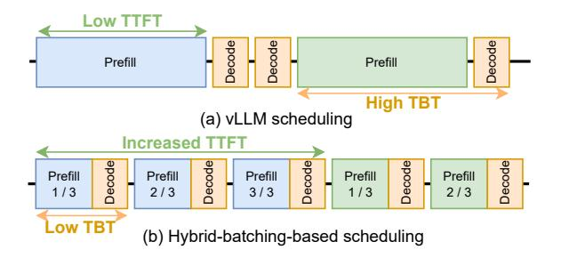
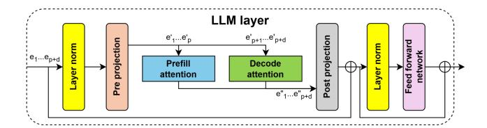
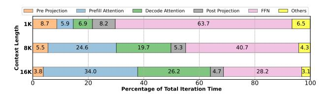
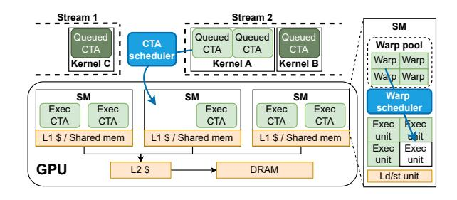

# 2 Background and Motivation

We first discuss why LLM serving systems use hybrid batching and then motivate the need to optimize attention computation. Finally, we provide an overview of GPU execution.

### 2.1 Large Language Model (LLM) Inference

LLMs process user inputs and outputs as tokens, internally represented as vectors. Each request during inference goes through two phases — prefill and decode [\[62\]](#page-15-1). The prefill phase processes the tokens of a user's prompt in parallel and produces the first output token, whose latency is called time-to-first-token (TTFT). Subsequently, the decode phase generates one output token (per-request) per-iteration autoregressively. The latency taken to generate each output token is called time-between-tokens (TBT). The prefill phase is highly parallel and compute bound while the decode phase is memory bound. Due to the parallel processing of a large number of tokens, the latency of a prefill iteration is generally higher than that of a decode iteration.

The distinct computational characteristics of prefill and decode operations create a throughput-latency tradeoff in LLM inference [\[23,](#page-13-3) [35,](#page-13-11) [46,](#page-14-0) [65\]](#page-15-2), as illustrated in [Figure 2.](#page-2-1) Since

Figure 2. Impact of scheduling strategies on TTFT and TBT.

decoding is memory bound, using a large batch size improves throughput. The original vLLM scheduler [41] uses prefill-prioritizing scheduling to maximize the decode batch size (Figure 2(a)). This approach provides low TTFT, but at the cost of high TBT because a new request's prefill can pause ongoing decodes, causing *generation stalls* [23]. High TBT is especially problematic in long-context scenarios, where each generation stall can last several seconds.

The issue of high TBT has been acknowledged in real-world deployments [14]. Sarathi-Serve [23] proposed *chunked-prefills* coupled with *continuous hybrid batching* [62] — a technique that divides the prefill tokens of a request into multiple smaller chunks and schedules one prefill chunk per-iteration with on-going decodes (Figure 2(b)). This way, Sarathi-Serve enables increasing batch size while avoiding generation stalls, improving both performance and user interactivity. Various LLM serving systems have incorporated this technique [2, 64, 66], including vLLM [18].

In the common case with hybrid batching, an executing batch consists of one prefill chunk of a pre-determined size and multiple decodes (as shown in Table 1). For example, consider a workload where each request consists of 2K prefill tokens and generates 200 output (decode) tokens. If the prefill chunk size is 1K, a request's prefill completes over two iterations (prefill tokens / chunk size). Upon completion of the prefill phase, it must execute for another 200 iterations each iteration corresponding to one output token. In these 200 iterations, 100 requests can complete their prefill phase to join the running batch. This leads to an effective batch size of 101 in the steady state wherein 100 requests execute in their decode phase alongside one prefill chunk of a new request. Executing these hybrid batches requires both high compute (for the prefill chunk) and high memory bandwidth (for the decode requests).

Figure 3 shows how hybrid batching works in practice. Except attention, all other operations are linear i.e., computed element-wise. Linear operations obey the rule f(x + y) = f(x) + f(y) so inputs for a linear operation can be combined, computed upon by the same model weights to reduce memory accesses, and then separated. In contrast, attention is a sequence-level operator that is computed between three

**Figure 3.** Computation in hybrid batches. Current systems compute prefill inputs  $(e_1...e_p)$  and decode inputs  $(e_{p+1}...e_{p+d})$  together for linear operations. However, they compute prefill and decode attention separately using specialized kernels.

**Figure 4.** Contribution of different operations in iteration runtime with hybrid batching (model: Llama-3-8B, batch size: 60, chunk size: 1K). For each context length, we show runtime of iteration that processes the last chunk of a prompt.

representations Q (query, of the current tokens being processed), and K/V (key/value, of all tokens in the sequence seen so far) as:

$$\operatorname{Attention}(Q, K, V) = \operatorname{softmax}\left(\frac{QK^T}{scale}\right)V$$

The QKV representations are further divided among multiple query heads and K/V heads, each assigned to a group [25]. Attention is computed in parallel for each Q head and K/V head pair. Since resource requirements of prefill and decode attention are different, state-of-the-art libraries such as FlashAttention (FA) [29, 30, 49] and FlashInfer (FI) [60] provide specialized kernel APIs, optimized separately for each phase. Use of these kernels works well in small context length scenarios where attention computation is a small fraction of the total inference time [24, 62].

However, the context length in many real-world LLM applications continues to grow [21, 57]. In such scenarios, attention computation dominates, becoming more than 60% of the total inference time in many cases as shown in Figure 4 (context length 16K). Note that prefill and decode attention are computed immediately one after the other in hybrid batches (see Figure 3). Therefore, when independently optimized attention kernels are used, GPU execution goes through periods of high demand of a resource followed by low utilization of the same resource. For example, the prefill kernel requires high compute but compute is (mostly) idle when the decode kernel executes.

Figure 5. GPU execution model.

We posit that concurrently computing prefill and decode attention can improve performance as it would utilize both compute and memory simultaneously. However, current techniques have several limitations with attention computation. To delve deeper into this, we first explain how GPUs operate and then present a case study of existing methods for executing different operations concurrently on GPUs [\(§3\)](#page-3-0).

## 2.2 GPU Execution Model

The GPU's hardware is arranged in a hierarchy that supports execution at a scale of hundreds of thousands of parallel threads, depicted in [Figure 5](#page-3-1) [\[5\]](#page-13-17). The main processor unit of a GPU is a Streaming Multiprocessor (SM), with modern GPUs containing around a hundred SMs. Each SM has an L1 cache and shared memory along with tensor cores for accelerated general matrix multiplication (GEMM) and execution units for integer/floating point operations. The shared memory is a user-addressable partition of the L1 cache. The GPU memory is accessed by SMs through the shared L2 cache.

GPU programming languages expose a hierarchy of threads that mimic the hardware hierarchy. The smallest unit of execution is a thread, while a group of 32 threads make up a warp, which typically execute concurrently in lockstep. To maximize throughput, GPU programmers ensure that threads within a warp execute the same code path. A Cooperative Thread Array (CTA) [\[12\]](#page-13-18) is a group of warps that share the L1 cache and shared memory. All warps in a CTA are guaranteed to execute within a single SM.

Users launch GPU kernels, or GPU-executed functions, specifying the number of threads in the CTA, the number of CTAs in the kernel, as well as the required shared memory per CTA. This launch is then queued in a stream; operations within a stream are serialized but different streams can execute in parallel in any order. The CTA scheduler selects CTAs from streams and assigns them to SMs when sufficient execution resources (e.g., threads, shared memory and registers) are available within the SM.

Central to the GPU's massive throughput is the fast, cyclelevel warp scheduler baked into the hardware. Every clock cycle, the warp scheduler dispatches eligible warps for execution; a warp is eligible if its threads aren't stalled (e.g., waiting for memory access). This allows each SM to context

| Execution method        | GC | WQ | Notes                            |
|-------------------------|----|----|----------------------------------|
| Streams [45]            | ×  | ✓  | Easiest to implement             |
| CTA                     | ×  | ✓  | Easy load balancing              |
| Warp (e.g., HFuse [42]) | ✓  | ×  | Suffers from straggler problem   |
| Intra-thread [53, 59]   | ✓  | ×  | Cannot overlap with CTA barriers |
| SM-aware CTA (Ours)     | ✓  | ✓  | Minimizes operation interference |

Table 2. Methods of concurrently executing or fusing different operations along different levels of the GPU execution hierarchy (GC=guarantees op co-location, WQ=reduces wave quantization).

| Config.    | Description                                    |
|------------|------------------------------------------------|
| FA_Serial  | Serial execution with FA kernels               |
| FA_Streams | Parallel execution via streams with FA kernels |
| FA_HFuse   | Horizontally fused FA kernels with HFuse [42]  |
| POD (Ours) | Optimized fused computation with our kernel    |

Table 3. Different methods of computing attention in hybrid batches (FA: FlashAttention).

switch at every clock cycle if required, effectively utilizing all its execution resources.

