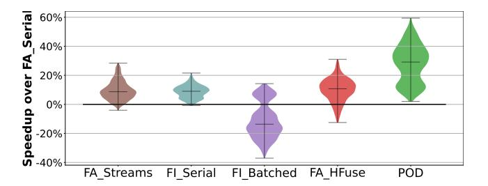
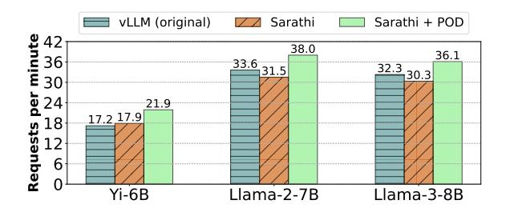
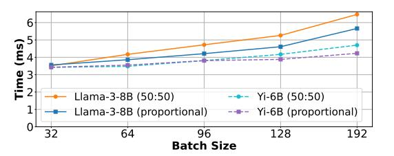
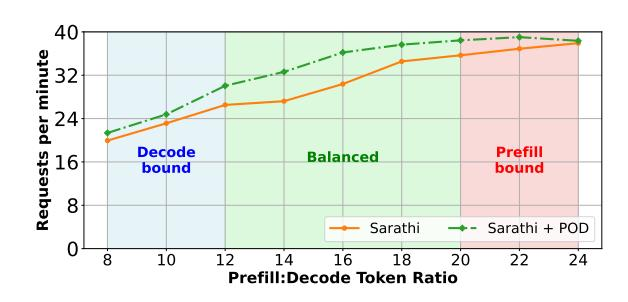

# 5 Evaluation

Our evaluation answers the following questions:

- What is the effect of POD-Attention on attention computation latencies?
- How does POD-Attention affect end-to-end LLM inference performance?
- What is the impact of different optimizations and design choices employed in POD-Attention?

Models and environment: We evaluate POD-Attention with Yi-6B (4 KV heads [\[20\]](#page-13-27)), Llama-2-7B (32 KV heads [\[6\]](#page-13-28)) and Llama-3-8B (8 KV heads [\[8\]](#page-13-29)), deploying Yi-6B on one A100 GPU, and others on two A100 GPUs with tensor parallelism [\(Table 4\)](#page-7-2). Each model has 32 query heads. Each GPU has 80GB HBM memory.

Workloads and metrics: We evaluate both offline and online inference scenarios. For offline inference, we report the number of requests processed per minute. For online inference, we report TTFT, TBT and request execution latency on two workloads consisting of 2K requests each, and context length ranging from 4K to 32K tokens per-request. One of the workloads is an internal enterprise workload (mean context length of 10.5K tokens, per-request prefill to decode token ratio i.e., P:D in the range of 0 – 40) and the other is based on arXiv-Summarization [\[4\]](#page-13-30) (mean context length of 9.5K tokens, P:D ratio of 0-50). On average, the number of decode tokens in arXiv workload is 42% higher (470) than the internal workload (331).

Serving system baselines: Our experiments use Sarathi-Serve [\[15\]](#page-13-31) as the serving framework, which is built atop vLLM [\[19\]](#page-13-32) . We evaluate two baselines: 1) the original vLLM scheduler [\[41\]](#page-14-1) that runs prefills and decodes in separate batches, prioritizing prefills over decodes and 2) Sarathi-Serve [\[23\]](#page-13-3). Both baselines use FlashAttention kernels (v2.6.1) for attention computation. We integrate POD-Attention into Sarathi-Serve to evaluate the benefits of our optimizations. For simplicity, we refer to Sarathi-Serve without and with POD-Attention as Sarathi and Sarathi+POD.

## <span id="page-7-0"></span>5.1 Evaluating Attention Computation

[Figure 6](#page-4-0) illustrates a specific instance where POD-Attention accelerates attention computation, outperforming the next best alternative by up to 29%. To demonstrate the broad applicability of POD-Attention, we conducted a comprehensive sweep across over a thousand hybrid batches on our models. In these experiments, we varied the context length from 4K to 20K and the prefill chunk size from 512 to 2K. We focused

<span id="page-8-0"></span>

**Figure 11.** Distribution of speedup in attention computation with different mechanisms compared to FA\_Serial.

on scenarios where prefill and decode attention account for at least 20% of the serial runtime, as other cases offer limited potential for optimization through operation fusion.

In addition to FlashAttention kernels, we also compare the runtime of FlashInfer (FI) v0.2.0 kernels [60] in two configurations: FI\_Serial and FI\_Batched. FI\_Batched computes prefill and decode attention using the prefill kernel of Flash-Infer. We compare against FI\_Batched for two reasons: 1) this strategy is the easiest way to compute prefill and decode attention together, and 2) some systems prefer this method e.g., Sarathi used FI\_Batched in its default attention back-end [7], and a similar feature is requested in vLLM [17]. However, we show that this strategy is inefficient e.g., when FI\_Batched uses a prefill-optimized kernel, it leads to redundant compute in decode computation due to use of larger tile sizes (§4.2.1). This redundant computation interferes with co-running prefill. Similar interference occurs on memory-bandwidth if FI\_Batched uses a decode-optimized kernel.

Figure 11 shows the relative speedup for different mechanisms compared to FA\_Serial. FA\_Streams provides limited speedup as it cannot guarantee SM-level overlap of operations. In rare cases, we find that the overhead of stream synchronization can also negate its benefits. FI Serial has better optimized decode kernels giving it a modest improvement over FA Serial, but it does not overlap the operations. FI\_Batched improves performance at low context lengths, but degrades at higher lengths by up to 40% due to redundant computation for decodes. FA\_HFuse is the strongest baseline as it guarantees operation overlap, improving median performance by 11%. However, FA\_HFuse is susceptible to the straggler effect due to which it is slower by up to 13% compared to FA\_Serial. The straggler effect can also be seen in Figure 6 towards the later chunks where prefill is more dominant, making it hard to achieve perfect utilization.

POD-ATTENTION reaches a peak speedup of 59%, and a mean of 28% — higher than all alternatives. We found that in 25% of cases, it also reaches within 10% of the theoretical peak speedup, signifying near-perfect overlap. Furthermore, unlike other alternatives, POD-ATTENTION never under-performs serial execution. These results underline the importance of a specialized attention kernel for hybrid-batching-based LLM inference.

<span id="page-8-1"></span>

Figure 12. Serving throughput in offline inference.

Additionally, we profiled the energy consumption of the attention kernels and observed that POD-ATTENTION reduces energy consumption by up to 35% over FA\_Serial (mean 20.5%). These savings are largely proportional to the reduction in runtime, showing that prefill-decode overlap not only improves performance but also reduces energy consumption.

#### 5.2 Evaluating Throughput in Offline Inference

For evaluating offline inference scenarios, we run long context requests of 16K tokens each. We use chunk size 512 for Yi-6B, and 1K for both Llama-2-7B and Llama-3-8B, chosen in a way that chunking a prompt does not reduce the performance of linear operations (as recommended by Sarathi [23, 24]). We run 1K total requests for Yi-6B, and 2K requests each for Llama-2-7B and Llama-3-8B such that the total runtime of a single configuration is about one hour. The number of output tokens per-request is set to 2K for Yi-6B, 1K for Llama-3-8B and 256 for Llama-2-7B; we study the effect of varying prefill to decode token ratio (P:D ratio) in §5.4.4.

Figure 12 shows that Sarathi+POD delivers the best throughput: 22%, 20% and 19% higher than Sarathi, and 27%, 13% and 12% higher than vLLM, for the three models. It is worth highlighting that chunked-prefills and hybrid batching involves a tradeoff. Chunking a prompt increases attention computation time due to repeated KV cache loads: computing attention of a prefill chunk requires reading KV cache of all prior chunks [65]. At the same time, fusing decode tokens with prefills helps execute linear operations more efficiently: model weights need not be read separately for prefills and decodes. Therefore, the relative performance of vLLM and Sarathi can vary depending on workload, model configuration and chunk size. In our experiments, Sarathi improves throughput slightly over vLLM for Yi-6B but underperforms it for Llama-2-7B and Llama-3-8B. Sarathi+POD fuses prefills and decodes in all operations to improve GPU resource utilization, thereby outperforms both baselines.

#### 5.3 Evaluating Latency in Online Inference

We evaluate Llama-3-8B on the internal and arXiv-based workloads near the serving capacity of the system: the maximum load a system can handle while avoiding high queuing delays [23]. We evaluate 2048 requests in each workload by

|     |                 | TTFT  |       | TBT  |      | Request Latency |       | % Requests with Stalls |       |
|-----|-----------------|-------|-------|------|------|-----------------|-------|------------------------|-------|
| QPS | System          | P50   | P99   | P50  | P99  | P50             | P99   | 200ms                  | 500ms |
|     | vLLM (original) | 0.67  | 10.11 | 0.04 | 1.13 | 25.05           | 91.01 | 99.95                  | 97.8  |
| 1.1 | Sarathi         | 2.2   | 12.58 | 0.10 | 0.15 | 26.83           | 92.24 | 2.05                   | 0     |
|     | Sarathi+POD     | 1.9   | 12.26 | 0.10 | 0.14 | 24.70           | 79.04 | 3.17                   | 0     |
|     | vLLM (original) | 0.94  | 12.70 | 0.07 | 1.76 | 42.73           | 151.8 | 99.95                  | 99.6  |
| 1.2 | Sarathi         | 25.44 | 57.83 | 0.12 | 0.16 | 67.12           | 140.5 | 5.07                   | 2.63  |
|     | Sarathi+POD     | 7.49  | 23.78 | 0.11 | 0.15 | 38.69           | 106.8 | 2.29                   | 0     |
|     |                 |       |       |      |      |                 |       |                        |       |

Table 5. Internal workload. Latency numbers in seconds.

<span id="page-9-1"></span>

|      |                 |               | TTFT          |             | TBT          |                | Request Latency |              | % Requests with Stalls |  |
|------|-----------------|---------------|---------------|-------------|--------------|----------------|-----------------|--------------|------------------------|--|
| QPS  | System          | P50           | P99           | P50         | P99          | P50            | P99             | 200ms        | 500ms                  |  |
|      | vLLM (original) | 0.55          | 6.26          | 0.03        | 0.82         | 20.53          | 234.93          | 99.9         | 97.8                   |  |
| 0.85 | Sarathi         | 2.68          | 14.89         | 0.08        | 0.13         | 27.87          | 281.07          | 4.15         | 2.05                   |  |
|      | Sarathi+POD     | 1.85          | 12.71         | 0.08        | 0.11         | 24.31          | 255.75          | 1.85         | 1.61                   |  |
|      | vLLM            |               |               |             |              |                |                 |              |                        |  |
| 0.95 | Sarathi         |               |               |             |              |                |                 |              |                        |  |
|      | Sarathi+POD     | 11.74         | 27.38         | 0.09        | 0.12         | 40.6           | 333.0           | 2.2          | 2.1                    |  |
|      |                 | 0.71<br>46.22 | 8.25<br>144.2 | 0.06<br>0.1 | 1.36<br>0.14 | 36.86<br>90.12 | 401.2<br>417.6  | 99.9<br>4.44 | 99.45<br>1.9           |  |

Table 6. arXiv-based workload. Latency numbers in seconds.

varying the input load based on Poisson distribution. For Sarathi and Sarathi+POD, we use chunk size of 1024 for the arXiv-based workload, and 1536 for the internal workload which is more prefill-heavy. We discuss performance on important LLM-specific latency metrics of TTFT, TBT, and end-to-end request execution latency.

Note that there is an inherent trade-off between these metrics [\[23\]](#page-13-3) and optimizing for one metric can severely compromise the others. For example, as will see below, vLLM prioritizes prefills and thus achieves low TTFT but sacrifices TBT, resulting in 95+% of user requests experiencing one or more stalls during decode generation. On the other hand, Sarathi reduces the stalls to a small % of user requests but significantly increases TTFT compared to vLLM.

5.3.1 TTFT. vLLM provides the lowest TTFT as it schedules a prefill on the first available opportunity. In comparison, Sarathi increases TTFT because the ongoing decodes interfere with prefills. TTFT in Sarathi further increases with the load, particularly due to higher queuing delays, e.g., the median TTFT goes to 25.4 and 46.2 seconds for the internal and arXiv-based workloads, compared to 0.94 and 0.71 seconds of vLLM. Sarathi+POD significantly reduces TTFT over Sarathi, bringing the median TTFT down to 7.5 and 11.74 seconds at higher load. Sarathi+POD also reduces the P99 TTFT by up to 4.3× over Sarathi.

5.3.2 TBT and Stalls. vLLM induces generation stalls by pausing on-going decodes whenever a new prefill is scheduled, resulting in poor interactivity with the LLM service. These generation stalls are reflected as high tail TBT latency, e.g., the P99 TBT of vLLM reaches up to 1.76 seconds (internal workload) and 1.36 seconds (arXiv-based workload).

<span id="page-9-0"></span>

| Latency    | vLLM       | Sarathi+POD |       |       |  |  |
|------------|------------|-------------|-------|-------|--|--|
| Metric     | (original) | 1024        | 1536  | 2048  |  |  |
| TTFT (P50) | 0.67       | 6.29        | 1.9   | 1.59  |  |  |
| TTFT (P99) | 10.11      | 18.99       | 12.26 | 12.40 |  |  |
| TBT (P50)  | 0.04       | 0.08        | 0.10  | 0.08  |  |  |
| TBT (P99)  | 1.13       | 0.11        | 0.14  | 0.18  |  |  |

Table 7. TTFT and TBT of Sarathi+POD with different chunk sizes versus vLLM (internal workload, QPS 1.1).

In the worst-case, we observe that the highest TBT latency reaches up to 8 seconds in vLLM when it computes multiple prefills consecutively. In comparison, Sarathi ensures that ongoing decodes do not get affected by a new prefill. Therefore, Sarathi provides significantly lower tail TBT latency compared to vLLM e.g., the P99 TBT of Sarathi is at most 0.16 seconds (10× lower than vLLM). Sarathi+POD further minimizes tail TBT over Sarathi by 10 – 20%. Crucially, since a single response results in a large number of decodes, high TBT tail latency affects nearly all requests in vLLM, signifying poor interactive experience for almost all users. Even if the TBT SLO is raised to 500ms, more than 97% of the total requests experience at least one stall in vLLM. In contrast, very few requests (<5%) observe a stall in Sarathi, which Sarathi+POD further reduces in most cases.

5.3.3 End-to-end Request Latency. Request latency can be used to approximate system throughput in online inference. Sarathi reduces P99 request latency over vLLM by 8% for the internal workload at QPS 1.2, but increase it by up to 24% over vLLM for the arXiv-based workload (QPS 0.85). Sarathi+POD is not only better than Sarathi in all cases, but

<span id="page-10-1"></span>

|                    |      | В    | atch siz | e    |      |       |              | E    | Batch siz | e    |      |
|--------------------|------|------|----------|------|------|-------|--------------|------|-----------|------|------|
| CL                 | 8    | 16   | 32       | 64   | 128  | CL    | 8            | 16   | 32        | 64   | 128  |
| 1024               | 1.08 | 1.00 | 1.07     | 1.14 | 1.03 | 1024  | 1.00         | 1.00 | 1.00      | 1.00 | 1.00 |
| 2048               | 1.00 | 1.00 | 1.00     | 1.09 | 1.05 | 2048  | 1.10         | 1.06 | 1.05      | 1.00 | 1.00 |
| 4096               | 1.00 | 1.00 | 1.00     | 1.00 | 1.00 | 4096  | 1.13         | 1.12 | 1.11      | 1.05 | 1.04 |
| 8192               | 1.00 | 1.00 | 1.00     | 1.00 | 1.00 | 8192  | 1.13         | 1.15 | 1.16      | 1.11 | 1.08 |
| 16384              | 1.00 | 1.00 | 1.00     | 1.00 | 1.00 | 16384 | 1.17         | 1.16 | 1.17      | 1.17 | 1.15 |
| (a) 2 CTAs per SM. |      |      |          |      |      |       | <b>(b)</b> 4 | CTA  | s per     | SM.  |      |

Figure 13. POD-ATTENTION with varying CTA configs.

also outperforms vLLM in many cases e.g., it reduces the P99 request execution latency by up to 42% over vLLM for the internal workload (106.8 seconds vs 151.8 seconds at QPS 1.2) and by up to 17% for the arXiv-based workload (333 seconds vs 401.2 seconds at QPS 0.95).

These results demonstrate that Sarathi enhances interactivity by reducing tail TBT and minimizing stalls, albeit with increased TTFT and some throughput reduction compared to vLLM. POD-ATTENTION optimizes Sarathi 's performance across all metrics, effectively balancing the throughput-latency tradeoff. Table 7 shows that the chunk size in Sarathi+POD can be tuned further to navigate the TTFT and TBT trade-off, e.g., using a larger chunk size of 2K tokens lowers the median TTFT from 6.3 seconds to 1.6 seconds at the cost of higher TBT (P99 0.18 seconds vs 0.11 seconds).

#### 5.4 Sensitivity Studies

**5.4.1 CTAs per SM.** Figure 13 shows the performance of POD-ATTENTION with different numbers of CTAs running concurrently on an SM, varying batch sizes (horizontally) and context lengths (vertically) for Llama-3-8B. For each (context length, batch size) data point, we normalize the runtime to the best among the two configurations. In general, for long contexts where prefill cost dominates, 2 CTAs per SM performs better as it allows for larger tile sizes. As the context length decreases, the decode cost starts demonating and hence 4 CTAs per SM starts performing better: more CTAs per SM allows packing more decodes with fewer prefills, e.g., 1 prefill CTA and 3 decode CTAs.

5.4.2 Scheduling Policy. We explore two CTA scheduling policies within an SM, namely 50:50 allocation and Proportional allocation. In 50:50 allocation, CTAs launched on an SM alternate between prefill and decodes, i.e., the first CTA performs prefill, the next decode, and so on. This policy is agnostic to the total number of prefill and decode CTAs in the kernel. In Proportional allocation, the CTAs pick whether to perform prefill or decode depending on the total number of CTAs in the kernel. For example, if 50 prefill and 100 decode CTAs are required, the first CTA on each SM will perform prefill, the next two CTAs will perform decode, then repeat. Figure 14 shows the latency of POD-ATTENTION with these policies for 8K context length and varying decode batch sizes on Yi-6B and Llama-3-8B. We notice that

<span id="page-10-2"></span>

**Figure 14.** Effect of scheduling policy in POD-ATTENTION.

<span id="page-10-3"></span>

| Chunk Id  | FA Serial | POD-ATTENTION |                      |  |  |  |  |
|-----------|-----------|---------------|----------------------|--|--|--|--|
| Chulik lu | rA_seriai | Vanilla split | Limited split [Ours] |  |  |  |  |
| 28        | 1.93      | 1.68 (0.87×)  | 1.45 (0.75×)         |  |  |  |  |
| 29        | 1.96      | 1.69 (0.86×)  | $1.45 (0.74 \times)$ |  |  |  |  |
| 30        | 1.98      | 1.71 (0.86×)  | $1.45 (0.73 \times)$ |  |  |  |  |
| 31        | 1.99      | 1.71 (0.86×)  | 1.46 (0.73×)         |  |  |  |  |

**Table 8.** Per-layer attention runtime (ms) of last four prefill chunks of a prompt, co-running with decode batch size 64 (model: Llama-3-8B, context length: 16K, chunk size: 512).

as the load increases (greater batch size), the performance of Proportional improves over 50:50 allocation. Proportional allocation spreads out the less frequent operations allowing better operational overlap and reduced resource contention, performing up to 14% better than a 50:50 allocation scheme.

5.4.3 Limiting Prefill Splits. POD-ATTENTION reduces attention computation time with the default FlashDecoding-style splitting along the KV dimension. However, limiting the number of splits further improves performance. For example, Table 8 shows that in the last four chunks of a 16K prompt, co-running with 64 decode requests of the same context length, limiting the number of splits in prefill attention computation nearly doubles the speedup of POD-ATTENTION over FA Serial.

<span id="page-10-0"></span>5.4.4 Sensitivity to Workload. POD-ATTENTION accelerates the execution of hybrid batches and hence its impact on overall performance depends on how many iterations consist of hybrid batches in a given workload. A workload that is highly dominated by either prefills (high P:D ratio) or decodes (low P:D ratio) is likely to experience little benefit with POD-ATTENTION. To understand the effect of varying P:D ratio, we benchmark Llama-3-8B with a total of 2048 requests, each consisting of  $\approx$  16.5K tokens, but with varying P:D ratio (in the range of 8 to 24) e.g., if the P:D is 10, then a request contains  $\approx 15$ K prefill tokens and  $\approx 1.5$ K decode tokens. Figure 15 shows that Sarathi+POD outperforms Sarathi over varying workload mixes. The peak gains occur in the P:D range of 12 to 18 because most batches are hybrid batches in this regime. In contrast, many iterations run decode-only batches when P:D ratio is lower than 12 (or prefill-only batches when P:D ratio is higher than 18).

<span id="page-11-0"></span>

**Figure 15.** Request processing throughput under varying workload distribution (model: Llama-3-8B, TP-2).

#### 6 Related Work

Optimizing GPU execution and LLM serving systems is an active area of research [21, 23, 27, 33, 35, 36, 38, 39, 41, 46–48, 52, 57, 62, 64–66].

Optimizing Attention Computation: FlashAttention [30] introduced the first specialized implementation of attention, fusing all its operations into a single kernel with tile-based computation. FA-2 [29] improved it further with better work partitioning and load balancing. FlashDecoding [31] accelerates decode attention by splitting computation along the KV dimension. FlashDecoding++ [34] uses asynchronized softmax, double-buffered flat GEMM optimizations, and dataflow-based hardware resource adaptation to accelerate decode. LeanAttention [48] follows Stream-K reduction [44] of tiled calculation to enable better load distribution across SMs for decodes. FlashInfer [60] introduced shared-prefix based optimized attention kernels. Compared to works that separately handle prefill and decode, POD-ATTENTION jointly optimizes and fuses them into a single kernel.

FA-3 [49] is a recent addition to the FlashAttention family of kernels. It leverages new features available in the NVIDIA Hopper architecture, exploiting the asynchrony of Tensor Cores, the Tensor Memory Accelerator, and the Special Function Units. FA-3 was under active development at the time of writing this paper and hence we leave extending POD-ATTENTION support to FA-3 and Hopper architecture for future work.

Operation Fusion: Kernel fusion is a commonly used technique for improving GPU performance. Elastic kernels [45] proposes restricting resources to enable running multiple kernels concurrently. However, this method provides no guarantee of intra-SM co-location. To overcome this, ISPA [63] deploys a predetermined number of CTAs for each kernel, less than the number of CTAs that run concurrently on the GPU. Significant a priori profiling is used to determine the appropriate CTA sizes to allow for both kernels to execute concurrently. This can be tedious for attention kernels with dynamically changing input sizes, and makes load balancing between the prefill and decode operations difficult, as one

operation completing early leaves resources underutilized. HFuse [42] fuses operations in warp-parallel fashion, providing source-to-source compilation tools to fuse kernels. SM-centric scheduling [56] uses the SM counter to assign work to CTAs, which we leverage in POD-ATTENTION.

Optimizing LLM Inference: Optimizing LLM serving systems is an active area of research [23, 33, 36, 41, 46, 50–52, 57, 58, 62]. Orca [62] introduced iteration-level scheduling to eliminate compute fragmentation when requests of different lengths are batched together. PagedAttention [41] and vAttention [47] proposed different techniques for dynamic memory management for LLM inference. Sarathi-Serve [23] leverages chunked prefills to enable stall-free batching. In contrast, Splitwise [46], DistServe [65] and TetriInfer [35] disaggregate the prefill and decode phases onto different GPU nodes to avoid interference between these phases. Various recent works have also proposed overlapping compute with communication to improve resource utilization [28, 37, 54].

Similar to POD-ATTENTION, NanoFlow [66] also targets improving intra-device resource utilization, albeit with a contrasting approach. NanoFlow divides a batch into smaller operation-level nano-batches and schedules them in a way that overlaps operations with complementary resource profiles via CUDA streams. In contrast, POD-ATTENTION tries to maximize resource-utilization within a given batch by fusing prefill and decode attention computation. While NanoFlow requires large batch sizes in order to benefit from batch splitting, POD-ATTENTION is useful when attention consumes a significant amount of time. Therefore, NanoFlow seems more suitable for small-context scenarios whereas POD-ATTENTION targets long-context scenarios that depend on hybrid batching for efficient LLM serving.

## 7 Conclusion

We introduce POD-ATTENTION — the first attention kernel specialized to compute prefill and decode attention in parallel such that both compute and memory bandwidth of a GPU can be utilized simultaneously. POD-ATTENTION enables efficient hybrid batching based LLM inference by accelerating attention computation by up to 59% (mean 28%) compared to using independently optimized prefill and decode attention kernels. POD-ATTENTION also improves the end-to-end serving throughput by up to 22%, while significantly reducing latency over state-of-the-art LLM serving systems Sarathi-Serve and vLLM.

## Acknowledgments

We thank our shepherd Tim Rogers, the anonymous ASPLOS reviewers and Ajay Nayak for their valuable feedback on various aspects of the paper. We also thank Zihao Ye for various helpful discussions on POD-ATTENTION and FlashInfer. Aditya K Kamath and Simon Peter are supported by National Science Foundation grant CNS-2212580.

## A Artifact Appendix

#### A.1 Abstract

POD-ATTENTION is a GPU kernel that overlaps prefill and decode attention operations for large language models. POD-ATTENTION is built on top of FlashAttention kernels (v2.6.1) [29] and is integrated with Sarathi-Serve [23] – a state-of-the-art hybrid batching based LLM inference scheduler.

## A.2 Artifact check-list (meta-information)

- Compilation: CUDA 12.4, GCC 11.4.
- Model: Llama-2-7B [6], Llama-3-8B [8], Yi-6B [20].
- Data set: arXiv-Summarization [4].
- Run-time environment: Ubuntu 22.04, CUDA 12.4, Python 3.12, and PyTorch 2.4.
- Hardware: 1-2 NVIDIA A100 80 GB GPUs, x86 machine.
- How much time is needed to prepare workflow?: 1 minute with Docker image. 1–2 hours if installing from source.
- How much time is needed to complete experiments (approximately)?: Approx. 18 hours.
- Publicly available?: Yes.
- Archived (provide DOI)?: 10.5281/zenodo.14770841

#### A.3 Description

**A.3.1 How to access.** We provide the source code in various forms: Docker container (see A.3.3), GitHub repository (https://github.com/microsoft/vattention/tree/main/pod\_attn), and Zenodo (https://doi.org/10.5281/zenodo.14770840).

**A.3.2** Hardware dependencies. This artifact requires an x86 machine with 2 NVIDIA A100 GPUs with 80GB memory each. If only one GPU is available, all experiments can be conducted in full, except for Table 6 and the results for Llama-2-7B and Llama-3-8B in Figure 12.

<span id="page-12-0"></span>**A.3.3 Software dependencies.** POD-ATTENTION has been tested on a machine with Ubuntu 22.04. All other software dependencies are resolved while installing.

**A.3.4 Data sets.** Some experiments are based on the arXiv-Summarization dataset. We use a subset of the dataset available in the traces/ folder of the artifact.

**A.3.5 Models.** This artifact evaluates Yi-6B, Llama-2-7B and Llama-3-8B. Accessing Yi-6B and Llama-2-7B is straightforward but accessing Llama-3-8B requires logging into huggingface with the user's private token (HF\_TOKEN below):

```
$ huggingface-cli login --token HF_TOKEN
```

#### A.4 Installation

We provide two methods of installing and testing: using Docker (recommended) or manual installation.

**A.4.1 Docker installation (recommended).** We provide a docker image for POD-ATTENTION with all its dependencies pre-installed. You can launch the docker container and navigate to the artifact directory as follows:

```
$ docker run --gpus all -it \
  -p 8181:8181 --rm --ipc=host --cap-add=SYS_ADMIN \
  rnp1910/pod_attention:asplos_25_pytorch_run
$ cd /workspace/vattention/pod_attn
```

**A.4.2 Manual installation.** For manual installation, we can download POD-Attention (available in vAttention repository) to home directory to install it. We use Anaconda for the appropriate versions of CUDA, Python, and PyTorch. This can take up to 2 hours.

```
$ git clone \
 https://github.com/microsoft/vattention.git
$ cd vattention/pod_attn/
# Install miniconda; skip if already installed
$ make install_miniconda
$ bash # Refresh shell and activate
$ conda activate pod_attn
# Install CUDA Toolkit
(pod_attn)$ conda install -y -c \
 conda-forge cuda-toolkit=12.4.0
# Install dependencies
(pod_attn)$ pip install -r requirements.txt
(pod_attn)$ pip install flashinfer==0.1.5 \
 -i https://flashinfer.ai/whl/cu124/torch2.4
# Install POD-Attention and vAttention
(pod_attn)$ make install_all
```

#### A.5 Experiment workflow

The source code for POD-ATTENTION kernel is available in the vattention/pod\_attn/ folder. Our evaluation primarily contains two kinds of experiments: attention performance (Figures 1, 6, 10, 11, 13, 14) and end-to-end LLM performance (Figure 12 and Table 6). Figure 7 evaluates various kernel fusion strategies with a micro-benchmark. Most of these require only one GPU except for Table 6 and Figure 12 (for Llama-2-7B and Llama-3-8B) that require two GPUs. Use the Makefile present in the vattention/pod\_attn/ folder to run experiments as follows:

```
make figure1 # 2 minutes; sudo used by script
make figure6 # 2 minutes
make figure7 # 2 minutes
make figure10 # 1 minute; sudo used by script
make figure11 # 2 hours
make figure12 # 9 hours
make figure13 # 1 minute
make figure14 # 1 minute
make table6 # 4 hours
```

#### A.6 Evaluation and expected results

The artifact scripts redirect the raw output numbers and logs to output/ folder, while the plotted graphs can be found in the graphs/ folder. Tables are saved as CSVs in the same folder. Results may have minor runtime variations from those reported in in the paper, but general trends should hold.

### References

- <span id="page-13-10"></span>[1] 2022. FlashAttention. https://github.com/Dao-AlLab/flash-attention.
- <span id="page-13-13"></span>[2] 2023. TensorRT-LLM: A TensorRT Toolbox for Optimized Large Language Model Inference. https://github.com/NVIDIA/TensorRT-LLM.
- <span id="page-13-0"></span>[3] 2024. AI Infrastructure Spending Forecast to Be Over a Trillion Dollars Over the Next Five Years. https://www.delloro.com/news/aiinfrastructure-spending-forecast-to-be-over-a-trillion-dollars-overthe-next-five-years/.
- <span id="page-13-30"></span>[4] 2024. ccdv/arxiv-summarization. https://huggingface.co/datasets/ ccdv/arxiv-summarization.
- <span id="page-13-17"></span>[5] 2024. CUDA C Programming Guide – Hardware Implementation. https://docs.nvidia.com/cuda/cuda-c-programming-guide/ #hardware-implementation.
- <span id="page-13-28"></span>[6] 2024. Llama-2-7B. https://huggingface.co/meta-llama/Llama-2-7b-hf.
- <span id="page-13-19"></span>[7] 2024. Merged PR 1865: Critical bug fixes related to sampling. https://github.com/microsoft/sarathi-serve/ commit/50e59c51b85b1157e001bb8ee7a1b049d551955d#diff-450b0de5cce8a2341140afed859dc5dd3b913fa6e62d27988fccefeacc7b33ec.
- <span id="page-13-29"></span>[8] 2024. Meta-Llama-3-8B. https://huggingface.co/meta-llama/Meta-Llama-3-8B.
- <span id="page-13-26"></span>[9] 2024. NVIDIA Multi-Instance GPU. https://www.nvidia.com/en-us/ technologies/multi-instance-gpu/.
- <span id="page-13-25"></span>[10] 2024. NVIDIA Multi-Process Service. https://docs.nvidia.com/deploy/ mps/index.html.
- <span id="page-13-23"></span>[11] 2024. NVIDIA/cutlass: CUDA Templates for Linear Algebra Subroutines. https://github.com/NVIDIA/cutlass.
- <span id="page-13-18"></span>[12] 2024. Parallel Thread Execution ISA Version 8.5 - Cooperative Thread Arrays. https://docs.nvidia.com/cuda/parallel-thread-execution/#cooperative-thread-arrays.
- <span id="page-13-21"></span>[13] 2024. Parallel Thread Execution ISA Version 8.5 – Special Registers: %smid. https://docs.nvidia.com/cuda/parallel-thread-execution/index. html#special-registers-smid.
- <span id="page-13-12"></span>[14] 2024. Performance and Tuning. https://docs.vllm.ai/en/v0.6.0/models/ performance.html.
- <span id="page-13-31"></span>[15] 2024. Sarathi-Serve. https://github.com/microsoft/sarathi-serve.
- <span id="page-13-1"></span>[16] 2024. The State of AI Infrastructure at Scale 2024. https://ai-infrastructure.org/wp-content/uploads/2024/03/The-State-of-Al-Infrastructure-at-Scale-2024.pdf.
- <span id="page-13-20"></span>[17] 2024. Unify the kernel used in flash attention backend. https://github.com/vllm-project/vllm/pull/6052.
- <span id="page-13-14"></span>[18] 2024. Upstream Chunked Prefill. https://github.com/vllm-project/ vllm/issues/3130.
- <span id="page-13-32"></span>[19] 2024. vLLM: Easy, fast, and cheap LLM serving for everyone. https://github.com/vllm-project/vllm.
- <span id="page-13-27"></span>[20] 2024. Yi-6B-200K. https://huggingface.co/01-ai/Yi-6B-200K.
- <span id="page-13-2"></span>[21] Amey Agrawal, Junda Chen, Íñigo Goiri, Ramachandran Ramjee, Chaojie Zhang, Alexey Tumanov, and Esha Choukse. 2024. Mnemosyne: Parallelization Strategies for Efficiently Serving Multi-Million Context Length LLM Inference Requests Without Approximations. arXiv:2409.17264 [cs.LG] https://arxiv.org/abs/2409.17264
- <span id="page-13-4"></span>[22] Amey Agrawal, Nitin Kedia, Jayashree Mohan, Ashish Panwar, Nipun Kwatra, Bhargav S Gulavani, Ramachandran Ramjee, and Alexey Tumanov. 2024. Vidur: A Large-Scale Simulation Framework For LLM Inference. Proceedings of The Seventh Annual Conference on Machine Learning and Systems, 2024, Santa Clara (2024).
- <span id="page-13-3"></span>[23] Amey Agrawal, Nitin Kedia, Ashish Panwar, Jayashree Mohan, Nipun Kwatra, Bhargav Gulavani, Alexey Tumanov, and Ramachandran Ramjee. 2024. Taming Throughput-Latency Tradeoff in LLM Inference with Sarathi-Serve. In 18th USENIX Symposium on Operating Systems Design and Implementation (OSDI 24). USENIX Association, Santa Clara, CA, 117–134. https://www.usenix.org/conference/osdi24/presentation/agrawal

- <span id="page-13-5"></span>[24] Amey Agrawal, Ashish Panwar, Jayashree Mohan, Nipun Kwatra, Bhargav S. Gulavani, and Ramachandran Ramjee. 2023. SARATHI: Efficient LLM Inference by Piggybacking Decodes with Chunked Prefills. arXiv:2308.16369 [cs.LG] https://arxiv.org/abs/2308.16369
- <span id="page-13-15"></span>[25] Joshua Ainslie, James Lee-Thorp, Michiel de Jong, Yury Zemlyanskiy, Federico Lebron, and Sumit Sanghai. 2023. GQA: Training Generalized Multi-Query Transformer Models from Multi-Head Checkpoints. In Proceedings of the 2023 Conference on Empirical Methods in Natural Language Processing, Houda Bouamor, Juan Pino, and Kalika Bali (Eds.). Association for Computational Linguistics, Singapore, 4895– 4901. https://doi.org/10.18653/v1/2023.emnlp-main.298
- <span id="page-13-22"></span>[26] Jeremy Appleyard and Scott Yokim. 2017. Programming Tensor Cores in CUDA 9. https://developer.nvidia.com/blog/programming-tensorcores-cuda-9/.
- <span id="page-13-33"></span>[27] Shiyi Cao, Shu Liu, Tyler Griggs, Peter Schafhalter, Xiaoxuan Liu, Ying Sheng, Joseph E. Gonzalez, Matei Zaharia, and Ion Stoica. 2024. MoE-Lightning: High-Throughput MoE Inference on Memory-constrained GPUs. arXiv:2411.11217 [cs.DC] https://arxiv.org/abs/2411.11217
- <span id="page-13-35"></span>[28] Li-Wen Chang, Wenlei Bao, Qi Hou, Chengquan Jiang, Ningxin Zheng, Yinmin Zhong, Xuanrun Zhang, Zuquan Song, Ziheng Jiang, Haibin Lin, Xin Jin, and Xin Liu. 2024. FLUX: Fast Software-based Communication Overlap On GPUs Through Kernel Fusion. arXiv:2406.06858 [cs.LG] https://arxiv.org/abs/2406.06858
- <span id="page-13-16"></span>[29] Tri Dao. 2024. FlashAttention-2: Faster Attention with Better Parallelism and Work Partitioning. In The Twelfth International Conference on Learning Representations. https://openreview.net/forum?id= mZn2Xyh9Ec
- <span id="page-13-7"></span>[30] Tri Dao, Daniel Y. Fu, Stefano Ermon, Atri Rudra, and Christopher Ré. 2022. FLASHATTENTION: fast and memory-efficient exact attention with IO-awareness. In Proceedings of the 36th International Conference on Neural Information Processing Systems (New Orleans, LA, USA) (NIPS '22). Curran Associates Inc., Red Hook, NY, USA, Article 1189, 16 pages.
- <span id="page-13-8"></span>[31] Tri Dao, Daniel Haziza, Francisco Massa, and Grigory Sizov. 2023. Flash-Decoding for long-context inference. https://crfm.stanford.edu/ 2023/10/12/flashdecoding.html.
- <span id="page-13-24"></span>[32] Kshitij Gupta, Jeff A. Stuart, and John D. Owens. 2012. A study of Persistent Threads style GPU programming for GPGPU workloads. In 2012 Innovative Parallel Computing (InPar). 1–14. https://doi.org/10. 1109/InPar.2012.6339596
- <span id="page-13-6"></span>[33] Connor Holmes, Masahiro Tanaka, Michael Wyatt, Ammar Ahmad Awan, Jeff Rasley, Samyam Rajbhandari, Reza Yazdani Aminabadi, Heyang Qin, Arash Bakhtiari, Lev Kurilenko, and Yuxiong He. 2024. DeepSpeed-FastGen: High-throughput Text Generation for LLMs via MII and DeepSpeed-Inference. arXiv:2401.08671 [cs.PF] https://arxiv. org/abs/2401.08671
- <span id="page-13-9"></span>[34] Ke Hong, Guohao Dai, Jiaming Xu, Qiuli Mao, Xiuhong Li, Jun Liu, kangdi chen, Yuhan Dong, and Yu Wang. 2024. FlashDecoding++: Faster Large Language Model Inference with Asynchronization, Flat GEMM Optimization, and Heuristics. In *Proceedings of Machine Learning and Systems*, P. Gibbons, G. Pekhimenko, and C. De Sa (Eds.), Vol. 6. 148–161. https://proceedings.mlsys.org/paper\_files/paper/2024/file/5321b1dabcd2be188d796c21b733e8c7-Paper-Conference.pdf
- <span id="page-13-11"></span>[35] Cunchen Hu, Heyang Huang, Liangliang Xu, Xusheng Chen, Jiang Xu, Shuang Chen, Hao Feng, Chenxi Wang, Sa Wang, Yungang Bao, Ninghui Sun, and Yizhou Shan. 2024. Inference without Interference: Disaggregate LLM Inference for Mixed Downstream Workloads. arXiv:2401.11181 [cs.DC] https://arxiv.org/abs/2401.11181
- <span id="page-13-34"></span>[36] Haiyang Huang, Newsha Ardalani, Anna Sun, Liu Ke, Shruti Bhosale, Hsien-Hsin S. Lee, Carole-Jean Wu, and Benjamin Lee. 2024. Toward Efficient Inference for Mixture of Experts. In *The Thirty-eighth Annual Conference on Neural Information Processing Systems*. https://openreview.net/forum?id=stXtBqyTWX
- <span id="page-13-36"></span>[37] Abhinav Jangda, Jun Huang, Guodong Liu, Amir Hossein Nodehi Sabet, Saeed Maleki, Youshan Miao, Madanlal Musuvathi, Todd Mytkowicz,

- and Olli Saarikivi. 2022. Breaking the Computation and Communication Abstraction Barrier in Distributed Machine Learning Workloads. In Proceedings of the 27th ACM International Conference on Architectural Support for Programming Languages and Operating Systems (Lausanne, Switzerland) (ASPLOS '22). Association for Computing Machinery, New York, NY, USA, 402–416. <https://doi.org/10.1145/3503222.3507778>
- <span id="page-14-9"></span>[38] Abhinav Jangda, Saeed Maleki, Maryam Mehri Dehnavi, Madan Musuvathi, and Olli Saarikivi. 2024. A Framework for Fine-Grained Synchronization of Dependent GPU Kernels. In Proceedings of the 2024 IEEE/ACM International Symposium on Code Generation and Optimization (Edinburgh, United Kingdom) (CGO '24). IEEE Press, 93–105. <https://doi.org/10.1109/CGO57630.2024.10444873>
- <span id="page-14-15"></span>[39] Hao Kang, Srikant Bharadwaj, James Hensman, Tushar Krishna, Victor Ruhle, and Saravan Rajmohan. 2024. TurboAttention: Efficient Attention Approximation For High Throughputs LLMs. arXiv[:2412.08585](https://arxiv.org/abs/2412.08585) [cs.LG] <https://arxiv.org/abs/2412.08585>
- <span id="page-14-12"></span>[40] Scott J. Krieder, Justin M. Wozniak, Timothy Armstrong, Michael Wilde, Daniel S. Katz, Benjamin Grimmer, Ian T. Foster, and Ioan Raicu. 2014. Design and evaluation of the gemtc framework for GPU-enabled many-task computing. In Proceedings of the 23rd International Symposium on High-Performance Parallel and Distributed Computing (Vancouver, BC, Canada) (HPDC '14). Association for Computing Machinery, New York, NY, USA, 153–164. <https://doi.org/10.1145/2600212.2600228>
- <span id="page-14-1"></span>[41] Woosuk Kwon, Zhuohan Li, Siyuan Zhuang, Ying Sheng, Lianmin Zheng, Cody Hao Yu, Joseph Gonzalez, Hao Zhang, and Ion Stoica. 2023. Efficient Memory Management for Large Language Model Serving with PagedAttention. In Proceedings of the 29th Symposium on Operating Systems Principles (Koblenz, Germany) (SOSP '23). Association for Computing Machinery, New York, NY, USA, 611–626. <https://doi.org/10.1145/3600006.3613165>
- <span id="page-14-6"></span>[42] Ao Li, Bojian Zheng, Gennady Pekhimenko, and Fan Long. 2022. Automatic Horizontal Fusion for GPU Kernels. In 2022 IEEE/ACM International Symposium on Code Generation and Optimization (CGO). 14–27. <https://doi.org/10.1109/CGO53902.2022.9741270>
- <span id="page-14-13"></span>[43] Yun Liang, Huynh Phung Huynh, Kyle Rupnow, Rick Siow Mong Goh, and Deming Chen. 2015. Efficient GPU Spatial-Temporal Multitasking. IEEE Transactions on Parallel and Distributed Systems 26, 3 (2015), 748– 760. <https://doi.org/10.1109/TPDS.2014.2313342>
- <span id="page-14-10"></span>[44] Muhammad Osama, Duane Merrill, Cris Cecka, Michael Garland, and John D. Owens. 2023. Stream-K: Work-Centric Parallel Decomposition for Dense Matrix-Matrix Multiplication on the GPU. In Proceedings of the 28th ACM SIGPLAN Annual Symposium on Principles and Practice of Parallel Programming (Montreal, QC, Canada) (PPoPP '23). Association for Computing Machinery, New York, NY, USA, 429–431. [https://doi.](https://doi.org/10.1145/3572848.3577479) [org/10.1145/3572848.3577479](https://doi.org/10.1145/3572848.3577479)
- <span id="page-14-5"></span>[45] Sreepathi Pai, Matthew J. Thazhuthaveetil, and R. Govindarajan. 2013. Improving GPGPU concurrency with elastic kernels. In Proceedings of the Eighteenth International Conference on Architectural Support for Programming Languages and Operating Systems (Houston, Texas, USA) (ASPLOS '13). Association for Computing Machinery, New York, NY, USA, 407–418. <https://doi.org/10.1145/2451116.2451160>
- <span id="page-14-0"></span>[46] Pratyush Patel, Esha Choukse, Chaojie Zhang, Aashaka Shah, Íñigo Goiri, Saeed Maleki, and Ricardo Bianchini. 2024. Splitwise: Efficient Generative LLM Inference Using Phase Splitting. In 2024 ACM/IEEE 51st Annual International Symposium on Computer Architecture (ISCA). 118–132. <https://doi.org/10.1109/ISCA59077.2024.00019>
- <span id="page-14-19"></span>[47] Ramya Prabhu, Ajay Nayak, Jayashree Mohan, Ramachandran Ramjee, and Ashish Panwar. 2025. vAttention: Dynamic Memory Management for Serving LLMs without PagedAttention. In Proceedings of the 30th ACM International Conference on Architectural Support for Programming Languages and Operating Systems, Volume 1 (Rotterdam, Netherlands) (ASPLOS '25). Association for Computing Machinery, New York, NY, USA, 1133–1150. <https://doi.org/10.1145/3669940.3707256>

- <span id="page-14-3"></span>[48] Rya Sanovar, Srikant Bharadwaj, Renee St. Amant, Victor Rühle, and Saravan Rajmohan. 2024. Lean Attention: Hardware-Aware Scalable Attention Mechanism for the Decode-Phase of Transformers. arXiv[:2405.10480](https://arxiv.org/abs/2405.10480) [cs.AR] <https://arxiv.org/abs/2405.10480>
- <span id="page-14-4"></span>[49] Jay Shah, Ganesh Bikshandi, Ying Zhang, Vijay Thakkar, Pradeep Ramani, and Tri Dao. 2024. FlashAttention-3: Fast and Accurate Attention with Asynchrony and Low-precision. In The Thirty-eighth Annual Conference on Neural Information Processing Systems. [https:](https://openreview.net/forum?id=tVConYid20) [//openreview.net/forum?id=tVConYid20](https://openreview.net/forum?id=tVConYid20)
- <span id="page-14-17"></span>[50] Ying Sheng, Shiyi Cao, Dacheng Li, Banghua Zhu, Zhuohan Li, Danyang Zhuo, Joseph E. Gonzalez, and Ion Stoica. 2024. Fairness in Serving Large Language Models. In 18th USENIX Symposium on Operating Systems Design and Implementation (OSDI 24). USENIX Association, Santa Clara, CA, 965–988. [https://www.usenix.org/conference/osdi24/](https://www.usenix.org/conference/osdi24/presentation/sheng) [presentation/sheng](https://www.usenix.org/conference/osdi24/presentation/sheng)
- [51] Yixin Song, Zeyu Mi, Haotong Xie, and Haibo Chen. 2024. PowerInfer: Fast Large Language Model Serving with a Consumer-grade GPU. In Proceedings of the ACM SIGOPS 30th Symposium on Operating Systems Principles (Austin, TX, USA) (SOSP '24). Association for Computing Machinery, New York, NY, USA, 590–606. [https://doi.org/10.1145/](https://doi.org/10.1145/3694715.3695964) [3694715.3695964](https://doi.org/10.1145/3694715.3695964)
- <span id="page-14-16"></span>[52] Jovan Stojkovic, Chaojie Zhang, Íñigo Goiri, Josep Torrellas, and Esha Choukse. 2024. DynamoLLM: Designing LLM Inference Clusters for Performance and Energy Efficiency. arXiv[:2408.00741](https://arxiv.org/abs/2408.00741) [cs.AI] [https:](https://arxiv.org/abs/2408.00741) [//arxiv.org/abs/2408.00741](https://arxiv.org/abs/2408.00741)
- <span id="page-14-7"></span>[53] Mohamed Wahib and Naoya Maruyama. 2014. Scalable Kernel Fusion for Memory-Bound GPU Applications. In SC '14: Proceedings of the International Conference for High Performance Computing, Networking, Storage and Analysis. 191–202. <https://doi.org/10.1109/SC.2014.21>
- <span id="page-14-20"></span>[54] Shibo Wang, Jinliang Wei, Amit Sabne, Andy Davis, Berkin Ilbeyi, Blake Hechtman, Dehao Chen, Karthik Srinivasa Murthy, Marcello Maggioni, Qiao Zhang, Sameer Kumar, Tongfei Guo, Yuanzhong Xu, and Zongwei Zhou. 2022. Overlap Communication with Dependent Computation via Decomposition in Large Deep Learning Models. In Proceedings of the 28th ACM International Conference on Architectural Support for Programming Languages and Operating Systems, Volume 1 (Vancouver, BC, Canada) (ASPLOS 2023). Association for Computing Machinery, New York, NY, USA, 93–106. [https://doi.org/10.1145/](https://doi.org/10.1145/3567955.3567959) [3567955.3567959](https://doi.org/10.1145/3567955.3567959)
- <span id="page-14-14"></span>[55] Zhenning Wang, Jun Yang, Rami Melhem, Bruce Childers, Youtao Zhang, and Minyi Guo. 2016. Simultaneous Multikernel GPU: Multitasking throughput processors via fine-grained sharing. In 2016 IEEE International Symposium on High Performance Computer Architecture (HPCA). 358–369. <https://doi.org/10.1109/HPCA.2016.7446078>
- <span id="page-14-11"></span>[56] Bo Wu, Guoyang Chen, Dong Li, Xipeng Shen, and Jeffrey Vetter. 2015. Enabling and Exploiting Flexible Task Assignment on GPU through SM-Centric Program Transformations. In Proceedings of the 29th ACM on International Conference on Supercomputing (Newport Beach, California, USA) (ICS '15). Association for Computing Machinery, New York, NY, USA, 119–130. <https://doi.org/10.1145/2751205.2751213>
- <span id="page-14-2"></span>[57] Bingyang Wu, Shengyu Liu, Yinmin Zhong, Peng Sun, Xuanzhe Liu, and Xin Jin. 2024. LoongServe: Efficiently Serving Long-Context Large Language Models with Elastic Sequence Parallelism. In Proceedings of the ACM SIGOPS 30th Symposium on Operating Systems Principles (Austin, TX, USA) (SOSP '24). Association for Computing Machinery, New York, NY, USA, 640–654. <https://doi.org/10.1145/3694715.3695948>
- <span id="page-14-18"></span>[58] Bingyang Wu, Yinmin Zhong, Zili Zhang, Gang Huang, Xuanzhe Liu, and Xin Jin. 2023. Fast Distributed Inference Serving for Large Language Models. arXiv[:2305.05920](https://arxiv.org/abs/2305.05920) [cs.LG] [https://arxiv.org/abs/](https://arxiv.org/abs/2305.05920) [2305.05920](https://arxiv.org/abs/2305.05920)
- <span id="page-14-8"></span>[59] Haicheng Wu, Gregory Diamos, Srihari Cadambi, and Sudhakar Yalamanchili. 2012. Kernel Weaver: Automatically Fusing Database Primitives for Efficient GPU Computation. In 2012 45th Annual IEEE/ACM International Symposium on Microarchitecture. 107–118. <https://doi.org/10.1109/MICRO.2012.19>

- <span id="page-15-5"></span><span id="page-15-0"></span>[60] Zihao Ye, Lequn Chen, Ruihang Lai, Wuwei Lin, Yineng Zhang, Stephanie Wang, Tianqi Chen, Baris Kasikci, Vinod Grover, Arvind Krishnamurthy, and Luis Ceze. 2025. FlashInfer: Efficient and Customizable Attention Engine for LLM Inference Serving. arXiv[:2501.01005](https://arxiv.org/abs/2501.01005) [cs.DC] <https://arxiv.org/abs/2501.01005>
- <span id="page-15-7"></span>[61] Tsung Tai Yeh, Amit Sabne, Putt Sakdhnagool, Rudolf Eigenmann, and Timothy G. Rogers. 2017. Pagoda: Fine-Grained GPU Resource Virtualization for Narrow Tasks. In Proceedings of the 22nd ACM SIGPLAN Symposium on Principles and Practice of Parallel Programming (Austin, Texas, USA) (PPoPP '17). Association for Computing Machinery, New York, NY, USA, 221–234. <https://doi.org/10.1145/3018743.3018754>
- <span id="page-15-1"></span>[62] Gyeong-In Yu, Joo Seong Jeong, Geon-Woo Kim, Soojeong Kim, and Byung-Gon Chun. 2022. Orca: A Distributed Serving System for Transformer-Based Generative Models. In 16th USENIX Symposium on Operating Systems Design and Implementation (OSDI 22). USENIX Association, Carlsbad, CA, 521–538. [https://www.usenix.org/conference/](https://www.usenix.org/conference/osdi22/presentation/yu) [osdi22/presentation/yu](https://www.usenix.org/conference/osdi22/presentation/yu)
- <span id="page-15-6"></span>[63] Han Zhao, Weihao Cui, Quan Chen, and Minyi Guo. 2023. ISPA: Exploiting Intra-SM Parallelism in GPUs via Fine-Grained Resource Management. IEEE Trans. Comput. 72, 5 (2023), 1473–1487. [https:](https://doi.org/10.1109/TC.2022.3214088)

#### [//doi.org/10.1109/TC.2022.3214088](https://doi.org/10.1109/TC.2022.3214088)

- <span id="page-15-4"></span>[64] Lianmin Zheng, Liangsheng Yin, Zhiqiang Xie, Chuyue Sun, Jeff Huang, Cody Hao Yu, Shiyi Cao, Christos Kozyrakis, Ion Stoica, Joseph E. Gonzalez, Clark Barrett, and Ying Sheng. 2024. SGLang: Efficient Execution of Structured Language Model Programs. In The Thirty-eighth Annual Conference on Neural Information Processing Systems. <https://openreview.net/forum?id=VqkAKQibpq>
- <span id="page-15-2"></span>[65] Yinmin Zhong, Shengyu Liu, Junda Chen, Jianbo Hu, Yibo Zhu, Xuanzhe Liu, Xin Jin, and Hao Zhang. 2024. DistServe: Disaggregating Prefill and Decoding for Goodput-optimized Large Language Model Serving. In 18th USENIX Symposium on Operating Systems Design and Implementation (OSDI 24). USENIX Association, Santa Clara, CA, 193– 210. [https://www.usenix.org/conference/osdi24/presentation/zhong](https://www.usenix.org/conference/osdi24/presentation/zhong-yinmin)[yinmin](https://www.usenix.org/conference/osdi24/presentation/zhong-yinmin)
- <span id="page-15-3"></span>[66] Kan Zhu, Yilong Zhao, Liangyu Zhao, Gefei Zuo, Yile Gu, Dedong Xie, Yufei Gao, Qinyu Xu, Tian Tang, Zihao Ye, Keisuke Kamahori, Chien-Yu Lin, Stephanie Wang, Arvind Krishnamurthy, and Baris Kasikci. 2024. NanoFlow: Towards Optimal Large Language Model Serving Throughput. arXiv[:2408.12757](https://arxiv.org/abs/2408.12757) [cs.DC] [https://arxiv.org/abs/2408.](https://arxiv.org/abs/2408.12757) [12757](https://arxiv.org/abs/2408.12757)