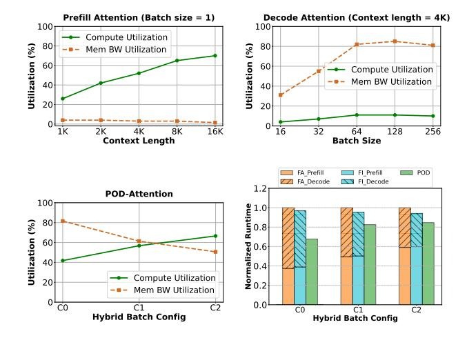

# POD-ATTENTION: Unlocking Full Prefill-Decode Overlap for Faster LLM Inference

Aditya K Kamath\* University of Washington Seattle, USA

Simon Peter University of Washington Seattle, USA Ramya Prabhu Microsoft Research Bengaluru, India

Ramachandran Ramjee Microsoft Research Bengaluru, India Jayashree Mohan Microsoft Research Bengaluru, India

Ashish Panwar Microsoft Research Bengaluru, India

#### **Abstract**

Each request in LLM inference goes through two phases: compute-bound *prefill* and memory-bandwidth-bound *decode*. To improve GPU utilization, recent systems use hybrid batching that combines the prefill and decode phases of different requests into the same batch. This approach optimizes linear operations but remains inefficient for attention computation because *existing attention kernels specialize execution independently for the prefill and decode phases*.

In this paper, we present POD-ATTENTION — the first GPU kernel that efficiently computes attention for hybrid batches. POD-ATTENTION aims to maximize the utilization of both compute and memory bandwidth by carefully allocating the GPU's resources such that prefill and decode operations happen concurrently on the same multiprocessor. POD-ATTENTION speeds up attention computation by up to 59% (mean 28%), enabling higher throughput and lower latency LLM inference compared to the use of independently optimized prefill and decode attention kernels.

CCS Concepts: • Computing methodologies  $\rightarrow$  Machine learning; • Computer systems organization  $\rightarrow$  Parallel architectures.

**Keywords:** Large language models; GPUs; self-attention

## **ACM Reference Format:**

Aditya K Kamath, Ramya Prabhu, Jayashree Mohan, Simon Peter, Ramachandran Ramjee, and Ashish Panwar. 2025. POD-ATTENTION: Unlocking Full Prefill-Decode Overlap for Faster LLM Inference. In Proceedings of the 30th ACM International Conference on Architectural Support for Programming Languages and Operating Systems, Volume 2 (ASPLOS '25), March 30-April 3, 2025, Rotterdam, Netherlands. ACM, New York, NY, USA, 16 pages. https://doi.org/10.1145/3676641.3715996

\*Work done as an intern at Microsoft Research India.

This work is licensed under a Creative Commons Attribution 4.0 International License.

ASPLOS '25, March 30-April 3, 2025, Rotterdam, Netherlands © 2025 Copyright held by the owner/author(s). ACM ISBN 979-8-4007-1079-7/2025/03 https://doi.org/10.1145/3676641.3715996

**Figure 1.** State-of-the-art attention kernels utilize either compute or memory (FA: FlashAttention, FI: FlashInfer). POD-ATTENTION utilizes both compute and memory to accelerate attention computation in hybrid batches (see Table 1 for configurations. Model: Llama-3-8B on 2 A100 GPUs).

#### 1 Introduction

The infrastructure for serving large language models (LLMs) is expanding to meet their growing demands [3, 16]. Large-scale service providers often depend on expensive high-end GPUs to meet peak demand or latency targets [46]. Therefore, optimizing LLM serving systems has become crucial [21, 23, 41, 57, 62, 65, 66]. The overall efficiency of a deployment depends on how well GPU resources are utilized.

From a resource utilization perspective, LLM inference is a challenging workload because different phases require different resources at different times [22–24, 66]. The processing of an LLM request begins with a highly parallel (hence, compute-bound) prefill phase which is then followed by a memory-bound decode phase [24]. Serving LLMs efficiently, therefore, requires both high compute and high memory bandwidth. An ideal system would strive to maximize the utilization of both compute and memory. However, doing so is non-trivial because for a given request, the prefill and decode phases occur at different times.

State-of-the-art LLM serving systems deal with this challenge by combining the inputs of prefill and decode phases of different requests into the same batch [\[24,](#page-13-5) [33,](#page-13-6) [62\]](#page-15-1) — a technique we refer to as hybrid batching. Hybrid batching avoids the need to fetch model weights from GPU high-bandwidth memory (HBM) separately for prefill and decode tokens. Instead, it allows the GPU to fetch model weights once and use them to compute over both prefill and decode inputs. Hybrid batching also helps reduce tail latency: to limit the runtime of each iteration, the scheduler can divide long input prompts (prefill inputs) into multiple smaller chunks, then combine ongoing decodes with a new prefill chunk every iteration [\[23,](#page-13-3) [33\]](#page-13-6). As such, use of hybrid batching is common in various LLM serving systems today [\[23,](#page-13-3) [33,](#page-13-6) [41,](#page-14-1) [62,](#page-15-1) [66\]](#page-15-3).

While prior work has focused on optimizing the linear operations [\[23,](#page-13-3) [33,](#page-13-6) [62\]](#page-15-1), they do not optimize the attention computation of a hybrid batch. This is reasonable for a system that primarily deals with small context lengths since linear operations dominate run time in this setting [\[62,](#page-15-1) [66\]](#page-15-3). In contrast, as the context length increases, attention computation becomes the primary performance bottleneck [\(Figure 4\)](#page-2-0).

Some recent works have also tried to optimize attention computation [\[30,](#page-13-7) [31,](#page-13-8) [34,](#page-13-9) [48\]](#page-14-3), but current solutions address prefill and decode operations separately — maximizing compute utilization for prefills and bandwidth utilization for decodes, as shown in [Figure 1.](#page-0-0) In this paper, we show that such an approach is suboptimal as it leaves critical GPU resources underutilized in different parts of computation. For example, [Figure 1](#page-0-0) illustrates that memory bandwidth utilization of the prefill attention kernel is often below 5%, while compute utilization of the decode attention kernel is under 10%. The effect of using independently optimized kernels is particularly noticeable with hybrid batching because prefill and decode kernels execute immediately one after the other, leading to periods of high demand of a resource immediately followed by low utilization of the same resource.

To improve the efficiency of hybrid batching, we present POD-Attention — the first GPU kernel, to the best of our knowledge, that efficiently batches the computation of prefill and decode attention. In doing so, we first show [\(§3\)](#page-3-0) that existing techniques do not provide adequate performance in fusing attention computation due to various limitations such as straggler threads, synchronization barriers and lack of guaranteed SM-level co-location of different Cooperative Thread Arrays (CTAs) on GPU Streaming Multiprocessors (SMs). POD-Attention addresses these issues by fusing the computation in a CTA-parallel manner, introducing SMaware software-based CTA scheduling within the GPU [\(§4\)](#page-5-0). Building on state-of-the-art FlashAttention kernels [\[1\]](#page-13-10), POD-Attention significantly accelerates attention computation by utilizing both compute and memory resources as per the requirement of a given batch of requests (see [Figure 1\)](#page-0-0).

|         |    | Prefill |     |     | Decode | Resource      |
|---------|----|---------|-----|-----|--------|---------------|
| Config. | BS | CS      | CL  | BS  | CL     | requirement   |
| C0      | 1  | 1K      | 12K | 80  | 12K    | memory-bound  |
| C1      | 1  | 12K     | 12K | 220 | 12K    | balanced      |
| C2      | 1  | 16K     | 16K | 250 | 12K    | compute-bound |

Table 1. Details of hybrid batches evaluated in [Figure 1](#page-0-0) (BS: batch size, CS: chunk size, CL: context length).

We also integrate POD-Attention in a state-of-the-art LLM inference scheduler Sarathi-Serve [\[23\]](#page-13-3). Our experiments show that POD-Attention computes attention up to 59% faster (mean 28%) than the prefill and decode attention kernels of FlashAttention and FlashInfer. In terms of the end-to-end LLM inference performance, POD-Attention improves throughput by up to 22% while also reducing crucial latency metrics such as time-to-first-token (TTFT), timebetween-tokens (TBT) and the end-to-end request execution latency over Sarathi-Serve.

Contributions: We make the following contributions:

- We highlight that independently optimizing prefill and decode attention kernels is suboptimal for hybrid batching based LLM inference.
- We present POD-Attention a GPU kernel that computes prefill and decode attention concurrently to utilize both compute and memory bandwidth simultaneously.
- We integrate POD-Attention in Sarathi-Serve and show that it enables high throughput and low latency LLM inference compared to the use of independently optimized prefill and decode attention kernels.

