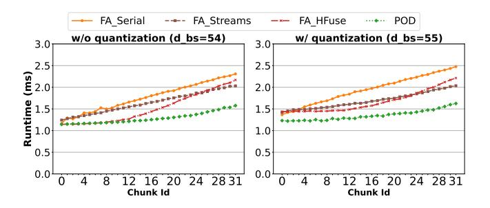
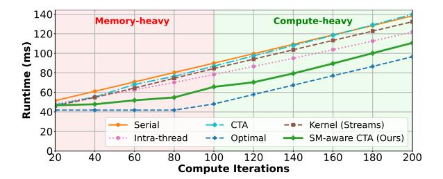
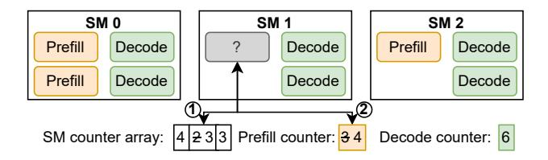

# 3 A Case Study on Concurrent Execution

The simplest way to compute prefill and decode attention together is to pass both inputs to an existing attention kernel. Some LLM serving systems prefer this method for computing attention in hybrid batches [\[7,](#page-13-19) [17\]](#page-13-20). In [§5.1,](#page-7-0) we show that this is counter-productive and slower than serial execution.

In this section, we focus on GPU methods for concurrent execution e.g., running kernels in parallel or fusing their operations into a single kernel. We quantitatively analyze their performance and highlight key limitations that motivated us to develop a specialized attention kernel.

## 3.1 Methods of Concurrent Execution

Each level of the execution hierarchy in a GPU offers potential for concurrent execution (see [Table 2\)](#page-3-2).

- 1. Kernel-parallel. Streams can potentially execute different GPU kernels concurrently. This approach is easy to implement as it only requires submitting existing kernels to different streams; all other approaches require fusing different operations into a single kernel. Unfortunately, streams alone guarantees neither concurrency nor SMlevel co-location of different operations [\[45,](#page-14-5) [63\]](#page-15-6).
- 2. CTA-parallel. In this scheme, the CTAs in the kernel are split across operations in a predetermined manner. CTAparallel enables better load-balancing: when one CTA finishes execution, the GPU scheduler can deploy the next CTA to the SM. However, similar to streams, CTA-parallel does not guarantee SM-level co-location.
- 3. Warp-parallel. Here, warps within each CTA are split across operations, as proposed in horizontal fusion (HFuse

**Figure 6.** Per layer attention runtime of 32 hybrid batches corresponding to chunked prefills of a request of 16K tokens (chunk size: 512, model: Yi-6B, d bs: decode batch size).

[42]). This apprach guarantees co-location since all warps in a CTA are guaranteed to reside within the same SM. Unfortunately, warp-parallel fusion suffers from the straggler problem: an entire CTA must complete execution before it can be replaced by another one; if one or more of its threads or warps lag behind others, the next CTA is delayed. While fusing the prefill and decode attention computation, the fused kernel requires extensive tuning to deal with a large input space of varying batch sizes and context lengths e.g., some hybrid batches may be prefill heavy and others may be decode heavy. Therefore, a fused prefill-decode attention kernel is particularly vulnerable to the straggler effect with warp-parallel fusion.

4. Intra-thread. In intra-thread fusion, each thread alternates between executing instructions of different operations [53, 59]. In simple cases, this strategy provides the maximum opportunity to overlap different operations. However, attention kernels use CTA-level sync barriers to coordinate fetching data into shared memory. These barriers limit intra-thread fusion as instructions before a barrier cannot be overlapped with those after the barrier. We now quantitatively analyze the performance of different methods. Unfortunately, no readily available implementation exists for CTA-parallel and intra-thread fusion. Hence, we first analyze kernel-parallel and warp-parallel methods on attention kernels and then investigate other methods.

#### 3.2 Analysis of Readily Available Methods

For kernel-parallel execution, shown as FA\_Streams in Figure 6, we run FA's prefill and decode kernel on two different CUDA streams. For warp-parallel execution (FA\_HFuse), we fuse FA's kernels using the toolchain provided by [42]. Figure 6 compares their performance against serial execution of FA's prefill and decode attention kernels (FA\_Serial). Our experiment shows the per-layer attention computation time of Yi-6B for 32 chunks of a 16K prompt (chunk size 512), each co-scheduled with decodes of 16K context length each.

Note that if the number of CTAs in a kernel is not divisible by the number of GPU SMs, some of the SMs in the last wave of scheduling can remain idle — a phenomenon known as

Figure 7. Fine-grained fusion versus serial computation.

wave quantization [38, 44]. In the worst case, a marginal increase in work can double the latency of a kernel due to wave quantization. Therefore, to fully understand the benefit of concurrent execution, we evaluate performance with and without wave quantization. Each decode request uses 4 CTAs in our experiment (one CTA per KV head). Hence a decode batch size of 54 uses 216 CTAs having no wave quantization on our NVIDIA A100 GPU (108 SMs). In contrast, a batch size of 55 uses 220 CTAs leaving 4 quantized CTAs.

FA\_Streams provides some speed up over FA\_Serial and its gains are higher (up to 20%) when serial execution suffers from wave quantization. This is because streams run kernels in parallel to fill GPU SMs that would otherwise remain idle. This effect can be seen in Figure 6 where FA Streams take roughly the same amount of time for both batch sizes while the time taken by FA\_Serial increases at batch size 55; in particular, decode time increases by more than 25% in FA\_Serial when batch size goes from 54 to 55 which increases the total attention time of prefill and decode by up to 17%. FA\_HFuse outperforms FA\_Streams is some cases but its performance degrades quickly due to straggler effect in the later chunks that are dominated by prefill. This happens because the prefill cost increases with each successive chunk but decode cost is same in all hybrid batches. Overall, FA Streams and FA HFuse both perform better than FA\_Serial but still leave significant performance on the table as shown by POD-ATTENTION which outperforms both methods by a significant margin.

#### 3.3 Analysis of Other Methods

For complex kernels, such as attention, efficiently implementing fine-grained fusion schemes is non-trivial and prone to errors. Therefore, we analyze the performance of other fusion methods with a simple micro-benchmark consisting of a compute-bound kernel that repeatedly multiplies array elements with a scalar, and a memory-bound kernel that repeatedly adds three arrays. Each thread executes a barrier after each operation. We vary the number of compute iterations to evaluate performance under varying compositions of compute-bound and memory-bound operations. Figure 7 shows the runtime of different fusion methods applied on these two functions. At 100 compute iterations, both operations consume equal time when executed serially. To the

Figure 8. SM-aware CTA scheduling.

left of this point, memory bound is more dominant. To the right, it is compute bound. [Figure 7](#page-4-1) also shows the runtime achievable with an ideal oracle (i.e., perfect overlap).

CTA and kernel-parallel cannot guarantee SM-level colocation of compute-bound and memory-bound operations and hence provides only marginal average improvement of 3% and 7% over serial execution. Intra-thread fusion outperforms both serial and CTA-parallel execution, on average by 13%. However, the benefit of intra-thread fusion is limited due to sync barriers that hinder concurrent execution.

In summary, current methods for concurrently executing heterogeneous operations face several challenges, such as stragglers, barrier-induced delays, and the inability to guarantee SM-level co-location. In the following sections, we demonstrate how a specialized fused kernel, designed to leverage the characteristics of prefill and decode phases, can overcome these challenges.

