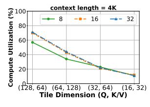
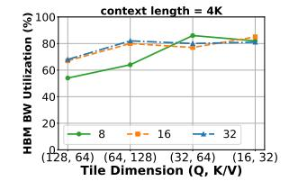

# <span id="page-5-0"></span>4 POD-Attention

We introduce POD-Attention — a single GPU kernel that efficiently computes both prefill and decode attention. Our primary goal is to ensure that each GPU SM computes both operations simultaneously while minimizing resource contention between them. We build our kernel atop FA v2.6.1 [\[29\]](#page-13-16).

To achieve our goal, we fuse computation along the CTA dimension that helps avoid the pitfalls of finer-grained warpparallel and intra-thread fusion. In particular, CTA-parallel fusion offers three advantages: 1) it allows different CTAs to start and finish at different times independently of others, 2) ensures that sync barriers do not affect other parts of the computation since the effect of a barrier is limited to within its CTA, and 3) it is easier to program [\(§4.3\)](#page-7-1). However, naive CTA-parallel fusion cannot guarantee that prefill and decode will be co-located on GPU SMs. To overcome this limitation, we introduce software-based SM-aware CTA scheduling wherein each CTA decides whether to compute prefill or decode after it has been dispatched to an SM.

### 4.1 SM-aware CTA Scheduling

SM-aware CTA scheduling co-locates prefill and decode CTAs through "runtime operation binding". Here, a CTA decides whether to perform prefill or decode at runtime, after checking: 1) which SM it got launched on [\[56\]](#page-14-11), and 2) what other CTAs running on the same SM are doing. This

```
1 if (threadIdx.x == 0) { // Leader thread finds assignment
2 int sm_id; // Find which SM this CTA is on
3 asm volatile("mov.u32 %0, %smid;" : "=r"(sm_id));
4 // For this SM, what do we want to run?
5 const int ratio = (prefill_ratio + decode_ratio);
6 int op, ticket = (atomicAdd(&sm_ctr[sm_id], 1) % ratio);
7 if(ticket < prefill_ratio) op = PREFILL;
8 else op = DECODE;
9 // Get the next CTA for operation
10 int cta_id = atomicAdd(&cta_assign[op], 1);
11 // If the CTA exceeds the max CTA for that op switch ops
12 if (op == PREFILL && cta_id >= prefill_ctas) {
13 op = DECODE;
14 cta_id = atomicAdd(&cta_assign[op], 1);
15 } else if (op == DECODE && cta_id >= decode_ctas) {
16 op = PREFILL;
17 cta_id = atomicAdd(&cta_assign[op], 1);
18 }
19 // Write the CTA ID and operation to shared memory
20 shared_mem[0] = cta_id;
21 shared_mem[1] = op;
22 }
23 __syncthreads(); // Barrier: waits for scheduling to finish
24 // Fetch the assigned CTA and operation.
25 int cta_id = shared_mem[0];
26 const int op = shared_mem[1];
27 __syncthreads();
28 // Perform the appropriate operation
29 if (op == PREFILL) prefill_op(cta_id);
30 else decode_op(cta_id)
```

Figure 9. CUDA code for SM-aware CTA scheduling.

allows the kernel to remain completely agnostic to how the hardware scheduler assigns SMs to CTAs.

To do this, before launching the kernel, we determine how many CTAs are required for prefill and decode independently, and launch the kernel with CTAs matching the sum of both. Each SM has a counter keeping track of the number of CTAs launched on it along with 2 more counters that track the number of prefill and decode CTAs executed on it so far.

[Figure 9](#page-5-1) shows a simple code snippet of SM-aware CTA scheduling. When the hardware scheduler schedules a new CTA on an SM, a leader thread of the CTA (e.g., thread 0) reads the SMID hardware counter [\[13\]](#page-13-21) that contains the unique ID of the SM it was launched on (lines 2 - 3). The thread then performs an atomic add operation on the SM counter to obtain a ticket (line 6). This ticket informs the thread as to which operation it should perform i.e., prefill or decode (lines 7 - 8), depending on the scheduling policy. The thread also increments the CTA counter for the operation (line 10). If this exceeds the maximum CTAs for that operation, it switches operations (line 12 - 18). Finally, it writes this information to shared memory so that the other threads in the CTA can begin execution accordingly (lines 20 - 30). We examined two scheduling policies: 50:50 and proportional. In the 50:50 policy, subsequent CTAs on an SM alternate between prefill and decode. In contrast, the proportional policy (line 5) allocates CTAs based on the ratio of prefill and decode CTAs in the current batch.

## 4.2 Performance Optimizations

Simply co-locating prefill and decode operations does not yield optimal performance. In this subsection, we introduce

<span id="page-6-0"></span>



- (a) Compute utilization.
- (b) DRAM BW utilization.

**Figure 10.** Impact of decode tile size on compute and HBM BW utilization for batch sizes 8, 16 and 32.

various optimizations to maximize the benefit of fusing prefill and decode attention computation.

<span id="page-6-1"></span>**4.2.1 Tile Sizes.** Data tiling is necessary to make effective use of tensor cores, which provide ~8× higher throughput than their CUDA core counterpart [26]. Tiling also helps improve shared memory usage. However, the benefit of tiling is not uniform across operations. Decode operates on a single token per request, having a tile length of one across the query sequence length (QSL) dimension. In Group Query Attention [25], this length increases to the ratio between query and KV heads, typically 2 – 8. Due to this small dimension length, data reuse is insignificant, and performance is limited by memory bandwidth.

FlashAttention uses tile lengths of 64 – 128 for the QSL dimension. The side-effect of using such large tile sizes is that decodes end up zero padded, causing redundant compute [34]. For example, Figure 10a shows that compute utilization of the decode attention kernel is proportional to tile sizes, reaching up to 70% at QSL tile dimension of 128, compared to 10% with tile dimension of 16. However, note that decode attention is memory bound and hence, the primary objective of a decode kernel is to try and saturate memory bandwidth. Figure 10b shows that even at a relatively large QSL tile dimension of 64, the decode kernel is able to maximize memory bandwidth utilization. Hence, for a decode-only attention kernel, there is little incentive to reducing tile sizes further.

In contrast, using large tile sizes for decodes is counterproductive in a fused kernel: any redundant compute performed by decodes interferes with co-located prefills since tensor cores are shared between them. If we reduce unnecessary computation, prefill can make better use of the tensor cores. To do so, we use a decode tile length of 16 for QSL, the minimum needed by CUTLASS [11] for A100 tensor operations. This drops the compute utilization of decodes to ~10%, freeing up tensor cores for prefill. Figure 10b shows that reducing tile size has no adverse impact on decode performance at large batch sizes.

**4.2.2 Concurrent CTAs per SM.** The number of CTAs running concurrently on an SM dictates the amount of resources (e.g., shared memory) each CTA can have. More CTAs per SM implies less resources per CTA, but more opportunities for fine-grained scheduling and co-location, i.e., with 2 CTAs per SM we can only co-locate prefills and decodes in a 1:1 ratio, but with 4 CTAs per SM, we can allocate CTAs to prefill and decode in different proportion depending on batch composition e.g., 3 CTAs to prefill and 1 CTA to decode. In general, prefills benefit from fewer CTAs per SM as it allows each CTA access to more shared memory, enabling use of larger tile sizes. In contrast, decodes do not benefit from larger tile sizes and therefore using more CTAs per SM can be beneficial since it allows fine-grained scheduling.

To achieve the best of both worlds, POD-ATTENTION supports two configurations: 2 CTAs per SM for prefill-dominant hybrid batches and 4 CTAs per SM otherwise. Based on the desired configuration, we modify the tile lengths and number of threads used for prefill and decode. We also explored if 8 CTAs per SM can further improve performance and found that it only marginally improves performance in a few cases while under-performing in most cases. POD-ATTENTION automatically picks the most suitable configuration at runtime.

4.2.3 Virtual Decode CTAs. The amount of shared memory provided to each prefill and decode CTA must be same in the fused kernel. However, because decode uses smaller tile sizes, the shared memory requirement of decode is a quarter of the prefill requirement. To avoid over-allocating shared memory to decodes, we divide each decode CTA into virtual CTAs containing a warp of threads. If the original decode CTA has four warps, each virtual CTA contains one warp which uses a quarter of the shared memory of the original CTA. The sum of shared memory used by all the virtual CTAs in each regular CTA is close to the shared memory used by prefill. This way, virtual decode CTAs balance the shared memory used by prefill and decode.

4.2.4 Limiting Prefill Splits. FlashAttention parallelizes computation across the query heads and QSL tile dimension. FlashDecoding [31], designed for decode which has a QSL of one, further splits the computation across the K/V dimension when there is not enough parallelism to fill the SMs of the GPU. The side-effect of this approach is that different CTAs fetch the same query tensor from memory independently of each other, proportional to the number of splits. Consequently, splitting the computation increases memory bandwidth utilization. While splitting along the key/value dimension is not required for prefills when the input contains enough tokens, chunked-prefills limit the number of tokens processed per-iteration by design (to minimize TBT). Therefore, FlashAttention also uses the FlashDecoding technique to accelerate the chunked-prefill attention computation. This scheme works well for a prefill-only kernel as increased parallelism can easily offset the cost of extra memory reads.

However, in a fused kernel, using a large number of splits for chunked-prefills can cause memory bandwidth contention between prefill and decode CTAs, potentially negating the benefit of fusion. To balance this trade-off, we limit the number of splits for a chunked-prefill to fill at most two full waves (determined empirically). This allows a chunked-prefill to use more CTAs when required, while ensuring that the number of splits do not get excessive and harm concurrent decodes.

### <span id="page-7-1"></span>4.3 Implementing CTA-parallel Fusion

To fuse the two kernels, we first convert them into generic device functions callable from within GPU code while removing all references to the CUDA-provided CTA ID (i.e., blockIdx), instead passing this as a function parameter. We build a wrapper kernel that calls these different functions using a calculated CTA ID. The prefill and decode operations execute as if the supplied CTA ID was their actual ID. This enables flexible remapping of CTA IDs, e.g., CTA 0 of the fused kernel can invoke prefill with CTA ID 0, CTA 1 can call decode with ID 0, CTA 2 can call prefill with ID 1, and so on. The amount of shared memory each CTA gets is fixed at kernel launch time, and prefill and decode operations have different requirements. To manage this, we hand-tune the shared memory usage of both prefill and decode operations to balance their requirements while minimizing performance degradation. We launch our fused kernel with enough shared memory for the maximum needed by either operation. To implement virtual CTAs, we modify the decode function replacing all CTA-level barriers with warp-level barriers. The decode function in the fused kernel is called with the appropriate virtual CTA ID, instead of the assigned CTA ID.

