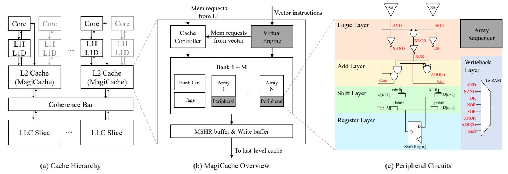

# 3.2 In-Cache Data Movement Latency Reduction

The second challenge is the bursty in-cache data movement latency between storage space and computing space. One memory instruction of parallel programming frameworks triggers accesses to many elements, which inherently causes bulk accesses and incurs long latency. This problem is deteriorating for in-cache architectures because they obtain much higher parallelism (e.g., millions of threads in Duality Cache and 2048-element vectors in EVE). When bulk accesses encounter cache misses, the latency is dramatically exacerbated by the limited number of miss-status handling registers (MSHR). Duality Cache mitigates the bursty access problem with a very long instruction word (VLIW) architecture that allows different computing arrays to perform different operations. However, the software-implemented solution requires a sophisticated compiler design.

In contrast, we propose a hardware-implemented instruction chaining technique that allows different arrays to execute the same instruction stream asynchronously. By leveraging this technique,

Figure 4: The MagiCache Overview. (a) The L2 cache is transformed into MagiCache. (b) The virtual engine controls the execution of vector instructions. (c) The peripheral circuits for one bit-line are shown. Each bit-line has a replica of the circuits.

all fused arrays can perform memory accesses of their own vector register segment at different cycles. Each fused array can also execute subsequent instructions once its own accesses are finished without waiting for all the other arrays. This significantly alleviates the high latency caused by bursty accesses.

## 4 Architecture Design

In this section, we first present an overview of MagiCache (Section [4.1\)](#page-4-0). Then, we introduce the cacheline-level in-cache computing architecture (Section [4.2\)](#page-4-1), the virtual engine for efficient cachelinelevel space management (Section [4.3\)](#page-5-0), and the instruction chaining technique (Section [4.4\)](#page-6-0), respectively. These three components constitute the MagiCache. Finally, we present the impact of MagiCache on cache behavior and functionality in Section [4.5.](#page-7-0)

### 4.1 The MagiCache Overview

Fig. [4](#page-4-2) presents an overview of the MagiCache architecture. We implement MagiCache on the L2 cache and support all 32-bit integer instructions of the RISC-V vector ISA. The scalar core and MagiCache are the front-end and back-end of the vector ISA. When executing a vector instruction, the scalar core decodes the instruction, fetches the required scalar registers, and sends the instruction to the MagiCache back-end through a dedicated port. The MagiCache back-end manages vector registers and executes vector instructions through the proposed virtual engine, which will be discussed in Section [4.3.](#page-5-0) If the instruction does not write back, the scalar core can commit it immediately after sending it to the MagiCache. Otherwise, the core has to wait until MagiCache returns the results.

The fused array design of MagiCache is modified from the computing arrays of EVE [\[3\]](#page-12-17) and Duality Cache [\[15\]](#page-12-20). As shown in Fig. [4\(](#page-4-2)c), the peripheral circuits of each fused array include five layers: logic, add, shift, register, and writeback, which collaborate to perform logic and addition operations. We also add two rows on vanilla SRAM arrays to hold intermediate values of in-cache computation or input scalar values. When executing an instruction, the fused array first obtains the row indexes of both the source

vector registers from the virtual engine. Then, it utilizes the bitline computation technique and peripheral circuits to perform the required operation. In detail, the logic layer generates all logic values from the bit-line, including (n)and, (n)or, and x(n)or. The add and shift layers implement addition and shift operations by configuring carry chains and shift units across bit-lines. The register layer contains one 1-bit register per bit-line to hold the intermediate values of shift operation. It also serves as the line buffer to coalesce read/write operations for vector memory instructions. Finally, the writeback layer selects the correct result and stores it in the destination row.

MagiCache uses a micro-code framework to perform complex operations. Based on the bit-parallel layout, addition and logic operations can be finished in two cycles. The first cycle performs bit-line computation, and the second cycle writes the results back to the array. Vector multiplication consumes about 160 (=32×5) cycles by performing iterative shift and addition. Each fused array contains an array sequencer to hold the row numbers of virtual registers and executes the micro-code programs.

## 4.2 Cacheline-Level In-Cache Computing Architecture

Our proposed in-cache computing architecture enables cachelinelevel partition of the storage and computing spaces. For convenience, we logically combine multiple fused arrays horizontally into a super array so that each row of the super array can accommodate exactly one cacheline. For example, if the fused array is 256×256 and the cacheline size is 512 bits, two arrays are combined into a super array of 256 rows and 512 columns. In the rest of this section, all the "arrays" we refer to are super arrays, and each row of the array is equivalent to one cacheline.

As shown in Fig. [5,](#page-5-1) the tags in MagiCache should contain two additional indicator bits to enable cacheline-level partition. The computing bit indicates whether a cacheline belongs to computing space or storage space. The presence bit is used to solve the cache coherence problem (see Section [4.5\)](#page-7-0). The conversion from cachelines to computing lines has four steps. First, evict the

Figure 5: The Conversion from Cachelines to Computing Lines. V(Valid), W(Writeable), D(Dirty), P(Presence), C(Computing).

cacheline if it is valid. It should be written back to the next level cache if it is dirty. Then, all indicator bits except the computing bit are cleared. Next, the corresponding LRU bits are set to invalid so that the replacement policy will not select the cacheline again. Finally, the computing bit is set to 1. The computing lines can also be converted to cachelines by clearing the computing bit and setting the LRU bits as the least recently used cacheline. The computing lines are managed by the virtual engine. The cache controller can neither access nor replace the computing line. From the storage space perspective, the available associativity of the corresponding set is reduced by 1. Based on the cacheline-level conversion, the virtual engine can dynamically switch the roles of each cacheline at runtime for efficient space management.

